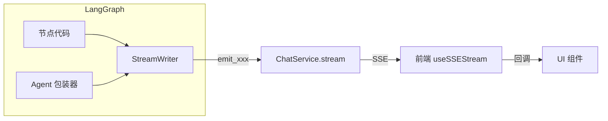
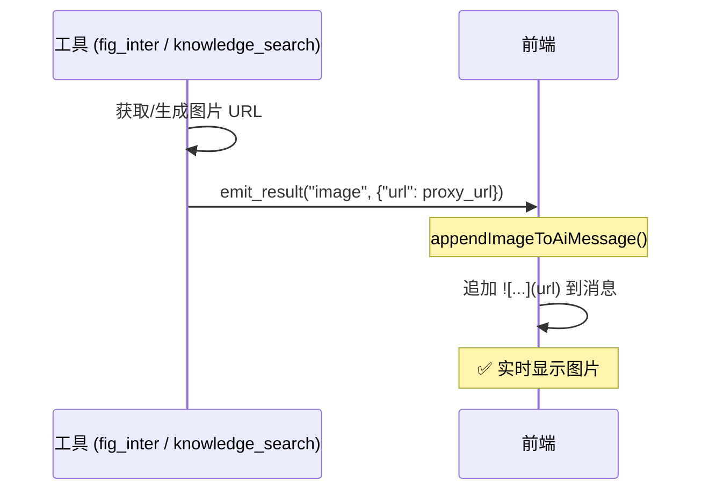
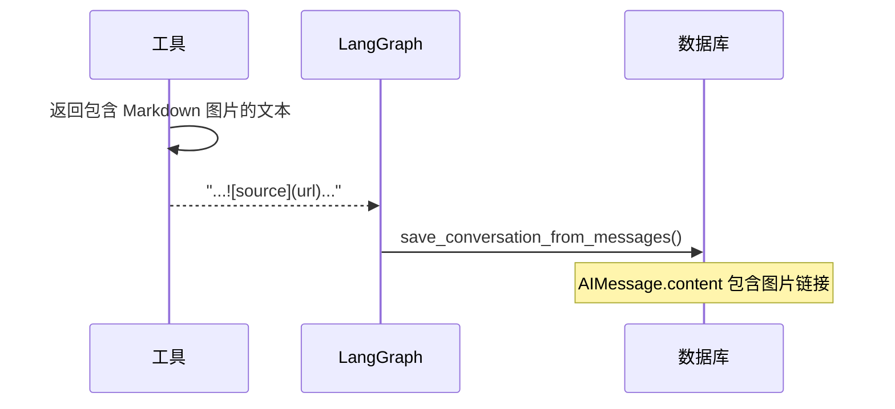
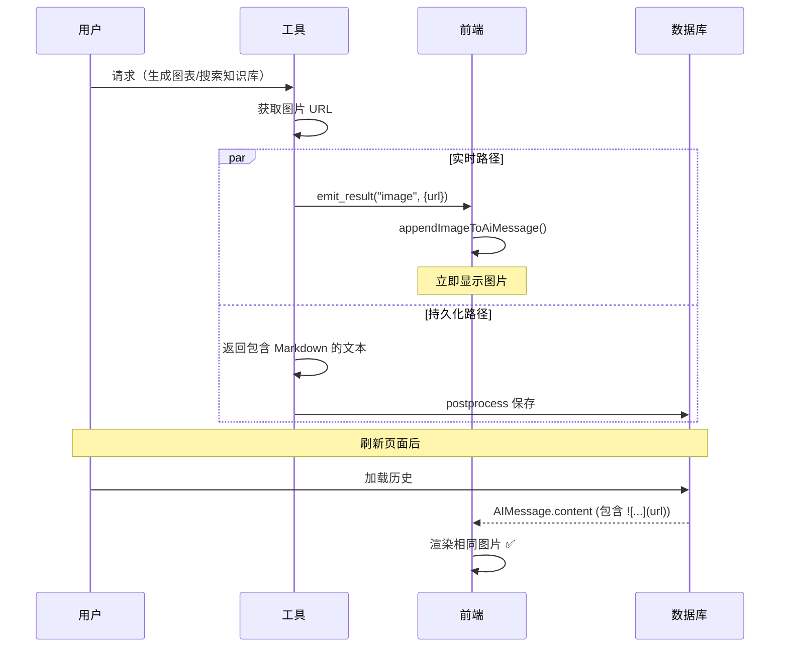

# AI 模块详解

> **用途**: 深入理解 AI 模块的实现细节，帮助 AI 准确修改相关代码。

---

## 📂 目录结构

```
app/ai/
├── workflow/
│   └── multi_agent_graph.py   # 多智能体 Supervisor 图
├── agents/
│   ├── data_agent.py          # 数据分析专家
│   ├── knowledge_agent.py     # 知识库专家
│   ├── todo_agent.py          # 待办事项专家
│   ├── todo_graph.py          # 待办专用 StateGraph
│   ├── todo_enhanced_nodes.py # 增强节点（确认流程）
│   └── summarize_node.py      # 摘要节点
├── tools/
│   ├── todo_tools.py          # 待办工具集
│   ├── chatTools.py           # MCP 数据库工具
│   ├── file_tools.py          # 文件读取工具
│   ├── vision_tool.py         # 图片分析工具
│   └── ragflow_tool.py        # 知识库检索工具
├── prompts/                   # 🆕 渐进披露 Prompt 管理
│   ├── agent_prompts.py       # 核心 Prompt
│   ├── prompt_loader.py       # 参考文档加载器
│   └── references/            # 详细参考文档
│       ├── sql_guide.md
│       ├── chart_guide.md
│       └── knowledge_guide.md
├── mcp/                       # Model Context Protocol
├── utils/                      # 工具函数
│   └── image_fixer.py          # 图片链接修复逻辑
├── events.py                  # SSE 事件协议
├── guardrails.py              # 🆕 护栏系统（输入/输出验证）
├── intent_classifier.py       # 🆕 意图识别器
├── parameter_extractor.py     # 🆕 参数提取器（借鉴 Flock）
├── llm_judge.py               # 🆕 LLM as Judge 输出评估
├── llm_util.py                # LLM 实例管理
├── message_utils.py           # 消息处理工具
└── middleware.py              # AI 中间件
```

---

## 🔄 MultiAgentGraph 架构

### 状态定义

**文件**: `app/ai/workflow/multi_agent_graph.py`

```python
class MultiAgentState(TypedDict):
    """多智能体状态定义。"""
    messages: Annotated[list, add_messages]  # 对话消息列表
    user_id: Optional[int]                    # 用户 ID
    thread_id: Optional[str]                  # 对话线程 ID
    enable_thinking: Optional[bool]           # 是否启用深度思考
    model_id: Optional[str]                   # 模型标识
    attachment_analysis: Optional[str]        # 附件分析结果
    evaluation: Optional[str]                 # 评估结果
    iteration_count: Optional[int]            # 迭代计数
    thinking_content: Optional[str]           # 思考内容
    # 🆕 意图识别字段（借鉴 Flock Intent Recognition）
    detected_intent: Optional[str]            # 识别到的意图类型
    intent_route: Optional[str]               # 意图路由目标
```

### 核心节点（简化架构）

| 节点 | 函数 | 职责 |
|------|------|------|
| `preprocess` | `_preprocess_multimodal` | 验证消息、分析附件、护栏验证 |
| `intent_classify` | `_classify_intent` | 🆕 意图识别，决定路由目标 |
| `supervisor` | Supervisor Agent | 理解意图、路由决策、直接处理简单任务 |
| `data_expert` | Data Agent | 复杂多步骤数据分析 |
| `todo_expert` | Todo Agent | 待办事项管理（需要确认流程） |
| `evaluate` | `_evaluate_expert_work` | 评估任务完成度 |
| `postprocess` | `_postprocess` | 保存对话、清理缓存 |

### 路由机制

Supervisor 通过 **Handoff Tools** 进行路由：

```python
def _create_task_handoff_tool(agent_name: str, description: str):
    """创建带任务描述的 Handoff 工具。"""
    
    @tool
    def handoff_tool(
        task_description: Annotated[str, "详细描述下一个专家需要完成的任务"],
        state: Annotated[dict, InjectedState],
    ):
        """将任务委派给指定的专家 Agent。"""
        # 使用 Send() 原语发送消息
        return Send(agent_name, {
            "messages": [HumanMessage(content=task_description)],
            **state  # 传递其他状态
        })
    
    return handoff_tool
```

---

## 🛠️ Tools 详解

### Todo Tools

**文件**: `app/ai/tools/todo_tools.py`

| 工具 | 用途 | 关键参数 |
|------|------|----------|
| `add_todo` | 创建待办 | title, due_date, priority, category |
| `list_todos` | 查询待办 | status, category, keyword |
| `update_todo` | 更新待办 | todo_id, 各属性字段 |
| `update_progress` | 更新进度 | todo_id, progress (0-100) |
| `complete_todo` | 标记完成 | todo_id |
| `delete_todo` | 删除待办 | todo_id |

### 工具返回格式

所有工具返回字符串，格式如下：

```python
# 成功
"✅ 成功创建待办事项：「周一开会」\n  ID: 123\n  截止: 2024-01-15 09:00"

# 失败
"❌ 操作失败：未找到 ID 为 999 的待办事项"

# 列表
"📋 找到 3 条待办事项：\n\n1. [ID:101] 周一开会 ⏰ 01-15 09:00\n2. ..."
```

---

## 📡 事件系统

### 事件发送方式

**文件**: `app/ai/events.py`

```python
from langgraph.config import get_stream_writer
from app.ai.events import emit_status, emit_result

def my_node(state):
    writer = get_stream_writer()
    
    # 发送状态更新
    emit_status(writer, "正在处理...")
    
    # 发送结构化结果
    emit_result(writer, "todo_list", {"todos": [...]}, "找到 3 条待办")
    
    return state
```

### 事件函数一览

| 函数 | 事件类型 | 用途 |
|------|----------|------|
| `emit_token` | `token` | AI 文本输出 |
| `emit_thinking` | `thinking` | 思考过程 |
| `emit_status` | `status` | 状态更新（如"正在查询..."） |
| `emit_result` | `result` | 结构化结果（卡片数据） |
| `emit_confirmation` | `confirmation` | 确认请求 |
| `emit_clarification` | `clarification` | 澄清问题 |
| `emit_error` | `error` | 错误信息 |
| `emit_done` | `done` | 流结束 |

---

## 🔧 LLM 配置

### 获取 LLM 实例

**文件**: `app/ai/llm_util.py`

```python
from app.ai.llm_util import get_llm, get_llm_by_model_id

# 获取默认 LLM
llm = get_llm()

# 获取指定模型
llm = get_llm_by_model_id("deepseek-chat")

# 启用深度思考模式
llm = get_llm(enable_thinking=True)
```

### 支持的模型类型

| 提供商 | 模型代码 | 特性 |
|--------|----------|------|
| OpenAI | `gpt-4o` | 通用 |
| DeepSeek | `deepseek-chat` | 支持 reasoning_content |
| Qwen | `qwen-max` | 支持 thinking 模式 |

---

## 🔍 消息处理

### 消息验证

**文件**: `app/ai/message_utils.py`

```python
from app.ai.message_utils import validate_messages, remove_incomplete_tool_calls

# 验证消息完整性
messages = validate_messages(state["messages"])

# 移除不完整的 tool_calls
messages = remove_incomplete_tool_calls(messages)
```

### 常见消息问题

1. **Tool Call 没有对应的 Tool Message** → 自动补充空响应
2. **DeepSeek reasoning_content 丢失** → 修复 AIMessage 属性
3. **消息格式不一致** → 标准化为 LangChain 格式

---

## 📡 Custom 事件机制 (stream_mode="custom")

### 核心概念

LangGraph 提供了 `stream_mode="custom"` 模式，允许图中的节点通过 `StreamWriter` 直接向前端发送自定义事件。这是实现实时推送（如图片、状态更新、工具调用）的核心机制。

### 工作原理



### 完整事件类型列表

| 事件类型 | emit 函数 | 用途 | 触发时机 |
|---------|----------|------|----------|
| `token` | `emit_token` | AI 文本输出 | LLM 生成 token 时 |
| `thinking` | `emit_thinking` | 思考过程 | 深度思考模式下 |
| `tool_start` | `emit_tool_start` | 工具调用开始 | 检测到 tool_calls 时 |
| `tool_end` | `emit_tool_end` | 工具调用结束 | 检测到 ToolMessage 时 |
| `status` | `emit_status` | 状态更新 | 长时间操作时 |
| `result` | `emit_result` | 结构化结果 | 返回卡片数据时 |
| `confirmation` | `emit_confirmation` | 确认请求 | 需要用户确认时 |
| `clarification` | `emit_clarification` | 澄清问题 | 需要补充信息时 |
| `error` | `emit_error` | 错误 | 发生异常时 |
| `done` | `emit_done` | 流结束 | 处理完成时 |

### 关键组件

#### 1. 获取 StreamWriter

```python
from langgraph.config import get_stream_writer

def my_tool():
    writer = get_stream_writer()  # 获取当前流的 writer
    # 使用 writer 发送自定义事件
```

> [!IMPORTANT]  
> `get_stream_writer()` 只能在 LangGraph 流式执行上下文中调用。在普通函数或测试中调用会失败。

#### 2. 事件发送函数 (app/ai/events.py)

```python
# 文本输出
def emit_token(writer, content: str, node: str = ""):
    writer({"type": "token", "data": {"content": content}, "node": node})

# 思考过程
def emit_thinking(writer, content: str, node: str = ""):
    writer({"type": "thinking", "data": {"content": content}, "node": node})

# 状态更新
def emit_status(writer, message: str, node: str = ""):
    writer({"type": "status", "data": {"message": message}, "node": node})

# 工具调用开始
def emit_tool_start(writer, tool_name: str, tool_input: dict = None, node: str = ""):
    writer({"type": "tool_start", "data": {"name": tool_name, "input": tool_input or {}}, "node": node})

# 工具调用结束
def emit_tool_end(writer, tool_name: str, output: str = "", node: str = ""):
    writer({"type": "tool_end", "data": {"name": tool_name, "output": output}, "node": node})

# 结构化结果（图片、待办列表等）
def emit_result(writer, data_type: str, data: dict, message: str = "", node: str = ""):
    writer({
        "type": "result",
        "data": {"data_type": data_type, "data": data, "message": message},
        "node": node
    })
```

#### 3. 接收事件 (ChatService)

`ChatService.stream()` 使用 `stream_mode="custom"` 监听所有自定义事件：

```python
async for chunk in graph.astream(input_state, config, stream_mode="custom"):
    event_type = chunk.get("type")  # token/result/status/tool_start/tool_end/...
    event_data = chunk.get("data")
    
    # 收集内容用于保存
    if event_type == "token":
        full_answer.append(event_data.get("content", ""))
    elif event_type == "thinking":
        thinking_content += event_data.get("content", "")
    
    # 转发到前端
    yield self._format_sse(event_type, event_data)
```

#### 4. 前端处理 (useSSEStream.ts)

```typescript
const callbacks: StreamCallbacks = {
  onToken: (token) => appendToAiMessage(aiId, token),
  onThinking: (content) => handleThinking(aiId, content),
  onToolStart: (name, input) => addToolCallToMessage(aiId, name, input),
  onToolEnd: (name, output) => console.debug(`工具 ${name} 执行完成`),
  onStatus: (message) => setCurrentStatus(message),  // 🆕 显示在 UI 中
  onResult: (data) => {
    if (data.data_type === 'image') {
      appendImageToAiMessage(aiId, data.data.url);
    }
    // 处理其他类型...
  },
  onDone: () => {
    setCurrentStatus(null);  // 清除状态
    setIsLoading(false);
  },
};
```

### Agent 包装器中的自动事件发送

**文件**: `app/ai/workflow/multi_agent_graph.py`

Agent 包装器 `_create_streaming_agent_wrapper` 自动检测并发送以下事件：

```python
async def streaming_wrapper(state, config):
    writer = get_stream_writer()
    
    async for mode, chunk in agent.astream(state, config, stream_mode=["messages", "values"]):
        if mode == "messages":
            msg, metadata = chunk
            
            # 1️⃣ 检测 ToolMessage → 发送 tool_end
            if isinstance(msg, ToolMessage):
                emit_tool_end(writer, msg.name, str(msg.content)[:200])
                continue
            
            # 2️⃣ 检测 AIMessage 文本 → 发送 token
            if content := getattr(msg, "content", ""):
                emit_token(writer, content, node=name)
            
            # 3️⃣ 检测 tool_calls → 发送 tool_start
            if tool_calls := getattr(msg, "tool_calls", None):
                for tc in tool_calls:
                    emit_tool_start(writer, tc["name"], tc.get("args", {}))
            
            # 4️⃣ 检测思考内容 → 发送 thinking
            if reasoning := additional.get("reasoning_content"):
                emit_thinking(writer, reasoning)
```

### currentStatus UI 显示

**前端组件**: `web/src/components/chat/messages/ai.tsx`

当后端发送 `status` 事件时，前端会显示状态消息：

```tsx
// 获取当前处理状态
const currentStatus = thread.currentStatus;

if (isLoading) {
  return (
    <div className="flex flex-col gap-2">
      {/* 显示当前处理状态 */}
      {currentStatus && (
        <div className="flex items-center gap-2 text-xs text-gray-500 animate-pulse">
          <span className="inline-block h-1.5 w-1.5 rounded-full bg-blue-500 animate-ping"></span>
          {currentStatus}
        </div>
      )}
      {/* 工具调用和内容 */}
      {hasToolCalls && <ToolCalls toolCalls={message.tool_calls} />}
      <MarkdownText>{contentString}</MarkdownText>
    </div>
  )
}
```

### 典型使用场景

1. **图片推送** (`fig_inter`, `knowledge_search`)
   ```python
   emit_result(writer, "image", {"url": image_url})
   ```

2. **工具调用** (Agent 包装器自动发送)
   ```python
   emit_tool_start(writer, tool_name, tool_args, node=name)
   emit_tool_end(writer, tool_name, output[:200], node=name)
   ```

3. **状态更新** (长时间操作)
   ```python
   emit_status(writer, "正在分析数据...")
   ```

4. **确认请求** (`todo_tools`)
   ```python
   emit_confirmation(writer, operation_data, message)
   ```

---

## 🖼️ 图片流式传输机制

### 统一的双路径架构

**目标**: 确保所有图片来源（Agent 生成 / 知识库检索）在实时对话和历史加载中 URL 完全一致。

#### 图片来源统一处理

| 来源 | 工具 | 返回值 | 事件推送 |
|------|------|--------|---------|
| Agent 生成 | `fig_inter` | `{"image_url": proxy_url}` | `emit_result("image", {url})` |
| 知识库检索 | `knowledge_search` | 文本含 `` | `emit_result("image", {url})` |

两种来源使用**完全相同**的机制：
1. **实时显示**: `emit_result` 推送事件 → 前端 `appendImageToAiMessage`
2. **历史恢复**: 返回值包含 Markdown 图片 → 后端保存 → 前端渲染

#### 路径 1: 实时流式显示



**实现**:
- 工具调用 `emit_result()` 发送 `result` 事件
- 前端 `onResult` 回调调用 `appendImageToAiMessage()` 追加图片
- URL 存储在 `additional_kwargs.displayedImages[]` 用于去重

#### 图片位置与时序

> [!IMPORTANT]
> `appendImageToAiMessage` 将图片追加到**当时内容的末尾**，但 LLM 后续输出会让图片被"包裹"在中间。

**fig_inter 时序**（图片被文字包裹）：
```
T0: LLM 输出 "好的，我来画圆形"  → content = "好的，我来画圆形"
T1: 工具执行，生成图片
T2: emit_result() 追加图片       → content = "好的..."
T3: LLM 继续输出 "完成！"        → content = "好的...完成！"
                                              ↑ 图片在中间
```

**knowledge_search 时序**（图片在最前面）：
```
T0: LLM 调用工具                → content = "" (空)
T1: 工具执行，检索知识库
T2: emit_result() 追加图片       → content = ""
T3: LLM 输出 "根据知识库..."     → content = "根据知识库..."
                                     ↑ 图片在最前面
```

**关键差异**：`emit_result` 触发时，LLM 是否已有输出。

#### 路径 2: 数据库持久化



**实现**:
- `fig_inter`: 返回 `{"image_url": url}`, LLM 输出 Markdown 或 `image_fixer` 补充
- `knowledge_search`: 返回文本直接包含 ``
- `save_conversation_from_messages` 提取 Tool 消息中的图片 URL 并补充到 AI 回复

### 去重机制

**问题**: `emit_result` 和工具返回值都包含图片 URL，可能导致重复显示。

**解决**: 三重去重保护

1. **前端追加时检查** (`appendImageToAiMessage`)
   ```typescript
   if (displayedImages.includes(imageUrl)) return; // 已通过事件显示
   if (content.includes(imageUrl)) return; // LLM 已输出（竞态）
   ```

2. **前端 Token 过滤** (`appendToAiMessage`)
   ```typescript
   const imageRegex = /!\[.*?\]\(([^)]+)\)/g;
   if (displayedImages.includes(url)) {
       filteredToken = filteredToken.replace(match[0], ""); // 移除重复
   }
   ```

3. **后端数据库保存（差异化处理）** (`save_conversation_from_messages`)
   
   > [!IMPORTANT]
   > 图片保存策略因来源不同而异
   
   | 图片来源 | URL 特征 | 保存策略 |
   |---------|---------|---------|
   | `fig_inter` 图表 | 包含 `/charts/` | LLM 未引用时自动补充 |
   | `knowledge_search` 知识库 | 包含 `/proxy/ragflow/` | 只保存 LLM 引用的 |
   
   ```python
   # 只补充图表图片，不补充知识库图片
   if "/charts/" in url and url not in ai_content:
       missing_chart_images.append(url)
   ```

### 知识库图片特殊说明

**文件**: `app/ai/tools/ragflow_tool.py`

```python
def _format_retrieval_results(chunks: list) -> tuple[str, list[dict]]:
    """格式化检索结果，提取图片信息用于主动推送。"""
    images = []
    for chunk in chunks:
        if image_id := chunk.get("image_id"):
            image_url = f"/api/v1/assets/proxy/ragflow/{image_id}"
            images.append({"url": image_url, "source": source})
            # 返回文本直接包含 Markdown 图片
            result_text += f"\n   "
    return text, images

def _emit_images(images: list[dict]) -> None:
    """主动推送图片事件给前端。"""
    writer = get_stream_writer()
    for img in images:
        emit_result(writer, "image", {"url": img["url"]}, ...)
```

### 时序图（完整流程）



---

## 📝 扩展指南

### 添加新专家 Agent

1. 在 `app/ai/agents/` 创建 `new_agent.py`
2. 在 `AgentType` 枚举中添加类型
3. 在 `AGENT_DESCRIPTIONS` 中添加描述
4. 在 `create_multi_agent_graph()` 中注册节点

### 添加新工具

1. 在 `app/ai/tools/` 创建或修改工具文件
2. 定义 Pydantic Input Schema
3. 使用 `@tool(args_schema=...)` 装饰器
4. 在相应 Agent 的工具列表中注册

### 添加新事件类型

1. 在 `app/ai/events.py` 的 `EventType` 中添加
2. 创建对应的 `emit_xxx` 函数
3. 在 `web/src/hooks/useSSEStream.ts` 中处理
4. 在 `web/src/lib/backend.ts` 的 `StreamCallbacks` 中添加回调
