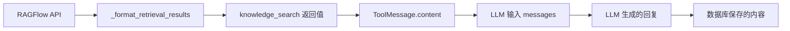

# RAGFlow 图片显示问题深度调试计划

## 问题
LLM 收到包含图片 Markdown 的 `knowledge_search` 工具返回，但不在回复中保留图片。

## 数据流追踪路径



## 调试计划

### 1. 验证 _format_retrieval_results 输出
- [ ] 添加日志：打印完整的格式化结果
- [ ] 确认图片 Markdown 语法正确
- [ ] 统计包含图片的 chunk 数量

### 2. 验证 ToolMessage 封装
- [ ] 打印 knowledge_search 工具的实际返回值
- [ ] 检查 LangGraph 如何封装 ToolMessage
- [ ] 确认 ToolMessage.content 包含图片

### 3. 验证 LLM 输入
- [ ] 打印发送给 LLM 的完整 messages 列表
- [ ] 特别关注最后一条 ToolMessage 的内容
- [ ] 检查是否有长度截断

### 4. 分析 LLM 行为
- [ ] 检查 LLM 的系统提示词
- [ ] 分析 LLM 如何处理工具返回中的 Markdown
- [ ] 测试不同的提示词措辞

### 5. 对比测试
- [ ] 手动构造包含图片的 ToolMessage
- [ ] 测试 LLM 是否会保留
- [ ] 排查是否为模型特定行为

## 关键检查点

1. **工具返回值格式**
   ```python
   result = """【0】内容...
      📄 来源: xxx.docx | 相关度: 75%
      
   
   【1】内容...
      📄 来源: yyy.docx | 相关度: 70%
      
   """
   ```

2. **系统提示词关键部分**
   - 是否明确要求保留图片？
   - 措辞是否足够强制？
   - 是否有矛盾指令？

3. **LLM 模型差异**
   - 不同模型对 Markdown 的处理可能不同
   - GPT-4 vs DeepSeek vs Gemini 的行为差异

## 下一步
优先添加端到端日志，追踪整个数据流。
