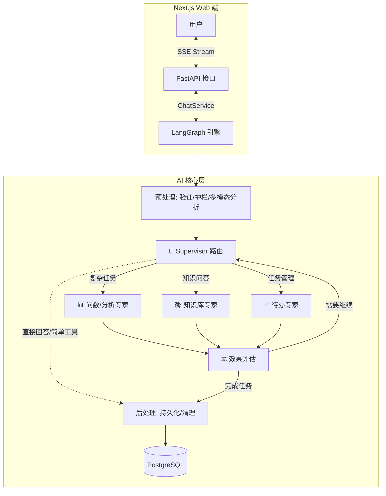
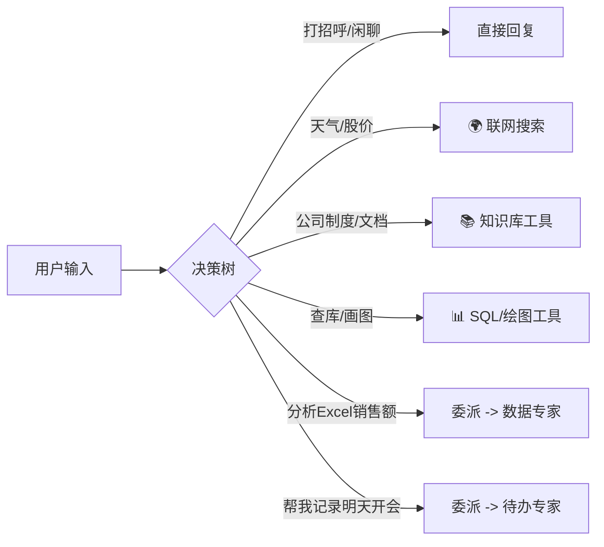
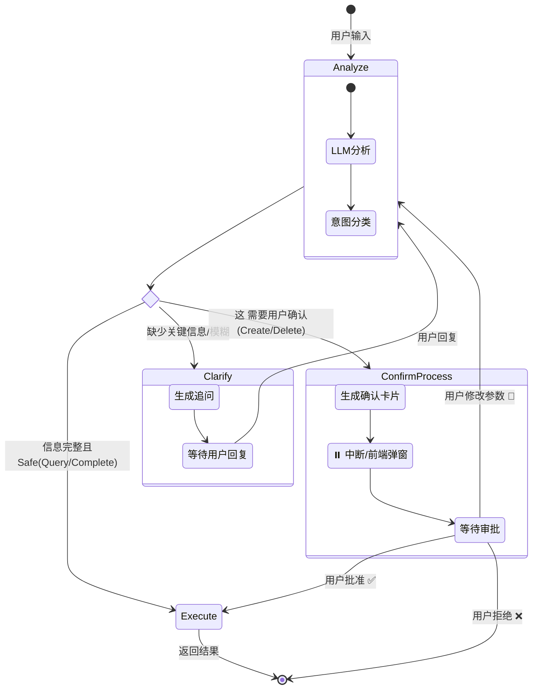
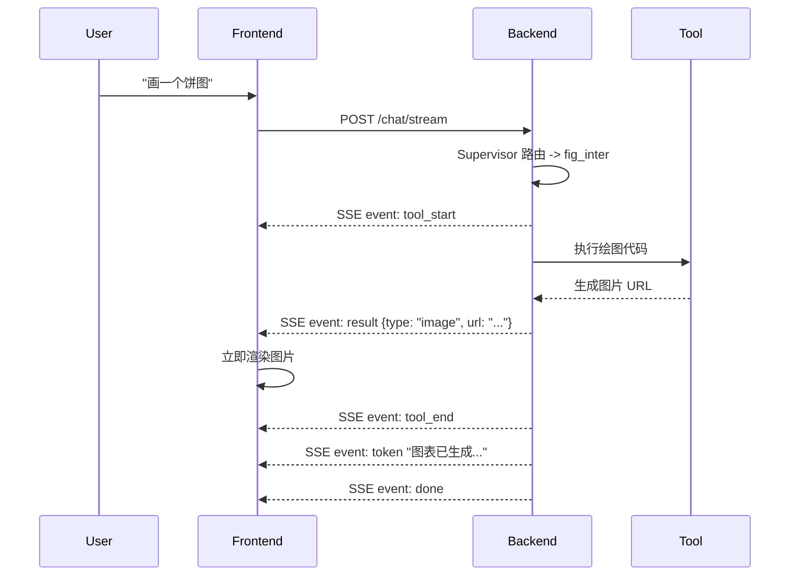

# 多智能体系统全解：架构、流程与实现

> **文档版本**: v1.0  
> **最后更新**: 2026-01-16  
> **适用对象**: 架构师、开发者、维护人员

---

## 1. 🌟 系统宏观架构

本系统基于 **LangGraph Supervisor 模式** 构建，是一个具备路由分发、专业分工、人机协作（Human-in-the-loop）能力的多智能体对话系统。

### 1.1 核心设计理念

1.  **Supervisor 为核心**: 中央调度器负责意图理解与任务分发，而不是让所有 Agent 混在一起。
2.  **专家即插即用**: 数据分析、待办管理、知识问答作为独立模块，互不干扰。
3.  **流式优先**: 全链路支持 SSE (Server-Sent Events) 流式输出，包括状态更新、工具调用和图表渲染。
4.  **安全护栏**: 所有输入输出经过 Guardrails 层，防止注入与敏感泄露。

### 1.2 高层架构图



---

## 2. 🔄 核心工作流详解

### 2.1 主控制流 (Main Loop)

代码入口: `app/ai/workflow/multi_agent_graph.py`

整个系统运行在一个有向循环图 (Cyclic Graph) 中：

1.  **START -> Preprocess**: 
    - **消息验证**: 修复 DeepSeek `reasoning_content`，清理无效 Tool Calls。
    - **护栏检查**: `guardrail_runner.validate_input` 拦截恶意输入。
    - **附件分析**: 识别图片/文件 URL，调用 Vision Tool 分析内容并注入 Context。

2.  **Preprocess -> Supervisor**:
    - Supervisor 接收预处理后的 State。
    - 根据 System Prompt 中的 **决策树** 判断：
        - 是简单聊天？ -> 直接回复。
        - 是简单查询？ -> 直接调用 `tavily_search`, `knowledge_search` 等。
        - 是复杂任务？ -> 调用 `handoff` 工具委派给专家。

3.  **Supervisor -> Experts (Handoff)**:
    - 使用 `Send()` 原语将特定任务描述发送给目标 Agent。
    - 关键工具: `assign_to_data_expert`, `assign_to_todo_expert`。

4.  **Experts -> Evaluate**:
    - 专家执行完毕后（可能包含多轮 ReAct 循环）。
    - 进入 Evaluate 节点评估任务是否真正完成。
    - 如果专家需要其他专家协助（极少情况），Evaluate 可将控制权交回 Supervisor。

5.  **Evaluate/Supervisor -> Postprocess -> END**:
    - 保存对话历史到 `t_chat_message`。
    - 清理临时数据（如 DataFrame 缓存）。

### 2.2 Supervisor 决策逻辑

Supervisor 并非"全知全能"，它主要基于工具描述进行路由。



---

## 3. 🤖 子智能体深度解析

### 3.1 📊 Data Expert (数据/问数专家)

- **职责**: 处理复杂的多步骤数据分析任务。
- **文件**: `app/ai/agents/data_agent.py`
- **核心能力**:
    - **SQL 查询**: `sql_inter` 直接查询数据库。
    - **数据清洗**: `extract_data` 处理上传的文件。
    - **代码执行**: `python_inter` 运行 Python 代码进行高级分析。
    - **可视化**: `fig_inter` 生成 ECharts 图表。

### 3.2 📚 Knowledge Expert (知识库专家)

- **职责**: 企业私有知识检索。
- **文件**: `app/ai/agents/knowledge_agent.py`
- **集成**: 对接 RAGFlow 系统。
- **关键机制 - 图片透传**:
    - RAGFlow 返回的文档片段中可能包含 Markdown 图片 ``。
    - 专家被 Prompt 强制要求 **保留这些图片链接**。
    - 后端通过 `emit_result` 和 Markdown 渲染双重机制确保图片在前端展示。

### 3.3 ✅ Todo Expert (待办专家) - 最复杂的 Agent

- **职责**: 智能任务管理，支持多轮澄清与确认。
- **文件**: `app/ai/workflow/todo_graph.py`
- **架构**: 独立的子图 (SubGraph)，拥有自己的状态机。

#### 待办专家状态机



#### 关键特性
1.  **NLP 时间解析**: 自动将 "下周三下午" 解析为 ISO 时间。
2.  **智能冲突检测**: 如果新任务与已有任务时间重叠，Prompt 会标记风险。
3.  **Human-in-the-loop**: 
    - 危险操作（删除、批量修改）触发 `interrupt`。
    - 前端收到 `interrupt` 事件弹出确认卡片。
    - 用户点击确认后，调用 `/chat/resume` 恢复执行。

---

## 4. 📡 通信与协议 (SSE & Events)

系统使用 **Server-Sent Events (SSE)** 实现全双工流式通信。

### 4.1 事件全景图

| 事件类型 | 触发源 | 说明 | 数据载体 |
| :--- | :--- | :--- | :--- |
| `token` | LLM | 实时文本流 | `{content: "..."}` |
| `thinking` | LLM | 深度思考过程 (DeepSeek-R1) | `{content: "..."}` |
| `status` | Graph Node | 状态更新 (如"正在查询...") | `{message: "..."}` |
| `tool_start` | Agent | 工具调用开始 | `{name: "sql_inter", input: {...}}` |
| `tool_end` | Agent | 工具执行完成 | `{output: "..."}` |
| `result` | Tool | **结构化产物** (图表/图片/列表) | `{data_type: "image", data: {url: "..."}}` |
| `interrupt` | Graph | **需要人工干预** | `{interrupt_id: "...", value: {...}}` |

### 4.2 前后端交互时序 (以画图为例)



---

## 5. 🛠️ 开发与扩展指南

### 5.1 如何添加一个新的专家 Agent？

1.  **定义 Agent**: 在 `app/ai/agents/` 下创建新文件（如 `hr_agent.py`）。
2.  **编写 Prompt**: 定义 System Prompt，描述其专业能力。
3.  **注册枚举**: 在 `multi_agent_graph.py` 的 `AgentType` 和 `AGENT_DESCRIPTIONS` 中注册。
4.  **创建 Handoff**: 系统会自动根据描述生成 `assign_to_hr_expert` 工具。
5.  **加入图**: 在 `create_multi_agent_graph` 中添加节点 `workflow.add_node("hr_expert", ...)` 并连接边。

### 5.2 如何调试？

- **日志**: 后端日志详细记录了 `[多智能体-消息列表]` 和 `意图路由` 过程。
- **LangSmith**: 如果配置了 LangSmith，可以查看完整的 Trace 链路。
- **前端状态**: AI 回复框下方的 "Status Indicator" (脉冲小圆点) 会实时显示后端 `emit_status` 推送的当前步骤。

---

## 6. ⚠️ 常见问题速查

- **Q: 为什么 DeepSeek 模型有时会报错？**
    - A: DeepSeek R1 的 API 限制历史消息必须包含 `reasoning_content`。我们在 `preprocess` 节点有自动修复逻辑 (`fix_deepseek_reasoning`)。
- **Q: 图片为什么不显示？**
    - A: 检查 `fig_inter` 或 `ragflow_tool` 是否正确发出了 `emit_result("image", ...)` 事件。
- **Q: 任务一直卡在"正在思考"？**
    - A: 可能是死循环。`evaluate` 节点有 `MAX_ITERATIONS=3` 的强制熔断保护。

---

## 7. 🧩 代码级实现细节 (Code-Level Implementation)

### 7.1 Supervisor 图片保留规则 (必读)

为了解决 RAG 检索结果中图片丢失的问题，我们在 Supervisor 的 System Prompt 中增加了强制规则：

> **⚠️ 图片处理规则（必须遵守）**
> 
> knowledge_search 检索结果中包含的图片 Markdown **必须完整保留在回答中**！
> - **逐字复制**：不要修改 URL，不要尝试下载。
> - **位置要求**：放在相关文字说明之后。
> - **覆盖范围**：每个检索结果块的图片都要保留。

这确保了当知识库返回 `` 时，LLM 不会将其过滤掉。

### 7.2 RAGFlow 工具实现内幕

文件: `app/ai/tools/ragflow_tool.py`

工具实现了 RAGFlow 检索结果的格式化与图片提取：

1.  **Chunk 截断**: 强制限制 `MAX_CHUNKS = 30`，防止上下文溢出。
2.  **图片 URL 构造**: 将 RAGFlow 的 `image_id` 转换为本地代理 URL:
    ```python
    image_url = f"/api/v1/assets/proxy/ragflow/{image_id}"
    result_text += f"\n   "
    ```
3.  **调试日志**: 详细记录了检索到的 Chunk 数量及提取的图片数量，便于排查。

### 7.3 SSE 核心数据结构

前端 `useSSEStream.ts` 处理的关键事件结构：

#### `result` (结构化产物)
```json
{
  "type": "result",
  "data": {
    "data_type": "image", // 或 'chart', 'todo_list'
    "data": {
      "url": "/api/v1/assets/proxy/ragflow/..."
    },
    "message": "图片描述 optional"
  }
}
```

#### `tool_start` (工具调用)
```json
{
  "type": "tool_start",
  "data": {
    "name": "knowledge_search",
    "input": {
      "query": "企业年金政策"
    }
  }
}
```

### 7.4 调试技巧：日志追踪

我们在 `multi_agent_graph.py` 中增加了详细的 `DEBUG` 日志：
- **输入监控**: `[AgentName] LLM 输入消息` —— 打印最后 3 条消息，统计包含的图片数量。
- **输出监控**: `[AgentName] LLM 输出统计` —— 统计生成的 Token 数及保留的图片数量。

通过搜索日志关键字 `📸 包含图片数量` 可以快速定位图片丢失发生在哪个环节（是输入没给进去，还是输出被吞了）。
