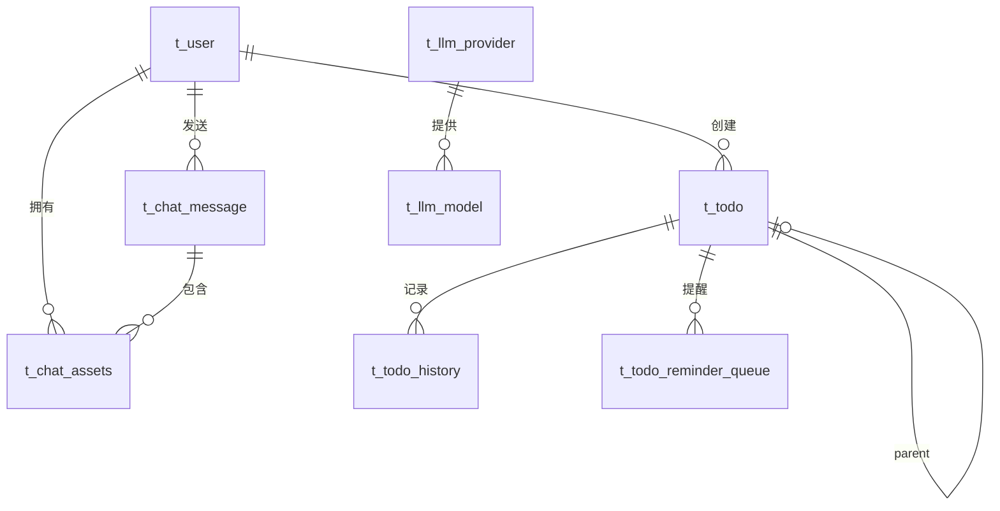

# 数据库规范

> **用途**: 定义数据库表结构、命名规范和使用约定。

---

## 📋 命名规范

| 规则 | 说明 |
|------|------|
| 表名前缀 | 统一以 `t_` 开头 |
| 字段命名 | 使用 `snake_case`（全小写下划线） |
| 主键 | 统一使用 `id` |
| 时间字段 | `created_at` / `updated_at` / `createtime` |

---

## 📊 数据库表一览

| 表名 | 模型文件 | 用途 |
|------|----------|------|
| `t_user` | `app/models/user.py` | 用户账户 |
| `t_chat_message` | `app/models/chat_message.py` | 对话历史 |
| `t_chat_assets` | `app/models/chat_asset.py` | 对话资产（图片、图表） |
| `t_todo` | `app/models/todo.py` | 待办事项 |
| `t_todo_history` | `app/models/todo_history.py` | 待办变更历史 |
| `t_todo_reminder_queue` | `app/models/todo_reminder.py` | 待办提醒队列 |
| `t_llm_provider` | `app/models/llm_config.py` | LLM 提供商配置 |
| `t_llm_model` | `app/models/llm_config.py` | LLM 模型配置 |
| `t_system_config` | `app/models/system_config.py` | 系统配置 |

---

## 📝 表结构详解

### `t_user` - 用户表

| 字段 | 类型 | 说明 |
|------|------|------|
| `id` | SERIAL | 主键 |
| `username` | VARCHAR | 用户名 |
| `password` | VARCHAR | 加密密码 |
| `mobile` | VARCHAR | 手机号 |
| `createtime` | TIMESTAMP | 创建时间 |
| `updatetime` | TIMESTAMP | 更新时间 |

---

### `t_chat_message` - 对话消息表

| 字段 | 类型 | 说明 |
|------|------|------|
| `id` | BIGSERIAL | 主键 |
| `user_id` | INTEGER | 用户 ID |
| `thread_id` | VARCHAR(100) | 对话线程 ID (NOT NULL) |
| `role` | VARCHAR(20) | 角色: ai / human / system |
| `content_type` | VARCHAR(50) | 内容类型: text / markdown / mixed |
| `content` | TEXT | 消息内容 |
| `metadata` | JSONB | 扩展元数据 |
| `create_time` | TIMESTAMP | 创建时间 |
| `title` | VARCHAR(255) | 对话标题（首条消息） |

**索引**: `idx_chat_message_thread_id` on `thread_id`

---

### `t_chat_assets` - 对话资产表

| 字段 | 类型 | 说明 |
|------|------|------|
| `id` | BIGSERIAL | 主键 |
| `qa_record_id` | BIGINT | 关联的问答记录 ID (NOT NULL) |
| `chat_id` | VARCHAR(64) | 对话 ID |
| `user_id` | BIGINT | 用户 ID |
| `asset_type` | ENUM | 资产类型: image / chart / export |
| `object_key` | VARCHAR(255) | MinIO Object Key (NOT NULL) |
| `original_url` | TEXT | 原始 URL |
| `file_name` | VARCHAR(255) | 文件名 |
| `file_size` | BIGINT | 文件大小（字节） |
| `content_type` | VARCHAR(100) | MIME 类型 |
| `created_at` | TIMESTAMP | 创建时间 |
| `expires_at` | TIMESTAMP | 过期时间 |

**索引**: `idx_user_chat` on `(user_id, chat_id)`

---

### `t_todo` - 待办事项表

| 字段 | 类型 | 说明 |
|------|------|------|
| `id` | BIGSERIAL | 主键 |
| `user_id` | BIGINT | 用户 ID |
| `title` | VARCHAR(500) | 标题 (NOT NULL) |
| `description` | TEXT | 描述 |
| `status` | ENUM | 状态: todo / in_progress / done / cancelled |
| `priority` | INTEGER | 优先级: 1=高, 2=中, 3=低 |
| `category` | VARCHAR(100) | 分类 |
| `tags` | JSONB | 标签列表 |
| `start_time` | TIMESTAMP | 开始时间 |
| `due_date` | TIMESTAMP | 截止时间 |
| `completed_at` | TIMESTAMP | 完成时间 |
| `progress` | INTEGER | 进度 (0-100) |
| `progress_notes` | TEXT | 进度备注 |
| `reminder_enabled` | BOOLEAN | 是否启用提醒 |
| `reminder_advance_minutes` | INTEGER | 提前提醒分钟数 |
| `is_recurring` | BOOLEAN | 是否循环 |
| `recurrence_pattern` | JSONB | 循环模式 |
| `parent_id` | BIGINT | 父任务 ID |
| `created_at` | TIMESTAMP | 创建时间 |
| `updated_at` | TIMESTAMP | 更新时间 |

---

### `t_todo_history` - 待办历史表

| 字段 | 类型 | 说明 |
|------|------|------|
| `id` | BIGSERIAL | 主键 |
| `todo_id` | BIGINT | 待办 ID |
| `action` | VARCHAR(50) | 操作类型 |
| `old_value` | JSONB | 旧值 |
| `new_value` | JSONB | 新值 |
| `changed_by` | BIGINT | 操作用户 |
| `created_at` | TIMESTAMP | 操作时间 |

---

### `t_llm_provider` - LLM 提供商表

| 字段 | 类型 | 说明 |
|------|------|------|
| `id` | SERIAL | 主键 |
| `name` | VARCHAR(50) | 提供商名称 (唯一) |
| `display_name` | VARCHAR(100) | 显示名称 |
| `api_base` | VARCHAR(500) | API 地址 |
| `api_key` | VARCHAR(500) | API 密钥 (加密存储) |
| `is_active` | BOOLEAN | 是否启用 |
| `created_at` | TIMESTAMP | 创建时间 |
| `updated_at` | TIMESTAMP | 更新时间 |

---

### `t_llm_model` - LLM 模型表

| 字段 | 类型 | 说明 |
|------|------|------|
| `id` | SERIAL | 主键 |
| `provider_id` | INTEGER | 提供商 ID (FK) |
| `model_code` | VARCHAR(100) | 模型代码 (唯一) |
| `model_name` | VARCHAR(200) | 模型名称 |
| `model_type` | VARCHAR(50) | 模型类型: chat / embedding |
| `supports_thinking` | BOOLEAN | 是否支持思考模式 |
| `is_default` | BOOLEAN | 是否默认模型 |
| `is_active` | BOOLEAN | 是否启用 |
| `created_at` | TIMESTAMP | 创建时间 |
| `updated_at` | TIMESTAMP | 更新时间 |

---

### `t_system_config` - 系统配置表

| 字段 | 类型 | 说明 |
|------|------|------|
| `id` | SERIAL | 主键 |
| `key` | VARCHAR(100) | 配置键 (唯一) |
| `value` | TEXT | 配置值 |
| `description` | TEXT | 描述 |
| `created_at` | TIMESTAMP | 创建时间 |
| `updated_at` | TIMESTAMP | 更新时间 |

---

## 🔗 表关系



---

## ⚙️ 枚举类型

### `todo_status`
```sql
CREATE TYPE todo_status AS ENUM ('todo', 'in_progress', 'done', 'cancelled');
```

### `asset_type`
```sql
CREATE TYPE asset_type AS ENUM ('image', 'chart', 'export');
```
