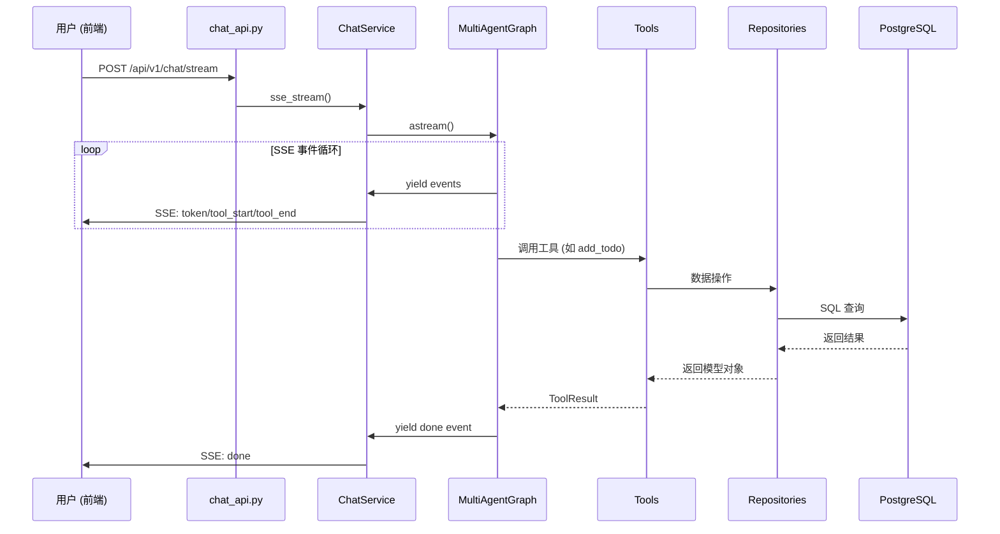
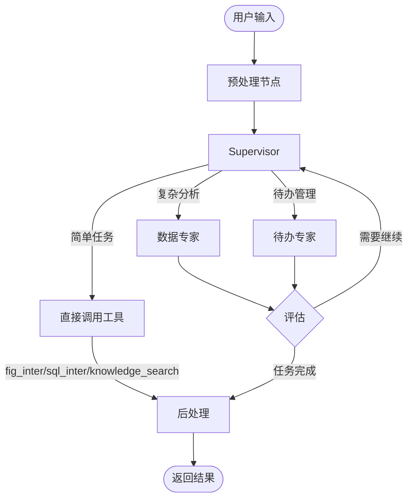

# 系统架构总览

> **用途**: 帮助 AI 理解项目整体结构，快速定位修改位置。

## 🔧 技术栈与版本

### 后端 (Python ≥3.11)

| 分类 | 依赖 | 版本 |
|------|------|------|
| **框架** | FastAPI | 0.115.5 |
| | Uvicorn | 0.32.0 |
| **AI/LLM** | LangChain | 1.0.8 |
| | LangGraph | 1.0.3 |
| | OpenAI SDK | ≥1.97.0 |
| | MCP | ≥1.12.2 |
| **数据库** | SQLAlchemy | 2.0.36 |
| **存储** | MinIO | ≥7.2.8 |

### 前端 (TypeScript)

| 分类 | 依赖 | 版本 |
|------|------|------|
| **框架** | Next.js | 15.4.8 |
| | React | 19.0.0 |
| | TypeScript | 5.7.2 |
| **样式** | TailwindCSS | 4.0.13 |
| **包管理** | pnpm | 10.5.1 |

> 📖 完整依赖版本请查看 `pyproject.toml` 和 `web/package.json`

---

## 📁 项目结构

```
fastapi-skeleton/
├── app/                    # 后端核心
│   ├── ai/                 # AI 模块（LangGraph、Tools、Agents）
│   ├── api/v1/endpoints/   # HTTP API 端点
│   ├── core/               # 基础设施（配置、安全、日志）
│   ├── db/                 # 数据库连接层
│   ├── models/             # SQLAlchemy ORM 模型
│   ├── repositories/       # 数据访问层（CRUD）
│   ├── schemas/            # Pydantic 请求/响应模型
│   ├── services/           # 业务逻辑服务层
│   └── tests/              # 测试套件
├── web/src/                # 前端 Next.js
│   ├── app/                # App Router 页面
│   ├── components/         # React 组件
│   ├── hooks/              # 自定义 Hooks
│   ├── lib/                # 工具函数与 API 客户端
│   ├── providers/          # React Context Providers
│   └── types/              # TypeScript 类型定义
└── .agent/                 # AI 辅助开发配置
    ├── docs/               # 架构文档（本目录）
    ├── rules/              # 代码规则
    └── workflows/          # 操作工作流
```

---

## 🔄 数据流

### 聊天请求流程



### 分层职责

| 层级 | 目录 | 职责 | 依赖 |
|------|------|------|------|
| **API** | `app/api/v1/endpoints/` | HTTP 入口、参数校验、路由 | Service |
| **Service** | `app/services/` | 业务编排、SSE 流处理 | Graph、Repository |
| **AI** | `app/ai/` | LangGraph 图、Agent、Tools | Service (部分)、Repository |
| **Repository** | `app/repositories/` | 数据访问、CRUD 操作 | Model |
| **Model** | `app/models/` | ORM 定义、表结构 | - |

---

## 🤖 AI 模块架构

### 核心组件

```
app/ai/
├── workflow/
│   ├── multi_agent_graph.py   # ⭐ 多智能体 Supervisor 图
│   ├── todo_graph.py          # 待办专用 StateGraph
│   └── chat_graph.py          # 基础对话图
├── agents/
│   ├── data_agent.py          # 数据分析专家（仅复杂任务）
│   ├── todo_agent.py          # 待办事项专家
│   └── todo_enhanced_nodes.py # 待办增强节点
├── tools/
│   ├── todo_tools.py          # ⭐ 待办工具集 (add/list/update/delete)
│   ├── chatTools.py           # MCP 工具（数据库查询）
│   ├── file_tools.py          # 文件读取工具
│   ├── vision_tool.py         # 图片分析工具
│   └── ragflow_tool.py        # 知识库检索工具
├── events.py                  # ⭐ SSE 事件协议定义
├── llm_util.py                # LLM 实例管理
└── message_utils.py           # 消息处理工具
```

### Supervisor 路由（简化架构）



**工具分布：**
| 位置 | 工具 | 说明 |
|------|------|------|
| Supervisor | fig_inter, sql_inter, knowledge_search, analyze_image | 简单单步任务 |
| data_expert | extract_data, python_inter | 多步骤复杂分析 |
| todo_expert | add_todo, list_todos, update_todo, etc. | 需要确认流程 |

---

## 🔗 关键文件速查

### 修改聊天功能
| 场景 | 文件 |
|------|------|
| 添加新 SSE 事件类型 | `app/ai/events.py` → `web/src/hooks/useSSEStream.ts` |
| 修改流处理逻辑 | `app/services/chat_service.py` |
| 添加新 Agent | `app/ai/agents/` + `app/ai/workflow/multi_agent_graph.py` |

### 修改待办功能
| 场景 | 文件 |
|------|------|
| 添加新 Tool | `app/ai/tools/todo_tools.py` |
| 修改 Agent 行为 | `app/ai/agents/todo_agent.py` / `todo_graph.py` |
| 修改数据库操作 | `app/repositories/todo_repository.py` |
| 修改 API 端点 | `app/api/v1/endpoints/todo_api.py` |

### 修改前端聊天 UI
| 场景 | 文件 |
|------|------|
| 修改消息渲染 | `web/src/components/chat/index.tsx` |
| 修改 Markdown 渲染 | `web/src/components/chat/markdown-text.tsx` |
| 修改输入框 | `web/src/components/chat/ChatInput.tsx` |
| 修改流处理 | `web/src/hooks/useSSEStream.ts` |

---

## 📡 SSE 事件类型

后端 (`app/ai/events.py`) 定义，前端 (`web/src/hooks/useSSEStream.ts`) 处理：

| 事件类型 | 用途 | 数据结构 |
|----------|------|----------|
| `token` | AI 文本输出 | `{content: string}` |
| `thinking` | 思考过程 | `{content: string}` |
| `tool_start` | 工具调用开始 | `{name: string, input: any}` |
| `tool_end` | 工具调用结束 | `{name: string, output: string}` |
| `status` | 状态更新 | `{message: string}` |
| `result` | 结构化结果 | `{data_type: string, data: any}` |
| `confirmation` | 确认请求 | `{operation: object, message: string}` |
| `clarification` | 澄清问题 | `{questions: string[], message?: string}` |
| `interrupt` | 中断等待 | `{thread_id, interrupt_id, value}` |
| `done` | 流结束 | `{thread_id: string}` |
| `error` | 错误 | `{message: string}` |

---

## 🗄️ 数据库表

| 表名 | 用途 |
|------|------|
| `t_user` | 用户账户 |
| `t_chat_message` | 对话历史 |
| `t_chat_assets` | 对话资产（图片、图表） |
| `t_todo` | 待办事项 |
| `t_todo_history` | 待办变更历史 |
| `t_todo_reminder_queue` | 待办提醒队列 |
| `t_llm_provider` | LLM 提供商配置 |
| `t_llm_model` | LLM 模型配置 |
| `t_system_config` | 系统配置 |

> 📖 详细表结构请查看 [database.md](file://.agent/docs/database.md)

---

## ⚙️ 配置管理

项目使用 **双层配置机制**：

### 1. 环境变量配置

**文件**: `.env.dev` / `.env.prod`

用于基础设施配置，如数据库连接、MinIO 凭证、RAGFlow 配置等。

```
# 示例
DATABASE_URL=postgresql+psycopg://...
MINIO_ENDPOINT=localhost:19000
RAGFLOW_API_KEY=ragflow-xxx
```

**加载**: `app/core/config.py` 在启动时通过 `dotenv` 加载

### 2. 数据库配置（动态配置）

可在运行时通过 API 修改，无需重启服务。

#### LLM 配置（`t_llm_provider` + `t_llm_model`）

**服务**: `app/services/llm_config_service.py`

| 方法 | 说明 |
|------|------|
| `LLMConfigService.load_from_db(db)` | 启动时加载 |
| `LLMConfigService.get_model_config(code)` | 获取模型配置 |
| `LLMConfigService.get_default_model_code()` | 获取默认模型 |
| `LLMConfigService.list_available_models()` | 列出可用模型 |

**数据流**:
```
启动 → load_from_db() → 内存缓存
API 请求 → get_model_config() → 从缓存读取
管理后台修改 → API 更新 DB → 刷新缓存
```

#### 系统配置（`t_system_config`）

**服务**: `app/services/system_config_service.py`

| 方法 | 说明 |
|------|------|
| `SystemConfigService.get(key, default)` | 获取配置值 |
| `SystemConfigService.get_string/int/float/bool(key)` | 类型化获取 |
| `SystemConfigService.list_configs(category)` | 列出配置项 |

**支持的值类型**: `string`, `number`, `boolean`, `json`

### 3. 配置优先级

```
数据库配置 > 环境变量 > 代码默认值
```

### 4. 初始化时机

**文件**: `app/main.py` - `lifespan` 函数

```python
@asynccontextmanager
async def lifespan(app: FastAPI):
    with get_db_context() as db:
        LLMConfigService.load_from_db(db)
        SystemConfigService.load_from_db(db)
    yield
```

