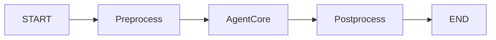

# LangGraph Agent 开发规范

## 核心原则
项目目前采用 **底层的 LangGraph (StateGraph)** 模式构建 Agent，而非单纯依赖 LangChain 的高层封装。
所有 Agent（Single Agent 或 Multi-Agent）都应遵循 **"显式图构建"** 的原则。

> **中文主导**: 无论是思考过程（CoT）还是最终输出，**永远使用中文**。

---

## 1. 标准图架构 (Standard Graph Architecture)

所有 Workflow 必须遵循 **Pre -> Core -> Post** 的三段式流水线结构：



### 1.1 Preprocess (预处理节点)
- **职责**: 
  - 消息验证与修复 (`validate_messages`)
  - 上下文注入 (系统时间、用户画像、Skills RAG)
  - 安全护栏 (Guardrails)
  - 多模态预处理 (图片/文件分析)
- **输出**: 更新 `state["messages"]` 或其他上下文及标记字段。

### 1.2 AgentCore (核心逻辑节点)
- **职责**: 执行 LLM 推理与工具调用。
- **实现方式**:
  - **推荐**: 使用 `langgraph.graph.StateGraph` 手动组合。
  - **允许**: 使用 `langgraph.prebuilt.create_react_agent` 作为子图节点 (Supervisor 或 Worker)。
  - **流式**: 必须支持 `astream_events (v2)`。

### 1.3 Postprocess (后处理节点)
- **职责 (必须执行)**:
  - **持久化**: 将对话记录保存到数据库 (`chat_repo.save_conversation_from_messages`)。
  - **清理**: 释放请求级资源 (如 DataFrame 缓存 `cleanup_thread_dataframes`)。
  - **日志**: 打印结构化调试日志。

---

## 2. State 管理规范

### 2.1 TypedDict 定义
必须使用 `TypedDict` 定义清晰的状态 Schema，并使用 `Annotated` 处理 reduce 逻辑。

```python
class AgentState(TypedDict):
    # 消息列表：必须使用 add_messages reducer
    messages: Annotated[Sequence[BaseMessage], add_messages]
    
    # 核心上下文
    user_id: Optional[int]
    thread_id: Optional[str]
    model_id: Optional[str]
    enable_thinking: Optional[bool]
    
    # 流程控制
    _graph_type: Optional[Literal["single_agent", "multi_agent"]]
```

---

## 3. 流式输出规范 (Streaming)

前端强依赖特定的事件流格式。所有 Agent 节点必须支持标准化的流式输出。

### 3.1 协议要求
- **API**: 必须使用 `astream_events(model, version="v2")`。
- **Wrapper**: 必须使用 `_create_streaming_agent_wrapper` 类似机制封装节点。
- **Event Format**: 输出必须转换为统一的 `AgentEvent` JSON 结构。

```python
# ❌ 禁止直接 yield 原始 chunk
# ✅ 必须封装为标准事件
writer(AgentEvent.token(content, node=name).to_stream_dict())
writer(AgentEvent.tool_start(tool_name, input, node=name).to_stream_dict())
```

---

## 4. 最佳实践与禁止事项

### ✅ 最佳实践
- **Checkpointer**: 必须支持 `checkpointer` 以实现持久化和断点恢复 (Human-in-the-loop)。
- **Tool Definition**: 优先使用 `app.ai.tools` 中的共享工具，涉及 heavy logic 时使用 MCP。
- **Error Handling**: Agent 节点应捕获常规异常并返回错误消息，**但必须抛出 `GraphInterrupt`**。

### ⛔️ 禁止事项 (Prohibited)
- **❌ 禁止跳过 Pre/Post 节点**: 数据库保存依赖 Postprocess，跳过会导致数据丢失。
- **❌ 禁止使用 legacy AgentExecutor**: 必须使用 LangGraph。
- **❌ 禁止在 Node 中直接 `print`**: 必须使用 `logger`。
- **❌ 禁止在 State 中存储不可序列化的对象**: 会导致 Checkpointer 失败。

---

## 5. 参考实现
- **单 Agent**: `app/ai/workflow/chat_graph.py`
- **多 Agent**: `app/ai/workflow/multi_agent_graph.py`
