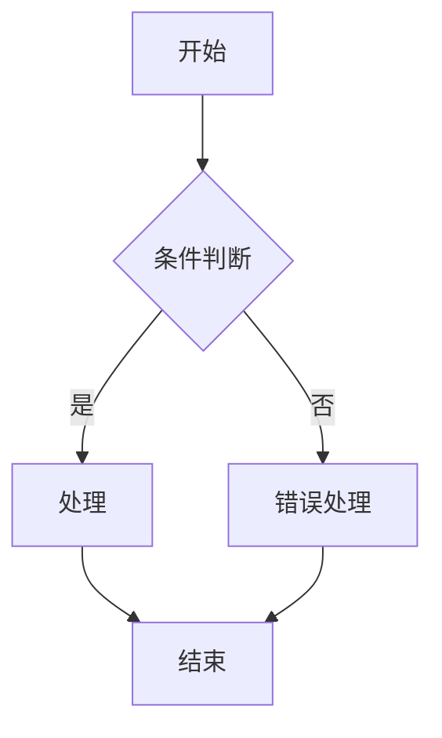
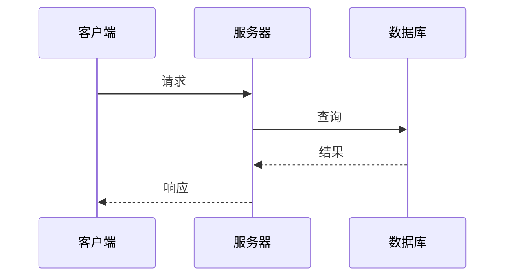
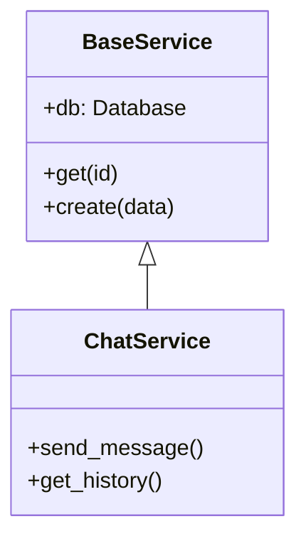
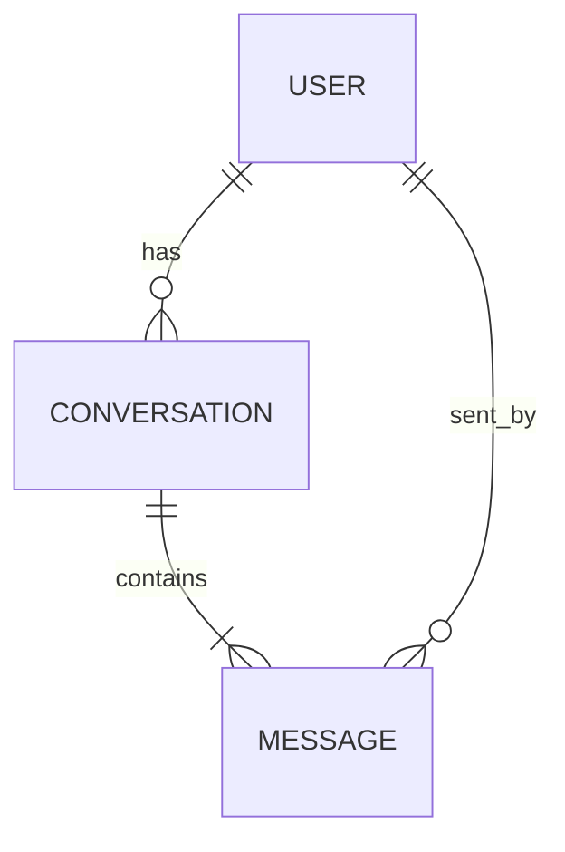
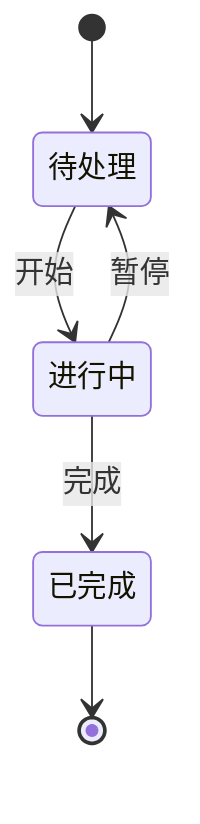

# 📊 生成 Mermaid 图表 (Diagrams)

分析代码、架构或概念，生成清晰的 Mermaid 图表。

> **中文主导**: 无论是思考过程还是最终输出，**永远使用中文**。

## 图表类型选择

| 类型 | 适用场景 | 语法 |
|------|----------|------|
| **流程图** | 算法、决策树、流程 | `flowchart TD/LR` |
| **时序图** | API 调用、消息传递 | `sequenceDiagram` |
| **类图** | 类结构、继承关系 | `classDiagram` |
| **ER 图** | 数据库表关系 | `erDiagram` |
| **状态图** | 状态机、生命周期 | `stateDiagram-v2` |
| **Git 图** | 分支策略 | `gitgraph` |
| **甘特图** | 项目计划、时间线 | `gantt` |

## 样式指南

### 箭头类型
```
-->   实线箭头（主流程）
-.->  虚线箭头（可选/异步）
==>   粗箭头（重要路径）
o-->  圆形端点（聚合）
*-->  菱形端点（组合）
```

### 最佳实践
- 节点 ID 使用描述性名称：`userService` 而非 `a1`
- 使用 subgraph 分组相关组件
- 每个图表最多 15-20 个节点
- 复杂系统拆分为多个图表

## 示例模板

### 流程图


### 时序图


### 类图


### ER 图


### 状态图


## 输出格式

始终使用 mermaid 代码块包裹：

````markdown
```mermaid
[图表代码]
```
````

生成后：
1. 解释图表内容
2. 提供优化建议
3. 可根据需要拆分或扩展

---
*提示：使用 `/diagrams` 触发此工作流。例如：`/diagrams 帮我画一下聊天系统的时序图`*
