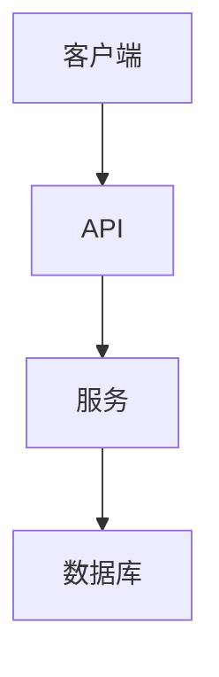

> 参考规则: @dual-database

# 全特性开发 (Feature Development)

一个指令，完成从需求到交付的全过程，包含文档同步闭环。

> **中文主导**: 无论是思考过程（CoT）还是最终输出，**永远使用中文**。

## 何时使用

| 场景 | 推荐命令 |
|------|----------|
| 完整的新功能开发 | `/jjk-feature` ✅ |
| 只需要规划，暂不编码 | `/jjk-plan` |
| 已有计划，只需编码 | `/jjk-imp` |
| 代码已完成，一次性验证 | `/jjk-verify` |
| 代码已完成，需要审查 | `/jjk-review` |
| 小改动（<= 3 文件） | `/jjk-quick` |

> **等效于**: `/jjk-plan` + `/jjk-imp` + `/jjk-review` + 文档同步闭环

---

## 阶段 1: 规划 (Planning)

1. **需求分析**: 
    - 询问用户意图
    - 生成 `<topic>_requirements.md`
    - 必须包含 User Stories + Acceptance Criteria

2. **技术设计** (如需):
    - 生成 `docs/内部参考/迭代需求/<topic>_implementation_plan.md`
    - 记录 ADR (架构决策)

3. **用户确认**: 
    - 用户满意后才进入编码

## 阶段 2: 编码 (Coding)

1. **Vibe Coding**:
    - 读取 `<topic>_requirements.md` 作为真理来源
    - 遵循 `.cursor/rules/core.mdc`、`.cursor/rules/doc_sync.mdc` 与场景规则

## 阶段 3: 文档同步闭环 (Doc Sync Loop)

> **执行顺序**: 先补文档草案，再编码，最后按实现回填并校验。

### 3.1 API 文档

如果新增/修改了 API，先补草案，编码后按实际实现回填 `docs/API文档/接口文档.md`：

```markdown
## POST /api/v1/xxx

简要描述

### 请求
**Body**
```json
{ "field": "value" }
```

### 响应
**200 OK**
```json
{ "id": "xxx", "result": "xxx" }
```

**错误码**
| Code | Description |
|------|-------------|
| 400 | 请求参数错误 |
```

### 3.2 数据库文档

如果新增/修改了表结构，先补草案，编码后回填 `docs/开发文档/架构设计/数据库设计.md`：

```markdown
### 表名: t_xxx

| 字段 | 类型 | 约束 | 说明 |
|------|------|------|------|
| id | UUID | PK | 主键 |
```

### 3.3 架构图

如果涉及架构变更，用 Mermaid 更新 `docs/开发文档/架构设计/后端架构.md`：



### 3.4 配置文档

如果新增配置项，更新 `docs/开发文档/快速入门/配置说明.md` 与 `.env.example`。

## 阶段 4: 审查与自测 (Review)

1. **自测**:
    - 运行单元测试
    - 验证服务能启动
    - 简单问题直接修复

2. **代码审查**:
    - 检查架构一致性、可读性、可维护性
    - **确认文档草案与实现回填一致**

## 阶段 5: 验证 (Verification)

1. **日志检查**: 确保无 ERROR
2. **数据验证**: 确认数据正确持久化
3. **生成报告**: 汇总结果交付用户

---

## 如何使用

```
/jjk-feature 我想做一个 [xxx] 功能
```

或者：
```
/jjk-feature 完成 <topic>_requirements.md 里定义的剩余工作
```
