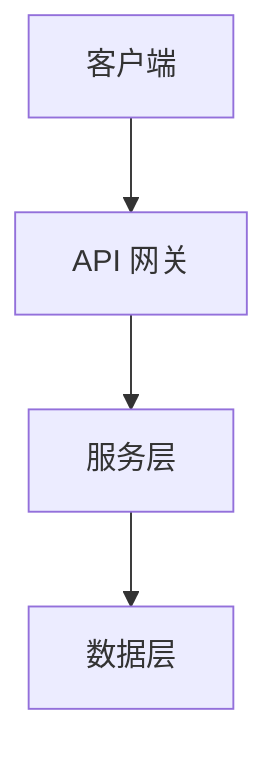

> 参考规则: @dual-database

# 实现工作流 (Implementation Workflow)

将 `<topic>_requirements.md` 或 `docs/内部参考/迭代需求/<topic>_implementation_plan.md` 转化为代码，并完成文档同步闭环。

> **中文主导**: 无论是思考过程（CoT）还是最终输出，**永远使用中文**。

## 何时使用

| 场景 | 推荐命令 |
|------|----------|
| 有明确计划，只需编码 | `/jjk-imp` ✅ |
| 需要先规划再编码 | `/jjk-plan` -> `/jjk-imp` |
| 诊断后按修复计划编码 | `/jjk-pc` -> `/jjk-imp` ✅ |
| 已拆分为 WS 子任务 | `/jjk-imp-ws` |
| 一站式从需求到交付 | `/jjk-feature` |

---

## 1. 编码 (Coding)

**输入**（按优先级匹配）:
1. `docs/内部参考/迭代需求/<topic>_implementation_plan.md`（来自 `/jjk-plan`，优先）
2. `docs/内部参考/迭代需求/fix_plan_<topic>.md`（来自 `/jjk-pc`）
3. `docs/内部参考/迭代需求/<topic>_requirements.md`（迭代级概览）
4. `docs/产品文档/<模块>需求.md`（模块级用户故事/验收标准）

**规范**:
- 遵循 `.cursor/rules/core.mdc`、`.cursor/rules/doc_sync.mdc` 与场景规则
- 若涉及架构/API/表结构/配置变更，先更新对应文档草案，再进入代码修改
- **禁止**: 自作聪明地修改需求
- 关键行为变化需回填到测试案例文档与追溯矩阵

## 2. 文档同步闭环 (Doc Sync Loop)

> **强制要求**: 文档先行，编码后回填并校验一致性。

### 2.1 API 文档更新

如果**新增或修改了 API 端点**，在编码前先补草案，编码后按实际实现回填 `docs/API文档/接口文档.md`：

```markdown
## POST /api/v1/xxx

简要描述

### 请求

**Headers**
| Header | Type | Required | Description |
|--------|------|----------|-------------|
| Authorization | string | Yes | Bearer token |

**Body**
```json
{
  "field": "value"
}
```

### 响应

**200 OK**
```json
{
  "id": "xxx",
  "result": "xxx"
}
```

**错误码**
| Code | Description |
|------|-------------|
| 400 | 请求参数错误 |
| 401 | 未授权 |
```

### 2.2 数据库文档更新

如果**新增或修改了表结构**，在编码前先补草案，编码后按实际实现回填 `docs/开发文档/架构设计/数据库设计.md`：

```markdown
### 表名: t_xxx

| 字段 | 类型 | 约束 | 说明 |
|------|------|------|------|
| id | UUID | PK | 主键 |
| name | VARCHAR(100) | NOT NULL | 名称 |
| created_at | TIMESTAMP | NOT NULL | 创建时间 |
```

### 2.3 配置文档更新

如果**新增了配置项**，更新 `docs/开发文档/快速入门/配置说明.md` 与 `.env.example`。

### 2.4 架构图更新（如需）

如果涉及**重大架构变更**，使用 Mermaid 更新 `docs/开发文档/架构设计/后端架构.md`：



## 3. 交接验证

编码完成后：
- 执行 `/jjk-verify` 一次性完成审查+测试+验收
- 或执行 `/jjk-review` 进行代码审查
- 或执行 `/jjk-test` 进行完整测试
- 如涉及测试行为变更，更新 `docs/开发文档/测试管理/测试用例库.md`

---
*使用 `/jjk-imp` 触发。兼容 `/jjk-plan` 产出（implementation_plan / requirements）和 `/jjk-pc` 产出（fix_plan），按”文档先行 + 编码回填”闭环执行。*
