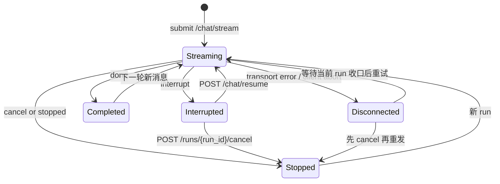

# API 接口文档
> 更新时间：2026-03-08

> 本项目 RESTful API 接口，所有接口以 `/api/v1` 为前缀。

## 文档导航

- 需求来源总览：[系统需求](../产品文档/系统需求.md)
- 架构总览：[系统总览](../开发文档/架构设计/系统总览.md)
- AI 调用链路设计：[AI模块设计](../开发文档/架构设计/AI模块设计.md)
- 配置与环境变量：[配置说明](../开发文档/快速入门/配置说明.md)
- 测试入口：[测试指南与环境配置](../开发文档/测试管理/测试指南与环境配置.md)

## 基础信息

- **Base URL**: `http://localhost:8000/api/v1`
- **认证方式**: JWT Bearer Token
- **请求格式**: JSON
- **响应格式**: JSON

除登录接口外，所有接口需要在 Header 中携带 Token：

```
Authorization: Bearer <token>
```

### 幂等性请求头

对于写操作（POST/PUT/PATCH/DELETE），支持通过 `Idempotency-Key` 请求头实现幂等性：

```
Idempotency-Key: <uuid>
```

| 说明 | 详情 |
|------|------|
| **作用** | 防止网络重试或用户重复提交导致的重复操作 |
| **格式** | 建议使用 UUID v4 |
| **判定维度** | `key + endpoint + user_id` |
| **重复行为** | 重复请求返回 HTTP 409 Conflict |
| **有效期** | 系统会记录请求状态：started/completed/failed |

> 前端建议：每次用户主动提交时生成新的幂等键，重试请求使用相同的键。

---

## 1. 认证接口

### POST /api/v1/auth/login

用户登录获取 Token。

**请求体**:

```json
{
  "username": "admin",
  "password": "secret"
}
```

**响应**:

```json
{
  "access_token": "eyJhbGciOiJIUzI1NiIsInR5cCI6IkpXVCJ9...",
  "token_type": "bearer"
}
```

**错误语义**:

| Code | 说明 | 前端展示建议 |
|------|------|--------------|
| 400 | `用户名或手机号至少填写一个` | 直接展示后端中文提示 |
| 401 | `用户名或密码错误` | 直接展示后端中文提示 |
| 500 | `数据库连接失败或查询异常` | 展示中文失败提示，避免英文兜底 |

> 前端登录页兜底文案统一为“登录失败”；若后端返回更具体的 `detail`，应优先展示该中文语义。

### GET /api/v1/me

获取当前登录用户信息。

**响应**:

```json
{
  "id": 1,
  "username": "admin",
  "mobile": "13800000000",
  "data_role": "staff",
  "data_role_label": "staff"
}
```

> `data_role_label` 读取系统配置键 `user.data_role_labels`（JSON 对象，`role -> label`）；若未配置对应角色，则回退 `data_role` 原值。

### POST /api/v1/logout

用户登出，将当前 Token 加入黑名单。

**响应**:

```json
{
  "message": "登出成功"
}
```

---

## 2. 用户管理接口

> 以下接口仅管理员（role=admin）可访问。

### GET /api/v1/users

获取用户列表（分页）。

**Query 参数**:

| 参数 | 类型 | 必填 | 说明 |
|------|------|------|------|
| `page` | int | 否 | 页码，默认 1 |
| `page_size` | int | 否 | 每页数量，默认 20，最大 100 |
| `search` | string | 否 | 搜索关键词（匹配用户名或手机号） |

**响应**:

```json
{
  "items": [
    {
      "id": 1,
      "username": "admin",
      "mobile": "13800000000",
      "role": "admin",
      "org_code": "001",
      "org_name": "总行",
      "dept_code": "IT",
      "dept_name": "信息科技部",
      "is_active": true,
      "create_time": "2026-01-01T00:00:00"
    }
  ],
  "total": 100,
  "page": 1,
  "page_size": 20
}
```

### POST /api/v1/users

创建新用户。

**请求体**:

```json
{
  "username": "newuser",
  "password": "password123",
  "mobile": "13900000000",
  "role": "user",
  "org_code": "001",
  "org_name": "总行",
  "dept_code": "IT",
  "dept_name": "信息科技部"
}
```

| 字段 | 类型 | 必填 | 说明 |
|------|------|------|------|
| `username` | string | 是 | 用户名（唯一） |
| `password` | string | 是 | 密码（至少 6 位） |
| `mobile` | string | 否 | 手机号 |
| `role` | string | 否 | 角色: user / analyst / admin，默认 user |
| `org_code` | string | 否 | 机构代码 |
| `org_name` | string | 否 | 机构名称 |
| `dept_code` | string | 否 | 部门代码 |
| `dept_name` | string | 否 | 部门名称 |

**错误码**:

| Code | Description |
|------|-------------|
| 400 | 用户名已存在 / 手机号已被使用 |

### PATCH /api/v1/users/{user_id}/status

更新用户启用/禁用状态。

**请求体**:

```json
{
  "is_active": false
}
```

**错误码**:

| Code | Description |
|------|-------------|
| 400 | 不能禁用自己 / 用户不存在 |

---

## 3. 聊天接口

### POST /api/v1/chat/stream

发起流式对话请求，返回 SSE 事件流。

**请求头**（可选）:

```
Idempotency-Key: c6f0a1f5-7b7a-4c3a-9a9a-2b0d2a2f9c5d
```

**请求体**:

```json
{
  "prompt": "你好，请帮我查询待办",
  "thread_id": "abc123",
  "enable_thinking": false,
  "model_id": "qwen-max",
  "attachments": [],
  "current_todo_id": null
}
```

| 参数 | 类型 | 必填 | 说明 |
|------|------|------|------|
| `prompt` | string | 是 | 用户输入内容 |
| `thread_id` | string | 否 | 对话线程 ID，为空则新建 |
| `enable_thinking` | boolean | 否 | 是否启用深度思考 |
| `model_id` | string | 否 | 指定模型 |
| `attachments` | array | 否 | 附件列表 |
| `current_todo_id` | int | 否 | 当前讨论的待办 ID |

> **注意**：系统已默认启用多智能体模式，`use_multi_agent` 参数已废弃。

> 幂等性由系统中间件统一处理，详见 [幂等性请求头](#幂等性请求头)

**响应**: SSE 事件流

```
event: token
data: {"content": "你好"}

event: result
data: {"data_type": "todo_list", "data": {"todos": [...]}, "message": "找到 3 条待办"}

event: tool_start
data: {"name": "list_todos", "input": {}}

event: tool_end
data: {"name": "list_todos", "output": "找到3条待办"}

event: final_answer
data: {"content": "按你的问题顺序：待办已查询，嘉兴天气为多云 18-24℃。", "meta": {"coverage_pass": true}}

event: done
data: {"thread_id": "abc123", "message_id": 456}
```

### SSE 协议约束（2026-02 严格切换）

1. **结构化数据单通道**：`result` 是唯一结构化载荷通道，格式为 `data_type + data + message?`。
2. **`done` 仅生命周期收口**：`done` 仅允许 `thread_id`、`message_id`、`final_content?` 字段。
3. **禁止在 `done` 携带结构化数据**：`done.additional_kwargs` 已废弃，不再作为前端卡片渲染输入。
4. **最终正文单一出口**：复合任务场景推荐消费 `final_answer.content` 作为用户最终答复，`done` 不承载业务正文。

#### 交付导向增量事件（V2）

| 事件 | 说明 | 建议消费方式 |
|---|---|---|
| `plan_ready` | 问题合同已生成（goal 列表） | 调试/进度面板可展示 |
| `task_started` | 子任务开始执行 | 进度条或状态面板 |
| `task_finished` | 子任务执行完成 | 进度条或状态面板 |
| `coverage_check` | 覆盖率检查结果（是否答全） | 质量面板/调试 |
| `final_answer` | 最终答复（唯一正文） | 聊天主消息正文 |

#### `done` 事件冻结字段（G0）

| 字段 | 必填 | 说明 |
|---|---|---|
| `thread_id` | 是 | 对话线程 ID |
| `message_id` | 是 | 已持久化 AI 消息 ID（用于点赞/点踩） |
| `final_content` | 否 | 非流式补发场景下的最终文本 |
| `meta` | 否 | 兼容扩展字段容器 |

> 兼容策略：新增字段只允许追加到 `meta` 或新增可选字段，不得删除 `thread_id/message_id`。

#### `result` 事件冻结字段（G0）

| 字段 | 必填 | 说明 |
|---|---|---|
| `type` | 是 | 结果类型（例如 `sql_result` / `todo_list` / `chart`） |
| `content` | 是 | 结果主内容；文本或结构化内容摘要 |
| `chart` | 否 | 图表数据 |
| `table` | 否 | 表格数据 |
| `meta` | 否 | 元信息（例如 `node`、兼容标签） |

#### `interrupt` 事件冻结字段（G0）

| 字段 | 必填 | 说明 |
|---|---|---|
| `reason` | 是 | 中断原因（默认 `action_required`） |
| `message` | 是 | 可直接展示给用户的提示文本 |
| `recoverable` | 否 | 是否可恢复（默认 `true`） |
| `suggested_action` | 否 | 建议动作（例如“请确认后继续”） |

> 兼容补充：为兼容既有前端，`interrupt` 仍附带 `thread_id`、`interrupt_id`、`value`。

### POST /api/v1/chat/resume

恢复被中断的流程（用户确认后）。

| decision.type | 说明 |
|---------------|------|
| `accept` | 确认执行 |
| `reject` | 拒绝执行 |
| `edit` | 编辑后执行 |

#### 客户端恢复/重发约束（2026-03-07）

> [!IMPORTANT]
> `resume` 是**控制面动作**，不是普通聊天消息。收到 `interrupt` 后，前端必须调用 `POST /api/v1/chat/resume`；禁止把“继续”“好的继续”“你刚刚中断了”当成新的用户消息发回 `/api/v1/chat/stream`。

| 场景 | 正确动作 | 禁止动作 | 说明 |
|---|---|---|---|
| 收到 `interrupt` | 调用 `POST /api/v1/chat/resume`，传 `decision.type=accept/reject/edit` | 发送普通文本“继续” | `interrupt` 表示旧 run 仍在等待用户决策，应继续旧流程而非开启新意图 |
| 用户放弃当前执行 | 调用 `POST /api/v1/chat/runs/{run_id}/cancel` | 直接本地清空状态后重发 | cancel 后 run 进入 `stopping/stopped`，后续 token 不再回灌 |
| run 已 `stopped` / 已取消 | 视为本次 run 结束；下一条消息走新的 `/api/v1/chat/stream` | 再次调用 `resume` | 已终态 run 不允许 resume |
| SSE 断流 / 网关 `400` / 客户端 abort | 保留当前 `run_id`，提示“连接中断，先等待收口或取消后重试” | 直接发“继续”作为聊天文本 | 传输层异常不等于业务 `interrupt`；当前版本无通用 reconnect 接口，不应伪装成新问题 |

> 前端展示约束：`run_id` 在用户界面统一展示为“运行编号”；恢复失败兜底文案统一为“恢复会话失败”，禁止直接向用户暴露 `resume failed`、`run_id` 等英文提示。

#### 多轮语义约束（2026-03-07）

1. 新的 `/chat/stream` 请求只以**最后一条用户消息**作为当前轮意图；更早历史仅作为上下文，不会被当成并列新问题重新处理。
2. `interrupt` 场景下，系统会保存中间 AI 消息并标记为 `is_intermediate=true`；历史查询默认过滤该类消息，避免把半成品当最终答复展示。
3. 因 `interrupt` 不会立即走最终 `postprocess` 清理，前端若跳过 `resume/cancel` 直接继续发普通消息，可能把新消息误判为对上一轮的补充或确认。
4. 因此 UI 必须把“继续/确认/编辑/取消”做成显式控制按钮，而不是依赖自然语言。

### 运行时取消能力（已上线，开关可控）

> 状态：已上线。开启 `ENABLE_RUN_CONTROL=true` 时为强停止语义；关闭时接口返回降级状态。

#### POST /api/v1/chat/runs/{run_id}/cancel

取消指定 run，幂等。

响应建议：

```json
{
  "accepted": true,
  "run_id": "run_xxx",
  "thread_id": "abc123",
  "status": "stopping",
  "idempotent": false,
  "reason": "user_cancelled"
}
```

约束建议：

1. 仅 run 所属用户或管理员可取消。
2. 前端对取消结果、停止中状态与异常兜底提示统一使用中文文案；用户界面不直接暴露英文状态提示。
2. 对终态 run 重复取消，返回已终态语义。
3. 取消成功后，run 进入 `stopping/stopped`，后续 token 停止回灌。

#### SSE `stopped` 事件（预留）

```json
{
  "type": "stopped",
  "data": {
    "thread_id": "abc123",
    "run_id": "run_xxx",
    "reason": "user_cancelled"
  }
}
```

#### 前端状态机建议（2026-03-07）



### GET /api/v1/chat/threads

获取当前用户的对话列表。

### GET /api/v1/chat/threads/latest

获取当前用户最近一次更新的会话（按 `updated_at` 降序取第一条）。

**响应（有历史会话）**:

```json
{
  "thread_id": "thread-latest-1",
  "title": "最近会话标题",
  "created_at": "2026-03-01T17:00:00",
  "updated_at": "2026-03-01T17:05:00"
}
```

**响应（无历史会话）**:

```json
null
```

### GET /api/v1/chat/threads/{thread_id}/messages

获取指定对话的消息历史。

**Query 参数**:

| 参数 | 类型 | 必填 | 默认 | 说明 |
|------|------|------|------|------|
| `limit` | int | 否 | 100 | 最大返回数量 |

**响应**:

```json
[
  {
    "id": 123,
    "thread_id": "uuid-xxx",
    "role": "ai",
    "content_type": "markdown",
    "content": "**贷款余额** 1,311.07 亿",
    "metadata": {"data_type": "sql_result", "data": {"sql": "...", "columns": [...], "rows": [...]}},
    "additional_kwargs": {"data_type": "sql_result", "data": {...}},
    "title": null,
    "created_at": "2026-02-07T10:30:00",
    "feedback_score": -1
  }
]
```

| 字段 | 类型 | 说明 |
|------|------|------|
| `feedback_score` | int / null | 当前用户的反馈: 1=赞, -1=踩, null=无反馈 |
| `additional_kwargs` | object / null | 结构化数据，`data_type` 标识类型（`sql_result` / `todo_list`） |

> 兼容说明（2026-02-13）：当历史记录中存在遗留结构串（例如 `[{"type": "text", "text": "..."}]` 或 Python repr 形式）时，接口会自动归一化为可读正文后返回 `content`。

### DELETE /api/v1/chat/threads/batch

批量删除对话及其关联资产。

**请求体**:

```json
{
  "thread_ids": ["uuid-1", "uuid-2", "uuid-3"]
}
```

**响应**:

```json
{
  "message": "已删除 3 个对话",
  "stats": {
    "total_messages": 25,
    "total_assets": 5,
    "total_minio": 5,
    "threads_deleted": 3
  }
}
```

**错误码**:

| Code | Description |
|------|-------------|
| 400 | thread_ids 不能为空 / 单次最多删除 100 个对话 |

### DELETE /api/v1/chat/threads/{thread_id}

删除对话及其关联资产。

### PATCH /api/v1/chat/threads/{thread_id}/title

更新对话标题。

### POST /api/v1/chat/feedback

提交消息反馈（点赞/点踩）。

点踩数据查询类消息（`data_type=sql_result`）时，自动将该查询记录到 SQL 修正台（`t_data_query_log`），供管理员审核和修正。

**请求体**:

```json
{
  "message_id": 123,
  "score": -1,
  "reason": "查询结果不正确"
}
```

| 参数 | 类型 | 必填 | 说明 |
|------|------|------|------|
| `message_id` | int | 是 | 消息 ID |
| `score` | int | 是 | 评分: 1=赞, -1=踩, 0=取消 |
| `reason` | string | 否 | 反馈原因 |

**响应**:

```json
{
  "message": "反馈已提交",
  "data": {
    "id": 1,
    "user_id": 1,
    "message_id": 123,
    "score": -1,
    "reason": "查询结果不正确"
  }
}
```

**副作用**:

当 `score=-1` 且被点踩的消息包含 `data_type=sql_result` 时，自动创建 `t_data_query_log` 记录（`is_correct=false`），在 SQL 修正台中可见。同一 SQL + 用户不重复写入。

---


## 3. 待办接口

### GET /api/v1/todo

获取当前用户的待办列表。

| 参数 | 类型 | 说明 |
|------|------|------|
| `status` | string | 状态过滤（写入值）: todo/in_progress/done/cancelled；查询别名: pending(=todo+in_progress)/completed(=done) |

### GET /api/v1/todo/{todo_id}

获取单个待办详情。

### PATCH /api/v1/todo/{todo_id}

更新待办事项（支持部分更新）。

| 参数 | 类型 | 说明 |
|------|------|------|
| `title` | string | 标题 |
| `description` | string | 描述 |
| `status` | string | 状态: todo/in_progress/done/cancelled |
| `priority` | int | 优先级 (1=高, 2=中, 3=低) |
| `due_date` | string | 截止时间（写入时使用标准日期时间格式，例如 `2023-10-01T10:00:00`） |
| `progress` | int | 进度 (0-100) |

**字段与错误语义补充**:

- `status` 的真实写入值仍为 `todo / in_progress / done / cancelled`，前端负责把展示标签翻译为“待办 / 进行中 / 已完成 / 已取消”。
- 当 `status` 非法时，返回中文校验提示：`状态仅支持：待办、进行中、已完成、已取消`。
- 当时间格式非法时，返回中文校验提示：`时间格式错误，请使用标准日期时间格式，例如 2023-10-01T10:00:00`。

### POST /api/v1/todo/{todo_id}/complete

标记待办为已完成。

### DELETE /api/v1/todo/{todo_id}

删除待办事项（软删除）。

### POST /api/v1/todo/{todo_id}/recurring

设置待办为重复任务。

| pattern | 说明 |
|---------|------|
| `daily` | 每天 |
| `weekly` | 每周 |
| `monthly` | 每月 |

### DELETE /api/v1/todo/{todo_id}/recurring

取消待办的重复设置。

### POST /api/v1/todo/{todo_id}/skip-occurrence

跳过一次重复任务实例。

### POST /api/v1/todo/recurring/generate-upcoming

批量生成未来 N 天的重复任务实例。

---

## 4. 资产接口

### GET /api/v1/assets/proxy/ragflow/{image_id}

代理访问 RAGFlow 知识库中的图片。

### GET /api/v1/assets/{asset_id}/presigned

获取 MinIO 资产的预签名 URL。

### GET /api/v1/assets

获取当前用户的资产列表。

| 参数 | 类型 | 说明 |
|------|------|------|
| `chat_id` | string | 过滤指定对话 |
| `asset_type` | string | 类型: image/chart/export |

---

## 5. 上传接口

### POST /api/v1/upload

上传文件到 MinIO 存储。

**请求**: `multipart/form-data`

| 参数 | 类型 | 说明 |
|------|------|------|
| `file` | file | 文件 |
| `thread_id` | string | 关联对话 ID (可选) |

**支持的文件类型**:

| 类型 | MIME |
|------|------|
| 图片 | image/png, image/jpeg, image/gif, image/webp |
| 文档 | application/pdf, text/plain |
| 表格 | application/vnd.ms-excel, text/csv |

**大小限制**: 10MB

---

## 6. 配置接口

### GET /api/v1/llm/models

获取可用的 LLM 模型列表。

### GET /api/v1/config/{key}

获取系统配置值。

### GET /api/v1/health

服务健康检查。

---

## 7. 管理后台

系统提供 Web 管理界面，用于配置和管理各项功能。

### 访问入口

| 功能 | 地址 | 说明 |
|------|------|------|
| 系统配置 | `/admin/system` | 管理 AI、RAGFlow、MCP 等运行参数 |
| LLM 配置 | `/admin/llm` | 管理模型提供商和模型配置 |
| 技能管理 | `/admin/skills` | 管理 Agent 技能向量库 |
| 数据访问控制 | `/admin/access` | 配置 AI 问数功能的表权限 |

### 登录凭据

首次运行需在 `.env.dev` 中设置 `INIT_DB_ON_STARTUP=true`，重启后端自动创建管理员账户：

- **用户名**: `admin`
- **密码**: `secret`

---

### 7.1 系统配置管理 (`/api/v1/system-admin`)

管理系统级配置项，支持分类管理和缓存刷新。

#### GET /system-admin/configs

获取配置列表，支持按分类筛选。

| 参数 | 类型 | 说明 |
|------|------|------|
| `category` | string | 分类筛选：ai/mcp/ragflow 等 |

**响应**:

```json
[
  {
    "id": 1,
    "config_key": "ai.default_model",
    "config_value": "qwen-max",
    "value_type": "string",
    "category": "ai",
    "description": "默认对话模型",
    "is_secret": false,
    "is_readonly": false
  }
]
```

#### GET /system-admin/configs/{config_key}

获取单个配置详情。

#### PUT /system-admin/configs/{config_key}

更新配置值（只读配置无法修改）。

**请求体**:

```json
{
  "config_value": "new_value"
}
```

#### POST /system-admin/configs

创建新配置项。

**请求体**:

```json
{
  "config_key": "custom.setting",
  "config_value": "value",
  "value_type": "string",
  "category": "custom",
  "description": "自定义配置",
  "is_secret": false,
  "is_readonly": false
}
```

#### DELETE /system-admin/configs/{config_key}

删除配置项（只读配置无法删除）。

#### GET /system-admin/categories

获取所有配置分类及数量。

**响应**:

```json
[
  {"category": "ai", "count": 10},
  {"category": "mcp", "count": 2},
  {"category": "ragflow", "count": 6}
]
```

#### POST /system-admin/refresh-cache

手动刷新配置缓存。

---

### 7.2 LLM 配置管理 (`/api/v1/llm-admin`)

管理 LLM 提供商和模型配置。

#### 提供商管理

##### GET /llm-admin/providers

获取所有提供商列表（API Key 自动脱敏）。

**响应**:

```json
[
  {
    "id": 1,
    "code": "qwen",
    "name": "通义千问",
    "base_url": "https://dashscope.aliyuncs.com/compatible-mode/v1",
    "api_key_masked": "sk-1****abcd",
    "is_active": true,
    "sort_order": 1,
    "model_count": 5,
    "extra_config": {
      "send_x_api_key": true
    }
  }
]
```

##### POST /llm-admin/providers

创建新提供商。

**请求体**:

```json
{
  "code": "openai",
  "name": "OpenAI",
  "base_url": "https://api.openai.com/v1",
  "api_key": "sk-xxx",
  "is_active": true,
  "sort_order": 0,
  "extra_config": {
    "default_headers": {
      "User-Agent": "my-admin"
    }
  }
}
```

##### PUT /llm-admin/providers/{provider_id}

更新提供商信息。

##### DELETE /llm-admin/providers/{provider_id}

删除提供商（级联删除关联模型）。

##### PUT /llm-admin/providers/{provider_id}/api-key

单独更新提供商的 API Key。

#### 模型管理

##### GET /llm-admin/models

获取模型列表。

| 参数 | 类型 | 说明 |
|------|------|------|
| `provider_id` | int | 按提供商筛选 |
| `model_type` | string | 按类型筛选：chat/embedding/reasoning/vision |
| `is_active` | bool | 按启用状态筛选 |

**响应**:

```json
[
  {
    "id": 1,
    "provider_id": 1,
    "provider_code": "qwen",
    "provider_name": "通义千问",
    "model_code": "qwen-max",
    "model_name": "Qwen Max",
    "model_type": "chat",
    "supports_thinking": false,
    "supports_tool_call": true,
    "supports_streaming": true,
    "max_output_tokens": 8192,
    "context_window": 32000,
    "default_temperature": 0.7,
    "is_default": true,
    "is_active": true,
    "sort_order": 1,
    "description": "通义千问旗舰模型",
    "extra_config": {
      "use_responses_api": true,
      "reasoning_effort": "medium"
    }
  }
]
```

##### POST /llm-admin/models

创建新模型。

**请求体**:

```json
{
  "provider_id": 1,
  "model_code": "gpt-4o",
  "model_name": "GPT-4o",
  "model_type": "chat",
  "supports_thinking": false,
  "supports_tool_call": true,
  "supports_streaming": true,
  "max_output_tokens": 4096,
  "context_window": 128000,
  "default_temperature": 0.7,
  "thinking_budget": 4096,
  "is_default": false,
  "is_active": true,
  "sort_order": 0,
  "description": "OpenAI GPT-4o",
  "extra_config": {
    "actual_model": "gpt-5.2",
    "use_responses_api": true,
    "send_x_api_key": true
  }
}
```

**模型属性说明**:

| 属性 | 类型 | 说明 |
|------|------|------|
| `model_type` | string | 模型类型：chat/embedding/reasoning/vision |
| `supports_thinking` | bool | 是否支持深度思考模式 |
| `supports_tool_call` | bool | 是否支持工具调用 |
| `supports_streaming` | bool | 是否支持流式输出 |
| `max_output_tokens` | int | 最大输出 token 数 |
| `context_window` | int | 上下文窗口大小 |
| `default_temperature` | float | 默认温度参数 |
| `thinking_budget` | int | 思考模式 token 预算 |
| `extra_config` | object | 模型级扩展参数（仅命中实验开关时生效） |

##### PUT /llm-admin/models/{model_id}

更新模型配置。

> 可传入 `extra_config` 覆盖模型级扩展参数；传空对象 `{}` 可清空已有键。

##### DELETE /llm-admin/models/{model_id}

删除模型。

##### PUT /llm-admin/models/{model_id}/set-default

设置为同类型的默认模型。

##### PUT /llm-admin/models/{model_id}/toggle-active

切换模型启用/禁用状态。

##### GET /llm-admin/model-types

获取所有模型类型及其默认模型。

**响应**:

```json
[
  {"type": "chat", "count": 6, "default_model": "qwen-max"},
  {"type": "embedding", "count": 1, "default_model": "text-embedding-v3"},
  {"type": "reasoning", "count": 1, "default_model": "qwq-32b"},
  {"type": "vision", "count": 1, "default_model": null}
]
```

#### 模型路由

> 需求来源：[`docs/产品文档/模型路由需求.md`](../产品文档/模型路由需求.md)

##### GET /llm-admin/model-routing

获取模型分类路由总览表（按能力分层，5 行）。

> 后端内部调用约束：
> - `t_llm_scene`：维护 `scene_key -> route_group`
> - `t_system_config`：维护 `route_group(config_key) -> model_id`
>   - `model_routing.default_chat`
>   - `model_routing.lightweight`
>   - `model_routing.sql_generation`
>   - `embedding`
>   - `vision`
> - 业务代码统一通过 `get_scene_llm(scene_key=...)` 或场景绑定工具函数取模型。

**响应**:

```json
[
  {
    "scene": "主对话",
    "call_point": "Supervisor / Agent 回复",
    "source": "scene_binding",
    "config_key": "model_routing.default_chat",
    "current_model": "qwen-plus",
    "recommended": "qwen-plus / deepseek-chat",
    "editable": true
  },
  {
    "scene": "SQL 生成 / 内部分析",
    "call_point": "vanna_client, analyze_data_intent, todo analyze_intent",
    "source": "scene_binding",
    "config_key": "model_routing.sql_generation",
    "current_model": "qwen-plus",
    "recommended": "qwen-plus / deepseek-chat",
    "editable": true
  },
  {
    "scene": "轻量任务（意图分类 / 参数提取 / 评估）",
    "call_point": "intent_classifier, parameter_extractor, llm_judge, sql_evaluator",
    "source": "scene_binding",
    "config_key": "model_routing.lightweight",
    "current_model": "qwen-plus",
    "recommended": "glm-4.5-air / qwen-flash",
    "editable": true
  },
  {
    "scene": "Embedding",
    "call_point": "embedding_util.get_embedding",
    "source": "scene_binding",
    "config_key": "embedding",
    "current_model": "embedding-3",
    "recommended": "embedding-3",
    "editable": true
  },
  {
    "scene": "Vision",
    "call_point": "vision_tool.analyze_image",
    "source": "scene_binding",
    "config_key": "vision",
    "current_model": "qwen3-vl-flash-2026-01-22",
    "recommended": "qwen3-vl-flash",
    "editable": true
  }
]
```

| 字段 | 类型 | 说明 |
|------|------|------|
| `scene` | string | 场景名称 |
| `call_point` | string | 代码调用点 |
| `source` | string | 模型来源：`scene_binding` / `user_select` |
| `config_key` | string? | 配置键名（可编辑行必有值，部分只读行也会返回用于标识来源） |
| `current_model` | string | 当前使用的模型 |
| `recommended` | string | 推荐模型 |
| `editable` | bool | 是否可通过此接口编辑 |

##### PUT /llm-admin/model-routing

更新模型路由配置。

> 更新逻辑：
> - 根据 `config_key` 定位 `route_group`
> - 将目标模型解析为 `model_id`
> - 写入 `t_system_config(config_key) = model_id`（单条配置）
> - 同一 `route_group` 下的全部 `scene_key` 自动生效（运行时通过 `t_llm_scene` 关联）

**请求**:

```json
{
  "config_key": "model_routing.sql_generation",
  "model_code": "qwen-plus"
}
```

| 字段 | 类型 | 必填 | 说明 |
|------|------|------|------|
| `config_key` | string | 是 | 配置键名（`model_routing.default_chat` / `model_routing.lightweight` / `model_routing.sql_generation` / `embedding` / `vision`） |
| `model_code` | string | 是 | 目标模型代码（必须是已启用模型；`default_chat` 仅允许 `chat`，`embedding` 仅允许 `embedding`，`vision` 允许 `vision/chat/reasoning`） |

**响应 200**:

```json
{
  "message": "模型路由已更新",
  "config_key": "model_routing.sql_generation",
  "model_code": "qwen-plus"
}
```

**错误码**:

| Code | 说明 |
|------|------|
| 400 | 不支持的配置项、模型不存在或未启用、默认对话模型不是对话类型、向量模型路由不是向量类型、或视觉模型路由类型不匹配 |

> 管理后台展示约束：按钮、提示与 toast 默认使用中文文案；`LLM`、`API` 等必要技术缩写可保留，但错误语义不得再回退到英文。

##### GET /llm-admin/scenes

获取调用点场景治理列表（`scene_key` 维度）。

**响应**:

```json
[
  {
    "scene_key": "app.ai.workflow.data_graph.analyze_data_intent",
    "scene_name": "问数意图分析",
    "route_group": "sql_generation",
    "scene_type": "text",
    "default_model_id": 12,
    "default_model_code": "qwen-plus",
    "is_active": true,
    "description": "问数链路内部分析"
  }
]
```

| 字段 | 类型 | 说明 |
|------|------|------|
| `scene_key` | string | 调用点唯一键（格式：`模块.函数名`） |
| `scene_name` | string | 场景名称 |
| `route_group` | string | 路由分组（`default_chat/lightweight/sql_generation/embedding/vision`） |
| `scene_type` | string | 场景类型（text/image/video/audio/embedding/vision/rerank/asr/tts） |
| `default_model_id` | int? | 当前路由模型 ID（运行时由 `t_system_config` 解析，非 `t_llm_scene` 持久列） |
| `default_model_code` | string? | 当前路由模型代码（运行时解析） |
| `is_active` | bool | 场景是否启用 |
| `description` | string? | 场景说明 |

##### PUT /llm-admin/scenes/{scene_key}

更新场景默认模型或状态。

**请求**:

```json
{
  "default_model_code": "qwen-plus",
  "is_active": true
}
```

| 字段 | 类型 | 必填 | 说明 |
|------|------|------|------|
| `default_model_code` | string | 否 | 目标模型代码（必须存在且启用，且类型兼容场景） |
| `is_active` | bool | 否 | 是否启用场景 |

**响应 200**:

```json
{
  "message": "场景配置已更新",
  "scene_key": "app.ai.workflow.data_graph.analyze_data_intent",
  "default_model_code": "qwen-plus",
  "is_active": true
}
```

**错误码**:

| Code | Description |
|------|-------------|
| 400 | scene_key 格式错误、模型不存在/未启用、模型类型不兼容 |
| 404 | 场景不存在 |

---

### 7.3 技能管理 (`/api/v1/skill-admin`)

管理 AI Agent 技能库、检索策略元数据和向量索引。

#### GET /skill-admin/skills

分页获取技能列表。

| 参数 | 类型 | 说明 |
|------|------|------|
| `skip` | int | 跳过数量，默认 0 |
| `limit` | int | 返回数量，默认 50，最大 200 |
| `search` | string | 搜索技能名称或描述 |
| `has_embedding` | bool | 筛选是否有向量 |
| `user_id` | int | 可选；返回该用户的绑定版本与生效版本信息 |

**响应**:

```json
[
  {
    "id": 1,
    "skill_id": "sql-expert",
    "name": "SQL Expert",
    "description": "SQL 查询与优化建议",
    "content_preview": "# SQL Expert...",
    "file_hash": "abc123",
    "has_embedding": true,
    "embedding_dim": 2048,
    "is_enabled": true,
    "auto_enabled": true,
    "priority": 80,
    "scope": "data",
    "trigger_phrases": ["贷款余额", "分行统计"],
    "conflicts_with": ["copywriter"],
    "published_version": "v2",
    "bound_version": "v1",
    "binding_status": "enabled",
    "effective_version": "v1",
    "created_at": "2026-02-13T09:30:00",
    "updated_at": "2026-02-13T09:30:00"
  }
]
```

#### GET /skill-admin/skills/{skill_id}

获取技能完整内容和元数据。

#### GET /skill-admin/skills/{skill_id}/versions

获取技能版本列表（按发布时间倒序，兼容未开启版本治理场景）。

#### POST /skill-admin/skills/{skill_id}/versions/publish

发布指定版本为当前生效版本。

**请求体**:

```json
{
  "version": "v2"
}
```

#### POST /skill-admin/skills/{skill_id}/versions/rollback

回滚技能版本；可指定 `target_version`，不传则回滚到最近候选版本。

**请求体**:

```json
{
  "target_version": "v1"
}
```

#### GET /skill-admin/bindings

查询用户技能绑定（支持 `user_id` / `skill_id` / `binding_status` 过滤）。

#### POST /skill-admin/bindings

绑定用户技能版本（按 `user_id + skill_id` 唯一约束隔离）。

**请求体**:

```json
{
  "user_id": 1001,
  "skill_id": "sql-expert",
  "version": "v2",
  "is_enabled": true,
  "priority_override": 20,
  "config_override": {
    "scope": "data"
  }
}
```

#### POST /skill-admin/bindings/rollback

回滚用户绑定，恢复平台发布版本生效。

**请求体**:

```json
{
  "user_id": 1001,
  "skill_id": "sql-expert"
}
```

#### GET /skill-admin/bootstrap-template

读取统一用户 Skill 初始化模板（系统配置键：`skill.user_bootstrap_template`）。

**响应**:

```json
{
  "default_version": "v1",
  "skills": [
    {
      "skill_id": "sql-expert",
      "version": "v2",
      "enabled": true,
      "priority_override": 20,
      "config_override": {
        "scope": "data"
      }
    }
  ]
}
```

#### PUT /skill-admin/bootstrap-template

更新统一模板（写入 `t_system_config`）。

**请求体**:

```json
{
  "default_version": "v2",
  "skills": [
    {
      "skill_id": "sql-expert",
      "version": "v2",
      "enabled": true,
      "priority_override": 20,
      "config_override": {
        "scope": "data"
      }
    }
  ]
}
```

#### POST /skill-admin/users/{user_id}/sync-template

对指定用户执行模板对齐；默认仅补齐缺失绑定，已存在绑定不会覆盖。

**请求体（可选）**:

```json
{
  "overwrite_existing": false
}
```

**响应**:

```json
{
  "user_id": 1001,
  "total": 2,
  "synced_count": 1,
  "skipped_count": 1,
  "failed_count": 0,
  "overwrite_existing": false
}
```

#### PATCH /skill-admin/skills/{skill_id}/meta

更新技能治理元数据。

> 运行时真理源说明：从 2026-03-07 起，该接口直接写入 `t_agent_skill_definitions` / `t_agent_skill_versions`；`t_agent_skills` 仅保留兼容、导入与调试用途，不再作为聊天 runtime metadata 主写路径。

**请求体**:

```json
{
  "is_enabled": true,
  "auto_enabled": true,
  "priority": 80,
  "scope": "data",
  "trigger_phrases": ["贷款余额", "分行统计"],
  "conflicts_with": ["copywriter"],
  "catalog_path": "finance/loan/sql-author",
  "catalog_order": 80,
  "catalog_description": "按主题目录暴露给模型的简要说明",
  "when_to_use": "当你需要生成或解释贷款 SQL 时"
}
```

**响应**:

```json
{
  "skill_id": "sql-expert",
  "updated": true,
  "updated_fields": ["priority", "trigger_phrases"]
}
```

**错误码**:

| Code | Description |
|------|-------------|
| 400 | 元数据非法（如 conflicts_with 包含自身） |
| 404 | 技能不存在 |

#### DELETE /skill-admin/skills/{skill_id}

删除指定技能。

#### GET /skill-admin/vector-status

获取向量索引状态概览。

**响应**:

```json
{
  "total_skills": 235,
  "with_embedding": 235,
  "without_embedding": 0,
  "embedding_dim": 2048,
  "current_model_dim": 2048,
  "dimension_mismatch": false
}
```

#### POST /skill-admin/regenerate-embeddings

批量重新生成技能向量。

**请求体**:

```json
{
  "skill_ids": ["sql-expert", "data-insight"]
}
```

> 如果 `skill_ids` 为空或不传，则重新生成所有技能向量。小批量（≤10）立即执行，大批量使用后台任务。

#### POST /skill-admin/skills/{skill_id}/regenerate

重新生成单个技能的向量。

#### GET /skill-admin/search

技能搜索（默认 Hybrid，返回精简结果）。

| 参数 | 类型 | 说明 |
|------|------|------|
| `query` | string | 搜索关键词（必填） |
| `top_k` | int | 返回数量，默认 5，最大 20 |
| `threshold` | float | 阈值（可选） |
| `scope` | string | 作用域过滤，默认 `global` |
| `user_id` | int | 可选；启用绑定开关后按用户覆盖版本检索 |

**响应**:

```json
{
  "query": "按分行统计贷款余额",
  "scope": "data",
  "results": [
    {
      "skill_id": "sql-expert",
      "name": "SQL Expert",
      "description": "SQL 查询与优化建议",
      "similarity": 0.8123,
      "vector_score": 0.76,
      "lexical_score": 0.71,
      "trigger_hit": 1.0,
      "effective_version": "v2",
      "binding_status": "enabled"
    }
  ],
  "count": 1
}
```

#### GET /skill-admin/search/hybrid

Hybrid 检索调试接口，返回候选、融合排序、淘汰原因与上下文预览。

| 参数 | 类型 | 说明 |
|------|------|------|
| `query` | string | 搜索关键词（必填） |
| `top_k` | int | 返回数量，默认 5 |
| `threshold` | float | 阈值（可选） |
| `scope` | string | 作用域过滤 |
| `auto_only` | bool | 是否仅返回可自动触发技能 |
| `user_id` | int | 可选；按用户绑定做候选覆盖 |

**响应核心字段**：
- `vector_candidates`
- `lexical_candidates`
- `final_candidates`
- `dropped`
- `context_preview`

---

### 7.4 用户技能自维护 (`/api/v1/user-skills`)

普通用户维护本人 Skill 绑定配置；接口内强制使用 `current_user.id`，不允许跨用户写入。

#### GET /user-skills

查询当前用户绑定列表与生效版本。

#### PATCH /user-skills/{skill_id}

更新当前用户单个 Skill 绑定配置（可更新 `version`/`is_enabled`/`priority_override`/`config_override`）。

**请求体示例**:

```json
{
  "is_enabled": false,
  "priority_override": 99,
  "config_override": {
    "scope": "todo"
  }
}
```

#### POST /user-skills/{skill_id}/reset

将当前用户该 Skill 回滚到模板默认（底层调用绑定回滚语义）。

---

### 7.5 数据访问控制 (`/api/v1/access-admin`)

管理 AI 问数功能的 SQL 查询权限，支持白名单/黑名单机制。

> 配置键口径（2026-02-14）：
> - 分析 Schema 白名单：`askdata.analytics_schema_allowlist`
> - 系统 Schema 黑名单：`askdata.system_schema_blacklist`
> - 兼容读取历史键：`data_access.*`、`askdata.schema_whitelist`、`askdata.schema_blacklist`

#### GET /access-admin/config

获取完整的访问控制配置。

**响应**:

```json
{
  "whitelist": ["t_orders", "t_products", "t_customers", "t_sales"],
  "whitelist_source": "default",
  "blacklist": ["t_user", "t_password", "t_secrets", "t_audit", "t_system"],
  "schema_whitelist": ["fdmdata", "sdmdata", "public"],
  "system_schema_blacklist": ["information_schema", "pg_catalog"]
}
```

#### GET /access-admin/whitelist

获取表白名单。

#### PUT /access-admin/whitelist

批量更新白名单。

**请求体**:

```json
{
  "tables": ["t_orders", "t_products", "t_new_table"]
}
```

#### POST /access-admin/whitelist/add

添加单个表到白名单。

| 参数 | 类型 | 说明 |
|------|------|------|
| `table_name` | string | 表名（Query 参数） |

#### DELETE /access-admin/whitelist/{table_name}

从白名单移除指定表。

#### GET /access-admin/blacklist

获取表黑名单。

#### PUT /access-admin/blacklist

批量更新黑名单。

**请求体**:

```json
{
  "tables": ["t_user", "t_password", "t_tokens"]
}
```

#### GET /access-admin/schema-whitelist

获取分析 Schema 白名单。

#### PUT /access-admin/schema-whitelist

更新分析 Schema 白名单（写入 `askdata.analytics_schema_allowlist`）。

**请求体**:

```json
{
  "schemas": ["fdmdata", "sdmdata", "public"]
}
```

#### GET /access-admin/system-schema-blacklist

获取系统 Schema 黑名单。

#### PUT /access-admin/system-schema-blacklist

更新系统 Schema 黑名单（写入 `askdata.system_schema_blacklist`）。

**请求体**:

```json
{
  "schemas": ["pg_catalog", "information_schema"]
}
```

#### POST /access-admin/test-sql

测试 SQL 语句的访问权限（不执行 SQL，仅检查权限）。

**请求体**:

```json
{
  "sql": "SELECT * FROM t_orders WHERE status = 'pending'"
}
```

**响应**:

```json
{
  "is_valid": true,
  "error": null,
  "tables_found": ["t_orders"],
  "tables_allowed": ["t_orders"],
  "tables_denied": []
}
```

#### GET /access-admin/available-tables

获取业务数据库中所有可用的表（用于 UI 选择）。

**响应**:

```json
{
  "tables": [
    {"schema": "public", "table": "t_orders", "full_name": "public.t_orders"},
    {"schema": "public", "table": "t_products", "full_name": "public.t_products"}
  ],
  "count": 25
}
```


### 7.5 开发工具 (`/api/v1/dev-tools`)

> ⚠️ **仅开发/测试环境可用**：该组接口用于本机调试与联调，生产环境（`ENV=prod`）会直接拒绝访问。

#### POST /dev-tools/codex/exec

桥接本机 `codex exec` 命令，便于在开发阶段验证“Agent 调用 Codex CLI”能力。

**请求体**:

```json
{
  "prompt": "只回复一个词：hi",
  "model": "gpt-5.2",
  "sandbox": "read-only",
  "timeout_sec": 180,
  "working_dir": "/Users/you/project"
}
```

| 字段 | 类型 | 必填 | 说明 |
|------|------|------|------|
| `prompt` | string | 是 | 要交给 Codex 执行的任务描述 |
| `model` | string | 否 | 指定 Codex 使用的模型（为空时走本机默认配置） |
| `sandbox` | string | 否 | `read-only` / `workspace-write` / `danger-full-access` |
| `timeout_sec` | int | 否 | 命令超时时间（秒），默认 180 |
| `working_dir` | string | 否 | 执行目录，必须位于项目根目录下 |

**响应示例**:

```json
{
  "ok": true,
  "exit_code": 0,
  "duration_ms": 5230,
  "stdout": "...",
  "stderr": "",
  "command": "codex -a never -m gpt-5.2 exec --skip-git-repo-check --sandbox read-only '只回复一个词：hi'",
  "workdir": "/Users/you/project",
  "dev_only": true
}
```

**错误码**:

| Code | Description |
|------|-------------|
| 400 | `working_dir` 超出项目目录范围 |
| 403 | 当前为生产环境，禁止调用开发工具接口 |
| 500 | 本机未安装 `codex` 命令 |

### 7.6 总览驾驶舱 (`/api/v1/admin-overview`)

> 后台总览接口，统一提供摘要、趋势与实时流三种消费形态，默认仅管理员可访问。

#### GET /admin-overview/summary

获取总览摘要快照（健康分、请求质量、稳定性、容量成本、告警、新鲜度、模块矩阵、变更流）。

**数据口径说明**:

1. 默认采集窗口为最近 5 分钟运行时观测，其中 `request_total` 与 `QPS` 采用“用户提问事件”口径（`/api/v1/chat/stream`，兼容历史 `/api/v1/chat/completions`），确保用户每提问 1 次仅增长 1 次请求总量；同时排除 `/api/v1/admin-overview/*` 自身请求，避免页面刷新/轮询放大统计值。
2. 当窗口内无业务请求流量时，返回 `overview.runtime.no_traffic` 提示告警，健康分字段可能为 `null`。
3. 当存在有效流量且健康分可计算时，服务会落库到 `t_ops_metric_snapshot_minute`，供趋势接口复用。

**响应示例**:

```json
{
  "snapshot_at": "2026-02-13T12:00:00Z",
  "source": "live",
  "degraded": false,
  "health_score": 92.4,
  "health_level": "healthy",
  "budget_usage_pct": 63.2,
  "request_quality": {
    "status": "healthy",
    "score": 94.0,
    "request_total": 1200,
    "success_rate": 0.985,
    "error_5xx_rate": 0.006,
    "latency_p95_ms": 630
  },
  "stability": {
    "status": "healthy",
    "score": 90.0
  },
  "capacity_cost": {
    "status": "warning",
    "score": 78.5,
    "budget_usage_pct": 65.8
  },
  "alerts": [],
  "freshness": {
    "status": "fresh",
    "delay_sec": 18,
    "expired": false
  },
  "module_matrix": [],
  "change_feed": [],
  "meta": {
    "generated_at": "2026-02-13T12:00:01Z",
    "trace_id": "trace-summary-001"
  }
}
```

#### GET /admin-overview/trends

获取总览趋势曲线。

| 参数 | 类型 | 必填 | 默认 | 说明 |
|------|------|------|------|------|
| `window` | string | 否 | `1h` | 趋势窗口：`1h` / `24h` |

**响应示例**:

```json
{
  "window": "24h",
  "interval": "1h",
  "points": [
    {
      "snapshot_at": "2026-02-13T11:00:00Z",
      "health_score": 88.2,
      "health_level": "healthy",
      "budget_usage_pct": 61.5,
      "request_total": 1100,
      "error_5xx_rate": 0.008,
      "latency_p95_ms": 690
    }
  ],
  "generated_at": "2026-02-13T12:00:01Z",
  "meta": {
    "trace_id": "trace-trends-001"
  }
}
```

#### GET /admin-overview/stream

获取总览实时 SSE 事件流（长连接），连接建立后立即推送首帧快照，随后按固定间隔持续推送增量快照。默认间隔为 10 秒。

事件协议遵循 `G0` 冻结字段：`result` / `interrupt` / `done`。

- 正常链路：持续输出 `result`，客户端保持连接；
- 异常链路：输出 `interrupt`，由客户端切换轮询降级；
- `done`：仅在服务端主动收口批次时出现，长连接常态下不作为必达事件。

**SSE 示例**:

```
event: result
data: {"type":"result","data":{"snapshot_at":"2026-02-13T12:00:00Z","patch":{"health_score":92.4},"trace_id":"trace-stream-001"}}

event: interrupt
data: {"type":"interrupt","data":{"reason":"stream_degraded","level":"warning","retry_after_sec":10,"message":"实时通道暂不可用，请降级轮询 /api/v1/admin-overview/summary"}}
```

**契约约束**:

1. `result.data` 必含 `snapshot_at` 与 `patch`。
2. `interrupt.data` 必含 `reason` 与 `level`，用于前端触发轮询降级。
3. `done.data` 必含 `batch_id`，仅用于批次收口，不承载业务明细；长连接常态不依赖该事件。

---

## 通用响应格式

### 成功响应

```json
{
  "data": { ... },
  "message": "操作成功"
}
```

### 错误响应

```json
{
  "detail": "错误信息"
}
```

### HTTP 状态码

| 状态码 | 说明 |
|--------|------|
| 200 | 成功 |
| 201 | 创建成功 |
| 400 | 请求参数错误 |
| 401 | 未认证 |
| 403 | 无权限 |
| 404 | 资源不存在 |
| 422 | 参数验证错误 |
| 500 | 服务器错误 |

---

## 问数管理 API (`/api/v1/data-admin`)

> 管理问数助手的查询日志、指标定义、训练数据和表元数据。

### 查询日志

#### GET `/data-admin/query-logs`

获取查询日志列表。

默认排除已忽略日志（`is_ignored=true`）。

| 参数 | 类型 | 必填 | 说明 |
|------|------|------|------|
| `skip` | int | 否 | 偏移量，默认 0 |
| `limit` | int | 否 | 每页数量，默认 20，最大 100 |
| `is_correct` | bool | 否 | 按正确性筛选 |
| `trained` | bool | 否 | 按训练状态筛选 |
| `include_ignored` | bool | 否 | 是否包含已忽略日志，默认 false |

#### GET `/data-admin/query-logs/{log_id}`

获取单条查询日志详情。

#### POST `/data-admin/query-logs/correct`

修正 SQL 并标记反馈。

```json
{ "log_id": 1, "corrected_sql": "SELECT ...", "is_correct": true }
```

#### POST `/data-admin/query-logs/feedback/{log_id}`

用户反馈 SQL 是否正确。参数: `is_correct` (bool)。

#### POST `/data-admin/query-logs/ignore`

批量忽略查询日志（软隐藏，不物理删除）。

仅允许忽略 `trained=false` 的日志，重复忽略幂等。

```json
{ "log_ids": [1, 2, 3] }
```

**响应示例**:
```json
{
  "message": "忽略完成，成功 2 条",
  "ignored_count": 2,
  "skipped_count": 1,
  "errors": ["日志 3 已训练，不能忽略"]
}
```

### 训练管理

#### POST `/data-admin/train`

将选中的日志训练到 Vanna 向量库。

```json
{ "log_ids": [1, 2, 3] }
```

#### POST `/data-admin/train/all-pending`

训练所有待训练日志（is_correct=True 且 trained=False）。

### 指标管理

#### GET `/data-admin/metrics/stats`

获取指标模板统计数据（仪表盘用）。

**响应示例**:
```json
{
  "total": 2678,
  "by_template_type": [
    {"type": "ETL(DELETE+INSERT)", "count": 1524, "percent": 56.9},
    {"type": "无模板", "count": 1135, "percent": 42.4},
    {"type": "SELECT", "count": 19, "percent": 0.7}
  ],
  "by_template_source": [
    {"source": "result_lookup", "count": 1489},
    {"source": "none", "count": 1170},
    {"source": "manual", "count": 19}
  ],
  "by_category": [{"category": "贷款", "count": 800}],
  "query_ready": 1508,
  "query_ready_percent": 56.3,
  "embedding_ready": 1543,
  "embedding_ready_percent": 57.6
}
```

#### GET `/data-admin/metrics`

获取指标列表。

| 参数 | 类型 | 必填 | 说明 |
|------|------|------|------|
| `skip` | int | 否 | 偏移量，默认 0 |
| `limit` | int | 否 | 每页数量，默认 50，最大 200 |
| `category` | string | 否 | 按分类筛选 |
| `keyword` | string | 否 | 按名称/别名/描述搜索 |

#### POST `/data-admin/metrics`

创建新指标（自动生成 embedding）。

```json
{
  "metric_id": "DEP_009",
  "metric_name": "协议存款余额",
  "description": "协议存款的余额汇总",
  "sql_template": "SELECT SUM(acct_bal) FROM fdmdata.f_mid_dep_tb WHERE ...",
  "category": "存款",
  "unit": "元"
}
```

#### PUT `/data-admin/metrics/{metric_id}`

更新指标（重新生成 embedding）。请求体同创建。

#### DELETE `/data-admin/metrics/{metric_id}`

删除指标。

#### POST `/data-admin/metrics/convert-etl`

AI 转换：将 ETL 脚本转为 SELECT 查询模板（不直接保存，供预览编辑）。

```json
{ "etl_script": "DELETE FROM ... INSERT INTO ... SELECT ..." }
```

**响应**: 结构化的指标元信息 + 提取的 SELECT 模板。

#### POST `/data-admin/metrics/batch-convert`

批量转换 ETL 模板。

```json
{
  "mode": "result_lookup",
  "limit": 100,
  "dry_run": false
}
```

| 参数 | 说明 |
|------|------|
| `mode` | `result_lookup`（快速，无需 LLM）或 `ai_extract`（AI 提取，较慢） |
| `limit` | 每批处理数量 |
| `dry_run` | `true` 时仅预览不保存 |

### 表元数据

#### GET `/data-admin/tables`

获取表元数据列表。

#### POST `/data-admin/sync-schema`

手动触发表结构同步。

### 结果增强规则管理（2026-02 新增）

#### GET `/data-admin/enrichment-rules`
获取结果增强规则列表。

#### POST `/data-admin/enrichment-rules`
创建规则。

#### PUT `/data-admin/enrichment-rules/{id}`
更新规则。

#### PATCH `/data-admin/enrichment-rules/{id}/enable`
启用/禁用规则。

#### PATCH `/data-admin/enrichment-rules/{id}/priority`
调整规则优先级。

#### POST `/data-admin/enrichment-rules/test`
输入样例 `rows/columns`，预览规则增强结果。

响应新增字段（2026-03）：

| 字段 | 说明 |
|------|------|
| `matched_rule_codes` | 已命中规则（命中 key 条件并触发查表） |
| `applied_rule_codes` | 已补齐成功的规则（实际改写了返回数据） |
| `no_data_rule_codes` | 命中规则但查不到映射数据的规则 |
| `summary_message` | 测试摘要提示（用于前端 toast 与预览文案） |

> 说明（2026-02）：该接口仅通过 `ResultEnrichmentRuleService.apply_lookup_enrichment_rule()` 执行规则测试，
> 不再直接调用 `app.ai.workflow.data_graph` 私有函数，避免 endpoint 越层依赖。

#### POST `/data-admin/enrichment-rules/refresh-cache`
手动刷新规则缓存。

### 文档记忆运维（2026-02 新增）

> 路由前缀：`/memory-admin`，仅管理员可访问。  
> 能力定位：文档记忆混合检索的向量补偿、重试与状态查询。

#### POST `/memory-admin/document/rebuild-embeddings`

触发文档记忆 chunk 向量重建（支持后台执行）。

```json
{
  "user_id": 10001,
  "doc_id": 501,
  "status_filter": ["pending", "failed"],
  "limit": 200,
  "run_async": true
}
```

| 字段 | 类型 | 必填 | 说明 |
|------|------|------|------|
| `user_id` | int | 否 | 仅重建指定用户 |
| `doc_id` | int | 否 | 仅重建指定文档 |
| `status_filter` | string[] | 否 | 默认 `["pending","failed"]` |
| `limit` | int | 否 | 本次处理上限，默认 200 |
| `run_async` | bool | 否 | 是否后台异步执行，默认 `true` |

#### GET `/memory-admin/document/embedding-status`

查询向量状态统计（按用户/文档可选过滤）。

| 参数 | 类型 | 必填 | 说明 |
|------|------|------|------|
| `user_id` | int | 否 | 指定用户 |
| `doc_id` | int | 否 | 指定文档 |

**响应示例**:
```json
{
  "total": 320,
  "pending": 25,
  "ready": 286,
  "failed": 9
}
```

#### POST `/memory-admin/document/retry-failed`

将失败记录重置为待处理并触发重试。

```json
{
  "user_id": 10001,
  "doc_id": 501,
  "limit": 100,
  "run_async": true
}
```
