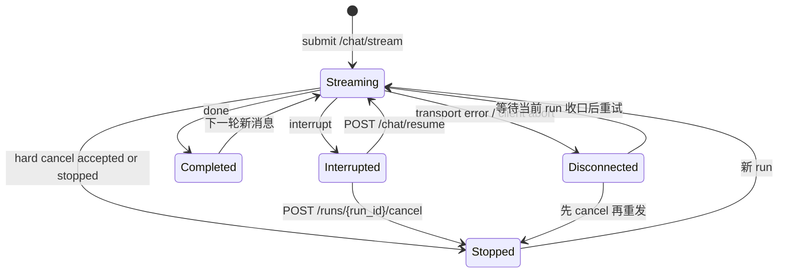

# API 接口文档：聊天与流式协议
> 更新时间：2026-03-13

> **用途**: 聚焦聊天流式接口、恢复、取消、线程管理与 SSE 协议约束。
> **入口说明**: 当前文档为 API 总览的专题正文；通用约定、认证前提与阅读路径见 [接口文档](接口文档.md)。

## 文档导航
- 总览入口：[接口文档.md](接口文档.md)
- 认证与用户：[接口文档_认证与用户.md](接口文档_认证与用户.md)
- 聊天与流式协议：[接口文档_聊天与流式协议.md](接口文档_聊天与流式协议.md)
- 待办与通用资源：[接口文档_待办与通用资源.md](接口文档_待办与通用资源.md)
- 管理后台：[接口文档_管理后台.md](接口文档_管理后台.md)
- 问数管理与文档记忆：[接口文档_问数管理与文档记忆.md](接口文档_问数管理与文档记忆.md)

---

## 3. 聊天接口

### POST /api/v1/chat/stream

发起流式对话请求，返回 SSE 事件流。

**请求头**（可选）:

```
Idempotency-Key: c6f0a1f5-7b7a-4c3a-9a9a-2b0d2a2f9c5d
```

**请求体**:

```json
{
  "prompt": "你好，请帮我查询待办",
  "thread_id": "abc123",
  "enable_thinking": false,
  "model_id": "qwen-max",
  "attachments": [],
  "current_todo_id": null
}
```

| 参数 | 类型 | 必填 | 说明 |
|------|------|------|------|
| `prompt` | string | 是 | 用户输入内容 |
| `thread_id` | string | 否 | 对话线程 ID，为空则新建 |
| `enable_thinking` | boolean | 否 | 是否启用深度思考 |
| `model_id` | string | 否 | 指定模型 |
| `attachments` | array | 否 | 附件列表 |
| `current_todo_id` | int | 否 | 当前讨论的待办 ID |

`attachments` 在服务端会派生两类输出：

1. `attachment_manifest + lightweight_probe`：供运行态 planning / tool / workflow 使用
2. `display_content`：供 human 历史消息与刷新回放展示使用

展示规则：

- 图片附件会在 human 历史消息中展示为 Markdown 图片 ``
- 其他附件会在 human 历史消息中展示为 Markdown 链接列表 `- [name](url)`
- 上述展示规则不包含内部工具提示

> **注意**：系统已默认启用多智能体模式，`use_multi_agent` 参数已废弃。

> 幂等性由系统中间件统一处理，详见 [幂等性请求头](#幂等性请求头)

#### 流前置门禁（2026-03-08 多会话并发）

在建立 SSE 连接前，后端会先登记 `run` 并执行并发门禁；若门禁失败，本接口直接返回 JSON 错误，不进入事件流。

| HTTP 状态 | `error_code` | 场景 | 附加字段 |
|------|------|------|------|
| `409` | `active_run_exists` | 同一 `thread_id` 已有 `running/stopping` run | `thread_id`、`run_id` |
| `429` | `parallel_limit_exceeded` | 当前用户 active run 已达到并发上限（P0 默认 `3`） | `active_count`、`limit` |

**响应**: SSE 事件流

```
event: token
data: {"content": "你好"}

event: result
data: {"data_type": "todo_list", "data": {"todos": [...]}, "message": "找到 3 条待办"}

event: tool_start
data: {"name": "list_todos", "input": {}}

event: tool_end
data: {"name": "list_todos", "output": "找到3条待办"}

event: final_answer
data: {"content": "按你的问题顺序：待办已查询，嘉兴天气为多云 18-24℃。", "meta": {"coverage_pass": true}}

event: done
data: {"thread_id": "abc123", "message_id": 456}
```

### SSE 协议约束（2026-02 严格切换）

1. **结构化数据单通道**：`result` 是唯一结构化载荷通道，格式为 `data_type + data + message?`。
2. **`done` 仅生命周期收口**：`done` 仅允许 `thread_id`、`message_id`、`final_content?` 字段。
3. **禁止在 `done` 携带结构化数据**：`done.additional_kwargs` 已废弃，不再作为前端卡片渲染输入。
4. **最终正文单一出口**：复合任务场景推荐消费 `final_answer.content` 作为用户最终答复，`done` 不承载业务正文。
5. **`final_content` 仅作补发兜底**：若本轮先产生 `result` 占位、但尚未真正输出正文 token，流结束或 resume 收口时仍必须允许通过 `done.final_content` 补发最终 AI 文本，避免正文丢失。
6. **显式复合问题允许快速拆解**：对于编号列表/分行等显式多问题输入，服务端可直接生成 goals，必要时从 `preprocess` 直接路由到对应专家，跳过额外 planner / supervisor 往返；`decomposed_goals` 仍是唯一目标状态源。
7. **已完成子问题允许提前回流**：复合任务执行中，已完成的直答子问题可先通过 `token` 增量返回；`final_answer` 继续承担最终合并结论。

#### 交付导向增量事件（V2）

| 事件 | 说明 | 建议消费方式 |
|---|---|---|
| `plan_ready` | 问题合同已生成（goal 列表） | 调试/进度面板可展示 |
| `task_started` | 子任务开始执行 | 进度条或状态面板 |
| `task_finished` | 子任务执行完成 | 进度条或状态面板 |
| `coverage_check` | 覆盖率检查结果（是否答全） | 质量面板/调试 |
| `token` | 已完成子问题的增量正文或普通流式文本 | 聊天主消息实时增量 |
| `final_answer` | 最终答复（唯一正文） | 聊天主消息正文 |

#### `done` 事件冻结字段（G0）

| 字段 | 必填 | 说明 |
|---|---|---|
| `thread_id` | 是 | 对话线程 ID |
| `message_id` | 是 | 已持久化 AI 消息 ID（用于点赞/点踩） |
| `final_content` | 否 | 非流式补发场景下的最终文本；即使前面已出现 `result` 占位，只要正文尚未发出，仍允许在收口时补发 |
| `meta` | 否 | 兼容扩展字段容器 |

> 兼容策略：新增字段只允许追加到 `meta` 或新增可选字段，不得删除 `thread_id/message_id`。

#### `result` 事件冻结字段（G0）

| 字段 | 必填 | 说明 |
|---|---|---|
| `type` | 是 | 结果类型（例如 `sql_result` / `todo_list` / `chart`） |
| `content` | 是 | 结果主内容；文本或结构化内容摘要 |
| `chart` | 否 | 图表数据 |
| `table` | 否 | 表格数据 |
| `meta` | 否 | 元信息（例如 `node`、兼容标签） |

#### `interrupt` 事件冻结字段（G0）

| 字段 | 必填 | 说明 |
|---|---|---|
| `reason` | 是 | 中断原因（默认 `action_required`） |
| `message` | 是 | 可直接展示给用户的提示文本 |
| `recoverable` | 否 | 是否可恢复（默认 `true`） |
| `suggested_action` | 否 | 建议动作（例如“请确认后继续”） |

> 兼容补充：为兼容既有前端，`interrupt` 仍附带 `thread_id`、`interrupt_id`、`value`。

### POST /api/v1/chat/resume

恢复被中断的流程（用户确认后）。

| decision.type | 说明 |
|---------------|------|
| `accept` | 确认执行 |
| `reject` | 拒绝执行 |
| `edit` | 编辑后执行 |

#### 客户端恢复/重发约束（2026-03-07）

> [!IMPORTANT]
> `resume` 是**控制面动作**，不是普通聊天消息。收到 `interrupt` 后，前端必须调用 `POST /api/v1/chat/resume`；禁止把“继续”“好的继续”“你刚刚中断了”当成新的用户消息发回 `/api/v1/chat/stream`。

| 场景 | 正确动作 | 禁止动作 | 说明 |
|---|---|---|---|
| 收到 `interrupt` | 调用 `POST /api/v1/chat/resume`，传 `decision.type=accept/reject/edit` | 发送普通文本“继续” | `interrupt` 表示旧 run 仍在等待用户决策，应继续旧流程而非开启新意图 |
| 用户放弃当前执行 | 调用 `POST /api/v1/chat/runs/{run_id}/cancel` | 直接本地清空状态后重发 | 当前实现固定走 `hard cancel`；成功后 run 直接收口为 `stopped`，后续 token 不再回灌 |
| run 已 `stopped` / 已取消 | 视为本次 run 结束；下一条消息走新的 `/api/v1/chat/stream` | 再次调用 `resume` | 已终态 run 不允许 resume |
| SSE 断流 / 网关 `400` / 客户端 abort | 保留当前 `run_id`，提示“连接中断，先等待收口或取消后重试” | 直接发“继续”作为聊天文本 | 传输层异常不等于业务 `interrupt`；当前版本无通用 reconnect 接口，不应伪装成新问题 |

> 前端展示约束：`run_id` 在用户界面统一展示为“运行编号”；恢复失败兜底文案统一为“恢复会话失败”，禁止直接向用户暴露 `resume failed`、`run_id` 等英文提示。

#### 多轮语义约束（2026-03-07）

1. 新的 `/chat/stream` 请求只以**最后一条用户消息**作为当前轮意图；更早历史仅作为上下文，不会被当成并列新问题重新处理。
2. `interrupt` 场景下，系统会保存中间 AI 消息并标记为 `is_intermediate=true`；历史查询默认过滤该类消息，避免把半成品当最终答复展示。
3. 因 `interrupt` 不会立即走最终 `postprocess` 清理，前端若跳过 `resume/cancel` 直接继续发普通消息，可能把新消息误判为对上一轮的补充或确认。
4. 因此 UI 必须把“继续/确认/编辑/取消”做成显式控制按钮，而不是依赖自然语言。

### 运行时取消能力（已上线，开关可控）

> 实现说明（2026-03-10）：接口契约不变；后台共享 `RunControlService` owner 已从模块级实例收口到 `runtime registry`，以避免多 worker / 多模块出现第二套内存态持有者。


> 状态：已上线。开启 `ENABLE_RUN_CONTROL=true` 时为强停止语义；关闭时接口返回降级状态。

#### POST /api/v1/chat/runs/{run_id}/cancel

取消指定 run，幂等。

**请求体**:

```json
{
  "thread_id": "abc123"
}
```

| 参数 | 类型 | 必填 | 说明 |
|------|------|------|------|
| `thread_id` | string | 是 | 必须与目标 `run_id` 的所属会话完全一致；缺失或不匹配都返回 `400` |

> 服务端固定字段：`reason=user_cancelled`、`cancel_mode=hard`。客户端不允许覆写。

**成功响应**:

```json
{
  "accepted": true,
  "run_id": "run_xxx",
  "thread_id": "abc123",
  "status": "stopped",
  "idempotent": false,
  "reason": "user_cancelled"
}
```

**失败语义**:

| HTTP 状态 | 语义 | 说明 |
|------|------|------|
| `400` | `thread_id_required` | 请求体缺少 `thread_id` |
| `400` | `thread_id_mismatch` | `thread_id` 与目标 `run_id` 不一致 |
| `403` | forbidden | 非 run 所属用户且非管理员 |
| `404` | run_not_found | `run_id` 不存在 |

**行为约束**:

1. 仅 run 所属用户或管理员可取消。
2. 前端对取消结果、停止中状态与异常兜底提示统一使用中文文案；用户界面不直接暴露英文状态提示。
3. 目标 run 已处于 `stopping/stopped/completed/failed` 时，返回 `accepted=true`、`idempotent=true`。
4. 当前实现固定 `cancel_mode=hard`；取消成功后 run 直接返回 `stopped`，后续 token 停止回灌，并从后续 active 列表中移除。
5. 前端侧边栏仅对 `status=running` 显示 spinner；`stopping` 不得继续显示为运行中。

#### GET /api/v1/chat/runs/active

返回当前用户全部 active runs，仅用于刷新恢复与停留期间状态同步。

**Query 参数**: 无

**响应示例**:

```json
{
  "items": [
{
  "run_id": "run_xxx",
  "thread_id": "abc123",
  "status": "running",
  "updated_at": "2026-03-08T13:40:00",
  "last_activity_at": "2026-03-08T13:40:02"
}
  ],
  "active_count": 1,
  "poll_hint_seconds": 2,
  "server_time": "2026-03-08T13:40:02"
}
```

| 字段 | 类型 | 说明 |
|------|------|------|
| `items` | array | 当前用户全部 active run 列表 |
| `items[].run_id` | string | run ID |
| `items[].thread_id` | string | 所属会话 ID |
| `items[].status` | string | 仅允许 `running`、`stopping` |
| `items[].updated_at` | string(datetime) | run 最近更新时间 |
| `items[].last_activity_at` | string(datetime) \| null | 最近活动时间；为空时表示当前 run 尚未写入独立活动时间 |
| `active_count` | int | 当前 active run 数量 |
| `poll_hint_seconds` | int | 后端建议轮询间隔；成功返回固定 `2` |
| `server_time` | string(datetime) | 服务端当前时间 |

**查询约束**:

1. 固定只返回当前用户全部 active runs，不分页，不接受 `limit`。
2. 每次请求直接查询 `t_chat_run`，不依赖 worker 内存快照。
3. 列表排序固定为：`last_activity_at` 非空优先，再按最近活动时间、`updated_at`、`run_id` 降序。
4. 接口不返回消息内容、prompt、user_id 等非运行态字段。

**失败语义**:

| HTTP 状态 | 语义 | 说明 |
|------|------|------|
| `503` | `active_runs_unavailable` | active runs 查询暂不可用，客户端按 5s/10s 退避 |

#### SSE `stopped` 事件（兼容事件，非主判定源）

```json
{
  "type": "stopped",
  "data": {
"thread_id": "abc123",
"run_id": "run_xxx",
"reason": "user_cancelled"
  }
}
```

#### 前端状态机建议（2026-03-07）



### GET /api/v1/chat/threads

获取当前用户的对话列表。

### GET /api/v1/chat/threads/latest

获取当前用户最近一次更新的会话（按 `updated_at` 降序取第一条）。

**响应（有历史会话）**:

```json
{
  "thread_id": "thread-latest-1",
  "title": "最近会话标题",
  "created_at": "2026-03-01T17:00:00",
  "updated_at": "2026-03-01T17:05:00"
}
```

**响应（无历史会话）**:

```json
null
```

### GET /api/v1/chat/threads/{thread_id}/messages

获取指定对话的消息历史。

**Query 参数**:

| 参数 | 类型 | 必填 | 默认 | 说明 |
|------|------|------|------|------|
| `limit` | int | 否 | 100 | 最大返回数量 |

**响应**:

```json
[
  {
"id": 123,
"thread_id": "uuid-xxx",
"role": "ai",
"content_type": "markdown",
"content": "**贷款余额** 1,311.07 亿",
"metadata": {"data_type": "sql_result", "data": {"sql": "...", "columns": [...], "rows": [...]}},
"additional_kwargs": {"data_type": "sql_result", "data": {...}},
"title": null,
"created_at": "2026-02-07T10:30:00",
"feedback_score": -1
  }
]
```

| 字段 | 类型 | 说明 |
|------|------|------|
| `feedback_score` | int / null | 当前用户的反馈: 1=赞, -1=踩, null=无反馈 |
| `additional_kwargs` | object / null | 结构化数据，`data_type` 标识类型（`sql_result` / `todo_list`） |

> 兼容说明（2026-02-13）：当历史记录中存在遗留结构串（例如 `[{"type": "text", "text": "..."}]` 或 Python repr 形式）时，接口会自动归一化为可读正文后返回 `content`。

### DELETE /api/v1/chat/threads/batch

批量删除对话及其关联资产。

**请求体**:

```json
{
  "thread_ids": ["uuid-1", "uuid-2", "uuid-3"]
}
```

**响应**:

```json
{
  "message": "已删除 3 个对话",
  "stats": {
"total_messages": 25,
"total_assets": 5,
"total_minio": 5,
"threads_deleted": 3
  }
}
```

**错误码**:

| Code | Description |
|------|-------------|
| 400 | thread_ids 不能为空 / 单次最多删除 100 个对话 |

### DELETE /api/v1/chat/threads/{thread_id}

删除对话及其关联资产。

### PATCH /api/v1/chat/threads/{thread_id}/title

更新对话标题。

### POST /api/v1/chat/feedback

提交消息反馈（点赞/点踩）。

点踩数据查询类消息（`data_type=sql_result`）时，自动将该查询记录到 SQL 修正台（`t_data_query_log`），供管理员审核和修正。

**请求体**:

```json
{
  "message_id": 123,
  "score": -1,
  "reason": "查询结果不正确"
}
```

| 参数 | 类型 | 必填 | 说明 |
|------|------|------|------|
| `message_id` | int | 是 | 消息 ID |
| `score` | int | 是 | 评分: 1=赞, -1=踩, 0=取消 |
| `reason` | string | 否 | 反馈原因 |

**响应**:

```json
{
  "message": "反馈已提交",
  "data": {
"id": 1,
"user_id": 1,
"message_id": 123,
"score": -1,
"reason": "查询结果不正确"
  }
}
```

**副作用**:

当 `score=-1` 且被点踩的消息包含 `data_type=sql_result` 时，自动创建 `t_data_query_log` 记录（`is_correct=false`），在 SQL 修正台中可见。同一 SQL + 用户不重复写入。

---
