# RAGFlow 文档处理与图片关联完整分析

## 核心问题回答

### 1. 文字和图片是什么时候关联的？

**在文档解析时**就已经完成关联，不是在检索时。

### 2. 检索返回的 chunks 包含图片信息吗？

**是的**，每个 chunk 都包含 `image_id` 字段。

### 3. LLM 回答中会自动包含引用标记吗？

**不是自动的**，需要通过 [insert_citations()](file:///Users/jijingkun/bojxAI/fastapi/ragflow/src_ragflow/rag/nlp/search.py#178-267) 函数后处理添加。

---

## 完整流程分析

```mermaid
flowchart TB
    subgraph 第一阶段:文档解析
        A[用户上传文档] --> B[解析器处理文档]
        B --> C[生成 chunks]
        C --> D{chunk 包含图片?}
        D -->|是| E[保存图片到 MinIO]
        E --> F[设置 img_id = kb_id-chunk_id]
        D -->|否| G[img_id 为空]
        F --> H[存储到 Elasticsearch]
        G --> H
    end
    
    subgraph 第二阶段:检索
        I[用户提问] --> J[调用 retrieval API]
        J --> K[向量+全文检索]
        K --> L[返回 chunks 列表]
        L --> M[每个 chunk 包含 image_id]
    end
    
    subgraph 第三阶段:生成回答
        N[构建 Prompt] --> O[调用 LLM]
        O --> P[获得原始回答]
        P --> Q{开启引用?}
        Q -->|是| R[insert_citations 后处理]
        R --> S[添加引用标记]
        Q -->|否| T[直接返回]
    end
    
    subgraph 第四阶段:图片展示
        U[前端收到回答] --> V{包含引用标记?}
        V -->|是| W[解析标记替换为图片]
        V -->|否| X[仅显示文本]
    end
```



---

## 关键代码分析

### 阶段一：文档解析时的图片关联

**文件**: [src_ragflow/api/db/services/document_service.py](file:///Users/jijingkun/bojxAI/fastapi/ragflow/src_ragflow/api/db/services/document_service.py)  
**行号**: 1180-1192

```python
# 解析 chunk 时处理图片
for ck in th.result():
    d = deepcopy(doc)
    d.update(ck)
    d["id"] = xxhash.xxh64((ck["content_with_weight"] + str(d["doc_id"])).encode("utf-8")).hexdigest()
    
    # 如果 chunk 没有图片，直接添加
    if not d.get("image"):
        docs.append(d)
        continue

    # 如果有图片，保存到 MinIO
    output_buffer = BytesIO()
    if isinstance(d["image"], bytes):
        output_buffer = BytesIO(d["image"])
    else:
        d["image"].save(output_buffer, format='JPEG')

    # 保存图片到 MinIO: 桶名=kb.id, 对象名=chunk_id
    settings.STORAGE_IMPL.put(kb.id, d["id"], output_buffer.getvalue())
    
    # 设置 img_id: 格式为 "知识库ID-chunk_ID"
    d["img_id"] = "{}-{}".format(kb.id, d["id"])  # ← 关键关联点
    
    d.pop("image", None)
    docs.append(d)
```

**总结**: 
- 图片在**解析时**被保存到 MinIO
- `img_id` 格式: `{kb_id}-{chunk_id}`
- 这个关联信息随 chunk 一起存入 Elasticsearch

---

### 阶段二：检索时返回图片信息

**文件**: [src_ragflow/rag/nlp/search.py](file:///Users/jijingkun/bojxAI/fastapi/ragflow/src_ragflow/rag/nlp/search.py)  
**行号**: 462-478

```python
# retrieval() 方法构建返回的 chunk
for i in page_idx:
    id = sres.ids[i]
    chunk = sres.field[id]
    
    d = {
        "chunk_id": id,
        "content_ltks": chunk["content_ltks"],
        "content_with_weight": chunk["content_with_weight"],
        "doc_id": did,
        "docnm_kwd": dnm,
        "kb_id": chunk["kb_id"],
        "important_kwd": chunk.get("important_kwd", []),
        "image_id": chunk.get("img_id", ""),  # ← 图片ID在这里返回
        "similarity": float(sim_np[i]),
        "vector_similarity": float(vsim[i]),
        "term_similarity": float(tsim[i]),
        # ...
    }
    ranks["chunks"].append(d)
```

**总结**:
- 检索返回的每个 chunk 都包含 `image_id` 字段
- 您调用 API 时可以直接获取到这个字段
- 字段来源是 Elasticsearch 中存储的 `img_id`

---

### 阶段三：引用标记的添加

**文件**: [src_ragflow/rag/nlp/search.py](file:///Users/jijingkun/bojxAI/fastapi/ragflow/src_ragflow/rag/nlp/search.py)  
**行号**: 178-266

```python
def insert_citations(self, answer, chunks, chunk_v, embd_mdl, tkweight=0.1, vtweight=0.9):
    """
    在 LLM 回答后添加引用标记
    格式: [ID:0] [ID:1] 等
    """
    # 1. 将回答拆分成句子
    pieces = re.split(r"([^\\|][；。？!！\\n]|[a-z][.?;!][ \\n])", answer)
    
    # 2. 计算每个句子与每个 chunk 的相似度
    ans_v, _ = embd_mdl.encode(pieces_)
    sim, tksim, vtsim = self.qryr.hybrid_similarity(...)
    
    # 3. 找到相似度超过阈值的 chunk
    cites = {}
    for i, a in enumerate(pieces_):
        mx = np.max(sim) * 0.99
        if mx < thr:
            continue
        cites[idx[i]] = [str(ii) for ii in range(len(chunk_v)) if sim[ii] > mx]
    
    # 4. 在句子后插入引用标记
    res = ""
    for i, p in enumerate(pieces):
        res += p
        if i in cites:
            for c in cites[i]:
                res += f" [ID:{c}]"  # ← 官方版使用 [ID:N] 格式
    
    return res, seted
```

**RAGFlow-Plus 的区别**:
```python
# RAGFlow-Plus 使用不同的格式
return f'{match.group(0)}\n\n'
# 引用格式: ##N$$
```

---

## 您的 API 调用现状

当您调用 `/api/v1/retrieval` 时，返回数据结构：

```json
{
  "data": {
    "chunks": [
      {
        "content": "...",
        "document_keyword": "文档名.pdf",
        "image_id": "7c112617e91411f08852712b5dc403b8-c354179ee2213e12",  // ✅ 已包含
        "similarity": 0.456,
        ...
      }
    ]
  }
}
```

**图片信息已经在 chunks 中返回了！**

---

## 为什么您的回答中没有图片？

因为您调用的是**检索 API**，只返回原始 chunks。

要在回答中显示图片，需要：

1. **方式一：使用 RAGFlow 的对话 API**  
   RAGFlow 的 `/chat/completions` API 会自动处理引用

2. **方式二：自己处理图片插入**  
   在您的 Agent 中处理检索结果，拼接图片 URL

---

## 您需要做的处理

```python
MINIO_URL = "http://localhost:19000"

def process_chunks_with_images(chunks):
    """处理 chunks，添加图片 URL"""
    for chunk in chunks:
        image_id = chunk.get("image_id")
        if image_id:
            # image_id 格式: "kb_id-img_hash"
            # 直接用作 MinIO 路径
            parts = image_id.split("-", 1)
            if len(parts) == 2:
                kb_id, img_hash = parts
                chunk["image_url"] = f"{MINIO_URL}/{kb_id}/{img_hash}"
    return chunks

def build_prompt_with_images(chunks):
    """构建包含图片的 Prompt"""
    context_parts = []
    for i, chunk in enumerate(chunks):
        part = f"【参考资料 {i+1}】\n{chunk['content']}"
        if chunk.get("image_url"):
            part += f"\n相关图片: {chunk['image_url']}"
        context_parts.append(part)
    return "\n\n".join(context_parts)

def format_answer_with_images(answer, chunks):
    """在回答后添加相关图片（如果有引用标记）"""
    # 如果使用 insert_citations 后的 [ID:N] 格式
    for match in re.finditer(r'\[ID:(\d+)\]', answer):
        idx = int(match.group(1))
        if idx < len(chunks) and chunks[idx].get("image_url"):
            img_url = chunks[idx]["image_url"]
            answer = answer.replace(
                match.group(0), 
                f'{match.group(0)}\n\n'
            )
    return answer
```

---

## 流程对比

| 步骤 | RAGFlow 官方版 | RAGFlow-Plus |
|------|---------------|--------------|
| 文档解析 | ✅ 保存 img_id | ✅ 相同 |
| 检索返回 | ✅ 返回 image_id | ✅ 相同 |
| 引用标记 | `[ID:N]` 格式 | `##N$$` 格式 |
| 图片插入 | ❌ 不自动插入 | ✅ 自动插入 `` |
| 前端支持 | ❌ 无 | ✅ 渲染 img 标签 |

---

## 总结

1. **文字和图片在文档解析时就关联了** - `img_id = kb_id-chunk_id`
2. **检索 API 返回的 chunks 包含 `image_id`** - 您可以直接使用
3. **LLM 回答不会自动包含引用** - 需要 [insert_citations()](file:///Users/jijingkun/bojxAI/fastapi/ragflow/src_ragflow/rag/nlp/search.py#178-267) 后处理
4. **图片显示需要额外处理** - 拼接 MinIO URL 并插入到回答中

您只需在自己的 Agent 代码中添加图片处理逻辑即可实现和 RAGFlow-Plus 相同的效果。
