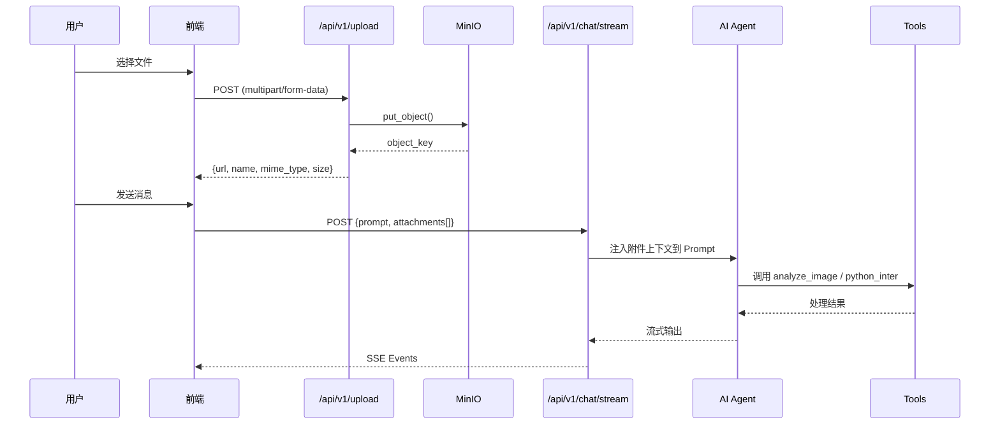

# 统一智能附件系统 (Unified Smart Attachments)

> **版本**: 1.0  
> **更新日期**: 2026-01-04  
> **状态**: 已实现

## 1. 概述

统一智能附件系统允许用户在聊天中上传多种类型的文件（图片、Excel、CSV、PDF 等），并让 AI Agent 自动感知和处理这些附件。

### 1.1 核心特性

- **多格式支持**: 图片 (PNG/JPG/GIF/WebP)、表格 (Excel/CSV)、文档 (PDF/Markdown/TXT)
- **MinIO 存储**: 所有文件统一存储到 MinIO 对象存储，通过代理 URL 访问
- **Agent 感知**: 附件元数据自动注入到 Prompt，Agent 可智能调用工具处理
- **工具路由**: 图片 → `analyze_image`；表格 → `python_inter`

### 1.2 架构图



---

## 2. 数据模型

### 2.1 Attachment (附件)

**后端 Pydantic Model** (`app/schemas/chat.py`):

```python
class Attachment(BaseModel):
    """附件信息模型。"""
    name: str          # 文件名
    url: str           # 代理 URL (/api/v1/assets/...)
    mime_type: str     # MIME 类型
    size: int          # 文件大小 (bytes)
    object_key: str    # MinIO Object Key
```

**前端 TypeScript Interface** (`web/src/lib/backend.ts`):

```typescript
interface Attachment {
  name: string;
  url: string;
  mime_type: string;
  size: number;
  object_key: string;
}
```

---

## 3. API 接口

### 3.1 文件上传

**Endpoint**: `POST /api/v1/upload`

**Request**:
- Content-Type: `multipart/form-data`
- Body:
  - `file`: 文件对象 (required)
  - `thread_id`: 对话 ID (optional)

**Response** (200 OK):
```json
{
  "url": "/api/v1/assets/user123/thread456/uploads/file_1704355803_abc123.xlsx",
  "object_key": "user123/thread456/uploads/file_1704355803_abc123.xlsx",
  "file_name": "data.xlsx",
  "content_type": "application/vnd.openxmlformats-officedocument.spreadsheetml.sheet",
  "size": 10240
}
```

**支持的文件类型**:
| 类型 | MIME Types |
|------|-----------|
| 图片 | `image/png`, `image/jpeg`, `image/gif`, `image/webp` |
| 表格 | `application/vnd.openxmlformats-officedocument.spreadsheetml.sheet`, `text/csv` |
| 文档 | `application/pdf`, `text/plain`, `text/markdown` |

**文件大小限制**: 20MB

---

### 3.2 聊天流 (带附件)

**Endpoint**: `POST /api/v1/chat/stream`

**Request**:
```json
{
  "prompt": "分析这个 Excel 文件的数据",
  "thread_id": "abc-123",
  "attachments": [
    {
      "name": "sales_data.xlsx",
      "url": "/api/v1/assets/user1/thread1/uploads/sales_data.xlsx",
      "mime_type": "application/vnd.openxmlformats-officedocument.spreadsheetml.sheet",
      "size": 15360,
      "object_key": "user1/thread1/uploads/sales_data.xlsx"
    }
  ]
}
```

**Response**: SSE 事件流（与普通聊天相同）

---

### 3.3 资产代理

**Endpoint**: `GET /api/v1/assets/{object_key:path}`

用于代理访问 MinIO 中的文件，自动处理权限校验和预签名 URL。

---

## 4. 前端实现

### 4.1 文件上传 Hook

**文件**: `web/src/hooks/use-file-upload.tsx`

```typescript
const {
  contentBlocks,      // 已选择的文件列表
  handleFileUpload,   // 处理文件选择
  handlePaste,        // 处理粘贴
  removeBlock,        // 移除文件
  dropRef,            // 拖放区域 ref
  dragOver,           // 是否正在拖放
} = useFileUpload();
```

### 4.2 上传与提交流程

**文件**: `web/src/components/chat/index.tsx`

```typescript
const handleSubmit = async (e: FormEvent) => {
  // 1. 并行上传所有附件
  const attachments = await Promise.all(
    contentBlocks.map(async (block) => {
      if (block.data instanceof File) {
        const result = await uploadFile(block.data, threadId);
        return {
          name: result.file_name,
          url: result.url,
          mime_type: result.content_type,
          size: result.size,
          object_key: result.object_key,
        };
      }
      return null;
    })
  );

  // 2. 提交消息 + 附件
  stream.submit({ messages: [newMessage], attachments });
};
```

### 4.3 类型定义

**文件**: `web/src/lib/backend.ts`

```typescript
// 上传文件
export async function uploadFile(file: File, threadId?: string): Promise<UploadResult>;

// 流式聊天 (支持附件)
export async function streamLLM(
  prompt: string,
  callbacks: StreamCallbacks,
  options?: {
    attachments?: Attachment[];
    // ...other options
  }
);
```

---

## 5. 后端实现

### 5.1 ChatService 附件处理

**文件**: `app/services/chat_service.py`

```python
async def stream(self, prompt: str, attachments: list = None, ...):
    final_prompt = prompt
    
    if attachments:
        final_prompt += "\n\nUser uploaded attachments:"
        for att in attachments:
            name = att.name
            url = att.url
            mime = att.mime_type
            
            final_prompt += f"\n- [{mime}] {name} (URL: {url})"
            
            # 为不同类型添加工具使用提示
            if "image" in mime:
                final_prompt += "\n  (Hint: Use 'analyze_image' tool with this URL)"
            elif "csv" in mime or "excel" in mime:
                final_prompt += "\n  (Hint: Use python code to read this file)"
```

### 5.2 Agent Prompt 示例

当用户上传附件后，Agent 会看到类似如下的上下文：

```
User: 分析这个销售数据

User uploaded attachments:
- [application/vnd.openxmlformats-officedocument.spreadsheetml.sheet] sales.xlsx (URL: /api/v1/assets/user1/thread1/uploads/sales.xlsx)
  (Hint: Use python code to read this file. Note: The URL is a relative API path, you may need to prepend 'http://localhost:8000' or download it first)
```

---

## 6. 工具集成

### 6.1 图片分析 (Vision Tool)

**文件**: `app/ai/tools/vision_tool.py`

```python
@tool
def analyze_image(image_url: str, question: str = "描述图片内容") -> str:
    """分析图片并回答问题。"""
    # 检测本地 URL，自动下载转 Base64
    if image_url.startswith("/api/v1/assets"):
        image_data = _download_and_encode(image_url)
    else:
        image_data = image_url
    
    # 调用 Vision Model (GLM-4V / GPT-4V)
    return _call_vision_api(image_data, question)
```

### 6.2 Python 数据分析

**文件**: `app/ai/tools/chatTools.py`

```python
@tool
def python_inter(py_code: str, config: RunnableConfig) -> str:
    """执行 Python 代码。"""
    # pandas 已预注入
    g = {"pd": pd, "plt": plt, ...}
    
    # 注入历史提取的 DataFrame
    if thread_id in extracted_dataframes:
        g.update(extracted_dataframes[thread_id])
    
    exec(py_code, g)
    # ...
```

**Agent 生成的代码示例**:
```python
import pandas as pd
df = pd.read_excel("http://localhost:8000/api/v1/assets/user1/thread1/uploads/sales.xlsx")
print(df.describe())
```

---

## 7. MinIO 存储规范

### 7.1 存储桶

| 桶名 | 用途 |
|------|------|
| `filedata` | 原始用户上传文件 |
| `chat-assets` | 对话生成的资产 (图表等) |

### 7.2 Object Key 格式

```
{bucket}/{user_id}/{thread_id}/{asset_type}/{filename}
```

示例: `chat-assets/123/abc-456/charts/fig_1704355803_abc123.png`

### 7.3 URL 协议

| 场景 | 格式 |
|------|------|
| 数据库存储 | `minio://chat-assets/user/thread/file.png` |
| API 返回 | `/api/v1/assets/user/thread/file.png` |
| 内部访问 | `http://localhost:8000/api/v1/assets/...` |

---

## 8. 注意事项

### 8.1 Docker 网络

如果 Python 工具在独立容器中执行，`localhost` 可能无法访问主服务。需要：
- 使用 Docker 服务名（如 `http://backend:8000/...`）
- 或配置 `host.docker.internal`

### 8.2 认证与权限

- `/api/v1/upload` 需要认证 (`Depends(get_current_user)`)
- `/api/v1/assets/{key}` 可配置为公开或需认证

### 8.3 文件清理

- 附件上传后保存到 `t_chat_assets` 表
- 删除对话时自动清理 MinIO 中的相关文件

---

## 9. 相关文件索引

| 模块 | 文件路径 |
|------|---------|
| 上传 API | `app/api/v1/endpoints/upload_api.py` |
| Chat Schema | `app/schemas/chat.py` |
| Chat Service | `app/services/chat_service.py` |
| Vision Tool | `app/ai/tools/vision_tool.py` |
| Python Tool | `app/ai/tools/chatTools.py` |
| 前端上传 | `web/src/lib/backend.ts` |
| 上传 Hook | `web/src/hooks/use-file-upload.tsx` |
| Chat 组件 | `web/src/components/chat/index.tsx` |
