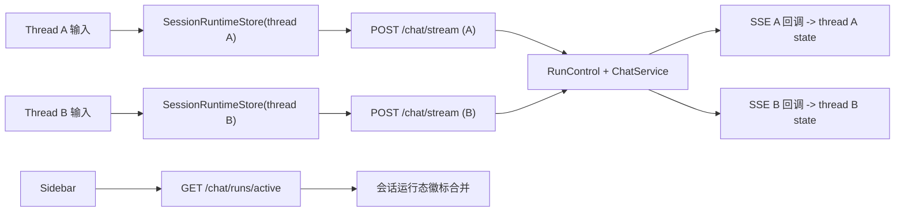
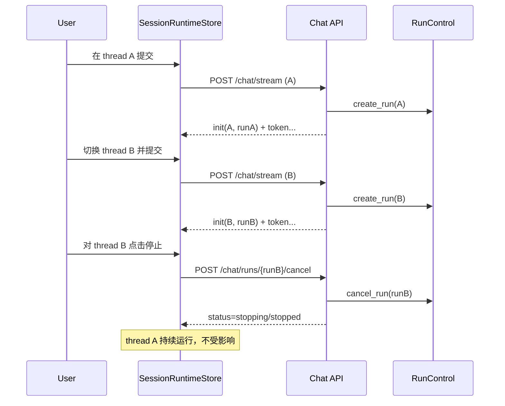

# 聊天多会话并发（方案 B）设计说明

## 1. 需求澄清结论
- 目标:
  - 支持同一用户在同一页面内“并行进行多个会话”（不同 `thread_id` 可同时运行）。
  - 保持“强停止（取消服务端 run）”语义，且停止只影响目标会话。
  - 会话切换不打断其他会话的流式执行，侧边栏可感知各会话运行态。
- 范围:
  - 前端聊天运行态模型（`StreamContext` + `useSSEStream`）从单实例升级为“会话级状态注册表”。
  - 后端补充“当前用户活跃 run 查询”能力，供前端恢复运行态和显示徽标。
  - 测试与文档同步更新（单测/API/E2E）。
- 边界:
  - 不引入事件重放系统（不做断点 token 回放）。
  - 不改 LangGraph 业务策略与节点编排语义。
  - 不做多窗格同时可见（本期是“单视图 + 多会话后台并发”）。
- 成功标准:
  - 在会话 A 流式中切到会话 B 并发起请求，A/B 均可继续完成并持久化。
  - 在会话 B 点击停止，仅 B 进入 `stopping/stopped`，A 不受影响。
  - 页面刷新后可恢复“哪些会话仍在运行”的状态提示（基于活跃 run 查询）。

## 2. 方案对比（2-3 个）
| 方案 | 优点 | 缺点 | 成本 | 推荐度 |
|---|---|---|---|---|
| A. 仅支持会话切换，不支持并发流 | 改动最小；快速上线 | 本质仍是单会话执行，不能满足“同时进行多个对话” | 低 | 中 |
| B. 会话级并发运行态（推荐） | 满足并发需求；复用现有 run_control；风险可控 | 前端状态模型需系统性重构；测试面扩大 | 中 | 高 |
| C. 事件总线 + 可回放 + 任务工作台 | 体验最接近 Codex App；可观测性最强 | 改造面大（事件存储/游标/重放协议） | 高 | 中 |

## 3. 推荐方案与理由
- 推荐: **方案 B（会话级并发运行态）**
- 理由:
  - 目标匹配：直接覆盖“多会话并发 + 强停止隔离”。
  - 技术可行：后端已具备 run 生命周期能力，可在不改 AI 策略前提下落地。
  - 演进路径清晰：后续若需要 token 回放，可增量升级到方案 C。

## 4. 现状与根因
### 4.1 前端单会话约束（阻碍并发）
- 当前 `StreamProvider` 仅提供单份流状态，`submit/stop/resume` 不带 `thread_id` 作用域。
- `useSSEStream` 中 `stopRef/currentAiIdRef/activeRunIdRef/isStreamingRef` 为单实例，第二条流会覆盖第一条流控制句柄。
- 提交入口受全局 `isLoading` 限制，任一会话流式中会阻断所有会话继续发送。

### 4.2 后端并发能力现状
- `RunControlService.create_run` 仅清理“同线程 active_run”，不限制同用户跨线程并发运行。
- 已有 `cancel_run` 强停止语义和 `disconnect-continue` 语义，可复用于并发会话。
- 缺口在查询面：缺少“当前用户活跃 run 列表”接口，前端刷新后无法恢复运行态徽标。

## 5. 设计概要
### 5.1 总体架构

### 5.2 前端核心设计（会话级 Runtime Registry）
- 新增会话级运行态模型（按 `thread_id` 分桶）：
  - `messages`
  - `is_loading`
  - `current_status`
  - `interrupt`
  - `active_run_id`
  - `stop_handle`
  - `error`
  - `kb_images`
  - `updated_at`
- `submit/stop/resume` 升级为带 `thread_id` 作用域：
  - `submit(threadId, payload)`
  - `stop(threadId)`
  - `resume(threadId, decision)`
- 会话切换策略：
  - 切换只影响“当前可视会话”。
  - 非当前会话的 SSE 回调仍写入对应桶，不串写到当前窗口。
- 并发约束（v1）：
  - 每用户最大并发流数量 `MAX_PARALLEL_STREAMS=3`（前端门禁 + 后端兜底）。
  - 同一 `thread_id` 在 `running` 时不允许重复提交（返回明确提示）。

### 5.3 后端查询面补齐（最小新增）
- 新增接口：`GET /api/v1/chat/runs/active`
  - 语义：返回当前用户处于 `running/stopping` 的 run 列表。
  - 返回字段建议：
    - `run_id`
    - `thread_id`
    - `status`
    - `cancel_reason`
    - `created_at`
    - `updated_at`
- 用途：
  - 页面初始化合并侧边栏运行态。
  - 前端刷新后恢复会话徽标与停止按钮可用性。

### 5.4 关键数据流

## 6. 分阶段落地计划（详细）
### Phase 1：契约与查询面（后端先行）
- 目标:
  - 提供活跃 run 查询能力，前端可恢复并发运行态。
- 改动点:
  - `app/services/run_control_service.py`：新增 `list_active_runs_by_user(...)`。
  - `app/api/v1/endpoints/chat_api.py`：新增 `GET /chat/runs/active`。
  - `tests/api/test_chat_api.py`：补 active runs API 用例（有数据/空数据/未登录）。
- 验收:
  - `pytest tests/api/test_chat_api.py -k active_runs -q`

### Phase 2：前端运行态模型重构（核心）
- 目标:
  - 从单会话流升级为按 `thread_id` 独立状态与控制器。
- 改动点:
  - `web/src/providers/StreamContext.tsx`：接口改为会话作用域 API。
  - `web/src/hooks/useSSEStream.ts`：单实例 ref/state -> `sessionRuntimeMap`。
  - `web/src/components/chat/index.tsx`：提交和渲染绑定当前 `thread_id` 状态。
  - `web/src/components/chat/ChatInput.tsx`：停止按钮改为 `stop(currentThreadId)`。
- 验收:
  - 单测：并发提交不串状态、stop 精准命中目标 thread。
  - `pnpm exec eslint` + `pnpm exec tsc --noEmit`

### Phase 3：侧边栏并发可观测与交互收口
- 目标:
  - 侧边栏展示每个会话是否运行中，可从列表直接停止指定会话。
- 改动点:
  - `web/src/providers/Thread.tsx` / `web/src/components/chat/history/index.tsx`：运行态徽标 + stop 入口。
  - 初始化时调用 `GET /chat/runs/active` 合并状态。
- 验收:
  - E2E：A/B 会话并发，侧边栏状态正确，停止 B 不影响 A。

### Phase 4：稳定性与门禁
- 目标:
  - 防止并发带来资源失控和状态串线。
- 改动点:
  - 并发上限门禁、超时回收、错误分桶日志（`thread_id/run_id`）。
  - 文档回填：API、测试用例库、故障排查手册。
- 验收:
  - `python3 scripts/docs_guard.py --strict`
  - 并发压力回归（前端 + 后端关键链路）

## 7. 风险与缓解
| 风险 | 触发条件 | 影响 | 缓解策略 |
|---|---|---|---|
| 停止误杀其他会话 | `run_id`/`thread_id` 绑定错误 | 误取消用户任务 | stop 接口强制传 `thread_id` 上下文校验；日志记录映射 |
| 状态串线 | 仍使用全局 `isLoading/currentStatus` | UI 混乱、误操作 | 全部状态按 thread 分桶，禁用全局共享字段 |
| 连接过多 | 用户同时启动过多会话 | 浏览器/服务端负载上升 | 并发上限 + 提示；后端限流兜底 |
| 刷新后状态丢失 | 仅靠前端内存态 | 用户感知“任务不见了” | `GET /chat/runs/active` 初始化恢复 |

## 8. 测试与验收矩阵
| 验收ID | 场景 | 断言 | 建议测试资产 |
|---|---|---|---|
| MSC-TC-001 | A 运行中切到 B 并发提交 | A/B 都可完成并落库 | `web/e2e/test_multi_session_parallel.spec.cjs` |
| MSC-TC-002 | 停止 B | B stopped，A 持续 | `web/e2e/test_multi_session_stop_isolation.spec.cjs` |
| MSC-TC-003 | 页面刷新恢复 | 可见 active run 徽标 | `tests/api/test_chat_api.py::active_runs` + E2E |
| MSC-TC-004 | 同线程重复提交 | 被阻断并提示 | 前端单测（hook/store） |
| MSC-TC-005 | 并发超限 | 第 4 个会话提交被拒绝 | 前端单测 + API 限流测试 |

## 9. 未决问题（如有）
- [ ] 并发上限默认值最终取 `3` 还是 `5`。
- [ ] 侧边栏是否需要显示“最近一条 token 时间”用于运行态诊断。
- [ ] `stop(threadId)` 是否允许从非当前会话直接触发二次确认。

## 10. 审批记录
- design_approved: false
- approved_at:
- approved_round: v1-draft
