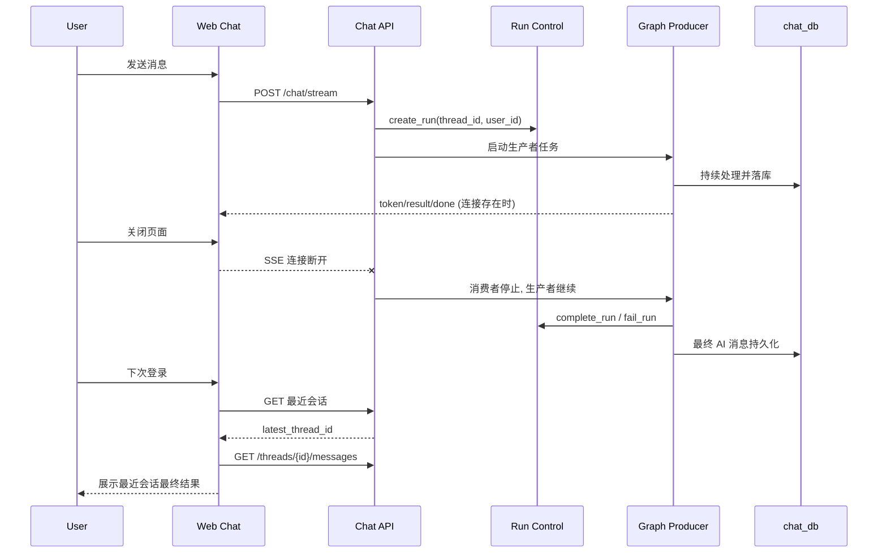

# 聊天会话断页续跑与最近会话回显设计说明

## 1. 需求澄清结论
- 目标:
  - 用户在 AI 回复中关闭页面后，后端继续执行本轮回复，结果最终可在历史中看到。
  - 用户下次登录后优先回到最近一次会话，而不是空白新会话。
- 范围:
  - 后端聊天流式链路：`/api/v1/chat/stream` 与 `ChatService.stream` 的连接生命周期处理。
  - 前端登录与聊天页入口：`/auth -> /chat` 跳转策略、`threadId` 初始化策略。
  - 会话列表/历史查询复用现有接口，不改业务意图与 AI 工作流决策逻辑。
- 边界:
  - 不调整 LangGraph 业务策略与模型路由。
  - 不新增“业务含义”SSE 事件；优先复用现有 `init/token/result/done/error`。
  - 不在本阶段引入复杂事件重放系统（event store）。
- 成功标准:
  - 场景 1：发送消息后立即关闭页面，30-120 秒后重新登录并进入最近会话，能看到该轮 AI 最终回复落库结果。
  - 场景 2：用户有历史会话时，登录后默认打开最近会话（`updated_at` 最新）。
  - 场景 3：无历史会话用户仍进入空白新会话，不报错。

## 2. 方案对比（2-3个）
| 方案 | 优点 | 缺点 | 成本 | 推荐度 |
|---|---|---|---|---|
| A. 仅前端回显最近会话 | 改动小，上线快；立刻解决“登录后总是新会话”问题 | 无法保证“关闭页面后继续生成”；后端断连语义不变 | 低 | 中 |
| B. 后端断连续跑 + 前端默认回最近会话（分阶段） | 同时覆盖两类诉求；不改核心业务策略；可复用 `t_chat_run` 与现有历史接口 | 需要重构流式执行生命周期；需补充状态查询与回收机制 | 中 | 高 |
| C. 事件溯源重放（run_event store + 可续流） | 能做到“关闭后回来继续看实时流”；可观测性最强 | 设计与改造面大，涉及新表/重放协议/消费游标，交付周期长 | 高 | 中 |

## 3. 推荐方案与理由
- 推荐: **方案 B（分阶段）**
- 理由:
  - 与当前诉求最匹配：既要“后台继续执行”，又要“下次打开就是最近会话”。
  - 复用已有能力：`t_chat_run` 生命周期管理、`threads` 按 `updated_at` 排序。
  - 风险可控：先实现“断连续跑 + 最近会话回显”，后续若要“断点续流”可增量演进到方案 C。

## 4. 设计概要
### 4.1 架构与组件
- 后端:
  - 将 `ChatService.stream` 调整为“生产者（执行图）/消费者（SSE输出）”解耦模型。
  - SSE 客户端断开时，消费者停止推送，但生产者继续执行直到 `done/error`，保证结果落库与 run 状态收口。
  - 新增“最近会话查询”轻量接口（或在现有线程列表上封装服务函数）。
- 前端:
  - 登录成功后不再固定 `router.push("/chat")`，改为“优先最近 threadId 跳转”。
  - 聊天页首次加载无 `threadId` 时，自动补全为最近会话；若无历史则保持空白会话。

### 4.2 数据流

### 4.3 关键改动点（按层）
- 后端 API 层
  - `POST /api/v1/chat/stream`: 保留协议，内部切为“断连不取消生产者”。
  - 新增 `GET /api/v1/chat/threads/latest`（建议）: 返回当前用户最近会话 `thread_id`。
- 后端服务层
  - `ChatService.stream`:
    - 拆分执行与发送职责，断连后仅停止发送，执行继续。
    - 对 orphan producer 增加超时回收与日志埋点（run_id/thread_id）。
- 前端入口层
  - `LoginCard` 登录后跳转逻辑：优先跳到最近会话。
  - `useSSEStream` 初次加载逻辑：无 query `threadId` 时自动补全最近会话。

### 4.4 异常与测试考虑
- 异常场景
  - 页面关闭导致连接断开：生产者不得被动取消。
  - 生产者执行失败：仍需 `fail_run` 并写入可诊断错误消息。
  - 最近会话不存在：前端回退到空白新会话。
- 测试建议
  - 后端单测: 模拟 SSE 消费中断，断言 run 最终 `completed/failed`，且 AI 消息落库。
  - API 测试: `GET /threads/latest` 在“有历史/无历史”下返回符合预期。
  - 前端 E2E: 登录后自动打开最近会话；关闭页面后重进可见最终回复。

### 4.5 停止按钮兼容策略（关键防回归）
- 现状风险
  - 输入框“停止”按钮仅调用前端 `stop()`，本质是 `AbortController.abort()` 断开 SSE，不会显式调用后端取消 API。
  - 方案 B 若实现“断连不停止后端执行”，则“停止按钮”会退化为“仅断开页面连接”，用户感知为失效。
- 设计约束
  - 必须将“页面关闭”和“用户点击停止”区分为两类语义：
    - 页面关闭: 不主动取消 run（用于断连续跑）。
    - 停止按钮: 主动取消 run（强语义停止）。
- 具体落地
  - 前端消费 `init` 事件里的 `run_id`（后端已发送），在流会话内缓存 `activeRunId`。
  - 新增前端 `cancelRun(runId)` API 封装，调用 `POST /api/v1/chat/runs/{run_id}/cancel`。
  - `stop()` 调整为两阶段：先调用 `cancelRun`，再 `abort()` 本地流并收口 UI 状态。
  - 当 `ENABLE_RUN_CONTROL=false` 时，保留兼容降级：仅本地 abort，并提示“本次为本地停止，服务端可能继续执行”。
- 回归验收
  - 点击停止后，服务端 run 状态应进入 `stopping/stopped`，且不再持续产出 token。
  - 关闭页面不点击停止时，run 允许继续并最终 `completed/failed`。

## 5. 决策收敛（本轮确认）
- 已确认不做“重新打开后继续实时 token 回放”，本期仅保证“后台继续执行 + 历史可见最终结果”。
- 断连续跑最大时长采用现有 run_control 默认超时（`orphan_timeout_seconds=600`，约 10 分钟），不额外引入新配置项。
- 运行环境按推荐默认集执行：生产与验收环境启用 `ENABLE_RUN_CONTROL=true`；`ENABLE_SSE_STOPPED_EVENT` 按兼容策略默认关闭。
- 停止按钮采用强停止语义：调用取消接口失败时自动重试 1 次，并以 toast 明确提示“停止失败，任务可能仍在后台执行”。

## 6. 审批记录
- design_approved: true
- approved_at: 2026-03-01 17:04
- approved_round: v1
