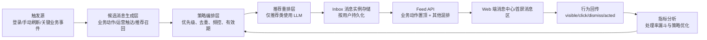
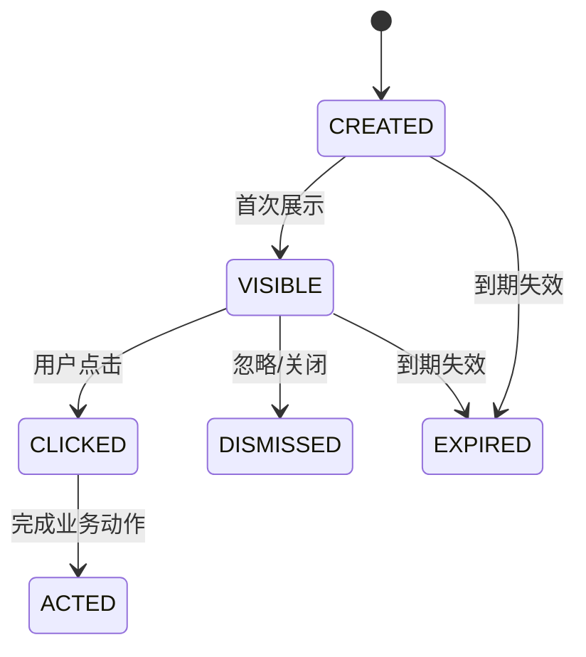
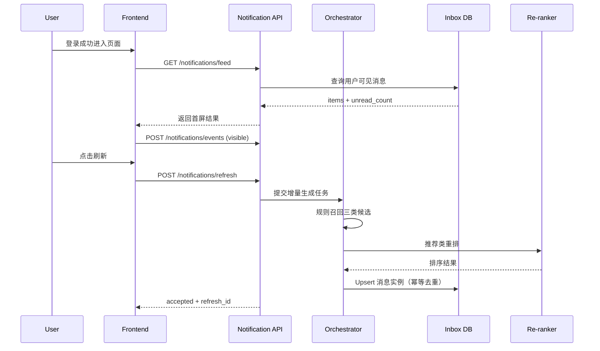

# 站内消息中心设计方案（登录触发，三类消息融合）

> 日期：2026-03-01  
> 状态：已评审通过（Design Approved）  
> 适用范围：仅 Web 站内消息，不包含 Push/邮件/IM 等外部渠道

---

## 1. 背景与目标

项目当前是 Web 形态，希望用户进入账号后，能像 OpenClaw 一样第一时间看到有价值的信息。  
本方案目标是在站内提供可编排、可追踪、可优化的消息中心能力，覆盖三类消息：

1. 业务动作类（待办、告警、审批等）
2. 运营触达类（后台人工发布）
3. 智能推荐类（规则召回 + LLM 重排）

核心成功指标：**业务动作消息处理率提升**。

---

## 2. 范围与非目标

### 2.1 本期范围（In Scope）

1. 登录首屏消息拉取
2. 手动刷新与关键事件触发增量更新
3. 三类消息统一入站内 Inbox
4. 消息生命周期管理与行为回传
5. 运营消息后台人工发布入口
6. 推荐类规则召回 + LLM 重排

### 2.2 非目标（Out of Scope）

1. Push、邮件、短信、IM 渠道接入
2. 全量实时流式刷新（首期不做全链路实时）
3. 复杂实验平台（A/B 只保留基础埋点能力）

---

## 3. 需求澄清结论（已确认）

1. 三类消息都要（业务动作 + 运营触达 + 智能推荐）
2. 展示策略为 C：业务动作固定置顶，其他混排
3. 更新策略为 C：登录首屏拉取 + 手动刷新/关键事件触发
4. 运营触达来源为 A：管理后台人工发布
5. 推荐策略为 B：规则召回 + LLM 重排
6. 一期核心指标为 B：业务动作消息处理率提升

---

## 4. 方案对比与选型

| 方案 | 优点 | 缺点 | 成本 | 推荐度 |
|---|---|---|---|---|
| A. 登录时实时拼装（不落消息实例） | 实现快、改动少 | 生命周期与去重能力弱，处理率统计不稳定 | 低 | ⭐⭐ |
| B. 事件化 Inbox（消息实例持久化）+ 登录拉取 | 生命周期清晰，指标闭环完整，后续扩展平滑 | 需要新增模型与状态管理 | 中 | ⭐⭐⭐⭐⭐ |
| C. 预计算快照流（离线聚合） | 首页读取性能高 | 复杂度高，首期投入大 | 高 | ⭐⭐⭐ |

**选型结论：方案 B**。

---

## 5. 总体架构



### 5.1 关键原则

1. 先落库再展示：避免登录请求内实时生成导致抖动与超时
2. 业务动作强确定性：不被推荐逻辑影响优先级
3. 推荐可降级：LLM 失败时自动回退规则分
4. 主链路不阻塞：增量生成失败不影响历史可见消息读取

---

## 6. 数据模型设计（chat_db）

> 说明：以下为设计层表结构草案，实际字段命名以现有 SQLAlchemy 规范为准。

| 模块 | 建议表名 | 关键字段 | 说明 |
|---|---|---|---|
| 运营模板 | `t_notification_template` | `id`, `type`, `content`, `start_at`, `end_at`, `target_rule`, `status` | 后台人工发布运营消息模板 |
| 用户消息实例（核心） | `t_user_notification_item` | `id`, `user_id`, `category`, `priority`, `title`, `body`, `source_type`, `source_id`, `status`, `score`, `dedupe_key`, `expires_at` | 用户维度 Inbox 消息实例 |
| 行为日志 | `t_user_notification_event` | `id`, `item_id`, `user_id`, `event_type`, `event_time`, `event_meta` | 记录曝光、点击、忽略、完成 |
| 用户偏好 | `t_user_notification_pref` | `user_id`, `category_enabled`, `quiet_hours`, `max_daily` | 频控与类别开关 |
| 推荐追踪 | `t_notification_rank_trace` | `item_id`, `recall_reason`, `llm_score`, `llm_reason` | 推荐链路可解释性与调参 |

### 6.1 状态机契约



### 6.2 幂等与去重

1. `user_id + dedupe_key` 唯一约束（防重复生成）
2. `source_type + source_id` 辅助索引（追溯来源）
3. 仅保留未过期可见项参与排序

---

## 7. API 设计与调用链

### 7.1 API 列表（MVP）

| 接口 | 方法 | 场景 | 主要职责 |
|---|---|---|---|
| `/api/v1/notifications/feed` | GET | 登录首屏、进入消息中心 | 拉取消息列表（业务动作置顶 + 其他混排） |
| `/api/v1/notifications/refresh` | POST | 手动刷新 | 异步触发一次增量生成 |
| `/api/v1/notifications/events` | POST | 行为回传 | 上报 `visible/click/dismiss/acted` |
| `/api/v1/notifications/unread-count` | GET | 角标刷新 | 轻量返回未读数 |
| `/api/v1/admin/notifications/templates` | POST | 运营发布 | 创建运营消息模板 |
| `/api/v1/admin/notifications/templates/{id}` | PATCH | 运营维护 | 更新模板状态/内容/有效期 |

### 7.2 登录与刷新调用链



---

## 8. 排序与展示规则

### 8.1 展示规则（已确认）

1. 第一层：业务动作消息固定置顶（按优先级 + 时效）
2. 第二层：运营触达与智能推荐混排（按分值 + 新鲜度）
3. 第三层：过期或超频消息不展示

### 8.2 推荐重排规则（已确认）

1. 先规则召回候选集（可控）
2. 再 LLM 重排（增强相关性）
3. LLM 异常自动降级为规则排序结果

---

## 9. 错误处理与降级策略

| 场景 | 处理策略 | 用户可见行为 |
|---|---|---|
| 推荐重排失败 | 回退规则分，不中断流程 | 仍返回消息列表 |
| 增量刷新失败 | 记录失败日志，保留历史消息 | 前端提示“刷新失败，可稍后重试” |
| 行为上报失败 | 异步重试或本地缓冲重传 | 不阻塞主页面交互 |
| 模板异常（越权/过期） | 后端拦截并拒绝入库 | 前端不展示异常模板消息 |

---

## 10. 验收与指标

### 10.1 一期核心指标（已确认）

`业务动作处理率 = ACTED(业务动作类) / VISIBLE(业务动作类)`（按日/周统计）

### 10.2 验收标准（MVP）

1. 登录后 2 秒内可拉取首屏消息（在常规负载下）
2. 三类消息可同屏展示，业务动作稳定置顶
3. 运营可在后台发布并生效模板
4. 推荐类可看到规则召回与重排结果痕迹
5. 可查看处理率基础报表

---

## 11. 风险与缓解

| 风险 | 影响 | 缓解措施 |
|---|---|---|
| 推荐质量波动 | 用户感知不稳定 | 增加规则兜底 + 反馈回流调参 |
| 重复消息骚扰 | 体验下降 | 强制去重键 + 频控配置 |
| 运营模板投放失误 | 错误触达 | 上线前预览 + 有效期与范围校验 |
| 指标口径漂移 | 无法评估收益 | 固化事件定义与漏斗计算口径 |

---

## 12. 审批记录

```yaml
design_approved: true
approved_at: "2026-03-01 03:02 CST"
approved_round: "round-1"
selected_solution: "B"
display_strategy: "业务动作置顶，其他混排"
refresh_strategy: "登录首屏拉取 + 手动刷新/关键事件触发"
```

---

## 13. 下一步

1. 基于本设计输出实施计划（任务拆分 + 里程碑 + 风险门禁）
2. 明确后端模型与 Alembic 迁移脚本清单
3. 明确前端消息中心入口与交互验收清单
