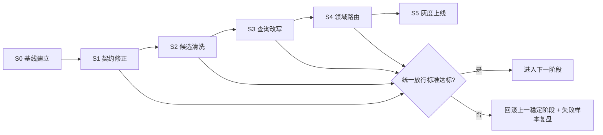

# 知识库检索 P2 分阶段治理方案（可人工闸门）

- 文档版本：v1.0
- 创建日期：2026-03-01
- 适用范围：`/Users/jijingkun/bojxAI/fastapi` 知识库检索链路（`knowledge_search` -> RAGFlow -> Supervisor）
- 目标阶段：P2（分步推进，不一次性硬切）

---

## 1. 背景与问题定位

当前“知识库查询结果不理想”不是单点参数问题，而是检索链路存在叠加性瓶颈：

1. 检索返回规模过大，导致工具输出超长。
2. 上下文压缩截断后，中段高价值证据容易丢失。
3. 模糊查询（如“新渠道有哪些功能”）缺少查询改写与多路召回兜底。
4. 候选结果缺少文档级去重与多样性控制，易出现同类片段刷屏。
5. 缺少可复现的离线评测与阶段闸门，改动效果不稳定。

### 1.1 现状证据（代码与文档）

| 证据点 | 现状 | 位置 |
|---|---|---|
| RAGFlow 检索请求仅传 `top_k`，未传 `page_size` | 请求默认可能返回 30 条 chunks | `/Users/jijingkun/bojxAI/fastapi/app/ai/tools/ragflow_tool.py:48` |
| RAGFlow API 语义 | `page_size` 控制返回条数，`top_k` 控制向量候选计算深度 | `/Users/jijingkun/bojxAI/fastapi/ragflow/src_ragflow/docs/references/http_api_reference.md:2404` |
| Supervisor 会压缩工具消息 | 默认 `char_limit=2400`，首尾保留中段省略 | `/Users/jijingkun/bojxAI/fastapi/app/ai/workflow/multi_agent_graph.py:231` |
| 线上日志出现大量 30 条返回 | `RAGFlow 检索完成: chunks=30` | `/Users/jijingkun/bojxAI/fastapi/logs/assistant.log.2026-02-27:22114` |

---

## 2. 目标、非目标与统一放行标准

### 2.1 目标（P2）

- 目标1：建立可重复、可解释、可回滚的检索改进机制。
- 目标2：分阶段提升召回相关性，降低错误引用率。
- 目标3：每一步都支持人工检测、测试、评估，达标再推进。

### 2.2 非目标

- 本期不改前端交互样式，不做 UI 改版。
- 本期不做全量知识库重建（可在后续 P3 做治理深化）。
- 本期不引入重量级外部排序基础设施（先以现有能力演进）。

### 2.3 统一放行标准（全阶段共用）

| 指标 | 阈值 | 解释 |
|---|---:|---|
| 人工相关性@5 | >= 80% | Top5 结果中至少 4 条业务可用相关 |
| 错误引用率 | <= 5% | 回答引用与证据不一致占比 |
| 阶段推进条件 | 两项同时达标 | 任意一项不达标，不进入下一阶段 |

---

## 3. 方案对比与推荐

| 方案 | 优点 | 缺点 | 成本 | 推荐度 |
|---|---|---|---|---|
| 快速止血后直冲 P2 | 见效快 | 波动风险高，质量不稳定 | 低 | ★★★☆☆ |
| 阶段闸门式推进（推荐） | 每步可人工把关、可回滚、可追溯 | 过程管理成本略高 | 中 | ★★★★★ |
| 先做知识治理再算法 | 长期收益高 | 前期见效慢 | 高 | ★★★★☆ |

**推荐结论**：采用“阶段闸门式推进”，先稳住链路，再逐步提准。

---

## 4. 分阶段执行蓝图（S0-S5）

### 4.1 阶段总表

| 阶段 | 目标 | 核心改造 | 人工检测 | 自动测试 | 放行条件 | 回滚策略 |
|---|---|---|---|---|---|---|
| S0 基线建立 | 固化可评估基线 | 样本集、日志规范、评估脚本 | 标注抽检 | 评估脚本回归 | 指标稳定可重复 | 无线上变更 |
| S1 契约修正 | 先解决“回太多+被截断” | `page_size/top_k` 解耦与配置化 | Top8 质量审查 | 参数契约单测 | 不低于基线，截断次数显著下降 | 配置开关回退 |
| S2 候选清洗 | 提升证据质量 | 去重、文档限额、结果压缩 | 引用一致性抽检 | 去重排序单测 | 相关性提升，错引不升 | 关闭清洗开关 |
| S3 查询改写 | 提升模糊问句命中 | 原问+扩展问多路召回融合 | 前后对比评审 | 改写融合单测 | 相关性提升明显 | 关闭改写开关 |
| S4 领域路由 | 降低跨域误召回 | 元数据过滤、数据集路由 | 跨域误召回抽检 | 路由过滤回归 | 错引进一步下降 | 关闭路由开关 |
| S5 灰度上线 | 安全全量 | 10%→30%→100% + 日复盘 | 每日 badcase 会审 | 巡检与告警 | 连续3天达标 | 一键切回 S4 |

### 4.2 分阶段详细说明

#### S0：基线建立（1-2天）

**核心动作**
- 建立 30-50 条“真实业务问句”离线评测集。
- 每条样本包含：问题、期望文档、关键证据、期望答案要点。
- 固化日志字段：query、返回文档ID、score、入模长度、截断次数。
- 输出首版基线报告（作为后续比较基准）。

**人工介入点**
- 业务专家双人复核标注。
- 对标注冲突样本进行仲裁，形成最终标准答案。

**放行门槛**
- 同一评测集重复跑两次，核心指标波动 < 5%。

#### S1：检索契约修正（1天）

**核心动作**
- 在检索请求中显式引入 `page_size`（返回条数）。
- 将 `top_k` 仅用于向量候选深度，不再承担“返回条数”语义。
- 配置建议（首版）：`page_size=8`、`top_k=64~256`，灰度调参。

**人工介入点**
- 抽检 20 条样本的 Top8 结果，确认是否减少无关噪声。

**放行门槛**
- 人工相关性@5 >= 80%，错误引用率 <= 5%。

#### S2：候选清洗与证据压缩（2天）

**核心动作**
- 同文档候选上限（例如每文档最多 2 个 chunk）。
- 文档级去重（相似段落只保留最高分）。
- 结果拼接改为“证据卡片摘要”而非全段原文堆叠。

**人工介入点**
- 审查“答案句子 -> 证据卡片”一一可追溯。

**放行门槛**
- 达到统一放行标准，且噪声样本比例显著下降。

#### S3：查询改写与多路召回（2-3天）

**核心动作**
- 保留原问作为主路。
- 扩展路：术语扩展、业务同义词扩展、场景词扩展。
- 多路结果融合排序（以相关性和证据覆盖度为主）。

**人工介入点**
- 针对模糊问题集进行前后对比评审（至少 20 条）。

**放行门槛**
- 统一放行标准达标，且模糊问句场景优于 S2。

#### S4：领域路由与 metadata 过滤（2天）

**核心动作**
- 建立领域词典（例如制度、流程、产品、系统操作）。
- 根据领域与元数据条件路由数据集，减少跨域干扰。
- 引入 metadata_condition 过滤策略（按标签/来源/日期）。

**人工介入点**
- 业务专家抽检跨域误召回案例并归因。

**放行门槛**
- 统一放行标准达标，跨域误召回显著下降。

#### S5：灰度发布与全量（1-2天）

**核心动作**
- 流量分批：10% -> 30% -> 100%。
- 每日自动产出指标日报 + badcase 清单。
- 发现指标异常立即冻结推进并回退。

**人工介入点**
- 每日会审异常样本，确认是否继续放量。

**放行门槛**
- 连续 3 天满足统一放行标准且无 P1 级事故。

---

## 5. 人工检测与评审机制（全流程）

### 5.1 评审角色分工

| 角色 | 责任 |
|---|---|
| 业务评审人 | 相关性与可用性判定 |
| 技术评审人 | 引用正确性与实现可行性 |
| QA | 回归执行与结果归档 |
| 负责人 | 放行/回滚决策 |

### 5.2 人工评审评分卡（建议）

| 维度 | 评分规则 |
|---|---|
| Top5 相关性 | 0-5 分（相关条数） |
| 引用正确性 | 正确/错误 |
| 答案完整性 | 完整/部分/缺失 |
| 误导风险 | 低/中/高 |
| 结论 | 通过/不通过 |

---

## 6. 自动化测试与可观测

### 6.1 自动测试清单

| 测试层级 | 覆盖项 |
|---|---|
| 单元测试 | 参数构造、去重、重排、改写融合 |
| 集成测试 | RAGFlow 请求契约与降级路径 |
| 离线评测 | 固定样本集批量对比 |
| 灰度巡检 | 延迟、空结果率、错误率、引用异常率 |

### 6.2 可观测字段（建议）

| 字段 | 说明 |
|---|---|
| query_hash | 问句去敏标识 |
| retrieval_stage | 所处阶段（S1/S2/...） |
| page_size/top_k | 检索参数快照 |
| selected_doc_ids | 最终选中文档列表 |
| context_chars | 入模字符长度 |
| truncation_flag | 是否发生截断 |
| citation_mismatch | 引用是否异常 |

---

## 7. 风险清单与应对

| 风险 | 表现 | 应对策略 |
|---|---|---|
| 调参导致召回骤降 | Top5 命中下降 | 小步灰度 + A/B 对比 |
| 改写过度偏题 | 命中漂移 | 原问主路权重保底 |
| 去重过强丢证据 | 回答不完整 | 每文档上限与覆盖率联合约束 |
| 领域路由误判 | 召回空洞 | 路由失败回退全库检索 |
| 人工评审口径不一致 | 指标失真 | 双人复核 + 仲裁机制 |

---

## 8. 里程碑与排期建议

| 周次 | 里程碑 |
|---|---|
| 第1周 | 完成 S0 + S1 |
| 第2周 | 完成 S2 |
| 第3周 | 完成 S3 |
| 第4周 | 完成 S4 + S5 灰度到全量 |

---

## 9. 阶段推进流程图

---

## 10. 本方案最终结论

1. 采用“阶段闸门式推进”是当前最稳妥的 P2 路径。
2. 统一放行标准已固定：`人工相关性@5 >= 80%` 且 `错误引用率 <= 5%`。
3. 每阶段均具备人工检测、自动测试、评估、放行与回滚机制。
4. 建议先落地 S0/S1，快速消除“结果超长+被截断”的系统性损失，再进入 S2-S4 提准阶段。

---

## 11. 全量优化范围定义（回答“是否全量”）

### 11.1 本期“全量”覆盖范围（P2）

本方案的“全量”是指：**覆盖知识库检索链路端到端**，从用户问题进入到最终回答引用输出，包含以下模块：

| 链路节点 | 是否覆盖 | 说明 |
|---|---|---|
| Query 进入与预处理 | 是 | 模糊问题识别、改写触发、主路保真 |
| RAGFlow 检索参数层 | 是 | `page_size/top_k/similarity/vector_weight` 契约化 |
| 候选合并与重排层 | 是 | 去重、文档多样性、证据覆盖优先 |
| 上下文组装层 | 是 | 证据卡片化、长度预算、截断友好 |
| 引用与答案一致性层 | 是 | 引用核查与错误引用防护 |
| 线上灰度与回滚层 | 是 | 阶段闸门、灰度放量、自动回退 |

### 11.2 本期“非全量”边界（P3 候选）

| 项 | 是否纳入 P2 | 原因 |
|---|---|---|
| 文档源头重切 chunk / 重建索引 | 否 | 工程量大、依赖知识库运营，放到 P3 |
| 大规模语义标注平台建设 | 否 | 先用轻量评测集闭环 |
| 引入外部独立 reranker 服务 | 否 | 先在现有栈完成收益验证 |

> 结论：对“在线检索效果”而言，本方案是 **P2 范围内的全量优化**；对“知识库生产体系”而言，不是最终全生命周期全量（那是 P3）。

---

## 12. 文件级落地清单（具体到改哪里）

| 文件 | 变更内容 | 阶段 | 类型 |
|---|---|---|---|
| `/Users/jijingkun/bojxAI/fastapi/app/ai/tools/ragflow_tool.py` | 检索参数契约化；显式 `page_size`；多路召回融合入口；候选去重与文档限额 | S1-S3 | 代码 |
| `/Users/jijingkun/bojxAI/fastapi/app/core/config.py` | 新增/调整知识库检索配置项（默认值、边界） | S1 | 代码 |
| `/Users/jijingkun/bojxAI/fastapi/app/ai/workflow/multi_agent_graph.py` | 工具结果压缩协同策略；证据卡片组装预算 | S2 | 代码 |
| `/Users/jijingkun/bojxAI/fastapi/tests/unit/test_ragflow_tool.py` | 参数构造、去重、文档限额、改写融合测试 | S1-S3 | 测试 |
| `/Users/jijingkun/bojxAI/fastapi/tests/unit/test_multi_agent_streaming_helpers.py` | 上下文压缩与引用一致性回归 | S2 | 测试 |
| `/Users/jijingkun/bojxAI/fastapi/scripts/data/` | 离线评测脚本（kb 版本）与报表导出 | S0 | 脚本 |
| `/Users/jijingkun/bojxAI/fastapi/docs/plans/2026-03-01-kb-retrieval-p2-phased-design.md` | 本文档持续更新（评估结果与决议） | 全阶段 | 文档 |

---

## 13. 参数矩阵（首版建议值与调优顺序）

### 13.1 参数建议

| 参数 | 当前观察值 | S1 建议初值 | 调优区间 | 作用 |
|---|---:|---:|---|---|
| `RAGFLOW_PAGE_SIZE` | 未显式传（默认 30） | 8 | 5-12 | 控制返回 chunks 数量 |
| `RAGFLOW_TOP_K` | 5 | 128 | 64-256 | 控制向量候选深度 |
| `RAGFLOW_SIMILARITY_THRESHOLD` | 0.2 | 0.2 | 0.2-0.45 | 过滤低相关候选 |
| `RAGFLOW_VECTOR_WEIGHT` | 0.3/0.6（环境差异） | 0.3 | 0.2-0.6 | 向量/关键词平衡 |
| `MAX_CHUNKS_PER_DOC` | 无 | 2 | 1-3 | 防止单文档刷屏 |
| `SUPERVISOR_TOOL_MESSAGE_CHAR_LIMIT` | 2400 | 2400（先不改） | 2400-3200 | 推理阶段工具消息预算 |

### 13.2 调优顺序（固定）

1. 先调 `page_size`
2. 再调 `top_k`
3. 再调 `max_chunks_per_doc`
4. 最后调 `threshold/vector_weight`

---

## 14. 评测数据集设计（具体采样）

| 类别 | 样本数 | 说明 |
|---|---:|---|
| 产品功能类 | 12 | “有什么功能/能力/限制” |
| 流程制度类 | 12 | “怎么做/按什么规定” |
| 操作手册类 | 10 | “在哪个页面/按钮/步骤” |
| 模糊问句类 | 10 | “这个怎么弄/新渠道咋用” |
| 跨域干扰类 | 8 | 易混词、同名术语 |
| 负样本类 | 8 | 库中无答案，检验拒答边界 |

合计：60 条（建议起步 40 条，第二周扩到 60 条）。

### 14.1 每条样本结构

| 字段 | 必填 | 示例 |
|---|---|---|
| `case_id` | 是 | KB-023 |
| `query` | 是 | 新渠道有哪些功能 |
| `expected_docs` | 是 | 文档ID列表 |
| `must_have_evidence` | 是 | 必含证据关键词 |
| `forbidden_evidence` | 否 | 禁止误引证据 |
| `grade_rule` | 是 | 相关性和引用判分规则 |

---

## 15. 阶段级 DoD（完成定义）

| 阶段 | DoD（必须全部满足） |
|---|---|
| S0 | 样本集 >= 40；评估脚本可复现；两次跑分波动 < 5% |
| S1 | 参数契约上线到测试环境；截断次数下降 >= 50%；统一放行标准达标 |
| S2 | 去重与文档限额生效；证据卡片化输出；统一放行标准达标 |
| S3 | 改写融合开关可控；模糊问句子集优于 S2；统一放行标准达标 |
| S4 | 路由与 metadata 过滤可回退；跨域误召回下降；统一放行标准达标 |
| S5 | 灰度三档稳定；连续3天达标；全量后无 P1 事故 |

---

## 16. 执行排程（到天级）

| 天 | 任务 | 产出 |
|---|---|---|
| D1 | S0 样本集首版 + 评测脚本骨架 | `kb_eval_cases_v1.json`、`eval_report_v0.md` |
| D2 | S0 标注复核 + 基线分数冻结 | `baseline_metrics.json` |
| D3 | S1 参数契约改造 + 单测 | `mr_s1`、单测报告 |
| D4 | S1 人工抽检 + 闸门评审 | `stage_s1_review.md` |
| D5-D6 | S2 去重/限额/证据卡片改造 | `mr_s2`、回归报告 |
| D7 | S2 评审与放行 | `stage_s2_review.md` |
| D8-D10 | S3 改写与多路融合 | `mr_s3`、模糊问句专项报告 |
| D11 | S3 评审与放行 | `stage_s3_review.md` |
| D12-D13 | S4 路由与过滤 | `mr_s4`、跨域误召回报告 |
| D14 | S4 评审与放行 | `stage_s4_review.md` |
| D15-D17 | S5 灰度三档发布 | 灰度日报、放量决议 |

---

## 17. 灰度与回滚 Runbook（具体执行）

### 17.1 灰度阈值

| 灰度档位 | 流量 | 观察时长 | 达标条件 |
|---|---:|---|---|
| G1 | 10% | 1 天 | 两项统一标准达标 |
| G2 | 30% | 1 天 | 两项统一标准达标 |
| G3 | 100% | 1 天 | 两项统一标准达标 |

### 17.2 触发回滚条件

| 条件 | 动作 |
|---|---|
| 人工相关性@5 < 80% | 立即冻结放量并回退上一阶段配置 |
| 错误引用率 > 5% | 立即回退并开启异常样本复盘 |
| P95 延迟恶化 > 30% | 停止新策略，恢复旧参数 |
| 大面积空结果 | 关闭改写/路由开关，回退 S2 稳定态 |

---

## 18. 附录：需要同步更新的文档

| 文档 | 何时更新 | 内容 |
|---|---|---|
| `/Users/jijingkun/bojxAI/fastapi/docs/API文档/外部服务集成.md` | S1 完成后 | 检索参数语义与示例请求修正 |
| `/Users/jijingkun/bojxAI/fastapi/docs/开发文档/快速入门/生产部署手册.md` | S1/S2 后 | 新增配置项、推荐参数、排障建议 |
| 本文档 | 每阶段结束 | 记录实际指标、放行结论、遗留问题 |
