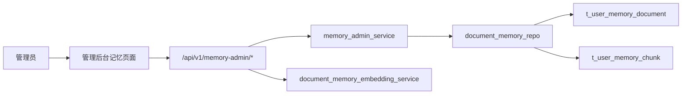
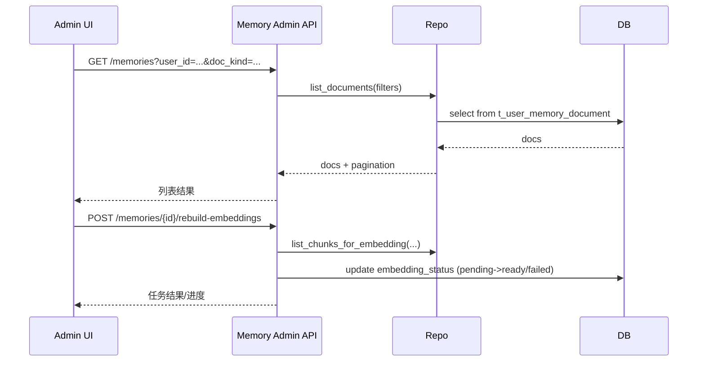

# 用户个性化永久记忆与管理能力需求方案（草案）

> 日期：2026-03-01  
> 状态：已评审通过（Design Approved）  
> 适用范围：FastAPI 后端 + 管理后台（仅管理员）

---

## 1. 需求澄清结论

- 目标: 在现有“用户个性化永久记忆”基础上，补齐后台可用的查询与管理闭环。  
- 范围: 以 `t_user_memory_document` + `t_user_memory_chunk` 为核心，增强管理 API 与后台页面，不改动主对话协议。  
- 边界: 不引入新存储引擎，不做跨集群同步，不在本期重构记忆主模型。  
- 成功标准: 管理员可按用户查询记忆、查看明细与分块状态、执行归档/删除/重建/失败重试，并可追踪操作结果。

### 1.1 Team 判定快照（jjk-clarify）

- module_count: 4（API、Service/Repo、Config、Admin Web）
- boundary_count: 2（后端 + 前端）
- uncertainty_count: 2（管理边界、编辑策略）
- estimated_file_count: 10+
- 结论: 满足升级阈值（命中 >= 2 条），按“大任务澄清”标准输出设计草案

---

## 2. 问题现状

当前系统已经具备“向量化永久记忆”的核心链路：

1. 对话写入：`flush` 将用户信息沉淀到 document/chunk。  
2. 对话召回：`memory_search -> memory_get` 混合检索注入。  
3. 向量补偿：`rebuild-embeddings / embedding-status / retry-failed` 管理 API。  

当前缺口主要在“面向管理员的业务管理能力”：

1. 缺记忆列表查询（按用户、doc_kind、时间、状态筛选）。  
2. 缺记忆明细查看（正文、分块、引用定位、向量状态）。  
3. 缺基础管理动作（归档、删除、手工修正、重分块触发）。  
4. 缺召回调试视图（给定 query 查看召回片段与分数）。  
5. 缺管理后台 UI 入口（目前以 API 为主）。

---

## 3. 方案对比（2-3 个）

| 方案 | 优点 | 缺点 | 成本 | 推荐度 |
|---|---|---|---|---|
| A. 仅补后端管理 API | 上线快、对现有链路侵入小 | 依赖 Postman/脚本，运营不可自助 | 低 | ⭐⭐⭐ |
| B. 后端 API + 管理后台最小页面 | 运维闭环完整，可直接查询/管理，风险可控 | 需前后端联调与权限联测 | 中 | ⭐⭐⭐⭐⭐ |
| C. 全治理平台（API+UI+审计中心+报表） | 一次性能力完整，后续扩展空间最大 | 周期长、跨模块改动大 | 高 | ⭐⭐⭐ |

---

## 4. 推荐方案与理由

- 推荐: **方案 B（后端 API + 管理后台最小页面）**  
- 理由:
  1. 满足“现在就要能查、能管”的核心诉求。  
  2. 在现有两表模型与管理 API 基础上增量扩展，技术风险最小。  
  3. 能保留后续升级到方案 C 的路径，不会造成返工。

---

## 5. 设计概要

### 5.1 架构



### 5.2 组件

1. 查询 API 组（新增）  
   - 记忆列表  
   - 记忆详情  
   - 分块列表  
   - 召回调试  
2. 管理 API 组（新增/增强）  
   - 归档记忆  
   - 删除记忆  
   - 手工编辑记忆（可选开关）  
   - 重分块与重建向量  
3. 后台页面（新增）  
   - 检索筛选区（user_id/doc_kind/status/date）  
   - 列表区（文档级）  
   - 详情抽屉（正文+chunks+embedding 状态）  
   - 操作区（归档/删除/重建/重试）

### 5.3 数据流



### 5.4 异常与测试考虑

1. 多租户隔离: 所有查询和操作必须强制 `user_id` 维度过滤。  
2. 大文档保护: 列表默认只返回摘要，详情按需加载正文。  
3. 风险操作: 删除/编辑要求二次确认与审计日志。  
4. 降级策略: embedding worker 不可用时只做状态重置，不阻塞管理查询。  
5. 回归测试: API 合约测试 + 权限测试 + 跨用户越权测试 + UI 冒烟。

---

## 6. 需求清单（MVP）

### 6.1 功能需求

| 编号 | 需求 | 验收标准 |
|---|---|---|
| FR-01 | 记忆列表查询 | 支持按 `user_id/doc_kind/status/date` 过滤，支持分页与排序 |
| FR-02 | 记忆详情查询 | 可查看 `content_md/revision/source/scope/update_time` |
| FR-03 | 分块状态查询 | 可查看 `chunk_no/start_line/end_line/embedding_status/retry_count/error` |
| FR-04 | 归档操作 | 执行后文档 `status=archived`，默认列表不可见 |
| FR-05 | 删除操作 | 删除文档后关联 chunk 级联清理，且可审计 |
| FR-06 | 向量重建/重试 | 可按 user/doc 触发重建与失败重试，并可查看结果 |
| FR-07 | 召回调试查询 | 输入 query，返回片段、分数、引用，便于排障 |
| FR-08 | 管理后台页面 | 具备列表、详情、操作按钮与结果反馈 |

### 6.2 非功能需求

| 编号 | 需求 | 验收标准 |
|---|---|---|
| NFR-01 | 安全性 | 管理接口仅管理员可访问，越权请求返回 403 |
| NFR-02 | 性能 | 列表查询 P95 < 300ms（常规分页） |
| NFR-03 | 可观测性 | 关键操作有结构化日志与错误码 |
| NFR-04 | 可回滚 | 支持通过 feature 开关关闭管理能力 |

---

## 7. 接口草案（语义命名）

说明：对外使用“记忆（memories）”语义命名；内部代码仍复用 `document_memory_*` 实现。

| 接口 | 方法 | 说明 |
|---|---|---|
| `/api/v1/memory-admin/memories` | GET | 记忆列表查询 |
| `/api/v1/memory-admin/memories/{memory_id}` | GET | 记忆详情查询 |
| `/api/v1/memory-admin/memories/{memory_id}/chunks` | GET | 分块与向量状态查询 |
| `/api/v1/memory-admin/memories/{memory_id}/archive` | POST | 归档记忆 |
| `/api/v1/memory-admin/memories/{memory_id}` | DELETE | 删除记忆 |
| `/api/v1/memory-admin/memories/search-debug` | POST | 召回调试（返回分数和引用） |
| `/api/v1/memory-admin/document/rebuild-embeddings` | POST | 保留现有重建入口（兼容） |
| `/api/v1/memory-admin/document/embedding-status` | GET | 保留现有状态入口（兼容） |
| `/api/v1/memory-admin/document/retry-failed` | POST | 保留现有失败重试入口（兼容） |

---

## 8. 阶段化交付

| 阶段 | 交付内容 | 出口标准 |
|---|---|---|
| Phase 1 | 后端查询 API（列表/详情/chunks） | 支持管理端只读查询 |
| Phase 2 | 后端管理 API（归档/删除/search-debug） | 支持核心管理动作 |
| Phase 3 | 管理后台页面（MVP） | 管理员可在页面完成查管闭环 |
| Phase 4 | 审计与体验增强 | 操作可追踪、排障可定位 |

---

## 9. 风险与缓解

| 风险 | 影响 | 缓解措施 |
|---|---|---|
| 误删记忆 | 影响召回质量 | 删除前确认 + 先归档后硬删策略 |
| 查询性能退化 | 管理页面卡顿 | 分页 + 索引复核 + 摘要返回 |
| 向量失败堆积 | 召回质量下降 | 定时补偿 + 失败重试 + 状态看板 |
| 语义混乱（文档 vs 记忆） | 接口理解成本高 | 对外统一“记忆”语义，文档内声明映射关系 |

---

## 10. 未决问题

- [ ] 是否在 MVP 支持“手工编辑记忆正文”（高风险操作，建议二期）  
- [ ] 删除策略是否默认“软删（archive）”，硬删仅超级管理员可用  
- [ ] 是否需要批量操作（按 user_id 批量归档/重建）  
- [ ] 后台页面是否需要显示 chunk 级原文对照与行号跳转

---

## 11. 审批记录

```yaml
design_approved: true
approved_at: "2026-03-01 15:23 CST"
approved_round: "round-1"
selected_solution: "B"
```

> 审批通过后再进入 `/jjk-plan` 或 `/jjk-imp`。
