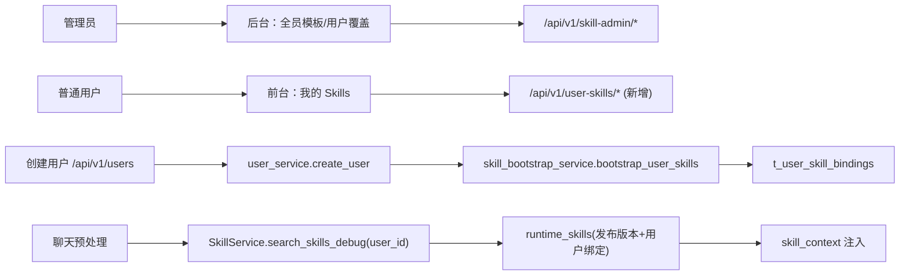

# 用户 Skill 统一模板与严格用户源检索设计（方案 B）

> 日期：2026-03-01  
> 状态：已评审通过（Design Approved）  
> 适用范围：FastAPI 后端 + 管理后台（管理员与普通用户）

---

## 1. 需求澄清结论

- 目标: 建立全员统一的 Skill 初始化模板，并让 Skill 在运行时按 `user_id` 隔离生效。  
- 范围: 覆盖后端检索链路、用户创建初始化、管理后台能力、灰度与回滚方案。  
- 边界: 一期不支持普通用户直接改写全局 Skill 正文；普通用户维护的是“本人绑定与覆盖配置”。  
- 成功标准:
  1. 新用户创建后自动拥有统一模板对应的初始 Skill 列表；
  2. 检索只按当前用户生效技能计算，不再依赖旧全局表作为主路径；
  3. 管理员可管理全员模板、查看用户覆盖并执行回滚；
  4. 用户可维护本人启停、优先级、触发词覆盖，不影响他人。

### 1.1 Team 判定快照（jjk-clarify）

- module_count: 2（Skill 治理、用户初始化）
- boundary_count: 2（后端 + 前端）
- uncertainty_count: 1（严格模式切换与回退策略）
- estimated_file_count: 7
- 结论: 命中条件 1 条，单代理输出设计文档

---

## 2. 现状与关键风险

### 2.1 当前能力（已有）

1. Skill 检索支持 hybrid（向量 + 关键词 + trigger 命中）；
2. 代码已具备 Skill 版本与用户绑定模型/服务接口；
3. 管理端已有 Skill 列表、向量状态与重建能力；
4. 检索链路已经支持传入 `user_id`。

### 2.2 当前缺口（待补）

1. `feature.enable_skill_versioning` 与 `feature.enable_user_skill_binding` 未开启；
2. 版本表为空（definitions/versions 尚未回填）；
3. 统一初始化模板机制尚未建立；
4. 前端缺少“全员模板管理 / 用户覆盖管理”页面；
5. 存在旧表兼容回退逻辑，不满足“Skill 跟用户走”的严格隔离要求。

### 2.3 风险判断

- 若直接开启开关且不做回填，会出现运行时候选为空或检索行为不一致；
- 若保留 legacy 回退为默认，会与“严格用户隔离”目标冲突；
- 若无统一模板，会导致新用户初始能力不可控，维护成本持续升高。

---

## 3. 方案对比（2-3 个）

| 方案 | 优点 | 缺点 | 成本 | 推荐度 |
|---|---|---|---|---|
| A. 仅开开关 + 继续兼容旧表回退 | 上线快，变更小 | 与“Skill 跟用户走”冲突，可能混入旧全局数据 | 低 | ⭐⭐ |
| B. 严格用户源模式 + 统一模板初始化（本方案） | 完整满足需求，隔离清晰，维护口径统一 | 需要一次性回填版本表并扩展管理端 | 中 | ⭐⭐⭐⭐⭐ |
| C. B + 用户私有 Skill 正文编辑 | 个性化最强 | 权限/审核/审计复杂度显著增加 | 高 | ⭐⭐⭐（二期） |

---

## 4. 推荐方案与理由

- 推荐: **方案 B（严格用户源模式 + 统一模板初始化）**
- 理由:
  1. 与“Skill 跟用户走”的核心目标完全一致；
  2. 复用现有版本与绑定数据结构，避免无边界新增模型；
  3. 能以阶段方式平滑上线，保留向方案 C 的演进路径。

---

## 5. 设计概要

### 5.1 架构与调用链



### 5.2 设计原则

1. **真理源统一**：运行时候选只来自“版本发布 + 用户绑定”，不以 `t_agent_skills` 为主。  
2. **模板先行**：新用户先初始化统一模板，再允许个性化覆盖。  
3. **用户隔离**：所有用户操作必须强制绑定 `current_user.id`。  
4. **管理员治理**：模板与发布/回滚仅管理员可操作。  
5. **可回滚**：提供灰度开关与回退路径，确保可控上线。

---

## 6. 数据模型与初始化方案

### 6.1 核心数据层（沿用现有）

1. `t_agent_skill_definitions`: 稳定 `skill_id` 定义层  
2. `t_agent_skill_versions`: 可发布/回滚版本层  
3. `t_user_skill_bindings`: 用户级覆盖层（按 `user_id + skill_id` 唯一）

### 6.2 新增：统一模板配置（建议）

建议在 `t_system_config` 新增模板键（JSON）：

- `skill.user_bootstrap_template`  
- 示例值：

```json
{
  "default_version": "v1",
  "skills": [
    {
      "skill_id": "sql-expert",
      "enabled": true,
      "priority_override": 100,
      "config_override": {
        "trigger_phrases": ["SQL", "查询", "报表"]
      }
    }
  ]
}
```

### 6.3 用户初始化链路（新增）

在 `user_service.create_user` 成功后增加：

1. `bootstrap_user_skills(user_id)` 读取统一模板，并在服务内部负责是否启用初始化的开关判定；
2. 逐条写入 `t_user_skill_bindings`；
3. 幂等策略：已存在 `user_id + skill_id` 则跳过或按策略更新；
4. 失败处理：记录告警并降级，不回滚用户创建主事务（与现有偏好记忆 bootstrap 口径一致）。

---

## 7. 严格用户源检索设计（关键）

### 7.1 模式定义

新增运行模式键（DB 动态配置）：

- `skill.runtime_source_mode`:
  - `compat`（兼容）：允许 legacy 回退；
  - `strict_user`（严格）：禁止 legacy 回退。

默认建议：灰度阶段 `compat`，目标状态切换为 `strict_user`。

### 7.2 严格模式行为

1. 检索候选 SQL 只走 runtime 视图（发布版本 + 当前用户绑定）；
2. 在 `strict_user` 模式下：
   - 禁止 `_fetch_*_legacy` 回退；
   - 若用户无绑定，按模板或发布默认版本返回；
   - 输出结构化日志并标记 `strict_user=true`。

### 7.3 触发机制说明（你关注点）

当前触发机制保留并增强：

1. 向量分：`vector_score`（embedding 相似度）；
2. 关键词分：`lexical_score`（FTS）；
3. 触发词命中：`trigger_hit`（`trigger_phrases` 子串命中）；
4. 最终分：`vector_weight*vector + lexical_weight*lexical + trigger_weight*trigger`。

结论：embedding 不是硬依赖（hybrid 可降级关键词），但为保证召回质量建议保持 embedding 常态化。

---

## 8. 管理能力与权限设计

### 8.1 管理员能力（后台）

1. 全员模板管理（读取/编辑 `skill.user_bootstrap_template`）；
2. Skill 版本发布/回滚；
3. 用户覆盖查询（按 user_id / skill_id / status）；
4. 对指定用户执行“回滚到模板默认”。

### 8.2 用户能力（前台）

1. 查看“我的生效 Skills”；
2. 调整本人启停、优先级、触发词覆盖；
3. 重置单个 Skill 到模板默认。

### 8.3 权限边界

1. 用户接口只允许操作 `current_user.id`；
2. 管理接口统一 `admin` 权限；
3. 所有状态变更写审计日志（user_id、operator、before/after、trace_id）。

---

## 9. “Skill 自我升级更新”能力设计（第二阶段）

### 9.1 当前结论

- 当前系统无自动自我升级闭环；
- 现有能力是：人工编辑 SKILL、导入、发布、回滚。

### 9.2 推荐落地方式（安全优先）

采用“自动建议 + 人工审核发布”：

1. 输入：检索日志、用户反馈、命中率与失败案例；
2. 生成：候选修改建议（trigger、描述、内容补充）写入 draft 版本；
3. 审核：管理员在后台对比差异并发布；
4. 回滚：复用现有版本回滚。

不建议首期启用“自动发布”，避免错误知识扩散到全员。

---

## 10. 阶段化交付计划

| 阶段 | 交付内容 | 出口标准 |
|---|---|---|
| Phase 0 | 版本表回填与模板草案 | definitions/versions 完整可查，模板可读 |
| Phase 1 | 用户初始化 + 模板管理 API | 新用户自动绑定模板技能 |
| Phase 2 | strict_user 检索切换 + 日志增强 | 检索主链不再依赖 legacy |
| Phase 3 | 前端页面（管理员+用户） | 管理与自维护闭环可用 |
| Phase 4 | 自我升级建议流（draft） | 可生成建议并审核发布 |

---

## 11. 验收与测试策略

### 11.1 功能验收

1. 新建用户后，`t_user_skill_bindings` 自动出现模板技能；
2. 同一 `skill_id` 在不同用户的绑定互不污染；
3. strict_user 开启后检索不读 legacy 回退；
4. 用户侧改动只影响本人会话检索结果；
5. 管理员回滚后用户恢复模板默认。

### 11.2 测试清单

1. 单测：`skill_service`（strict/compat 两种模式）；
2. API 测试：绑定、回滚、模板读取更新；
3. 集成测试：创建用户 -> 初始化 -> 会话检索；
4. 前端冒烟：管理员模板页、用户“我的 Skills”页；
5. 回归测试：向量重建与混合检索评分稳定性。

---

## 12. 灰度与回滚

### 12.1 灰度步骤

1. 先完成 Phase 0 数据回填；
2. 打开 `feature.enable_skill_versioning=true`，保留 `compat`；
3. 打开 `feature.enable_user_skill_binding=true`；
4. 验证核心用户后切换 `skill.runtime_source_mode=strict_user`。

### 12.2 回滚策略

1. 若 strict_user 异常，先切回 `compat`；
2. 若绑定链路异常，可临时关闭 `feature.enable_user_skill_binding`；
3. 版本内容问题用发布回滚，不直接改线上旧版本。

---

## 13. 未决问题

- [ ] 模板更新对“已存在用户”是否自动增量同步（建议默认不自动，提供“批量对齐”命令）  
- [ ] 用户覆盖允许到什么粒度（仅 trigger/priority，还是 scope/conflicts 也可改）  
- [ ] 用户侧是否展示“推荐技能”与“最近命中技能”运维指标

---

## 14. 审批记录

```yaml
design_approved: true
approved_at: "2026-03-01 18:05 CST"
approved_round: "round-2"
selected_solution: "B-strict"
```

> 本设计用于后续制定实施计划（`jjk-plan`）与拆分执行任务。
