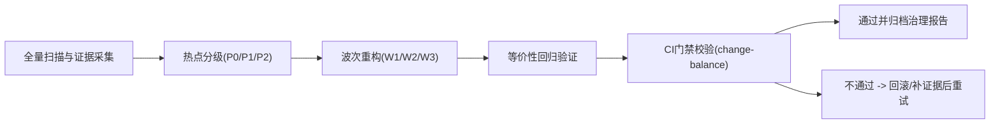

# 全量代码检查与精简治理（方案 C）设计说明

> 文档日期：2026-03-02  
> 目标定位：在不丢失现有功能前提下，系统性清理过度设计、兜底漂移和重复逻辑，并建立长期防反弹门禁  
> 工作模式：`clarify/design-only`（本阶段不进入实现）

---

## 1. 需求澄清结论

- 目标:
  1. 建立一次全量代码体检，识别复杂度热点、重复实现、兼容残留和兜底扩散。
  2. 通过分波次重构执行“减法改造”，降低维护成本并保持行为等价。
  3. 建立 feature/refactor 场景下的硬门禁，避免后续继续“只加不减”。
- 范围:
  1. 后端：`app/**/*.py`
  2. 前端：`web/src/**/*.{ts,tsx}`
  3. 治理与流程：`AGENTS.md`、`.cursor/rules/*.mdc`、`.github/workflows/*.yml`、`scripts/ci/*.py`、PR 模板
- 边界:
  1. 本期不新增业务需求，不改变对外 API 语义，不改动产品功能路径。
  2. 优先重构高风险高收益热点，不做全仓“美化式”格式化。
  3. 所有改动必须附带等价性验证证据（测试命令、日志或快照）。
- 成功标准:
  1. P0/P1 热点形成可执行清单并完成波次化治理。
  2. 重构波次内 `refactor` 类 PR 满足“净增可控 + 删除可见 + 退场清单完整”。
  3. 关键链路（chat/data/todo/admin）回归通过率 100%，无 P1 功能回退。
  4. 新增门禁在 CI 生效，后续 PR 可自动阻断“无减法说明的扩张改动”。

### 1.1 Team 判定快照

- `module_count`: 5（后端工作流、后端服务层、前端管理台、SSE 链路、CI 规则）
- `boundary_count`: 4（后端 / 前端 / AI-workflow / CI）
- `uncertainty_count`: 3（兜底边界、兼容路径退役时机、等价性验证口径）
- `estimated_file_count`: >= 20

判定结果：命中 4/4，采用 Team 并行收集上下文与草案（本报告为 Leader 汇总结论）。

### 1.2 当前基线证据（静态盘点）

- 后端：206 个 Python 文件，约 53113 行。
- 前端：106 个 TS/TSX 文件，约 19369 行。
- 模式信号：后端 `fallback` 关键字出现 310 次，兼容/legacy/兜底语义出现 242 次。
- 超大文件热点（后端）：
  1. `app/ai/workflow/multi_agent_graph.py`（4516 行）
  2. `app/ai/workflow/data_graph.py`（4489 行）
  3. `app/services/skill_service.py`（2319 行）
  4. `app/ai/workflow/todo_graph.py`（2316 行）
  5. `app/services/chat_service.py`（1674 行）
- 超大文件热点（前端）：
  1. `web/src/components/admin/overview/AdminOverviewCockpit.tsx`（1031 行）
  2. `web/src/lib/backend.ts`（975 行）
  3. `web/src/components/admin/DataAdminPanel.tsx`（909 行）
  4. `web/src/components/admin/MetricAdminPanel.tsx`（901 行）
  5. `web/src/hooks/useSSEStream.ts`（762 行）

---

## 2. 方案对比（2-3 个）

| 方案 | 优点 | 缺点 | 成本 | 推荐度 |
|---|---|---|---|---|
| A. 只出全量审查报告，不改门禁 | 上手快，短期可见热点清单 | 无法阻止后续继续膨胀，治理不可持续 | 低 | ⭐⭐⭐ |
| B. 体检 + 轻门禁（仅补流程约束） | 成本可控，能改善一部分“只增不减” | 对历史高复杂度热点收敛力度不足 | 中 | ⭐⭐⭐⭐ |
| C. 体检 + 强门禁 + 分波次重构（推荐） | 同时解决历史债务和未来反弹，形成闭环治理 | 短期投入高，需要更严格回归纪律 | 高 | ⭐⭐⭐⭐⭐ |

---

## 3. 推荐方案与理由

- 推荐: 方案 C
- 理由:
  1. 当前问题不是单点 bug，而是“历史复杂度 + 规则覆盖不足”叠加，必须同时处理代码与流程。
  2. 仅靠提示词或代码评审无法长期防止反弹，必须引入 CI 硬门禁。
  3. 分波次执行可把高风险改造拆成可回滚单元，降低一次性大爆炸风险。

---

## 4. 设计概要

### 4.1 架构

三层治理架构：

1. 证据层（Audit Layer）
   - 统一产出热点清单、复杂度指标、兜底/兼容路径分布。
2. 改造层（Refactor Layer）
   - 按波次推进“删除/收敛/抽取/合并”，每步附带等价性验证。
3. 门禁层（Guard Layer）
   - PR 模板 + CI 规则 + 预算脚本共同约束，阻断“无退场说明”的扩张改动。

### 4.2 组件

1. 热点台账（文档）
   - 记录文件、问题类型、风险分级、预计收益、验收命令。
2. 波次执行清单（任务）
   - W1/W2/W3 拆分，确保每波次可独立回滚。
3. 强门禁组件（流程）
   - 新增 `change-balance` workflow（覆盖 feature/refactor）
   - 增强预算脚本（纳入删除可见性与分类型阈值）
   - PR 模板新增“退场清单/豁免理由/清债截止日”

### 4.3 数据流

### 4.4 异常与测试考虑

1. 异常策略
   - 任一波次出现关键链路回归失败，立即停止下游波次并回滚当前波次。
   - 允许临时豁免，但必须绑定技术债卡和截止日期。
2. 测试策略
   - 后端：单测 + 集成测试（重点 chat/data/todo 流程）
   - 前端：类型检查 + lint + 关键 UI 流程回归
   - 端到端：核心用户路径抽样验证（SSE 流式、管理后台关键操作）
3. 验证纪律
   - 无测试证据不得标记“完成”。
   - 所有“删除/收敛”动作必须有行为等价证明。

### 4.5 执行波次（建议）

| 波次 | 目标 | 重点文件 | 验证重点 |
|---|---|---|---|
| W1 | 收敛主链编排与流式重复 | `app/ai/workflow/multi_agent_graph.py`、`app/services/chat_service.py` | fallback 路由一致性、SSE submit/resume 行为一致 |
| W2 | 拆分数据与 todo 超长节点 | `app/ai/workflow/data_graph.py`、`app/ai/workflow/todo_graph.py` | 意图判定/降级策略稳定、状态迁移一致 |
| W3 | 收敛前端超大组件和 API 重复 | `web/src/components/admin/overview/AdminOverviewCockpit.tsx`、`web/src/hooks/useSSEStream.ts`、`web/src/lib/data-admin-api.ts` | 页面状态一致、API 错误处理一致、类型收紧无回退 |

---

## 5. 未决问题（如有）

- [ ] `change-balance` 对 feature/refactor 的初始阈值最终取值（先严后松 or 先松后严）。
- [ ] 豁免机制的审批责任人（Owner）和超期升级策略。
- [ ] W1/W2/W3 每波次最大并发数（避免回归面过大）。
- [ ] 是否将“兜底分支登记”纳入必填文档（建议纳入）。

---

## 6. 审批记录

- design_approved: true
- approved_at: 2026-03-02 16:40 CST
- approved_round: round-2（用户以 `$jjk-plan` 指令确认进入正式规划）
