# GitHub 强门禁并行开发设计（组织仓库，单人执行）

- 文档版本：v1.0
- 创建日期：2026-03-02
- 适用范围：`/Users/jijingkun/bojxAI/fastapi` 多大任务并行开发治理
- 目标形态：组织仓库 + Rulesets + Merge Queue + Project V2 + Issue 层级/依赖

---

## 0. 设计审批记录

```yaml
design_approved: true
approved_at: "2026-03-02 19:44 CST"
approval_round: "round-1"
approval_source: "对话确认（用户依次确认第1节/第2节/第3节）"
```

---

## 1. 背景与问题

当前项目在本地执行真理源中仍是串行模式：

- `execution_mode: "serial"`（`docs/内部参考/任务拆解/2026-03-01_用户个性化永久记忆与管理能力/_active_task.json`）

在此状态下，即便 GitHub 上开了多分支，也容易出现如下问题：

1. 表面并行，实则被隐式依赖反复阻塞。
2. 单人多任务上下文切换成本高，WIP 失控后吞吐下降。
3. 主干稳定性依赖“自觉”，缺少可执行强门禁。

本设计目标是把“个人仓库串行习惯”升级为“组织仓库强门禁并行体系”。

---

## 2. 目标、非目标与成功标准

### 2.1 目标

1. 支撑单人同时推进多个大任务，但不牺牲主干稳定性。
2. 用 GitHub 原生能力建立可追踪、可回滚、可审计的并行流程。
3. 通过门禁矩阵降低并发冲突和“半成品合入”风险。

### 2.2 非目标

1. 本期不引入外部 CI 编排平台替代 GitHub Actions。
2. 本期不引入复杂人审流程（单人场景不强依赖多人审批）。
3. 本期不覆盖跨仓多仓依赖治理（先做好单仓强门禁）。

### 2.3 成功标准

1. 每个大任务可拆分为 Parent Issue + Sub-issues + Dependencies。
2. `main` 禁止绕过 PR 直接写入，且必须通过 required checks。
3. PR 仅通过 merge queue 合并；队列阻塞可诊断、可恢复。
4. 单人并行 WIP 有明确上限，且可通过 Project 面板观测。

---

## 3. 方案对比与选型

| 方案 | 优点 | 缺点 | 成本 | 推荐度 |
|---|---|---|---|---|
| A. 个人仓库基础并行（Issue + Draft PR + 基础 CI） | 上手快，配置少 | 门禁强度有限，易回退到“自觉驱动” | 低 | ★★★☆☆ |
| B. 个人仓库强门禁（A + Rulesets + Project 自动化） | 流程更稳，较易落地 | 受个人仓可用能力限制，扩展性一般 | 中 | ★★★★☆ |
| C. 组织仓库企业级强门禁（推荐） | 能完整启用 merge queue，主干稳定性最高 | 需要仓库迁移与治理配置 | 高 | ★★★★★ |

选型结论：采用 **方案 C**（组织仓库企业级强门禁）。

---

## 4. 总体架构与调用链

```mermaid
flowchart LR
    A["Parent Issue (Epic)"] --> B["Sub-issues (能力拆分)"]
    B --> C["Issue Dependencies (blocked by / blocking)"]
    C --> D["Project V2 (Stream/Gate/Status/Risk/PR)"]
    D --> E["每个子任务独立 branch + worktree"]
    E --> F["Draft PR (关联 Issue)"]
    F --> G["Rulesets 门禁 (PR + required checks)"]
    G --> H["Merge Queue(main)"]
    H --> I["合并后自动关单 + Project 状态推进"]
```



### 4.1 关键设计原则

1. 任务先建模再开发：未建 Parent/Sub/Dependencies 不允许开分支。
2. 每个任务一条独立执行流：`1 issue -> 1 branch -> 1 worktree -> 1 draft PR`。
3. 所有入主干行为都通过 ruleset + queue，不做人工例外路径。
4. Project 作为并行治理看板，避免状态散落在评论与私有记录。

---

## 5. 强门禁矩阵（G0-G5）

| Gate | 目标 | 硬门禁（必须满足） | 失败回退 |
|---|---|---|---|
| G0 任务建模闸门 | 防止伪并行 | Parent Issue + 3~7 Sub-issues + Dependencies + Project 字段齐全 | 禁止开分支，先补建模 |
| G1 开工闸门 | 控制在制品 | 单人 `WIP <= 3`；每个 Sub-issue 必须绑定 branch/worktree/draft PR | 超限后冻结新开任务 |
| G2 Draft PR 闸门 | 早暴露风险 | PR 必须 Draft + 关联 Issue + 基础 CI 全绿 | 维持 Draft，禁止转 Ready |
| G3 Ready 闸门 | 防止半成品入队 | required checks 全绿 + 无冲突 + 风险与回滚说明完整 | 失败即退回 Draft |
| G4 Merge Queue 闸门 | 保护主干 | `main` 要求 merge queue；Actions 支持 `merge_group` 触发 | 触发失败先修 CI 再入队 |
| G5 收口闸门 | 保证闭环 | 合并后自动关闭 linked issue + Project 进入 Done | 自动化失败需补录并复盘 |

默认建议参数（单人场景）：

- 并行上限：`WIP = 3`
- merge queue 并发：`min=1, max=1`（先稳后快）
- 状态检查超时：`30m`

---

## 6. 异常处理策略

| 异常场景 | 触发信号 | 处置策略 | 恢复标准 |
|---|---|---|---|
| 队列卡死 | PR 长时间停留 queue | 检查 `merge_group` 是否触发；修复后重新入队 | 连续样本可正常入队并合并 |
| CI 假红（flaky） | 同提交重复结果不一致 | 先治理 flaky，用标签区分 infra/test/code | 7 天内 flaky 率回归阈值 |
| 依赖死锁 | Project 出现循环阻塞 | 拆解“解锁子任务”打破环，再恢复并行 | 依赖图无环且关键路径可推进 |
| WIP 失控 | In Progress 明显超阈值 | 冻结新开流，只允许收敛旧流 | WIP 回到 `<=3` |
| 主干绕过 | 出现 main 直推 | 强化 ruleset，审计 bypass 事件 | 7 天无绕过事件 |

---

## 7. 验收测试清单

1. 结构验收：每个 Parent Issue 至少 3 个 Sub-issues，依赖图无环。
2. 流程验收：每个 Sub-issue 对应 branch/worktree/draft PR。
3. 门禁验收：直推 `main` 必须被拒，required checks 失败不能合并。
4. 队列验收：PR 入 queue 后触发 `merge_group`，失败可回退重试。
5. 闭环验收：PR merge 后 linked issue 自动关闭，Project 自动流转 Done。

---

## 8. 落地前置与迁移步骤

> 注：当前仓库是个人仓目标态需迁移到组织仓。

1. 建立组织仓并完成仓库迁移（保留 issue/PR 历史）。
2. 配置 Project V2 字段：`Stream/Gate/Status/Risk/PR`。
3. 配置 ruleset：`require PR`、`required status checks`、线性历史/签名按需。
4. 配置 merge queue：启用 `main` 队列策略，并确保 Actions 支持 `merge_group`。
5. 选 1 个大任务做试运行（两周），达到验收标准后再全量推广。

---

## 9. GitHub 官方依据（2026-03-02 查证）

1. Rulesets 可配置“要求 PR 合并”“required status checks”等门禁。  
   `https://docs.github.com/en/repositories/configuring-branches-and-merges-in-your-repository/managing-rulesets/available-rules-for-rulesets`
2. Merge queue 管理、`merge_group` 事件触发与队列策略。  
   `https://docs.github.com/en/enterprise-cloud@latest/repositories/configuring-branches-and-merges-in-your-repository/configuring-pull-request-merges/managing-a-merge-queue`
3. Parent/Sub-issues 与层级限制。  
   `https://docs.github.com/en/issues/tracking-your-work-with-issues/using-issues/adding-sub-issues`
4. Issue 依赖（阻塞链）能力。  
   `https://docs.github.com/en/enterprise-cloud@latest/issues/tracking-your-work-with-issues/using-issues/creating-issue-dependencies`
5. Project 内置自动化（item closed -> done 等）。  
   `https://docs.github.com/en/issues/planning-and-tracking-with-projects/automating-your-project/using-the-built-in-automations`
6. PR 与 Issue 关联后自动关闭行为。  
   `https://docs.github.com/en/issues/tracking-your-work-with-issues/using-issues/linking-a-pull-request-to-an-issue`
7. Draft/Ready 阶段切换行为。  
   `https://docs.github.com/en/pull-requests/collaborating-with-pull-requests/proposing-changes-to-your-work-with-pull-requests/changing-the-stage-of-a-pull-request`
8. 仓库迁移到组织的官方流程。  
   `https://docs.github.com/en/repositories/creating-and-managing-repositories/transferring-a-repository`

---

## 10. 下一步

按 skill 流程，本设计完成后进入 `writing-plans` 阶段，产出详细实施计划（任务拆分、顺序、检查点、回滚预案）。
