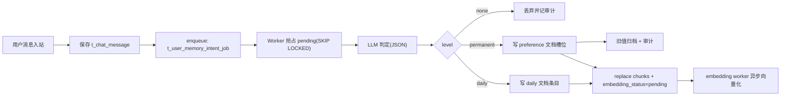

# 用户个性化永久记忆 LLM 异步判定设计

> 日期：2026-03-03  
> 版本：v1.2  
> 状态：待审批（clarify 阶段）  
> 来源：`$jjk-clarify` 多轮澄清结论（对齐 OpenClaw“检索优先 + 异步沉淀”理念）

## 1. 需求澄清结论

- 目标：
  - 记忆判定不再依赖关键词规则，改为 LLM 语义判定。
  - 输出分层固定为 `permanent / daily / none`。
  - 存储内容必须为“条目化整理文本”，禁止原文直接追加。
  - 主对话链路零阻塞，不增加用户等待时长。
- 范围：
  - 用户消息进入异步判定队列。
  - 判定模型固定使用模型路由的 `lightweight`。
  - 分类固定为 5 类：
    - `ai_persona`
    - `user_preference`
    - `important_knowledge`
    - `profile_fact`
    - `interaction_policy`
- 边界：
  - `P95 < 5s` 指“记忆任务生效时延”，不是“同轮回答立即可见”。
  - 低置信记忆（A1）：直接丢弃。
  - 冲突处理：新值覆盖旧值，旧值归档审计。
  - 反向指令：仅“反向意图 + 可定位槽位”成立时执行归档。
  - `important_knowledge` 仅允许跨会话长期稳定知识。
- 成功标准：
  - 用户回答时延与当前版本持平。
  - 记忆异步生效 `P95 < 5s`。
  - 永久记忆可治理（覆盖、归档、审计、检索可观测）。

## 2. 方案对比（2-3 个）

| 方案 | 优点 | 缺点 | 成本 | 推荐度 |
|---|---|---|---|---|
| A. 关键词规则 + 同步写入 | 实现快 | 误判高、不可扩展、主链路阻塞 | 低 | 低 |
| B. LLM 判定 + 同步写入 | 语义能力强 | 直接拉长用户响应时延 | 中 | 中 |
| C. LLM 判定 + PostgreSQL 队列 + Worker | 无主链路阻塞、数据一致性好、可审计可补偿 | 需要任务状态机与 Worker 运维 | 中高 | 高（推荐） |

## 3. 推荐方案与理由

- 推荐：方案 C（LLM 判定 + PostgreSQL 队列 + 常驻 Worker）。
- 理由：
  - 已明确约束是“不能影响用户回答”，异步是必要条件。
  - 当前系统主存储就是 PostgreSQL，沿用同库事务与审计链路，降低额外中间件运维面。
  - OpenClaw 对齐的是“检索优先 + 异步沉淀 + 可降级”，不是必须复用其文件或队列介质。
- 风险前提（不回避）：
  - 若压测证明 `SKIP LOCKED` 在目标流量下退化，再评估 Redis 队列替换；该项作为 Beta 里程碑门禁，不在设计阶段假设成功。

## 4. 设计概要

### 4.1 架构与职责分层

- Chat 主链路（同步）：
  - 保存消息后只做 `enqueue_memory_intent_job`。
  - 不执行 LLM 判定，不等待判定结果。
- Memory Intent Worker（异步）：
  - 事务抢占队列任务（`FOR UPDATE SKIP LOCKED`）。
  - 调 `lightweight` 生成结构化判定。
  - 归一化后写入文档记忆并触发 embedding 补偿。
- 记忆存储层（业务两表）：
  - `t_user_memory_document`（文档）
  - `t_user_memory_chunk`（分块与检索）
- 任务控制层（基础设施一表）：
  - `t_user_memory_intent_job`（异步任务状态机）

### 4.2 核心数据流

### 4.3 术语与存储映射（强制）

- 判定术语：
  - `permanent | daily | none`
- 存储术语：
  - `permanent -> doc_kind=preference`
  - `daily -> doc_kind=daily`
  - `none -> 不写库`

### 4.4 槽位模型（slot_key）与多值策略

- `slot_key` 不允许完全自由文本，采用“枚举前缀 + 有限后缀”规范：
  - `assistant.persona.*`
  - `user.preference.*`
  - `knowledge.important.*`
  - `user.profile.*`
  - `interaction.policy.*`
- 归一化规则：
  - LLM 可输出候选键；服务端执行 canonical map（同义键合并，如 `ai.personality -> assistant.persona.style`）。
  - 归一化失败则判 `none`（不入库）。
- 多值槽位：
  - 允许列表值，采用 `slot_key + value_hash` 共存，不再硬覆盖。
  - 若语义是“替换集合”（例如“以后只喝美式”），则触发同槽位旧值归档后重建。

### 4.5 判定合同分层（MVP 与扩展）

- MVP 必填（第一阶段仅要求这些字段稳定）：
  - `level`
  - `category`
  - `slot_key`
  - `canonical_text`
  - `confidence`
- 扩展字段（可选，缺失可默认）：
  - `durability_score`（默认 `0.0`）
  - `operation`（默认 `upsert`）
  - `reason`（默认空字符串）
  - `source_span`（默认空）
  - `reverse_intent`（默认 `false`）
- 容错策略：
  - 核心字段缺失/枚举非法 -> 该条记忆按 `none`。
  - 非核心字段缺失 -> 自动补默认值，不整任务失败。

### 4.6 条目化文本质量门禁

- `canonical_text` 必须满足：
  - 不得是对用户原句的机械复述。
  - 使用可检索短句（含核心实体词）。
  - 不含“我记住了你...”这类无信息模板句。
- 质量校验失败时：
  - 该条按 `none` 丢弃。
  - 原文只保留在审计上下文，不作为记忆正文注入。
- 说明：
  - 用户已明确“记忆内容不能用原文追加”，因此不采用“原文入库 fallback”。

### 4.7 异步队列表（`t_user_memory_intent_job`）

- 建议字段：
  - `id`, `user_id`, `source_thread_id`, `source_message_id`
  - `event_time`, `payload_json`, `dedupe_key`
  - `status(pending/processing/succeeded/failed/dead_letter)`
  - `attempt_count`, `next_retry_time`, `lease_until`
  - `claimed_by`, `claimed_at`, `error_message`
  - `create_time`, `update_time`
- 索引：
  - 唯一：`(user_id, source_message_id)`
  - 抢占：`(status, next_retry_time, create_time)`
  - 过期回收：`(status, lease_until)`
- 状态机：
  - `pending -> processing -> succeeded`
  - `pending -> processing -> failed -> pending(retry)`
  - `failed(retry_exhausted) -> dead_letter`

### 4.8 幂等、乱序、并发覆盖保护

- 幂等：同 `(user_id, source_message_id)` 只允许一个成功结果。
- 乱序：文档记录增加 `last_event_time`，旧事件不覆盖新事件。
- 并发：文档记录增加 `revision`（乐观锁）。
- 覆盖流程：
  1. 读取同 `slot_key` 当前激活记录。
  2. 校验 `event_time` 与 `revision`。
  3. 先归档旧值并写审计。
  4. 再 upsert 新值并递增 `revision`。

### 4.9 反向指令（删除/撤销）规则

- 定向删除：
  - 例如“不要再记我喜欢拿铁”。
  - 条件：`reverse_intent=true` 且可定位 `slot_key`。
- 模糊删除：
  - 例如“忘掉我刚刚说的偏好”。
  - 条件：可从最近窗口定位候选槽位；否则拒绝执行，仅记审计。
- 全量清除：
  - 例如“清空所有记忆”。
  - 归为管理操作，不走普通聊天自动执行（需后台管理端二次确认流程）。

### 4.10 敏感信息治理（发布前必备）

- 短期（MVP）：
  - Prompt 明确禁止写入银行卡、证件号、密码、验证码等高敏数据。
  - 规则引擎前置拦截（正则）命中即 `none`。
- 中期（Beta）：
  - 增加 NER/分类器复核，命中高敏后写审计拒绝原因。
- 合规原则：
  - 敏感信息默认不沉淀，不做“先存后脱敏”。

### 4.11 检索与注入口径（回答你“最终查什么字段”）

- FTS 检索字段：`t_user_memory_chunk.chunk_tsv`（由 `chunk_text` 构建）。
- 向量检索字段：`t_user_memory_chunk.embedding`。
- 混合排序输入：
  - 语义查询向量 vs `embedding`
  - 关键词查询 vs `chunk_tsv`
- 最终送 LLM 的文本：
  - 来自 `chunk_text`（必要时回源 `content_md` 截段）。
  - 不是 `summary_md`，`summary_md`仅用于后台列表与管理检索辅助。

### 4.12 Embedding 补偿链路

- 写入 chunk 后统一置 `embedding_status=pending`。
- 由现有 embedding worker 异步补偿，不阻塞主对话。
- 降级策略：
  - 向量缺失时自动降级 FTS，不影响“可查”；只影响语义召回质量。

### 4.13 分级背压与熔断

- L1（`pending < 5k`）：正常处理。
- L2（`5k <= pending < 10k`）：
  - 限流单用户并发任务。
  - 降低每轮批量拉取数。
- L3（`pending >= 10k`）：
  - 触发记忆判定熔断开关（仅暂停入队消费，不影响主对话）。
  - 仅保留审计日志与告警，等待恢复。

### 4.14 时延目标与依据

- 目标保持：`P95 < 5s`（用户已确认）。
- 口径：`enqueue_ts -> persist_done_ts`。
- 同步回答口径：不承诺同轮可见，承诺“下一轮高概率可见”。
- 若灰度期连续 7 天不达标：
  - 降级目标可临时放宽为 `P95 < 10s` 并保持透明披露。

### 4.15 OpenClaw 对齐与差异说明

| 维度 | OpenClaw | 本方案 |
|---|---|---|
| 记忆主存 | 工作区 Markdown 文件 | PostgreSQL 文档/分块表 |
| 召回方式 | `memory_search + memory_get` 两阶段 | 混合检索（FTS+向量）+ 引用注入 |
| flush 机制 | 预压缩前静默 flush | 聊天后异步队列判定 flush |
| 检索后端 | QMD/SQLite，失败自动回退 | 向量失败回退 FTS |
| scope/source | 支持并强调隔离 | `user_id` 强隔离 + source/scope 字段 |

- 结论：
  - 对齐的是设计思想（检索优先、异步沉淀、可回退），不是必须照搬文件存储形态。

### 4.16 分阶段实施计划

- MVP（2 周）：
  - 上线异步判定队列 + MVP 合同 + 文档写入。
  - 先打通端到端与观测链路。
- Beta（4 周）：
  - 完整合同、槽位治理、反向指令、分级背压。
  - 完成压测并验证 `SKIP LOCKED` 上限。
- GA（6 周）：
  - 敏感信息治理、管理端审计闭环、灰度到全量。

### 4.17 监控与发布门禁

- 核心指标：
  - 队列长度、任务成功率、死信率、`P95 enqueue->persist`、worker 心跳。
- 告警阈值：
  - `pending > 5k`（P2）
  - `pending > 10k`（P1）
  - `dead_letter_rate > 0.5%`（P2）
  - `P95 > 5s`（P2）
  - worker 连续 3 次心跳失败（P1）
- 发布门禁：
  - 灰度 10% -> 50% -> 100%，每阶段观察 7 天。
  - 未过门禁不得全量。

## 5. 未决问题

- [ ] 管理端“全量清除记忆”二次确认交互文案与审批流细节。
- [ ] 敏感信息规则库初版词典与正则覆盖范围评审。

## 6. 审批记录（待补）

- design_approved: false
- approved_at: <待补>
- approved_round: <待补>
