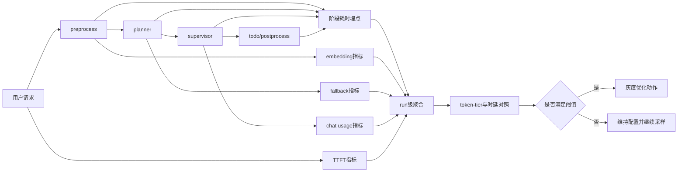

# AI响应慢与Token放大治理设计说明

## 1. 需求澄清结论
- 目标:
  - 在不牺牲稳定性与答复质量前提下，降低用户体感等待时长，并建立“可证明”的性能优化闭环。
  - 明确区分并量化 `chat token`、`embedding token`、模型 TTFT、fallback 重试对时延的贡献。
- 范围:
  - 后端 AI 主链路：`preprocess -> planner -> supervisor -> todo -> postprocess`。
  - 观测层、灰度策略层、路由与上下文治理层。
  - 数据来源包括运行日志、`t_chat_run`、模型 usage 元数据。
- 边界:
  - 本设计不包含新增业务功能，不调整业务语义目标。
  - 不做未经验证的全量模型切换或全量参数大幅下调。
  - 不在本阶段引入新的基础设施（如外部队列/新监控平台），优先复用现有日志与数据库。
- 成功标准:
  - 一天内完成因果验证基线，能输出 token 档位与时延对照结论。
  - 三天内完成至少一项数据驱动优化并通过灰度验收。
  - 七天内形成稳定治理机制，P90 时延与高 token 请求占比显著下降。

## 2. 最终方案
- 方案描述:
  - 采用“先证据、后动作”的三阶段治理路径：
    - P0（1天）：因果闭环与观测补齐。
    - P1（3天）：按证据打靶优化（模型、token预算、fallback、embedding）。
    - P2（7天）：结构性收敛与长期监控固化。
- 关键决策:
  - 决策一：采用证据分级机制。
    - 已证实：高 chat token 消耗、长会话时长、fallback 多次出现、embedding 调用存在且远程。
    - 强相关待闭环：token 与时延因果强度、fallback 单次时延贡献、embedding 占比。
    - 待证实：TTFT 是否为首要瓶颈。
  - 决策二：优化动作必须满足“可灰度、可观测、可回滚”。
  - 决策三：禁止全量一次性大改，优先小流量实验验证后放量。

## 3. 决策权衡
- 放弃路径:
  - 立即全量下调 `MESSAGE_MAX_TOKENS`。
  - 立即全量切换 `default_chat` 模型。
  - 仅做单点修补（只改 fallback 或只改 embedding）。
- 放弃原因:
  - 缺乏因果闭环时直接全量变更，风险高且难定位回归源。
  - 单点修补无法覆盖当前复合瓶颈，容易出现“局部改善、整体无感”。
  - 当前最优策略是先建立对照证据，再按瓶颈贡献度排序施策。

## 4. 设计概要
- 架构:
  - 在现有链路中增加最小侵入观测层，按 `run_id` 聚合五类指标：
    - 阶段耗时指标。
    - token 指标（chat 与 embedding 分离）。
    - fallback 指标。
    - TTFT 指标。
    - 质量与稳定性守护指标（错误率、回滚触发）。
- 组件:
  - 指标采集组件：
    - NodeTimer（阶段计时）。
    - UsageCollector（模型 usage 收集）。
    - FallbackRecorder（fallback 级别与耗时）。
    - EmbeddingProbe（embedding 调用次数/时延/缓存命中）。
  - 数据汇总组件：
    - RunMetricsAggregator（按 run 聚合并输出 token-tier 对照）。
  - 决策执行组件：
    - CanaryController（灰度开关与回滚门槛控制）。
- 数据流:

- 异常与测试考虑:
  - 异常场景:
    - 埋点本身引入性能抖动。
    - 日志采样不足导致结论偏差。
    - 灰度期间出现质量下降或错误率上升。
  - 防护策略:
    - 埋点采样可配置，默认低侵入。
    - 指标以 run_id 关联，避免跨请求污染。
    - 设置强制回滚阈值：错误率、P99、用户负反馈。
  - 验证策略:
    - P0 完成后输出固定报表：`token-tier vs latency`、`model vs TTFT`、`fallback_rate`、`embedding_p90`。
    - P1 每次变更仅放量 10%~20%，满足阈值后再扩容。

## 5. 未决问题（如有）
- [ ] 当前日志中 usage 与 run_id 的直接关联方式是否需要新增标准字段，避免后续解析误差。
- [ ] embedding token 消耗是否可从 provider 回执统一获取，还是仅统计时延与调用次数。
- [ ] TTFT 与总时延之间的贡献拆分是否需要引入网络 RTT 维度。
- [ ] fallback 的“触发率分母”按请求数还是按 planner 调用数作为官方口径。

## 6. 审批记录
- design_approved: true
- approved_at: 2026-03-04 09:30
- approved_round: user_request_jjk_clarify_design_v1
