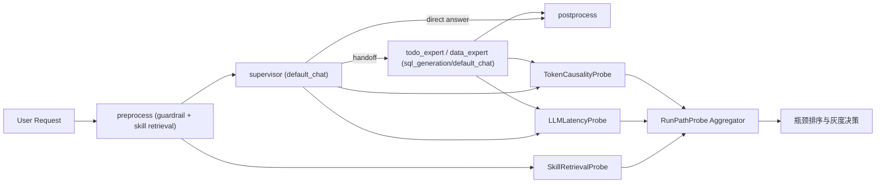

# AI响应慢改动后重分析设计说明（2026-03-04）

## 1. 需求澄清结论
- 目标:
  - 基于**代码已变更后的当前状态**，重排“响应慢”的主因优先级，避免继续沿用已失效结论。
  - 明确解释“为什么 token 消耗会变大”以及它在当前版本中是否仍是首因。
  - 产出可供外部 AI 复审的设计稿与证据框架。
- 范围:
  - `app/ai/workflow/multi_agent_graph.py`
  - `app/ai/workflow/todo_graph.py`
  - `app/services/skill_service.py`
  - `app/ai/utils/embedding_util.py`
  - 模型路由配置（`t_system_config` + `t_llm_model`）
  - 运行日志（`logs/assistant.log`）
- 边界:
  - 本文档只做重分析与设计，不做实现改动。
  - 不假设“旧瓶颈仍成立”，必须以改动后代码与最近样本为准。
  - 不在无因果证据前直接下调 `MESSAGE_MAX_TOKENS` 或全量换模型。
- 成功标准:
  - 给出改动后主因排序（含证据强弱标注）。
  - 给出 1/3/7 天可执行治理路径（含阈值与回滚条件）。
  - 给出外部评审提示词，确保另一模型可直接复核。

## 2. 最终方案
- 方案描述:
  - 采用“**改动后因果重建**”方案：先确认旧链路是否仍存在，再按当前运行样本重排瓶颈。
  - 结论从“token/ planner fallback 主导”调整为“**模型时延 + 每请求模型调用次数**主导，token 在当前样本中降级为条件性因素”。
- 关键决策:
  - 决策一：将 `planner` 从主链路剥离视为已生效事实，不再把 planner fallback 当成当前主瓶颈。
    - 证据：工作流边已变为 `preprocess -> supervisor`，`planner` 节点不再注册到图中。
  - 决策二：把“token 高”拆成两个命题分别验证：
    - 命题 A：token 可能高（配置和机制允许）；
    - 命题 B：token 导致当前慢（需要实证）。
    - 在改动后最新样本中，B 尚不成立为首因。
  - 决策三：把“每次请求的模型调用跳数”作为一级指标（1 跳 vs 2 跳）。
    - 观察到 1 跳请求约 6~7s，2 跳请求约 12~18s。
  - 决策四：将 `SkillService.search_skills_debug` 的 embedding 调用纳入硬观测，优先判断“每轮必调但无命中”的浪费占比。
  - 决策五：模型路由先灰度，不全量替换。
    - 当前 `default_chat/sql_generation` 均路由到 `gpt-5.2`，需做 TTFT 与总时延对照后再决策。

## 3. 决策权衡
- 放弃路径:
  - 继续以“planner fallback 频繁”作为当前第一主因。
  - 仅因 `MESSAGE_MAX_TOKENS=80000` 就直接全量降到低值。
  - 在没有新基线的情况下直接全量切到 `qwen3.5-flash`。
- 放弃原因:
  - `planner` 已退出主链，旧结论在新版本上已部分失效。
  - 改动后样本显示上下文 token 很低时仍存在秒级等待，说明“只降 token”收益可能有限。
  - 模型切换涉及质量风险，必须先灰度对比 TTFT、完成率与回退率。

## 4. 设计概要
- 架构:
  - 当前主链路（改动后）：
    - `preprocess(含技能检索)` -> `supervisor` -> `expert(todo/data)` -> `evaluate` -> `postprocess`
  - 分析重点从“多阶段串行（含 planner）”转为“**单/双跳模型调用成本** + **前置检索固定成本**”。
- 组件:
  - `RunPathProbe`：记录每次请求命中的节点与调用跳数（supervisor-only / supervisor+todo / supervisor+data）。
  - `LLMLatencyProbe`：记录每个 LLM 调用的 `ttft_ms`、`duration_ms`、`model_code`、`scene_key`。
  - `SkillRetrievalProbe`：记录 `embedding_duration_ms`、`cache_hit`、`selected_count`、`selected_skill_ids`。
  - `TokenCausalityProbe`：记录 `prepared_tokens`、`pruned_tokens`、`token_budget`，并和 `duration_ms`做分层对照。
- 数据流:



- 异常与测试考虑:
  - 异常场景:
    - 埋点数据有样本偏差（短对话过多、长对话不足）。
    - 请求存在并发重叠，导致 start/end 粗配对误差。
    - 模型切换后质量回退（意图识别、工具调用格式）。
  - 验证与阈值:
    - 时延阈值：
      - `supervisor-only`：P90 < 8s
      - `supervisor+expert`：P90 < 15s
    - 检索阈值：
      - `embedding P90 < 300ms`
      - `selected_count=0` 占比若 >60%，需引入短路或缓存策略
    - token 因果阈值：
      - 若高 token 档位 P90 时延未达到低 token 档位 2 倍，则 token 降级为次因
  - 回滚条件:
    - 任一优化导致错误率上升 >10% 或用户负反馈上升 >5%，立即回滚。

### 4.1 改动后证据快照（本次重分析）

| 证据项 | 改动后观察 | 结论 |
|---|---|---|
| 工作流链路 | `preprocess -> supervisor`，`planner` 节点已不在主图 | 旧“planner 串行开销”已降级 |
| 模型路由 | `default_chat=33`，`sql_generation=33`，模型 `GPT-5.2` | 主链仍使用同一高阶模型 |
| 运行样本（10:25 之后） | 4 个完成请求中，1 跳约 6~7s，2 跳约 12~18s | 时延与调用跳数强相关 |
| 同批次 token | 命中节点 token 约 `40~793`，预算 `68000` | 当前样本中“低 token 仍慢” |
| planner fallback 观测 | 10:25 后 `planner_*fallback*` 与 `weak_structure_recovered` 均为 0 | planner 路径对当前慢影响可忽略 |
| skill 检索触发 | 10:25 后 6 次请求有 6 条检索日志，`selected_count` 为 `[1,0,0,0,1,0]` | 存在“必调但常未命中”开销 |

### 4.2 为什么 token 消耗会大（机制解释）
- 原因机制:
  - `MESSAGE_MAX_TOKENS=80000` 且 supervisor 预算按 `0.85` 计算，单轮预算上限为 `68000`。
  - `trim_messages` 只在超过预算时裁剪；短会话通常不触发，长会话会持续累积历史。
  - `ToolMessage` 虽做了字符级压缩，但仍会把压缩后内容进入上下文；多轮工具调用仍可推高 token。
  - `todo analyze_intent` 仍是单独内部 LLM 调用，且含较长系统提示词与最近消息窗口。
  - `preprocess` 每轮技能检索触发 embedding，虽不直接计入 chat token，但会增加额外 API 成本与等待。
- 当前判定:
  - “token 会变大”是成立的（机制上必然可能）。
  - “token 是当前慢的首因”在最新短会话样本中证据不足，需分场景验证（短/中/长会话）。

### 4.3 1 天 / 3 天 / 7 天执行计划（改动后版本）

#### 1 天（P0：补齐因果最小闭环）
- 增加 `LLMLatencyProbe`：至少记录 `scene_key/model_code/ttft_ms/duration_ms`。
- 增加 `SkillRetrievalProbe`：记录 `embedding_duration_ms` 与 `cache_hit`。
- 产出 `token_tier vs latency` 首版对照报表（至少 100 样本）。
- 完成 `gpt-5.2` 与 `qwen3.5-flash` 小样本 TTFT 对比（同 prompt、同环境）。

#### 3 天（P1：按证据打靶）
- 若 TTFT 为主因：灰度 20% 将 `default_chat` 切到 `qwen3.5-flash`。
- 若 embedding 为主因：引入 query-hash 缓存（TTL 1h），目标命中率 >70%。
- 若 token 因果成立：再灰度下调上下文预算（优先调比例，不先硬砍到极低值）。
- 若 `selected_count=0` 长期偏高：在 `preprocess` 增加检索短路门控（低意图置信下跳过检索）。

#### 7 天（P2：结构性收敛）
- 清理主链死代码（planner 相关未被 runtime 调用的旧逻辑）并补文档。
- 建立分层看板：按请求跳数（1 跳/2 跳）、会话长度、模型、场景分层看 P50/P90/P99。
- 固化发布守卫：模型切换、预算调整、检索策略变更都走灰度与自动回滚门禁。

## 5. 未决问题（如有）
- [ ] `chat_service` 目前缺少 run 级 `ttft_ms` 标准字段，是否统一在 SSE 首 token 打点。
- [ ] `SkillService` 是否需要“语义短路”以避免明显非技能场景仍触发 embedding。
- [ ] `todo_graph.analyze_intent` 与 `_merge_description` 的内部调用是否可做模型分级（轻量/高质量）与缓存。
- [ ] planner 相关函数已不在主链，是否进入下一轮技术债清理范围。

## 6. 审批记录
- design_approved: false
- approved_at: 待确认
- approved_round: reanalysis_v1_pending_review

## 7. 外部 AI 评审提示词
```text
你是架构评审专家。请严格审阅这份“AI响应慢改动后重分析设计说明”，重点检查：

1) 因果关系是否成立（尤其是“token高”与“慢”的区分是否充分）；
2) 证据是否和“改动后代码状态”一致（特别关注 planner 已退出主链这一事实）；
3) 主因排序是否合理（模型时延/调用跳数/embedding 固定成本）；
4) 指标与阈值是否可执行、可回滚；
5) 是否存在遗漏的高风险反例（并发排队、数据库慢查询、SSE回压等）。

输出格式要求：
- A. 总体判断（同意/部分同意/不同意 + 置信度）
- B. Top 5 问题（每条含：漏洞描述、影响、严重级别、补证方案）
- C. 若结论错误，最可能错在哪里（反证）
- D. 修订后的 1天/3天/7天计划（含量化阈值与回滚条件）
- E. 明确两件“现在不能做”的事

要求：不要复述原文；必须给出可操作、可验证、可回滚的修订建议。
```
