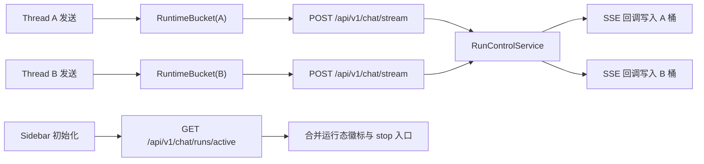

# 聊天多会话并发（方案 B v2）重分析设计说明

## 1. 需求澄清结论
- 目标:
  - 在同一页面支持同一用户并行运行多个会话（不同 `thread_id` 的 run 可同时执行）。
  - 保持“强停止（取消服务端 run）”语义，且停止动作仅影响目标会话。
  - 页面刷新后可恢复“哪些会话正在运行”的可见状态，而不是误判为空闲。
- 范围:
  - 前端流状态由“全局单实例”升级为“会话级运行态注册表（按 `thread_id` 分桶）”。
  - 后端新增“当前用户活跃 run 列表”查询接口，支撑前端冷启动恢复。
  - 补齐并发上限门禁、停止隔离校验、验收测试矩阵。
- 边界:
  - 本轮不做事件回放（不恢复离线期间每个 token）。
  - 本轮不做多窗格同屏，仅做“单视图 + 多会话后台并发”。
  - 不改 LangGraph 业务节点编排策略，仅改运行态与交互契约层。
- 成功标准:
  - 会话 A 正在流式时切到会话 B 发问，A/B 可并行完成并持久化。
  - 在会话 B 点击停止，仅 B 进入 `stopping/stopped`，A 不受影响。
  - 刷新页面后，侧边栏可恢复运行中会话标记；可继续对目标 run 执行停止。

## 2. 变更后现状复盘（基于最新代码）
### 2.1 已具备能力（可复用）
- 强停止链路已打通：前端 `cancel_mode: "hard"`，后端 `/chat/runs/{run_id}/cancel` 调用 `run_control_service.cancel_run`。
- run 生命周期较完整：`running -> stopping -> stopped/completed/failed` 已有模型与服务实现。
- 流式中断后的收口稳定性已增强：取消后会进入 drain，并在 done 事件中回传 stopped 状态元数据。

### 2.2 当前阻塞点（仍需改造）
- 前端仍是单会话状态模型：`useSSEStream` 里 `isLoading/stopRef/activeRunIdRef/currentStatus/messages` 仍是全局单份。
- UI 仍由全局 `isLoading` 控制发送与停止按钮，任一会话流式会阻断其他会话的发送。
- 后端仍缺“按用户列出 active runs”的查询 API，刷新后无法恢复多会话运行态。

## 3. 最终方案（B v2）
### 3.1 架构与职责

### 3.2 前端改造（会话级运行态注册表）
- 在 `StreamContext` 暴露“按会话操作”的 API，而不是全局单例：
  - `submit(threadId, payload)`
  - `stop(threadId)`
  - `resume(threadId, decision)`
  - `getRuntime(threadId)`（返回该会话的 `isLoading/currentStatus/messages/interrupt/activeRunId`）
- `useSSEStream` 内部把单实例 refs/state 改为 `Map<threadId, RuntimeBucket>`。
- `ChatInput` 的停止按钮绑定当前会话：`onStop => stop(currentThreadId)`，禁止误停其他会话。
- 发送门禁从“全局 isLoading”改为“当前 thread 正在运行时禁止重复提交”，允许跨会话并发。

### 3.3 后端改造（查询面补齐）
- 新增接口：`GET /api/v1/chat/runs/active`
  - 语义：返回当前用户 `running/stopping` 的 run 列表。
  - 字段：`run_id/thread_id/status/cancel_reason/cancel_mode/created_at/updated_at/cancel_requested_at`。
- `RunControlService` 新增 `list_active_runs_by_user(user_id, db)`：
  - 优先读内存快照；
  - 无内存或不全时回退 DB；
  - 返回时统一去重并按 `updated_at` 倒序。

### 3.4 停止隔离与安全校验
- 前端停止时携带目标 `run_id`（必要）与 `thread_id`（建议）上下文。
- 后端 cancel 前校验：
  - `run_id` 所属 `user_id` 必须匹配当前用户（现状已做）。
  - 若传入 `thread_id`，需与 run 真实 `thread_id` 一致，否则拒绝。
- 取消失败降级策略：重试 1 次 + 明确 toast（现有逻辑可直接沿用）。

### 3.5 并发上限与资源门禁
- 默认并发上限：`MAX_PARALLEL_STREAMS = 3`。
- 门禁策略：
  - 前端提交前先读活跃会话数，超限则阻断并提示。
  - 后端在 `create_run` 前做兜底判定，防止绕过前端。

## 4. 决策权衡（放弃路径）
- 放弃“仅保留单会话 + 切换时抢占”的原因：无法满足“同时进行多个对话”的核心目标。
- 放弃“事件回放工作台（重放 token）”的原因：改造面过大（事件存储、游标、回放协议），不符合当前增量改造节奏。
- 保留后续演进口：B v2 先确保并发与停止隔离，后续若需要 token 回放再升级事件层能力。

## 5. 量化目标（D）
- 功能目标:
  - 同用户并发会话数：至少 2，会话隔离正确率 100%。
  - 停止命中准确率：100%（仅目标会话变化状态）。
- 性能目标:
  - `GET /chat/runs/active` P95 < 120ms（本地环境除外）。
  - 刷新后运行态恢复展示 < 1s（首屏加载完成后）。
- 稳定性目标:
  - 停止失败降级可观测率 100%（有日志 + toast）。
  - 并发超限拒绝行为可复现且文案明确。

## 6. 失败与回滚口径（E）
- 回滚触发条件:
  - 发现跨会话误停、消息串写、刷新后运行态错乱。
  - 并发场景下出现系统性卡死或明显性能退化。
- 回滚策略:
  - 前端回滚到全局单流状态模型（保留强停止链路不动）。
  - 后端保留 `/runs/{run_id}/cancel`，仅下线 `/runs/active` 消费逻辑。
  - 保留数据库 `t_chat_run` 结构，不做破坏性回迁。
- 回滚验证:
  - 单会话问答与强停止能力必须可用；
  - 既有 interrupt/resume 链路无回归。

## 7. 测试与验收矩阵
| 验收ID | 场景 | 断言 | 建议资产 |
|---|---|---|---|
| MSC-RA-001 | A/B 会话并发提交 | 双会话均完成且消息不串写 | `web/e2e` 新增并发用例 |
| MSC-RA-002 | 仅停止 B | B 停止，A 持续输出 | `web/e2e` 停止隔离用例 |
| MSC-RA-003 | 刷新页面 | 运行态徽标可恢复 | API + E2E 组合 |
| MSC-RA-004 | 同线程重复提交 | 被阻断并提示 | 前端单测（store/hook） |
| MSC-RA-005 | 超过并发上限 | 第 N+1 会话提交被拒绝 | 前后端门禁测试 |

## 8. Team 判定快照
- module_count: 2（前端聊天运行态、后端 run 控制与 API）
- boundary_count: 2（前端 + 后端）
- uncertainty_count: 1（主要是并发上限阈值）
- estimated_file_count: 6（本轮澄清产物 + 关键契约改造点）
- 判定结果: 命中 1 条，保持单代理澄清即可。

## 9. 未决问题
- [ ] 并发上限默认值最终是否固定为 `3`（或允许配置化）。
- [ ] 是否在侧边栏显示“最近 token 时间”用于诊断长时间无响应。
- [ ] `stop(threadId)` 从非当前会话触发时，是否需要二次确认弹窗。

## 10. 审批记录
- design_approved: false
- approved_at:
- approved_round: v2-reanalysis
