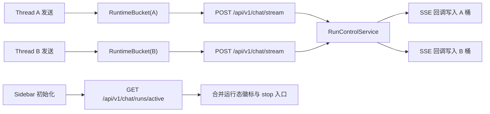

# 聊天多会话并发（方案 B v2）重分析设计说明

## 0. 文档状态
- 本稿为 `2026-03-04` 的历史重分析记录。
- 当前冻结真理源已收敛到 `docs/plans/2026-03-06-chat-multi-session-concurrency-design.md`。
- 若与当前实现冲突，以 `2026-03-06` 冻结稿、API 文档与验证报告为准。

## 1. 需求澄清结论
- 目标:
  - 在同一页面支持同一用户并行运行多个会话（不同 `thread_id` 的 run 可同时执行）。
  - 保持“强停止（取消服务端 run）”语义，且停止动作仅影响目标会话。
  - 页面刷新后可恢复“哪些会话正在运行”的可见状态，而不是误判为空闲。
- 范围:
  - 前端流状态由“全局单实例”升级为“会话级运行态注册表（按 `thread_id` 分桶）”。
  - 后端新增“当前用户活跃 run 列表”查询接口，支撑前端冷启动恢复。
  - 补齐并发上限门禁、停止隔离校验、验收测试矩阵。
- 边界:
  - 本轮不做事件回放（不恢复离线期间每个 token）。
  - 本轮不做多窗格同屏，仅做“单视图 + 多会话后台并发”。
  - 不改 LangGraph 业务节点编排策略，仅改运行态与交互契约层。
- 成功标准:
  - 会话 A 正在流式时切到会话 B 发问，A/B 可并行完成并持久化。
  - 在会话 B 点击停止，仅 B 进入 `stopping/stopped`，A 不受影响。
  - 刷新页面后，侧边栏可恢复运行中会话标记；可继续对目标 run 执行停止。

## 2. 变更后现状复盘（基于最新代码）
### 2.1 已具备能力（可复用）
- 强停止链路已打通：前端 `cancel_mode: "hard"`，后端 `/chat/runs/{run_id}/cancel` 调用 `run_control_service.cancel_run`。
- run 生命周期较完整：`running -> stopping -> stopped/completed/failed` 已有模型与服务实现。
- 流式中断后的收口稳定性已增强：取消后会进入 drain，并在 done 事件中回传 stopped 状态元数据。

### 2.2 当前阻塞点（仍需改造）
- 前端仍是单会话状态模型：`useSSEStream` 里 `isLoading/stopRef/activeRunIdRef/currentStatus/messages` 仍是全局单份。
- UI 仍由全局 `isLoading` 控制发送与停止按钮，任一会话流式会阻断其他会话的发送。
- 后端仍缺“按用户列出 active runs”的查询 API，刷新后无法恢复多会话运行态。

### 2.3 详细设计冻结清单（DoD）
- 模块边界与职责：前端会话运行态、后端 run 生命周期、`/chat/runs/active` 查询面分层定义。
- 端到端数据流：`submit -> stream -> run_control -> sidebar active badge -> stop` 全链路见 3.1、3.2、3.3、3.4。
- 状态机与生命周期：`running -> stopping -> stopped/completed/failed`，并包含同线程冲突与并发上限门禁。
- 输入契约（字段级）：`/chat/runs/{run_id}/cancel` 的 `run_id/thread_id/reason/cancel_mode` 约束见 3.4.1。
- 输出契约（字段级）：`/chat/runs/active` 返回字段与排序语义见 3.3.1、3.3.2。
- 异常语义与降级策略：`400/403/404/409/429/503` 口径与前端提示见 3.3.3、3.4、3.5。
- NFR 数字阈值：功能、性能、稳定性、恢复目标见 5。
- 可观测性字段：`run_state_mismatch/cancel_stop_settle_lag/active_count` 指标与日志见 3.3.3、3.5.4。
- 验证命令草案：最小验收命令见 7.1。
- 回退锚点（默认开关 `true`）：`ENABLE_CHAT_MULTI_SESSION_CONCURRENCY` 等开关见 6。
- 风险与反例（>=3）：并发竞争、内存泄漏、多 worker 一致性、跨会话误停、长时间无响应见 6.5。

## 3. 最终方案（B v2）
### 3.1 架构与职责


### 3.2 前端改造（会话级运行态注册表）

#### 3.2.1 API 契约变更
在 `StreamContext` 暴露”按会话操作”的 API，而不是全局单例：
- `submit(threadId, payload)`
- `stop(threadId)`
- `resume(threadId, decision)`
- `getRuntime(threadId)`（返回该会话的 `isLoading/currentStatus/messages/interrupt/activeRunId/lastTokenAt`）

#### 3.2.2 RuntimeBucket 结构设计
```typescript
interface RuntimeBucket {
  isLoading: boolean;
  currentStatus: RunStatus | null;
  messages: Message[];
  interrupt: InterruptState | null;
  activeRunId: string | null;
  lastTokenAt: number | null;  // 最后一次收到 token 的时间戳（用于诊断卡死）
}
```

#### 3.2.3 生命周期管理策略
- `useSSEStream` 内部把单实例 refs/state 改为 `Map<threadId, RuntimeBucket>`。
- **清理时机**：
  - 会话完成/失败/停止后，保留 bucket 30 秒（允许用户查看最终状态）。
  - 30 秒后自动清理，释放内存。
  - 内存上限：最多保留 10 个 bucket（超出时清理最旧的非运行态 bucket）。
- **切换会话时的流式处理**：
  - 非当前会话的流式输出静默写入对应 bucket 的 `messages`。
  - 侧边栏显示运行态徽标（绿点 + 最后 token 时间）。
  - 不弹出通知，避免干扰当前会话。
- **messages 同步策略**：
  - `getRuntime(threadId)` 返回的 `messages` 仅为内存态（流式输出缓冲）。
  - 切换会话时，从 DB 加载历史消息并与内存态合并。
  - 去重规则：优先 `message_id`；若缺失则使用 `client_message_id`；仍缺失时退化为 `(role + content_hash + created_at_bucket)` 组合键。

#### 3.2.4 UI 绑定与门禁
- `ChatInput` 的停止按钮绑定当前会话：`onStop => stop(currentThreadId)`，禁止误停其他会话。
- 发送门禁从”全局 isLoading”改为”当前 thread 正在运行时禁止重复提交”，允许跨会话并发。
- 侧边栏会话项显示：
  - 运行中：绿点 + “运行中”徽标 + 最后 token 时间（如”2 秒前”）。
  - 超过 30 秒无 token：仅在 `processing/llm_generating` 且非 `tool_running/interrupt` 阶段显示黄点 + “可能卡死”提示 + 停止按钮，避免误报。

### 3.3 后端改造（查询面补齐）

#### 3.3.1 新增接口
`GET /api/v1/chat/runs/active`
- **语义**：返回当前用户 `running/stopping` 的 run 列表。
- **字段**：`run_id/thread_id/status/cancel_reason/cancel_mode/created_at/updated_at/cancel_requested_at`。
- **权限**：仅返回当前用户的 run（通过 JWT token 获取 `user_id`）。

#### 3.3.2 RunControlService 改造
新增 `list_active_runs_by_user(user_id, db, limit=20)`：

**数据源分层（强一致优先）**：
- DB（`t_chat_run`）是活跃列表唯一真理源，`/runs/active` 每次请求都直接查询 DB，避免多进程内存态不一致导致漏数。
- `RunControlService` 现有内存态（`_runs`、`_active_run_by_thread`）仅用于单进程流式判停与线程内状态追踪，不作为跨会话列表主数据源。

**查询逻辑（字段级）**：
1. 执行 `WHERE user_id = ? AND status IN ('running', 'stopping') ORDER BY updated_at DESC LIMIT ?`。
2. 返回字段固定为 `run_id/thread_id/status/cancel_reason/cancel_mode/created_at/updated_at/cancel_requested_at`，并统一序列化时间格式。
3. 若同一 `run_id` 在内存态与 DB 状态不一致，以 DB 为准，同时记录 `run_state_mismatch` 告警日志。

**索引与性能保障**：
- 新增索引：`idx_chat_run_user_status_updated (user_id, status, updated_at)`。
- `GET /chat/runs/active` 的 P95 目标按该索引评估，不依赖进程内缓存命中率。

#### 3.3.3 异常语义与降级策略
- DB 查询失败返回 `503 Service Unavailable`，错误码 `active_runs_unavailable`，前端展示“运行态暂不可用，请稍后重试”。
- 不使用“内存快照兜底响应”作为降级路径，避免跨 worker 场景返回不完整列表。
- 日志字段必须包含：`user_id/trace_id/db_error/retry_count`。

### 3.4 停止隔离与安全校验

#### 3.4.1 前端停止请求契约（强制）
- 前端停止时**必须**携带 `run_id`，新客户端必须携带 `thread_id`。
- 请求契约：路径参数 `run_id` + 请求体 `{
  thread_id?: string,
  reason?: string,
  cancel_mode?: "hard" | "soft"
}`。
- 字段语义：
  - `thread_id`：新客户端 required，兼容模式下 optional。
  - `reason`：optional，默认 `user_cancelled`。
  - `cancel_mode`：optional，默认 `hard`。

#### 3.4.2 后端校验逻辑（按当前冻结稿收敛）
`POST /api/v1/chat/runs/{run_id}/cancel` 执行前必须通过以下校验：

1. **用户权限校验**（第一道防线）：
   - 查询 `t_chat_run` 表，验证 `run.user_id == current_user.id`。
   - 不匹配则返回 `403 Forbidden`。

2. **会话归属校验**（第二道防线）：
   - 请求体中的 `thread_id` 为 required。
   - 验证 `run.thread_id == request.thread_id`。
   - 缺失返回 `400 thread_id_required`；不匹配返回 `400 thread_id_mismatch`。

3. **状态校验**：
   - 当前实现固定走 `cancel_mode=hard`。
   - `running`：直接收口为 `stopped`，返回 `accepted=true, idempotent=false`。
   - `stopping/stopped/completed/failed`：保持幂等返回（`accepted=true, idempotent=true`），不返回 `409`。

#### 3.4.3 取消失败降级策略
- 取消请求失败时前端 toast 提示："停止失败，任务可能仍在后台执行"。
- 成功响应后前端立即退出当前线程本地运行态；若服务端仍返回 `stopping`，侧边栏也不得继续显示 spinner。
- 后端记录错误日志（包含 `run_id/thread_id/user_id/error`）。

#### 3.4.4 迁移口径（已冻结）
- `thread_id` 缺失兼容语义已废弃，不再作为当前设计目标。
- stop 的当前真理源语义为：`hard cancel -> stopped -> active list 移除 -> 并发槽可复用`。
- `thread_id_required` 已冻结为当前必填契约，不再保留旧客户端兼容观测项。

### 3.5 并发上限与资源门禁

#### 3.5.1 并发上限配置
- 默认并发上限：`MAX_PARALLEL_STREAMS = 3`（可通过环境变量 `MAX_PARALLEL_STREAMS_PER_USER` 配置）。
- 配置范围：1-10（超出范围启动时报错）。

#### 3.5.2 后端原子门禁（强制，第一道防线）
在 `RunControlService.create_run` 前执行“同用户互斥 + 活跃计数”的原子校验（与当前同步 `Session` 形态一致）：

```python
def create_run(self, user_id: int, thread_id: str, db: Session) -> ChatRun:
    # 1) 获取用户级互斥锁（按数据库方言实现）
    # 2) 在同一事务内查询该用户 active runs（必要时 FOR UPDATE）
    # 3) 若同 thread_id 已有 active run -> 抛 409（禁止同线程重复提交）
    # 4) active_count >= MAX_PARALLEL_STREAMS -> 抛 429
    # 5) 创建 run 并提交
    # 6) 释放用户级互斥锁
    pass
```

**关键点**：
- 必须在“同用户串行化”前提下做计数与创建，避免 TOCTOU 竞争。
- 用户级锁按数据库方言实现：PostgreSQL 可用 `pg_advisory_xact_lock`，MySQL 可用 `GET_LOCK`；实现时按实际 `DATABASE_URL` 选择。
- 同线程重复提交返回 `409 Conflict`（错误码 `active_run_exists`），并返回当前活跃 `run_id` 供前端定位。
- 达到用户并发上限返回 `429 Too Many Requests` + 明确错误信息。
- 移除“同线程旧 run 自动 cleanup_orphan 后新建 run”的隐式替换语义，防止误杀正在运行任务。

#### 3.5.3 前端 UX 优化（第二道防线）
- 提交前调用 `GET /chat/runs/active` 查询活跃数。
- 超限时禁用发送按钮 + toast 提示："当前有 3 个会话正在运行，请等待完成或停止其中一个"。
- 命中 `409 active_run_exists` 时提示："当前会话仍在运行，请先停止或等待完成"。
- **注意**：前端门禁仅作为 UX 优化，不作为安全边界（可被绕过）。

#### 3.5.4 监控与降级
- 后端记录并发拒绝事件（`user_id/active_count/timestamp`）。
- 后端记录同线程冲突事件（`user_id/thread_id/run_id/timestamp`）。
- 若发现频繁触发上限，考虑调整默认值或引入用户级配额。

## 4. 决策权衡（放弃路径）
- 放弃“仅保留单会话 + 切换时抢占”的原因：无法满足“同时进行多个对话”的核心目标。
- 放弃“事件回放工作台（重放 token）”的原因：改造面过大（事件存储、游标、回放协议），不符合当前增量改造节奏。
- 保留后续演进口：B v2 先确保并发与停止隔离，后续若需要 token 回放再升级事件层能力。

## 5. 量化目标（D）
- 功能目标:
  - 同用户并发会话数：至少 2，会话隔离正确率 100%。
  - 停止命中准确率：100%（仅目标会话变化状态）。
  - 同线程重复提交阻断命中率：100%（返回 `409 active_run_exists`）。
- 性能目标:
  - `GET /chat/runs/active` P95 < 120ms，P99 < 200ms（本地环境除外）。
  - `POST /chat/runs/{run_id}/cancel` P95 < 150ms。
  - 刷新后运行态恢复展示 < 1s（首屏加载完成后）。
- 稳定性目标:
  - `GET /chat/runs/active` 可用性 >= 99.9%。
  - 停止失败率 < 0.5%。
  - 停止失败降级可观测率 100%（有日志 + toast）。
  - 并发超限拒绝行为可复现且文案明确。
  - 多 worker 场景活跃会话漏报率 = 0（压测样本 >= 10,000 次查询）。
- 恢复目标:
  - `run_state_mismatch` 告警 MTTR < 10 分钟。
  - 功能开关回退生效时间 < 5 分钟。

## 6. 失败与回滚口径（E）
- 回退锚点（默认开启）:
  - `ENABLE_CHAT_MULTI_SESSION_CONCURRENCY=true`（前端会话级并发运行态）。
  - `ENABLE_ACTIVE_RUNS_QUERY=true`（消费 `/chat/runs/active`）。
  - `ENABLE_PER_USER_PARALLEL_GATE=true`（后端并发上限与同线程冲突门禁）。
  - `ENABLE_THREAD_ID_MATCH_CHECK=true`（取消接口 thread 归属校验）。
- 回滚触发条件:
  - 发现跨会话误停、消息串写、刷新后运行态错乱。
  - `GET /chat/runs/active` 连续 5 分钟 P95 超过 300ms 或错误率超过 2%。
  - 并发场景下出现系统性卡死或明显性能退化。
- 回滚策略:
  - 关闭 `ENABLE_CHAT_MULTI_SESSION_CONCURRENCY`：前端退回单会话发送门禁。
  - 关闭 `ENABLE_ACTIVE_RUNS_QUERY`：前端不展示运行中徽标与跨会话停止入口。
  - 关闭 `ENABLE_PER_USER_PARALLEL_GATE`：回退到现有 run 创建策略（保留强停止链路）。
  - 关闭 `ENABLE_THREAD_ID_MATCH_CHECK`：仅保留用户权限校验（紧急兼容）。
  - 保留数据库 `t_chat_run` 结构，不做破坏性回迁。
- 回滚验证:
  - 单会话问答与强停止能力必须可用；
  - 既有 interrupt/resume 链路无回归；
  - `/chat/stream` 在单会话场景下稳定运行 30 分钟无异常告警。

## 6.5 关键风险与缓解措施

### 6.5.1 并发竞争风险
**风险**：两个请求同时通过并发上限检查，导致实际并发超限。
**缓解**：
- 后端使用“用户级互斥锁 + 同事务计数与创建”保证原子性。
- 监控实际并发数，若发现超限则告警并调查。

### 6.5.2 内存泄漏风险
**风险**：`Map<threadId, RuntimeBucket>` 无限增长导致内存溢出。
**缓解**：
- 完成/失败/停止后 30 秒自动清理 bucket。
- 最多保留 10 个 bucket（LRU 策略清理非运行态）。
- 监控前端内存占用，设置告警阈值。

### 6.5.3 状态不一致风险
**风险**：多 worker 环境下进程内状态不同步导致活跃会话漏报。
**缓解**：
- `/chat/runs/active` 固定以 DB 查询结果为准，不以内存兜底响应。
- 建立 `run_state_mismatch` 告警并关联 `trace_id`。
- 针对多 worker 拓扑执行一致性回归测试（MSC-RA-011）。

### 6.5.4 跨会话误停风险
**风险**：用户在会话 A 点击停止，误停了会话 B。
**缓解**：
- 前端停止按钮严格绑定 `currentThreadId`。
- 后端强制校验 `thread_id` 匹配。
- E2E 测试覆盖跨会话停止隔离场景（MSC-RA-009）。

### 6.5.5 长时间无响应风险
**风险**：会话卡死但前端无法感知，用户不知道是否需要停止。
**缓解**：
- 侧边栏显示"最后 token 时间"。
- 超过 30 秒无 token 显示黄色警告 + "可能卡死"提示。
- 提供明确的停止按钮入口。

## 7. 测试与验收矩阵
| 验收ID | 场景 | 断言 | 建议资产 |
|---|---|---|---|
| MSC-RA-001 | A/B 会话并发提交 | 双会话均完成且消息不串写 | `web/e2e` 新增并发用例 |
| MSC-RA-002 | 仅停止 B | B 停止，A 持续输出 | `web/e2e` 停止隔离用例 |
| MSC-RA-003 | 刷新页面 | 运行态徽标可恢复 | API + E2E 组合 |
| MSC-RA-004 | 同线程重复提交 | 返回 `409 active_run_exists`，前端提示阻断 | 前后端联调测试 |
| MSC-RA-005 | 超过并发上限 | 第 N+1 会话提交被拒绝 | 前后端门禁测试 |
| MSC-RA-006 | 会话切换时消息完整性 | A 流式中切到 B 再切回 A，A 的消息完整无丢失 | `web/e2e` 切换用例 |
| MSC-RA-007 | 停止后立即重新提交 | 停止会话 A 后立即在 A 重新提交，正常启动新 run | `web/e2e` 状态转换用例 |
| MSC-RA-008 | 刷新时会话完成 | 刷新页面时恰好有会话完成，运行态正确清理 | API + E2E 时序用例 |
| MSC-RA-009 | 跨会话停止隔离 | 尝试用会话 A 的 thread_id 停止会话 B 的 run_id | 后端单测（安全校验） |
| MSC-RA-010 | 并发竞争门禁 | 两个标签页同时提交第 3 和第 4 个会话 | 后端集成测试（行锁） |
| MSC-RA-011 | 多 worker 活跃列表一致性 | 任意 worker 返回的 active 列表一致且不漏 run | 后端集成测试（多进程） |
| MSC-RA-012 | hard cancel 收口 | cancel 成功后直接 `stopped`，不会长驻 `stopping` | API + 真实链路回归 |

### 7.1 最小验收命令草案
- 后端单测：`pytest tests/unit/test_run_control_service.py -k "active_run or parallel or conflict"`
- API 测试：`pytest tests/api/test_chat_api.py -k "cancel_run or active_runs"`
- 前端单测：`pnpm --dir web test --filter stream`
- E2E 测试：`pnpm --dir web exec playwright test web/e2e --grep "MSC-RA"`

## 8. Team 判定快照
- module_count: 3（前端聊天运行态、后端 run 控制与 API、并发门禁）
- boundary_count: 2（前端 + 后端）
- uncertainty_count: 0（关键决策已明确）
- estimated_file_count: 8（本轮澄清产物 + 关键契约改造点 + 测试用例）
- 判定结果: 命中 3 条（`module_count/boundary_count/estimated_file_count`），按规则应升级 Team 执行；本轮仍处于澄清态，进入实现前再切 Team。

## 9. 冻结决策与后续演进

### 9.1 本轮冻结决策（P0）
- ✅ 并发上限默认值：固定为 `3`，可通过环境变量 `MAX_PARALLEL_STREAMS_PER_USER` 配置（范围 1-10）。
- ✅ 侧边栏显示”最后 token 时间”：**必须实现**，用于诊断长时间无响应（超过 30 秒显示黄色警告）。
- ✅ `thread_id` 校验：新客户端强制传，后端在传入时强校验；兼容模式保留指标观测。
- ✅ 同线程重复提交：后端强制返回 `409 active_run_exists`，不再自动替换旧 run。
- ✅ 停止交互：侧边栏跨会话停止不增加二次确认弹窗，以明确绑定和后端校验保证安全边界。

### 9.2 后续演进（P2）
- [ ] 性能压测：10 个并发会话的表现（内存占用、响应延迟）。
- [ ] 监控埋点：并发会话数分布、停止失败率、并发拒绝频率。
- [ ] 事件回放：离线期间 token 回放能力（需要事件存储层改造）。

## 10. 审批记录
- design_approved: true
- approved_at: 2026-03-04 21:08
- approved_round: v2-reanalysis-freeze-fix
- approval_evidence: 用户明确指令“直接修订 docs/plans/2026-03-04-chat-multi-session-concurrency-reanalysis-design.md，补齐冻结回执与缺失项”

## 11. 变更日志
- 2026-03-04 v2-reanalysis-enhanced:
  - 补充 RuntimeBucket 结构设计与生命周期管理策略（3.2.2、3.2.3）
  - 明确内存快照机制与一致性保证（3.3.2）
  - 强化停止隔离校验为双重防护（3.4.1、3.4.2）
  - 补充后端原子门禁实现（3.5.2）
  - 新增 5 个边界测试用例（MSC-RA-006 ~ MSC-RA-010）
  - 明确未决问题的决策优先级（9.1、9.2）
- 2026-03-04 v2-reanalysis-freeze-fix:
  - 活跃 run 查询改为 DB 真理源，补齐多 worker 一致性约束（3.3.2、3.3.3）
  - 收敛同线程重复提交语义为 `409 active_run_exists`（3.5.2、3.5.3）
  - 补齐回退锚点开关与时效目标（6）
  - 补齐审批证据与机读冻结回执（10、13）

## 12. 实现检查清单

### 12.1 前端改造（web/）
- [ ] `StreamContext` 改造为会话级 API（submit/stop/resume/getRuntime）
- [ ] `useSSEStream` 改造为 `Map<threadId, RuntimeBucket>`
- [ ] RuntimeBucket 添加 `lastTokenAt` 字段
- [ ] 实现 bucket 生命周期管理（30 秒清理 + 最多 10 个）
- [ ] 切换会话时合并 DB 历史消息与内存态
- [ ] 侧边栏显示运行态徽标 + 最后 token 时间
- [ ] 超过 30 秒无 token 显示黄色警告
- [ ] 停止按钮绑定 `currentThreadId`，携带 `thread_id` 参数
- [ ] 发送前调用 `/runs/active` 检查并发上限
- [ ] 超限时禁用发送按钮 + toast 提示

### 12.2 后端改造（app/）
- [ ] 新增 `GET /api/v1/chat/runs/active` 接口
- [ ] `list_active_runs_by_user` 实现（DB 真理源查询 + 503 异常语义）
- [ ] 新增索引 `idx_chat_run_user_status_updated (user_id, status, updated_at)`
- [ ] `create_run` 前添加并发上限原子校验（用户级互斥锁 + 同事务计数）
- [ ] 同线程重复提交返回 `409 active_run_exists`
- [ ] 超限时返回 `429 Too Many Requests`
- [ ] `cancel_run` 前在“传入 `thread_id`”时强制校验匹配
- [ ] 不匹配时返回 `400 Bad Request`
- [ ] 添加环境变量 `MAX_PARALLEL_STREAMS_PER_USER`（默认 3，范围 1-10）
- [ ] 添加开关 `ENABLE_CHAT_MULTI_SESSION_CONCURRENCY`（默认 `true`）
- [ ] 添加开关 `ENABLE_ACTIVE_RUNS_QUERY`（默认 `true`）
- [ ] 添加开关 `ENABLE_PER_USER_PARALLEL_GATE`（默认 `true`）
- [ ] 添加开关 `ENABLE_THREAD_ID_MATCH_CHECK`（默认 `true`）
- [ ] 记录并发拒绝事件日志
- [ ] 记录 `run_state_mismatch` 与 `cancel_stop_settle_lag` 指标

### 12.3 测试覆盖（tests/ + web/e2e/）
- [ ] MSC-RA-001: A/B 会话并发提交
- [ ] MSC-RA-002: 仅停止 B
- [ ] MSC-RA-003: 刷新页面恢复运行态
- [ ] MSC-RA-004: 同线程重复提交
- [ ] MSC-RA-005: 超过并发上限
- [ ] MSC-RA-006: 会话切换时消息完整性
- [ ] MSC-RA-007: 停止后立即重新提交
- [ ] MSC-RA-008: 刷新时会话完成
- [ ] MSC-RA-009: 跨会话停止隔离（安全校验）
- [ ] MSC-RA-010: 并发竞争门禁（行锁）
- [ ] MSC-RA-011: 多 worker 活跃列表一致性
- [ ] MSC-RA-012: hard cancel 收口与真实链路 stop 验证

### 12.4 文档同步
- [ ] 更新 `docs/产品文档/聊天系统需求.md`（多会话并发能力）
- [ ] 更新 `docs/开发文档/架构设计/前端架构.md`（RuntimeBucket 设计）
- [ ] 更新 `docs/开发文档/架构设计/后端架构.md`（并发门禁机制）
- [ ] 更新 `docs/API文档/接口文档.md`（新增 `/runs/active` 接口）
- [ ] 更新 `docs/开发文档/快速入门/配置说明.md`（新增环境变量）

## 13. 设计冻结回执（机读）
```yaml
design_freeze_summary:
  design_actionable: true
  missing_blocks: []
  risk_level: medium
  blocked_by: []
  risk_counterexamples_count: 5
  handoff_contract_ready: true
  implementation_seed_count: 8
  card_seed_ready: true
```

## 14. 承接契约（机读）
```yaml
clarify_handoff_contract:
  version: v1
  topic: chat-multi-session-concurrency-reanalysis
  design_source: docs/plans/2026-03-04-chat-multi-session-concurrency-reanalysis-design.md
  requirement_seeds:
    - design_item: D-01
      fr_id: FR-001
      trigger: 用户在会话 A 流式期间切换到会话 B 发起提交
      input_contract:
        required_fields: [user_id, thread_id, prompt]
        optional_fields: [run_id, enable_thinking, attachments, current_todo_id]
        defaults:
          enable_thinking: false
      output_contract:
        required_fields: [run_id, thread_id, status]
        optional_fields: [last_token_at, runtime_badge]
      failure_semantics: 同线程活跃 run 存在时返回 409 active_run_exists；超并发上限返回 429
      observability_fields: [trace_id, user_id, thread_id, run_id, status_phase, last_token_at]
      rollback_anchor: ENABLE_CHAT_MULTI_SESSION_CONCURRENCY=false
      acceptance_cmd_ref: pnpm --dir web exec playwright test web/e2e --grep "MSC-RA-001|MSC-RA-006"
    - design_item: D-02
      fr_id: FR-002
      trigger: 前端冷启动或刷新后初始化运行态徽标
      input_contract:
        required_fields: [jwt_token]
        optional_fields: [limit]
        defaults:
          limit: 20
      output_contract:
        required_fields: [items]
        optional_fields: [next_cursor]
      failure_semantics: DB 查询异常返回 503 active_runs_unavailable（retriable=true）
      observability_fields: [trace_id, user_id, limit, result_count, db_latency_ms]
      rollback_anchor: ENABLE_ACTIVE_RUNS_QUERY=false
      acceptance_cmd_ref: pytest tests/api/test_chat_api.py -k "active_runs"
    - design_item: D-03
      fr_id: FR-003
      trigger: 用户点击停止按钮提交 /chat/runs/{run_id}/cancel
      input_contract:
        required_fields: [run_id]
        optional_fields: [thread_id, reason, cancel_mode]
        defaults:
          reason: user_cancelled
          cancel_mode: hard
      output_contract:
        required_fields: [accepted, run_id, thread_id, status]
        optional_fields: [idempotent, reason]
      failure_semantics: thread_id 不匹配返回 400；无权限返回 403；run 不存在返回 404
      observability_fields: [trace_id, user_id, run_id, thread_id, cancel_mode, idempotent]
      rollback_anchor: ENABLE_THREAD_ID_MATCH_CHECK=false
      acceptance_cmd_ref: pytest tests/api/test_chat_api.py -k "cancel_run"
    - design_item: D-04
      fr_id: FR-004
      trigger: 服务端 create_run 前执行用户并发门禁
      input_contract:
        required_fields: [user_id, thread_id]
        optional_fields: [requested_run_id]
        defaults: {}
      output_contract:
        required_fields: [run_id, status]
        optional_fields: [active_count, rejected_reason]
      failure_semantics: 同线程冲突返回 409 active_run_exists；超过上限返回 429
      observability_fields: [trace_id, user_id, thread_id, active_count, rejected_reason]
      rollback_anchor: ENABLE_PER_USER_PARALLEL_GATE=false
      acceptance_cmd_ref: pytest tests/unit/test_run_control_service.py -k "parallel or conflict"
  implementation_seeds:
    - task_id: T-01
      feature_id: P1-01
      phase: Phase-1
      file_paths:
        - web/src/providers/StreamContext.tsx
      symbols:
        - StreamContextValue
      change_type: modify
      depends_on_tasks: []
      acceptance_cmds:
        - pnpm --dir web test --filter stream
      pr_id: PR-01
      rollback_point: 关闭 ENABLE_CHAT_MULTI_SESSION_CONCURRENCY 并回退 StreamContext 会话级 API
    - task_id: T-02
      feature_id: P1-01
      phase: Phase-1
      file_paths:
        - web/src/hooks/useSSEStream.ts
      symbols:
        - useSSEStream
      change_type: modify
      depends_on_tasks: [T-01]
      acceptance_cmds:
        - pnpm --dir web test --filter stream
      pr_id: PR-01
      rollback_point: 关闭 ENABLE_CHAT_MULTI_SESSION_CONCURRENCY 并恢复全局单流状态
    - task_id: T-03
      feature_id: P1-02
      phase: Phase-1
      file_paths:
        - app/api/v1/endpoints/chat_api.py
      symbols:
        - list_active_runs
        - CancelRunRequest
      change_type: modify
      depends_on_tasks: [T-04]
      acceptance_cmds:
        - pytest tests/api/test_chat_api.py -k "active_runs or cancel_run"
      pr_id: PR-02
      rollback_point: 关闭 ENABLE_ACTIVE_RUNS_QUERY 与 ENABLE_THREAD_ID_MATCH_CHECK
    - task_id: T-04
      feature_id: P1-02
      phase: Phase-1
      file_paths:
        - app/services/run_control_service.py
      symbols:
        - list_active_runs_by_user
        - create_run
        - cancel_run
      change_type: modify
      depends_on_tasks: []
      acceptance_cmds:
        - pytest tests/unit/test_run_control_service.py -k "active_run or parallel or conflict"
      pr_id: PR-02
      rollback_point: 关闭 ENABLE_PER_USER_PARALLEL_GATE 并恢复旧 create_run 语义
    - task_id: T-05
      feature_id: P1-02
      phase: Phase-1
      file_paths:
        - app/models/chat_run.py
      symbols:
        - ChatRun.__table_args__
      change_type: modify
      depends_on_tasks: [T-04]
      acceptance_cmds:
        - pytest tests/api/test_chat_api.py -k "active_runs"
      pr_id: PR-02
      rollback_point: 回滚新增索引 idx_chat_run_user_status_updated
    - task_id: T-06
      feature_id: P1-03
      phase: Phase-2
      file_paths:
        - web/src/lib/backend.ts
        - web/src/hooks/useSSEStream.ts
      symbols:
        - cancelRun
        - stop
      change_type: modify
      depends_on_tasks: [T-02, T-03]
      acceptance_cmds:
        - pnpm --dir web exec playwright test web/e2e --grep "MSC-RA-002|MSC-RA-009"
      pr_id: PR-03
      rollback_point: 关闭 ENABLE_THREAD_ID_MATCH_CHECK 并降级为 run_id + user 校验
    - task_id: T-07
      feature_id: P1-04
      phase: Phase-2
      file_paths:
        - tests/unit/test_run_control_service.py
        - tests/api/test_chat_api.py
      symbols:
        - test_create_run_conflict
        - test_list_active_runs
        - test_cancel_run_thread_mismatch
      change_type: modify
      depends_on_tasks: [T-03, T-04]
      acceptance_cmds:
        - pytest tests/unit/test_run_control_service.py -k "parallel or conflict"
        - pytest tests/api/test_chat_api.py -k "active_runs or cancel_run"
      pr_id: PR-04
      rollback_point: 回滚新增测试并保留旧测试基线
    - task_id: T-08
      feature_id: P1-05
      phase: Phase-2
      file_paths:
        - web/e2e/chat-multi-session-concurrency.spec.ts
      symbols:
        - MSC-RA-001
        - MSC-RA-009
        - MSC-RA-011
      change_type: add
      depends_on_tasks: [T-02, T-03, T-04, T-06]
      acceptance_cmds:
        - pnpm --dir web exec playwright test web/e2e --grep "MSC-RA"
      pr_id: PR-05
      rollback_point: 暂停多会话并发 E2E 套件并回滚新增 spec
  execution_chain_seed:
    preferred_mode: parallel
    task_key: PP-20260304-chat-multi-session-concurrency
    card_seed:
      - card_id: WS-01
        title: 前端会话级运行态注册表
        feature_ids: [P1-01, P1-03]
        hard_depends_on: []
        file_scope:
          - web/src/providers/**
          - web/src/hooks/**
          - web/src/lib/backend.ts
        done_gate:
          - pnpm --dir web test --filter stream
          - pnpm --dir web exec playwright test web/e2e --grep "MSC-RA-001|MSC-RA-002|MSC-RA-009"
      - card_id: WS-02
        title: 后端 active 查询与并发门禁
        feature_ids: [P1-02, P1-04]
        hard_depends_on: []
        file_scope:
          - app/api/v1/endpoints/**
          - app/services/**
          - app/models/**
        done_gate:
          - pytest tests/unit/test_run_control_service.py -k "active_run or parallel or conflict"
          - pytest tests/api/test_chat_api.py -k "active_runs or cancel_run"
      - card_id: WS-03
        title: 验收矩阵与多 worker 一致性验证
        feature_ids: [P1-05]
        hard_depends_on: [WS-01, WS-02]
        file_scope:
          - tests/**
          - web/e2e/**
        done_gate:
          - pnpm --dir web exec playwright test web/e2e --grep "MSC-RA"
          - pytest tests/api/test_chat_api.py -k "active_runs"
    execution_contract_hint:
      delivery_mode: staged
      execution_unit: per_pr
      commit_policy: per_pr
      stop_boundary: per_pr
      stop_on_blocked: true
  handoff_ready: true
```
