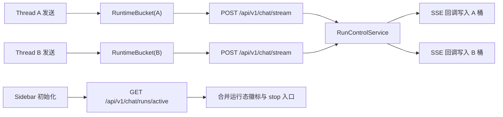

# 聊天多会话并发（方案 B v2）重分析设计说明

## 1. 需求澄清结论
- 目标:
  - 在同一页面支持同一用户并行运行多个会话（不同 `thread_id` 的 run 可同时执行）。
  - 保持“强停止（取消服务端 run）”语义，且停止动作仅影响目标会话。
  - 页面刷新后可恢复“哪些会话正在运行”的可见状态，而不是误判为空闲。
- 范围:
  - 前端流状态由“全局单实例”升级为“会话级运行态注册表（按 `thread_id` 分桶）”。
  - 后端新增“当前用户活跃 run 列表”查询接口，支撑前端冷启动恢复。
  - 补齐并发上限门禁、停止隔离校验、验收测试矩阵。
- 边界:
  - 本轮不做事件回放（不恢复离线期间每个 token）。
  - 本轮不做多窗格同屏，仅做“单视图 + 多会话后台并发”。
  - 不改 LangGraph 业务节点编排策略，仅改运行态与交互契约层。
- 成功标准:
  - 会话 A 正在流式时切到会话 B 发问，A/B 可并行完成并持久化。
  - 在会话 B 点击停止，仅 B 进入 `stopping/stopped`，A 不受影响。
  - 刷新页面后，侧边栏可恢复运行中会话标记；可继续对目标 run 执行停止。

## 2. 变更后现状复盘（基于最新代码）
### 2.1 已具备能力（可复用）
- 强停止链路已打通：前端 `cancel_mode: "hard"`，后端 `/chat/runs/{run_id}/cancel` 调用 `run_control_service.cancel_run`。
- run 生命周期较完整：`running -> stopping -> stopped/completed/failed` 已有模型与服务实现。
- 流式中断后的收口稳定性已增强：取消后会进入 drain，并在 done 事件中回传 stopped 状态元数据。

### 2.2 当前阻塞点（仍需改造）
- 前端仍是单会话状态模型：`useSSEStream` 里 `isLoading/stopRef/activeRunIdRef/currentStatus/messages` 仍是全局单份。
- UI 仍由全局 `isLoading` 控制发送与停止按钮，任一会话流式会阻断其他会话的发送。
- 后端仍缺“按用户列出 active runs”的查询 API，刷新后无法恢复多会话运行态。

## 3. 最终方案（B v2）
### 3.1 架构与职责


### 3.2 前端改造（会话级运行态注册表）

#### 3.2.1 API 契约变更
在 `StreamContext` 暴露”按会话操作”的 API，而不是全局单例：
- `submit(threadId, payload)`
- `stop(threadId)`
- `resume(threadId, decision)`
- `getRuntime(threadId)`（返回该会话的 `isLoading/currentStatus/messages/interrupt/activeRunId/lastTokenAt`）

#### 3.2.2 RuntimeBucket 结构设计
```typescript
interface RuntimeBucket {
  isLoading: boolean;
  currentStatus: RunStatus | null;
  messages: Message[];
  interrupt: InterruptState | null;
  activeRunId: string | null;
  lastTokenAt: number | null;  // 最后一次收到 token 的时间戳（用于诊断卡死）
}
```

#### 3.2.3 生命周期管理策略
- `useSSEStream` 内部把单实例 refs/state 改为 `Map<threadId, RuntimeBucket>`。
- **清理时机**：
  - 会话完成/失败/停止后，保留 bucket 30 秒（允许用户查看最终状态）。
  - 30 秒后自动清理，释放内存。
  - 内存上限：最多保留 10 个 bucket（超出时清理最旧的非运行态 bucket）。
- **切换会话时的流式处理**：
  - 非当前会话的流式输出静默写入对应 bucket 的 `messages`。
  - 侧边栏显示运行态徽标（绿点 + 最后 token 时间）。
  - 不弹出通知，避免干扰当前会话。
- **messages 同步策略**：
  - `getRuntime(threadId)` 返回的 `messages` 仅为内存态（流式输出缓冲）。
  - 切换会话时，从 DB 加载历史消息并与内存态合并。
  - 去重规则：优先 `message_id`；若缺失则使用 `client_message_id`；仍缺失时退化为 `(role + content_hash + created_at_bucket)` 组合键。

#### 3.2.4 UI 绑定与门禁
- `ChatInput` 的停止按钮绑定当前会话：`onStop => stop(currentThreadId)`，禁止误停其他会话。
- 发送门禁从”全局 isLoading”改为”当前 thread 正在运行时禁止重复提交”，允许跨会话并发。
- 侧边栏会话项显示：
  - 运行中：绿点 + “运行中”徽标 + 最后 token 时间（如”2 秒前”）。
  - 超过 30 秒无 token：仅在 `processing/llm_generating` 且非 `tool_running/interrupt` 阶段显示黄点 + “可能卡死”提示 + 停止按钮，避免误报。

### 3.3 后端改造（查询面补齐）

#### 3.3.1 新增接口
`GET /api/v1/chat/runs/active`
- **语义**：返回当前用户 `running/stopping` 的 run 列表。
- **字段**：`run_id/thread_id/status/cancel_reason/cancel_mode/created_at/updated_at/cancel_requested_at`。
- **权限**：仅返回当前用户的 run（通过 JWT token 获取 `user_id`）。

#### 3.3.2 RunControlService 改造
新增 `list_active_runs_by_user(user_id, db)`：

**内存快照机制**：
- `RunControlService` 维护 `_active_runs: Dict[Optional[int], Set[str]]`（user_id -> run_id 集合，兼容 `user_id=None` 场景）。
- 每次 `create_run` 时添加到集合，run 完成/失败/停止时移除。
- 内存快照仅存储 `run_id`，不存储完整 run 对象（避免内存膨胀）。

**查询逻辑**：
1. 从内存快照读取 `run_id` 列表。
2. 用 `run_id` 列表查询 DB 获取完整字段（单次 `WHERE run_id IN (...)`）。
3. 若内存快照为空或查询结果少于快照数量，回退到 DB 全表扫描（`WHERE user_id = ? AND status IN ('running', 'stopping')`）。
4. 返回时统一去重并按 `updated_at` 倒序。

**一致性保证**：
- 内存快照可能因进程重启丢失，但 DB 是最终真理来源。
- 查询时优先内存（性能），回退 DB（正确性）。

### 3.4 停止隔离与安全校验

#### 3.4.1 前端停止请求契约（强制）
- 前端停止时**必须**携带 `run_id`，并且**建议**携带 `thread_id`（新客户端强制传，旧客户端兼容）。
- 请求契约（兼容增强后）：路径参数 `run_id` + 请求体 `{ thread_id?: string, cancel_mode: "hard" }`。

#### 3.4.2 后端校验逻辑（双重防护）
`POST /api/v1/chat/runs/{run_id}/cancel` 执行前必须通过以下校验：

1. **用户权限校验**（第一道防线）：
   - 查询 `t_chat_run` 表，验证 `run.user_id == current_user.id`。
   - 不匹配则返回 `403 Forbidden`。

2. **会话归属校验**（第二道防线）：
   - 当请求携带 `thread_id` 时，验证 `run.thread_id == request.thread_id`。
   - 不匹配则返回 `400 Bad Request: thread_id mismatch`。
   - 未携带 `thread_id` 时保持旧行为（仅用户权限校验），避免破坏现网兼容性。

3. **状态校验**：
   - `running`：转为 `stopping`，返回 `accepted=true`。
   - `stopping/stopped/completed/failed`：保持幂等返回（`accepted=true, idempotent=true`），不返回 `409`，与现有语义一致。

#### 3.4.3 取消失败降级策略
- 重试 1 次（间隔 500ms）。
- 失败后前端 toast 提示："停止失败，请刷新页面后重试"。
- 后端记录错误日志（包含 `run_id/thread_id/user_id/error`）。

### 3.5 并发上限与资源门禁

#### 3.5.1 并发上限配置
- 默认并发上限：`MAX_PARALLEL_STREAMS = 3`（可通过环境变量 `MAX_PARALLEL_STREAMS_PER_USER` 配置）。
- 配置范围：1-10（超出范围启动时报错）。

#### 3.5.2 后端原子门禁（强制，第一道防线）
在 `RunControlService.create_run` 前执行“同用户互斥 + 活跃计数”的原子校验（与当前同步 `Session` 形态一致）：

```python
def create_run(self, user_id: int, thread_id: str, db: Session) -> ChatRun:
    # 1) 获取用户级互斥锁（按数据库方言实现）
    # 2) 在同一事务内查询 active_count
    # 3) active_count >= MAX_PARALLEL_STREAMS -> 抛并发上限异常（HTTP 429）
    # 4) 创建 run 并提交
    # 5) 释放用户级互斥锁
    pass
```

**关键点**：
- 必须在“同用户串行化”前提下做计数与创建，避免 TOCTOU 竞争。
- 用户级锁按数据库方言实现：PostgreSQL 可用 `pg_advisory_xact_lock`，MySQL 可用 `GET_LOCK`；实现时按实际 `DATABASE_URL` 选择。
- 返回 `429 Too Many Requests` + 明确错误信息。

#### 3.5.3 前端 UX 优化（第二道防线）
- 提交前调用 `GET /chat/runs/active` 查询活跃数。
- 超限时禁用发送按钮 + toast 提示："当前有 3 个会话正在运行，请等待完成或停止其中一个"。
- **注意**：前端门禁仅作为 UX 优化，不作为安全边界（可被绕过）。

#### 3.5.4 监控与降级
- 后端记录并发拒绝事件（`user_id/active_count/timestamp`）。
- 若发现频繁触发上限，考虑调整默认值或引入用户级配额。

## 4. 决策权衡（放弃路径）
- 放弃“仅保留单会话 + 切换时抢占”的原因：无法满足“同时进行多个对话”的核心目标。
- 放弃“事件回放工作台（重放 token）”的原因：改造面过大（事件存储、游标、回放协议），不符合当前增量改造节奏。
- 保留后续演进口：B v2 先确保并发与停止隔离，后续若需要 token 回放再升级事件层能力。

## 5. 量化目标（D）
- 功能目标:
  - 同用户并发会话数：至少 2，会话隔离正确率 100%。
  - 停止命中准确率：100%（仅目标会话变化状态）。
- 性能目标:
  - `GET /chat/runs/active` P95 < 120ms（本地环境除外）。
  - 刷新后运行态恢复展示 < 1s（首屏加载完成后）。
- 稳定性目标:
  - 停止失败降级可观测率 100%（有日志 + toast）。
  - 并发超限拒绝行为可复现且文案明确。

## 6. 失败与回滚口径（E）
- 回滚触发条件:
  - 发现跨会话误停、消息串写、刷新后运行态错乱。
  - 并发场景下出现系统性卡死或明显性能退化。
- 回滚策略:
  - 前端回滚到全局单流状态模型（保留强停止链路不动）。
  - 后端保留 `/runs/{run_id}/cancel`，仅下线 `/runs/active` 消费逻辑。
  - 保留数据库 `t_chat_run` 结构，不做破坏性回迁。
- 回滚验证:
  - 单会话问答与强停止能力必须可用；
  - 既有 interrupt/resume 链路无回归。

## 6.5 关键风险与缓解措施

### 6.5.1 并发竞争风险
**风险**：两个请求同时通过并发上限检查，导致实际并发超限。
**缓解**：
- 后端使用 `with_for_update()` 行锁保证原子性。
- 监控实际并发数，若发现超限则告警并调查。

### 6.5.2 内存泄漏风险
**风险**：`Map<threadId, RuntimeBucket>` 无限增长导致内存溢出。
**缓解**：
- 完成/失败/停止后 30 秒自动清理 bucket。
- 最多保留 10 个 bucket（LRU 策略清理非运行态）。
- 监控前端内存占用，设置告警阈值。

### 6.5.3 状态不一致风险
**风险**：内存快照与 DB 状态不一致（如进程重启后）。
**缓解**：
- 查询时优先内存，回退 DB（DB 是最终真理来源）。
- 刷新页面时强制从 DB 加载运行态。
- 定期（每 5 分钟）对账内存快照与 DB。

### 6.5.4 跨会话误停风险
**风险**：用户在会话 A 点击停止，误停了会话 B。
**缓解**：
- 前端停止按钮严格绑定 `currentThreadId`。
- 后端强制校验 `thread_id` 匹配。
- E2E 测试覆盖跨会话停止隔离场景（MSC-RA-009）。

### 6.5.5 长时间无响应风险
**风险**：会话卡死但前端无法感知，用户不知道是否需要停止。
**缓解**：
- 侧边栏显示"最后 token 时间"。
- 超过 30 秒无 token 显示黄色警告 + "可能卡死"提示。
- 提供明确的停止按钮入口。

## 7. 测试与验收矩阵
| 验收ID | 场景 | 断言 | 建议资产 |
|---|---|---|---|
| MSC-RA-001 | A/B 会话并发提交 | 双会话均完成且消息不串写 | `web/e2e` 新增并发用例 |
| MSC-RA-002 | 仅停止 B | B 停止，A 持续输出 | `web/e2e` 停止隔离用例 |
| MSC-RA-003 | 刷新页面 | 运行态徽标可恢复 | API + E2E 组合 |
| MSC-RA-004 | 同线程重复提交 | 被阻断并提示 | 前端单测（store/hook） |
| MSC-RA-005 | 超过并发上限 | 第 N+1 会话提交被拒绝 | 前后端门禁测试 |
| MSC-RA-006 | 会话切换时消息完整性 | A 流式中切到 B 再切回 A，A 的消息完整无丢失 | `web/e2e` 切换用例 |
| MSC-RA-007 | 停止后立即重新提交 | 停止会话 A 后立即在 A 重新提交，正常启动新 run | `web/e2e` 状态转换用例 |
| MSC-RA-008 | 刷新时会话完成 | 刷新页面时恰好有会话完成，运行态正确清理 | API + E2E 时序用例 |
| MSC-RA-009 | 跨会话停止隔离 | 尝试用会话 A 的 thread_id 停止会话 B 的 run_id | 后端单测（安全校验） |
| MSC-RA-010 | 并发竞争门禁 | 两个标签页同时提交第 3 和第 4 个会话 | 后端集成测试（行锁） |

## 8. Team 判定快照
- module_count: 3（前端聊天运行态、后端 run 控制与 API、并发门禁）
- boundary_count: 2（前端 + 后端）
- uncertainty_count: 0（关键决策已明确）
- estimated_file_count: 8（本轮澄清产物 + 关键契约改造点 + 测试用例）
- 判定结果: 命中 3 条（`module_count/boundary_count/estimated_file_count`），按规则应升级 Team 执行；本轮仍处于澄清态，进入实现前再切 Team。

## 9. 未决问题与决策

### 9.1 已决策（P0）
- ✅ 并发上限默认值：固定为 `3`，可通过环境变量 `MAX_PARALLEL_STREAMS_PER_USER` 配置（范围 1-10）。
- ✅ 侧边栏显示”最后 token 时间”：**必须实现**，用于诊断长时间无响应（超过 30 秒显示黄色警告）。
- ✅ `thread_id` 校验：**新客户端强制传、后端在传入时强校验**；旧客户端未传时保持兼容。

### 9.2 待决策（P1）
- [ ] 从非当前会话触发停止时，是否需要二次确认弹窗？
  - **建议**：不需要，侧边栏停止按钮已经足够明确（有会话名称 + 运行态徽标）。
  - **替代方案**：若用户反馈误操作频繁，再加确认弹窗。

### 9.3 后续演进（P2）
- [ ] 性能压测：10 个并发会话的表现（内存占用、响应延迟）。
- [ ] 监控埋点：并发会话数分布、停止失败率、并发拒绝频率。
- [ ] 事件回放：离线期间 token 回放能力（需要事件存储层改造）。

## 10. 审批记录
- design_approved: true
- approved_at: 2026-03-04 18:30
- approved_round: v2-reanalysis-enhanced + jjk-plan-p

## 11. 变更日志
- 2026-03-04 v2-reanalysis-enhanced:
  - 补充 RuntimeBucket 结构设计与生命周期管理策略（3.2.2、3.2.3）
  - 明确内存快照机制与一致性保证（3.3.2）
  - 强化停止隔离校验为双重防护（3.4.1、3.4.2）
  - 补充后端原子门禁实现（3.5.2）
  - 新增 5 个边界测试用例（MSC-RA-006 ~ MSC-RA-010）
  - 明确未决问题的决策优先级（9.1、9.2、9.3）

## 12. 实现检查清单

### 12.1 前端改造（web/）
- [ ] `StreamContext` 改造为会话级 API（submit/stop/resume/getRuntime）
- [ ] `useSSEStream` 改造为 `Map<threadId, RuntimeBucket>`
- [ ] RuntimeBucket 添加 `lastTokenAt` 字段
- [ ] 实现 bucket 生命周期管理（30 秒清理 + 最多 10 个）
- [ ] 切换会话时合并 DB 历史消息与内存态
- [ ] 侧边栏显示运行态徽标 + 最后 token 时间
- [ ] 超过 30 秒无 token 显示黄色警告
- [ ] 停止按钮绑定 `currentThreadId`，携带 `thread_id` 参数
- [ ] 发送前调用 `/runs/active` 检查并发上限
- [ ] 超限时禁用发送按钮 + toast 提示

### 12.2 后端改造（app/）
- [ ] 新增 `GET /api/v1/chat/runs/active` 接口
- [ ] `RunControlService` 维护 `_active_runs: Dict[Optional[int], Set[str]]`
- [ ] `create_run` 时添加到内存快照，完成时移除
- [ ] `list_active_runs_by_user` 实现（内存优先 + DB 回退）
- [ ] `create_run` 前添加并发上限原子校验（用户级互斥锁 + 同事务计数）
- [ ] 超限时返回 `429 Too Many Requests`
- [ ] `cancel_run` 前在“传入 `thread_id`”时强制校验匹配
- [ ] 不匹配时返回 `400 Bad Request`
- [ ] 添加环境变量 `MAX_PARALLEL_STREAMS_PER_USER`（默认 3，范围 1-10）
- [ ] 记录并发拒绝事件日志

### 12.3 测试覆盖（tests/ + web/e2e/）
- [ ] MSC-RA-001: A/B 会话并发提交
- [ ] MSC-RA-002: 仅停止 B
- [ ] MSC-RA-003: 刷新页面恢复运行态
- [ ] MSC-RA-004: 同线程重复提交
- [ ] MSC-RA-005: 超过并发上限
- [ ] MSC-RA-006: 会话切换时消息完整性
- [ ] MSC-RA-007: 停止后立即重新提交
- [ ] MSC-RA-008: 刷新时会话完成
- [ ] MSC-RA-009: 跨会话停止隔离（安全校验）
- [ ] MSC-RA-010: 并发竞争门禁（行锁）

### 12.4 文档同步
- [ ] 更新 `docs/产品文档/聊天系统需求.md`（多会话并发能力）
- [ ] 更新 `docs/开发文档/架构设计/前端架构.md`（RuntimeBucket 设计）
- [ ] 更新 `docs/开发文档/架构设计/后端架构.md`（并发门禁机制）
- [ ] 更新 `docs/API文档/接口文档.md`（新增 `/runs/active` 接口）
- [ ] 更新 `docs/开发文档/快速入门/配置说明.md`（新增环境变量）
