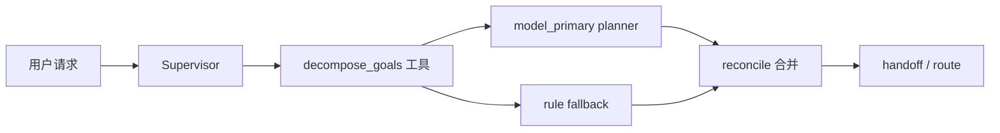

# 存量项目变更后屎山再分析报告（2026-03-04）

- 分析日期：2026-03-04
- 分析范围：当前工作区未提交变更中的核心代码与治理脚本
- 仓库路径：`/Users/jijingkun/bojxAI/fastapi`
- 分析目标：在“已有代码变动”前提下，重新识别可简化点，并形成可执行治理清单

---

## 1. 本次分析覆盖的关键变更

### 1.1 代码变更快照（核心文件）

| 文件 | 变更规模（+/-） | 当前行数 | 函数数 | 最高复杂度函数 | 结论摘要 |
|---|---:|---:|---:|---|---|
| `app/ai/workflow/multi_agent_graph.py` | +117 / -5 | 5037 | 159 | `create_multi_agent_graph`（C80/L649） | 编排层继续膨胀，新增意图分解路径但耦合度更高 |
| `scripts/docs_guard.py` | +127 / -0 | 1097 | 37 | `check_g01_evidence_binding`（C29/L167） | 新增规则有价值，但脚本单体持续变重 |
| `tests/unit/test_intent_plan_model_primary.py` | +75 / -0 | 245 | 22 | `test_infer_initial_intent_plan_keeps_data_goal_when_mixed_with_external`（C6/L17） | 覆盖了新增主路径，但边界场景仍缺失 |

### 1.2 运行验证证据

- `pytest`：`tests/unit/test_intent_plan_model_primary.py` 通过（10/10）
- `docs_guard`：执行后出现 `1 error + 18 warnings`（新增规则已经“真实触发”）
  - `requirement_status_mismatch: 1`
  - `requirement_tc_traceability_missing: 58`
  - `requirement_nfr_threshold_missing: 5`

---

## 2. 关键发现（按优先级）

### P0（必须先处理）

1. **多智能体主编排文件继续集中化，已形成超大单体**
   - 证据：`/Users/jijingkun/bojxAI/fastapi/app/ai/workflow/multi_agent_graph.py:4353`
   - 现象：`create_multi_agent_graph` 单函数 649 行，仍承载工具构建、Agent 拼装、节点 wiring 与后处理逻辑。
   - 风险：任何新增策略都需要触碰主干函数，冲突概率和回归面同步扩大。

2. **`decompose_goals` 工具定义出现“双入口同职责”**
   - 证据：`/Users/jijingkun/bojxAI/fastapi/app/ai/workflow/multi_agent_graph.py:4108`、`/Users/jijingkun/bojxAI/fastapi/app/ai/workflow/multi_agent_graph.py:4122`
   - 现象：同时存在模块级 `decompose_goals` 与闭包 `_create_decompose_goals_tool`，返回 payload 逻辑重复。
   - 风险：后续修改 source/payload 字段时易产生漂移。

3. **启发式词典扩张仍是硬编码堆叠，不可治理**
   - 证据：`/Users/jijingkun/bojxAI/fastapi/app/ai/workflow/multi_agent_graph.py:206`、`/Users/jijingkun/bojxAI/fastapi/app/ai/workflow/multi_agent_graph.py:219`
   - 现象：`DATA_DOMAIN_HINTS` 与 `DATA_STRONG_HINTS` 同时加入“贷款/存款/余额”，重复维护且无配置边界。
   - 风险：误判率与维护成本一起上升，且难以做灰度实验。

### P1（本轮建议跟进）

4. **意图分解合并函数职责过重**
   - 证据：`/Users/jijingkun/bojxAI/fastapi/app/ai/workflow/multi_agent_graph.py:4065`
   - 现象：`_resolve_decomposed_goals_for_query` 同时做输入归一、planner模式读取、模型调用、异常降级、规则补齐、source 拼接。
   - 风险：测试虽通过，但后续新增策略时将继续堆叠分支。

5. **文档治理脚本继续单文件叠加规则，进入“可运行但难演进”阶段**
   - 证据：`/Users/jijingkun/bojxAI/fastapi/scripts/docs_guard.py:913`、`/Users/jijingkun/bojxAI/fastapi/scripts/docs_guard.py:971`、`/Users/jijingkun/bojxAI/fastapi/scripts/docs_guard.py:1064`
   - 现象：新增 3 条校验直接写入单体 `main` 汇总，规则之间无模块边界。
   - 风险：规则越多，调试/排错/维护成本越高，新增规则易互相影响。

6. **`docs_guard` 新规则无对应单元测试保障**
   - 证据：全仓检索未发现 `docs_guard` 相关测试
   - 现象：规则逻辑直接上主线运行，仅靠人工观察输出。
   - 风险：后续规则调整可能误报或漏报，缺回归保护。

### P2（可排到下一轮）

7. **TC traceability 警告量偏大，当前输出对执行者噪声较高**
   - 证据：`docs_guard` 本次输出 `requirement_tc_traceability_missing: 58`
   - 现象：单轮输出集中告警，缺少“按优先级/按模块聚合”。
   - 风险：重要问题淹没在长列表中，降低治理效率。

8. **新增意图测试偏“成功路径”，失败注入与抗噪场景仍不足**
   - 证据：`/Users/jijingkun/bojxAI/fastapi/tests/unit/test_intent_plan_model_primary.py:45`、`/Users/jijingkun/bojxAI/fastapi/tests/unit/test_intent_plan_model_primary.py:71`
   - 现象：已有 model primary 与 reconcile 用例，但仍缺“乱码输入/空行多段/混合符号”覆盖。
   - 风险：真实脏输入下可能回归。

---

## 3. 变更后治理方案对比

| 方案 | 优点 | 缺点 | 成本 | 推荐度 |
|---|---|---|---|---|
| 继续按文件小修小补 | 快速见效 | 债务继续累积，边界更乱 | 低 | ★★☆☆☆ |
| **按“主干拆分 + 规则模块化”推进（推荐）** | 从根因降复杂度，可持续演进 | 初期需要补骨架与测试 | 中 | ★★★★★ |
| 一次性大重写 | 形态最干净 | 回归风险和沟通成本最高 | 高 | ★★☆☆☆ |

---

## 4. 推荐落地路径（7天）

### Day 1-2：先稳编排边界
- 抽 `decompose_goals` 统一构造器（去掉双入口重复 payload 逻辑）。
- 将 `_resolve_decomposed_goals_for_query` 拆为三段：`planner_path`、`fallback_path`、`reconcile_path`。

### Day 3-4：治理 `docs_guard` 单体结构
- 引入 `checks/` 子模块（如 `checks/requirements.py`）。
- `main()` 仅保留注册和汇总，不再塞规则实现。

### Day 5：补测试与失败注入
- 为 `docs_guard` 新增最小单测（status mismatch / TC mapping / NFR threshold）。
- 为 intent 分解新增脏输入和边界输入测试。

### Day 6-7：清理与收口
- 固化“规则配置化”入口（词典从硬编码迁移到配置源）。
- 输出二次复盘，确认复杂度与重复代码下降。

---

## 5. 可执行 Checklist（本轮）

### 5.1 编排层（multi_agent_graph）

- [ ] `decompose_goals` 工具入口收敛为单实现。
- [ ] `_resolve_decomposed_goals_for_query` 完成职责拆分。
- [ ] `create_multi_agent_graph` 中工具拼装与节点 wiring 分层。
- [ ] 数据意图词典改为可配置结构，去除重复硬编码。
- [ ] 新增改造点均有单测覆盖。

### 5.2 文档治理脚本（docs_guard）

- [ ] 新增规则迁移到独立 `checks` 模块。
- [ ] 规则注册采用清单式管理（避免 `main` 持续膨胀）。
- [ ] `requirement_tc_traceability` 输出支持聚合统计（减少噪声）。
- [ ] 新增规则补单测，覆盖误报/漏报边界。
- [ ] `--strict` 模式下错误与警告分层策略明确。

### 5.3 发布与验证

- [ ] 关键测试通过（intent 分解、docs_guard）。
- [ ] 复杂度对比数据已归档（函数长度/分支数/重复逻辑）。
- [ ] 回滚方案明确（保留旧入口开关或兼容层）。
- [ ] 更新文档与执行记录落盘。

---

## 6. 调用链现状（变更后）

> 当前问题不在“功能不可用”，而在“职责过度集中”。建议下一轮继续沿“模块边界先行”的方向推进。
