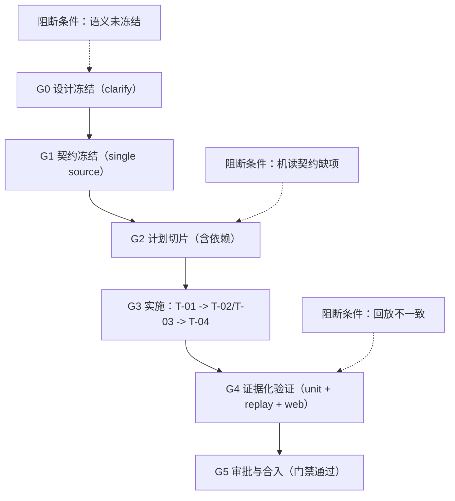

# AI 响应契约统一方案采纳评估（面向工程流优化）

## 1. 结论先行（是否采纳）

**结论**：建议 **“有条件采纳（Adopt with Changes）”**，而不是直接全量采纳。  
面向“优化工程流”目标，原方案方向正确（单契约、分层清晰、可回退），但仍存在会导致执行返工的设计空洞。  
建议按下表执行：

| 采纳级别 | 数量 | 说明 |
|---|---:|---|
| 直接采纳 | 7 | 方向正确且与工程流优化一致 |
| 修订后采纳 | 5 | 存在语义歧义/执行依赖缺失，需先冻结 |
| 暂不采纳 | 2 | 会引入额外治理成本或不确定性 |

> 目标口径：在不改变 `SSE` 主链路的前提下，优先提升“变更可预测性、跨端一致性、可回放性、可验证性”。

---

## 2. 评估目标与判定标准

本评估不再讨论“方案是否新颖”，只讨论“是否提升工程流效率与稳定性”。判定标准如下：

| 维度 | 判定问题 | 通过标准 |
|---|---|---|
| 需求到实现一致性 | 新增 `data_type` 是否必然触发前后端同步动作 | 有硬门禁与自动校验 |
| 交付节奏稳定性 | 并行执行是否可控、可避免返工 | 有明确依赖链和阻断条件 |
| 故障可观测性 | 异常是否可追踪而非静默失败 | 有统一日志键与 fallback 可视化 |
| 回放一致性 | 实时流与历史回放是否走同一路径 | 共享同一 canonical 字段 |
| 回退成本 | 出现兼容问题时是否能快速止血 | 开关级回退，且默认开启 |

---

## 3. 原方案建议采纳矩阵（核心）

| 建议项 | 当前判断 | 采纳结论 | 采纳理由（工程流视角） | 必要修订 |
|---|---|---|---|---|
| 以 `result(data_type+data+message?)` 作为唯一结构化通道 | 正确 | 采纳 | 消除双协议分叉，降低认知成本 | 明确 `message` 缺省语义 |
| `blocks` 只作为内部中间表示 | 正确 | 采纳 | 明确外部契约唯一性，减少前端分支复杂度 | 在 service 层定义唯一映射点 |
| `data_type` 受控枚举 | 正确 | 采纳 | 新类型可被编译期/测试期发现 | 增加“未登记禁止发送”校验 |
| 前端 renderer registry | 正确 | 采纳 | 新增类型不再改核心组件，缩短变更链路 | 约定默认 fallback renderer |
| 新增类型需“文档+后端+前端+回放测试”四件套 | 正确 | 采纳 | 把经验规则变成门禁，减少回归 | 写入 PR 模板或 CI 检查 |
| 缺失 `data_type`：后端 error 或前端 fallback（二选一） | 不完整 | 修订后采纳 | 当前是双语义，执行会分歧 | 冻结为单策略（推荐后端归一） |
| “代码生成（或镜像同步）” | 不完整 | 修订后采纳 | “或”会导致后续分叉治理 | 固定单一机制，不允许并存 |
| 回放使用 `metadata/additional_kwargs` | 有歧义 | 修订后采纳 | 双字段口径会导致刷新丢卡 | 指定 canonical 字段 + 迁移规则 |
| execution 采用 `parallel` | 条件不足 | 修订后采纳 | 无依赖图时并行易返工 | 增加 `blocked_by` 明确依赖 |
| fallback 展示原始 JSON 摘要 | 风险可控 | 修订后采纳 | 可观测性好，但有信息暴露风险 | 增加脱敏白名单 |
| 未知类型仅日志（关闭 fallback 开关） | 可接受 | 暂不采纳默认态 | 与“前端可感知降级”目标冲突 | 保持默认 fallback 可见 |
| 并行维护 `AssistantResponse.blocks` 外部协议 | 不建议 | 暂不采纳 | 治理成本翻倍，破坏单契约 | 明确禁止 |

---

## 4. 工程流优化版落地模型（建议采用）



### 4.1 推荐执行顺序（替代“无依赖并行”）

| 阶段 | 任务 | 依赖 | 输出物 | 放行条件 |
|---|---|---|---|---|
| Phase 1 | T-01（后端契约源与归一） | 无 | 契约枚举、构建器、normalize 统一 | `result` 字段语义冻结 |
| Phase 2 | T-02（前端 registry） | T-01 | registry + fallback 渲染链路 | 未知类型可见降级 |
| Phase 2 | T-03（文档同步） | T-01 | 协议文档与产品文档一致 | 字段定义无歧义 |
| Phase 3 | T-04（测试矩阵） | T-02/T-03 | 单测+回放+前端测试证据 | 实时/回放口径一致 |

### 4.2 门禁化工程流（建议写入团队规则）

| Gate | 必需证据 | 未通过处理 |
|---|---|---|
| G1 契约冻结 | 单一 source 文件 + 版本字段 + 异常语义唯一化 | 阻断进入实现 |
| G2 计划切片 | 每个任务 `task_id/file_paths/symbols/blocked_by` | 阻断并行执行 |
| G3 实施完成 | 后端/前端/文档最小闭环 | 阻断测试阶段 |
| G4 验证完成 | 回放一致性 + fallback 可见性 + 日志可观测 | 阻断审批合入 |

---

## 5. 必改项（不改就会拖慢工程流）

### P0（必须先改）
1. **异常语义唯一化**：缺失 `data_type` 的处理必须单选，不可双标。  
2. **契约源机制唯一化**：`代码生成` 与 `镜像同步` 必须二选一并固定。  
3. **handoff 机读一致性**：`clarify_handoff_contract.required.requirement_seeds` 必须包含 D-03。

### P1（建议本轮即改）
1. 统一版本字段命名：`result_contract_version` vs `contract_version`。  
2. 指定回放 canonical 字段（建议 `additional_kwargs`），并定义读旧写新策略。  
3. execution seed 增加依赖：`T-02/T-03 blocked_by T-01`, `T-04 blocked_by T-02/T-03`。  
4. fallback 摘要增加脱敏白名单，避免原始 payload 直出。

---

## 6. 采纳后对工程流的净收益（预期）

| 指标 | 现状痛点 | 采纳后预期 |
|---|---|---|
| 新类型接入周期 | 改动点散落、易漏改 | 以契约+registry 模式稳定缩短 |
| 回归风险 | 实时与回放两套语义 | 同一字段链路，风险显著下降 |
| 问题定位时间 | 静默丢失、日志离散 | fallback 可见 + 统一日志键 |
| 团队协作成本 | 并行缺依赖、返工频繁 | Gate + blocked_by 后可控并行 |

---

## 7. 建议给你的最终决策

**建议你采纳原方案的“主方向”，但先强制补齐 P0 再立项执行。**  
对“优化工程流”最关键的一点不是“再加更多设计”，而是把“单一契约 + 单一语义 + 单一依赖图”真正冻结成门禁。

可执行决策句（可直接用于审批）：

> 本方案按“修订后采纳”通过：先完成 P0（异常语义、契约源机制、handoff 一致性）修订，再进入 `/jjk-plan`。未完成 P0 前，禁止进入实现链路。

---

## 8. 可复用的机读决策（可选）

```yaml
adoption_decision:
  topic: ai-response-contract-unification
  verdict: adopt_with_changes
  objective: optimize_engineering_flow
  must_fix_before_plan:
    - unify_missing_data_type_semantics
    - choose_single_contract_source_mechanism
    - align_handoff_required_seeds_with_D03
  recommended_fixes:
    - unify_contract_version_field_name
    - define_replay_canonical_field_and_migration
    - add_task_dependency_graph
    - add_fallback_redaction_whitelist
  go_no_go_rule: "P0 fixed => GO, else NO_GO"
```

