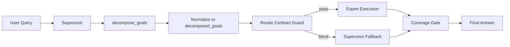

# 用户意图优化（v2：运行态契约收敛）设计说明

> 文档版本：v2.0  
> 更新时间：2026-03-06  
> 设计状态：`frozen_pending_approval`

## 0. 结论先行

- 本方案采用**单轨运行态契约**：运行阶段只认 `decomposed_goals + handoff.target_agent`，不再读取 `state.intent_plan`。
- `intent_plan` 仅在 `decompose_goals` 规划阶段内部保留，避免直接删除带来的稳定性回归。
- 所有阻塞/异常/覆盖缺口统一回流 `supervisor`，禁止专家节点承担兜底。
- 本文档满足 `$jjk-clarify` v3.2 冻结结构，并冻结“契约源唯一化”：运行态只读只写 `additional_kwargs.router_result_v2`。

## 1. scope_contract

- 目标:
  - 收敛意图路由运行态契约，消除历史双轨语义。
  - 保持规划产能稳定，不牺牲 `decompose_goals` 的可回退能力。
  - 将错误处理责任统一归属到 `supervisor`，降低职责扩散风险。
- 范围:
  - `app/ai/workflow/multi_agent_graph.py`：运行态目标解析、路由门禁、values 分发、fallback 收口。
  - `app/ai/prompts/agent_prompts.py`：意图判定优先级与反例语义。
  - `app/ai/contracts/delivery_contract_validators.py`：交付合同字段约束（仅在需要补齐时调整）。
  - `tests/unit/**`、`tests/integration/**`：新增/修正运行态契约与回归测试。
  - `docs/开发文档/架构设计/AI模块设计.md`：同步“规划保留、运行剥离”。
- 边界:
  - 本轮不删除 `_build_planner_intent_plan` 与现有 planner 策略链路。
  - 本轮不新增专家节点、不引入专家兜底。
  - 本轮不改数据库模型与存储层 schema。
- 成功标准:
  - 运行态关键路径不再读取 `state.intent_plan`。
  - `target_agent` 缺失/非法时统一产出结构化阻塞原因并回流 `supervisor`。
  - 记忆/元信息类请求误派发到 `data_expert` 比例降至 `<=0.5%`。

## 2. product_contract（PRD-Lite）

- target_users:
  - 会话终端用户（关注答复正确性与稳定性）
  - 运营/支持同学（关注误路由可解释与可观测）
  - AI 工作流研发（关注契约一致性与回归可控）
- core_scenarios:
  - S1：用户询问记忆/偏好/能力信息，应优先进入 supervisor 语义处理，不误派发数据查询。
  - S2：用户明确数据查询请求（如账单/贷款余额），可合法派发 `data_expert`。
  - S3：复合请求（例如“先查待办再看记忆”）必须多目标覆盖，不漏答。
  - S4：handoff 字段异常时，系统能在 1 回合内进入 supervisor 兜底并输出非空答复。
- business_goals（含 KPI）:
  - G1：意图误路由率（memory/meta -> data_expert）`<=0.5%`。
  - G2：路由阻塞后恢复时长 `TTR <= 1` 回合。
  - G3：Router Contract Guard 额外耗时 `P50 <= 30ms`、`P95 <= 150ms`。
  - G4：planner 异常回退命中率可观测，`planner_model_failed <= 5%`。
- non_goals:
  - 不做 planner 全链路重写。
  - 不做专家体系扩容或角色重命名。
  - 不做前端协议改版。
- acceptance_gates:
  - A1：`_resolve_active_goals`、`_apply_router_contract_guard`、`_dispatch_values_mode_chunk` 不读取 `state.intent_plan` 作为运行态输入。
  - A2：`invalid_target_agent`、`invalid_task_description`、`target_not_in_allowed_agents` 均可复现并稳定回流 `supervisor`。
  - A3：复合目标覆盖率通过回归测试，不发生漏目标收口。
  - A4：日志/指标字段完整，`event/turn_id/goal_id/target_agent/reason` 可追踪。
  - A5：运行态仅读写 `additional_kwargs.router_result_v2`，检测到历史字段即 fail-fast 并进入 supervisor 收口。
- release_constraints:
  - 运行态契约为硬约束，不提供任何 feature flag 降级路径。
  - 不兼容旧字段：检测到历史字段读写即 fail-fast 并进入 `supervisor_fallback`。
  - 回退路径仅允许代码级回退（revert 任务变更集），不允许双轨灰度。

## 3. architecture_contract

### 3.1 模块边界（冻结）

- `multi_agent_graph`：唯一编排层，负责目标归一、路由门禁、失败回流。
- `agent_prompts`：仅负责判定语义提示，不承担运行态门禁逻辑。
- `delivery_contract_validators`：仅负责合同字段校验，不做重路由决策。
- `experts`：只执行合法委派任务，禁止 fallback。

### 3.2 依赖方向（冻结）

- `input -> decompose_goals -> goal_normalization -> router_guard -> dispatch -> fallback/coverage -> final`。
- 依赖单向，不允许从执行层反向修改规划层中间状态。

### 3.3 状态归属（冻结）

- 规划态唯一中间对象：`intent_plan`（仅 `S1_PLAN`）。
- 运行态唯一目标源：`decomposed_goals`（`S2+` 全阶段）。
- 运行态唯一委派字段：`handoff.target_agent`。
- 重放幂等键：`turn_id + goal_id`。

### 3.4 错误处理责任（冻结）

- 单策略：任意运行态合同异常均 `block -> supervisor_fallback`，不进入专家兜底。
- 单策略：`target_not_in_allowed_agents` 一律进入 `supervisor` 重新组织答复，不采用“专家侧自行修复”。
- 单策略：planner 失败仅触发 `heuristic_fallback`，不终止主链路。

### 3.5 端到端数据流



### 3.6 回放归一（canonical）

- canonical 字段：`additional_kwargs.router_result_v2`。
- 执行语义：`read-new-write-new`（固定语义，无兼容分支）。
  - 读：运行态仅读取 `additional_kwargs.router_result_v2`。
  - 写：运行态仅写入 `additional_kwargs.router_result_v2`。
- 历史字段策略：历史字段一律视为非法输入，检测到即记录 `legacy_router_result_detected` 并 fail-fast 到 `supervisor_fallback`。

## 4. requirement_seeds（字段级需求原子）

| design_item | fr_id | trigger | input_contract | output_contract | failure_semantics | rollback_anchor(代码) |
|---|---|---|---|---|---|---|
| 运行态目标源单轨化 | FR-01 | 进入路由与分发路径 | `decomposed_goals` | `additional_kwargs.router_result_v2.route_decisions` | 缺失目标触发 `no_pending_goal` 并回流 supervisor | `revert:T01~T03` |
| handoff 契约强校验 | FR-02 | 生成 handoff | `target_agent/task_description/frame` | `blocked_records` | 字段缺失触发 `invalid_*` 并回流 supervisor | `revert:T02` |
| fallback 主体唯一化 | FR-03 | block/coverage 缺口/运行异常 | `blocked_handoffs` | `supervisor_fallback_activated` | 不允许专家兜底 | `revert:T03~T04` |
| planner 规划能力保留 | FR-04 | 调用 `decompose_goals` | `user_query + planner_runtime_context` | `goals(source=...)` | `planner_model_failed -> heuristic_fallback` | `revert:planner-preservation-delta` |
| 回放字段归一 | FR-05 | 记录结构化路由结果 | `additional_kwargs.router_result_v2` | `additional_kwargs.router_result_v2(version=v2)` | 检测到 `legacy_field_detected` 或 `canonical_missing` 时 fail-fast 并记观测事件 | `revert:canonical-router-result-v2` |

## 5. implementation_seeds（任务原子）

| task_id | blocked_by | file_paths | symbols | change_type | acceptance_cmds |
|---|---|---|---|---|---|
| T01 | [] | `app/ai/workflow/multi_agent_graph.py` | `_resolve_active_goals` | refactor | `PYTHONPATH=. pytest tests/unit/test_intent_layer_boundary.py -q` |
| T02 | [T01] | `app/ai/workflow/multi_agent_graph.py` | `_apply_router_contract_guard` | refactor | `PYTHONPATH=. pytest tests/unit/test_multi_intent_queue_flow.py -q` |
| T03 | [T02] | `app/ai/workflow/multi_agent_graph.py` | `_dispatch_values_mode_chunk` | refactor | `PYTHONPATH=. pytest tests/unit/test_multi_agent_streaming_helpers.py -q` |
| T04 | [T03] | `app/ai/prompts/agent_prompts.py` | `SUPERVISOR_PROMPT` | modify | `PYTHONPATH=. pytest tests/unit/test_intent_layer_boundary.py -q` |
| T05 | [T03] | `tests/unit/test_intent_plan_model_primary.py`,`tests/integration/test_intent_shadow_metrics.py` | `planner_regression_tests` | modify | `PYTHONPATH=. pytest tests/unit/test_intent_plan_model_primary.py -q && PYTHONPATH=. pytest tests/integration/test_intent_shadow_metrics.py -q` |
| T06 | [T03] | `tests/unit/test_router_ignores_intent_plan_runtime.py` | `runtime_contract_regression` | add | `PYTHONPATH=. pytest tests/unit/test_router_ignores_intent_plan_runtime.py -q` |
| T07 | [T01,T02,T03,T04,T05,T06] | `docs/开发文档/架构设计/AI模块设计.md` | `intent_routing_sections` | modify | `rg -n "intent_plan|decomposed_goals|router_result_v2|supervisor" docs/开发文档/架构设计/AI模块设计.md` |

## 6. execution_chain_seed

```yaml
execution_chain_seed:
  preferred_mode: core
  task_key: PP-20260306-intent-runtime-contract-v2
  card_seed: [T01, T02, T03, T04, T05, T06, T07]
  execution_contract_hint:
    delivery_mode: staged
    execution_unit: per_task
    commit_policy: per_pr
    stop_boundary: per_pr
```

## 7. risk_rollback_contract

| risk_id | 关键风险 | 触发信号 | 回退锚点（代码） | 回退动作 |
|---|---|---|---|---|
| R01 | 运行态单轨化后复合目标漏识别 | `coverage_missing` 上升 | `T01~T03 变更集` | 执行 `git revert` 回退 T01~T03，并恢复上一版目标解析路径 |
| R02 | 路由门禁误拦截导致空答复 | `router_handoff_blocked_total` 异常升高 | `T02~T04 变更集` | 执行 `git revert` 回退门禁与分发改动，保持 supervisor 直接收口 |
| R03 | planner 模型波动造成目标拆解质量下降 | `planner_model_failed > 5%` | `planner-preservation-delta` | 回退规划层本次增量并恢复上版 planner 调用链 |
| R04 | 仍有链路写入历史字段导致契约源分裂 | `legacy_router_result_detected_total > 0` | `canonical-router-result-v2` | 立即回滚 canonical-only 增量并阻断发布，修复后重新提测 |

## 8. 设计冻结回执（机读）

```yaml
design_freeze_summary:
  design_actionable: true
  missing_blocks: []
  risk_level: medium
  risk_counterexamples_count: 4
  handoff_contract_ready: true
  product_contract_ready: true
  implementation_seed_count: 7
  semantic_frozen: true
  contract_source_decided: true
  handoff_seed_alignment_ok: true
  parallel_dependency_ready: true
  replay_canonical_field_set: true
  blocking_issues: []
```

## 9. clarify_handoff_contract（机读）

```yaml
clarify_handoff_contract:
  version: v2
  topic: 用户意图优化（v2：运行态契约收敛）
  design_source: docs/plans/2026-03-06-intent-optimization-runtime-contract-v2-design.md
  handoff_ready: true
  required:
    product_contract_summary:
      target_users: [会话终端用户, 运营支持, AI工作流研发]
      core_scenarios:
        - 记忆/元信息请求不误派发
        - 明确数据查询可合法派发
        - 复合目标全覆盖收口
        - 异常一回合内 supervisor 兜底
      business_goal_metrics:
        - 误路由率<=0.5%
        - 路由恢复TTR<=1回合
        - 路由门禁P50<=30ms且P95<=150ms
        - planner_model_failed<=5%
      non_goals:
        - 不重写 planner 全链路
        - 不新增专家节点
        - 不改数据库 schema
      acceptance_gates:
        - 运行态关键路径不读取 state.intent_plan
        - handoff 关键字段缺失可阻塞并回流 supervisor
        - 复合目标覆盖率回归通过
        - 观测字段完整可追溯
    requirement_seeds:
      - design_item: D-01-runtime-goal-single-source
        fr_id: FR-01
        trigger: 进入路由与分发路径
        input_contract:
          required_fields: [decomposed_goals]
        output_contract:
          required_fields: [additional_kwargs.router_result_v2.route_decisions]
        failure_semantics: no_pending_goal -> supervisor_fallback
        observability_fields: [event, turn_id, goal_id, reason]
        rollback_anchor: revert:T01~T03
        acceptance_cmd_ref: PYTHONPATH=. pytest tests/unit/test_intent_layer_boundary.py -q
      - design_item: D-02-handoff-contract-guard
        fr_id: FR-02
        trigger: 生成 handoff
        input_contract:
          required_fields: [target_agent, task_description]
          optional_fields: [frame]
        output_contract:
          required_fields: [additional_kwargs.router_result_v2.router_contract_blocked]
        failure_semantics: invalid_target_agent|invalid_task_description
        observability_fields: [event, turn_id, target_agent, reason]
        rollback_anchor: revert:T02
        acceptance_cmd_ref: PYTHONPATH=. pytest tests/unit/test_multi_intent_queue_flow.py -q
      - design_item: D-03-supervisor-fallback-only
        fr_id: FR-03
        trigger: block/coverage缺口/运行异常
        input_contract:
          required_fields: [blocked_handoffs, missing_goals, runtime_error]
        output_contract:
          required_fields: [supervisor_fallback_activated, final_answer_non_empty]
        failure_semantics: coverage_missing -> supervisor_fallback
        observability_fields: [event, turn_id, reason, missing_goal_ids]
        rollback_anchor: revert:T03~T04
        acceptance_cmd_ref: PYTHONPATH=. pytest tests/unit/test_multi_agent_streaming_helpers.py -q
      - design_item: D-04-planner-keep-for-plan-only
        fr_id: FR-04
        trigger: decompose_goals 调用
        input_contract:
          required_fields: [user_query, planner_runtime_context]
        output_contract:
          required_fields: [goals, source]
        failure_semantics: planner_model_failed -> heuristic_fallback
        observability_fields: [planner_mode, source, fallback_hit_rate]
        rollback_anchor: revert:planner-preservation-delta
        acceptance_cmd_ref: PYTHONPATH=. pytest tests/unit/test_intent_plan_model_primary.py -q
      - design_item: D-05-replay-canonical-router-result
        fr_id: FR-05
        trigger: 写入结构化路由结果
        input_contract:
          required_fields: [additional_kwargs.router_result_v2]
        output_contract:
          required_fields: [additional_kwargs.router_result_v2]
        failure_semantics: legacy_field_detected|canonical_missing -> fail_fast_event
        observability_fields: [event, turn_id, field_version]
        rollback_anchor: revert:canonical-router-result-v2
        acceptance_cmd_ref: PYTHONPATH=. pytest tests/unit/test_router_ignores_intent_plan_runtime.py -q
    implementation_seeds:
      - task_id: T01
        feature_id: INTENT-P1
        blocked_by: []
        file_paths: [app/ai/workflow/multi_agent_graph.py]
        symbols: [_resolve_active_goals]
        change_type: refactor
      - task_id: T02
        feature_id: INTENT-P1
        blocked_by: [T01]
        file_paths: [app/ai/workflow/multi_agent_graph.py]
        symbols: [_apply_router_contract_guard]
        change_type: refactor
      - task_id: T03
        feature_id: INTENT-P1
        blocked_by: [T02]
        file_paths: [app/ai/workflow/multi_agent_graph.py]
        symbols: [_dispatch_values_mode_chunk]
        change_type: refactor
      - task_id: T04
        feature_id: INTENT-P1
        blocked_by: [T03]
        file_paths: [app/ai/prompts/agent_prompts.py]
        symbols: [SUPERVISOR_PROMPT]
        change_type: modify
      - task_id: T05
        feature_id: INTENT-P1
        blocked_by: [T03]
        file_paths: [tests/unit/test_intent_plan_model_primary.py, tests/integration/test_intent_shadow_metrics.py]
        symbols: [planner_regression_tests]
        change_type: modify
      - task_id: T06
        feature_id: INTENT-P1
        blocked_by: [T03]
        file_paths: [tests/unit/test_router_ignores_intent_plan_runtime.py]
        symbols: [runtime_contract_regression]
        change_type: add
      - task_id: T07
        feature_id: INTENT-P1
        blocked_by: [T01, T02, T03, T04, T05, T06]
        file_paths: [docs/开发文档/架构设计/AI模块设计.md]
        symbols: [intent_routing_sections]
        change_type: modify
    execution_chain_seed:
      preferred_mode: core
      task_key: PP-20260306-intent-runtime-contract-v2
      card_seed: [T01, T02, T03, T04, T05, T06, T07]
      execution_contract_hint:
        delivery_mode: staged
        execution_unit: per_task
        commit_policy: per_pr
        stop_boundary: per_pr
    alignment_contract:
      strict_match: true
      requirement_seed_ids:
        - D-01-runtime-goal-single-source
        - D-02-handoff-contract-guard
        - D-03-supervisor-fallback-only
        - D-04-planner-keep-for-plan-only
        - D-05-replay-canonical-router-result
      implementation_task_ids: [T01, T02, T03, T04, T05, T06, T07]
      card_seed_ids: [T01, T02, T03, T04, T05, T06, T07]
  extended:
    observability_hints:
      - 统一 event 命名前缀 intent_router_*
      - route block 事件必须记录 reason 与 goal_id
      - canonical 字段写入需携带 version=v2
    risk_counterexample_map:
      - risk_id: R01
        counterexample: 多目标输入仅返回单目标答复
        verify_cmd: PYTHONPATH=. pytest tests/unit/test_multi_agent_streaming_helpers.py -q
      - risk_id: R02
        counterexample: target_agent 缺失未进入 supervisor fallback
        verify_cmd: PYTHONPATH=. pytest tests/unit/test_multi_intent_queue_flow.py -q
      - risk_id: R03
        counterexample: planner 失败后主链路中断
        verify_cmd: PYTHONPATH=. pytest tests/unit/test_intent_plan_model_primary.py -q
      - risk_id: R04
        counterexample: 运行态仍写入历史字段且未产出 router_result_v2
        verify_cmd: PYTHONPATH=. pytest tests/unit/test_router_ignores_intent_plan_runtime.py -q
    assumptions:
      - 本轮允许新增单测文件以固化“运行态不读 intent_plan”回归。
      - 本轮不引入 feature flag，不提供双轨兼容层。
      - 不涉及前端协议变更，后端直接统一到 v2 字段契约。
```

## 10. 一致性自检（机读）

```yaml
clarify_consistency_check:
  product_contract_ready: true
  semantic_frozen: true
  contract_source_decided: true
  handoff_seed_alignment_ok: true
  parallel_dependency_ready: true
  replay_canonical_field_set: true
  fail_fast_codes: []
```

## 11. 审批记录

- design_approved: false
- approved_at: ""
- approved_round: round-0
- approval_evidence: ""
- approval_mode: pending
- go_no_go: NO_GO
- blocking_issues:
  - WAITING_USER_APPROVAL

## 12. 审批动作（必须）

以上设计已完全冻结。  
请回复：**确认 / 需要修改XX点 / 否**  
（回复“确认”或“是”且门禁全部通过即视为审批通过，可进入 `$jjk-plan`；否则记录条件采纳并继续澄清）
