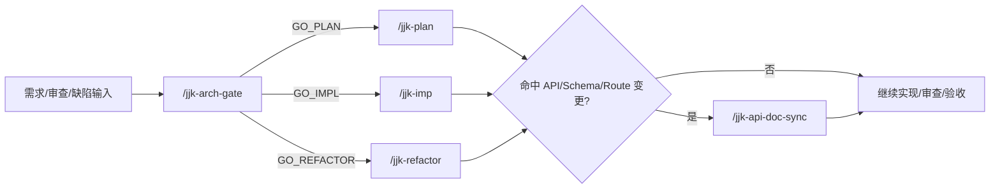

# JJK 治理前置技能设计

> 设计日期：2026-03-08
> 主题：为当前仓库新增 `jjk-arch-gate` 与 `jjk-api-doc-sync` 两个项目治理型技能

---

## 1. 执行结论

- 采用 **“`.cursor/commands` 为真理源，`.agents/skills` 自动镜像”** 的单源方案，不直接手写 Skill 镜像。
- `jjk-arch-gate` 负责把 Layer1 已声明的“四段式架构结论”固化为显式前置门禁。
- `jjk-api-doc-sync` 负责把 `.cursor/rules/doc_sync.mdc` 中与 API / Schema / Route / 接口语义相关的映射收敛成可执行的同步清单。
- 工作流手册与速查文档同步补入这两个入口，避免“规则里有、执行链里没有”的心智断层。

## 2. 背景与问题

- 当前仓库在 `AGENTS.md` Layer1 已明确要求：任何改动前必须提交“模块边界、依赖方向、状态归属、错误处理责任”四段式结论。
- 当前仓库在 `.cursor/rules/doc_sync.mdc` 已明确要求：涉及 API / 契约 / 测试资产 / 接口文档的变更必须同步更新对应文档。
- 但这两个要求目前只以规则存在，没有稳定的 `jjk-*` 命令入口，导致执行时容易直接跳去 `/jjk-plan`、`/jjk-imp`、`/jjk-refactor`，遗漏治理前置动作。
- 项目尚未上线，架构设计质量优先于兼容性与改动量，因此应优先补“治理入口”，而不是继续靠口头提醒或经验自觉执行。

## 3. 四段式架构结论

### 3.1 模块边界

- 命令真理源边界固定在 `.cursor/commands/jjk-*.md`。
- Skill 镜像边界固定在 `.agents/skills/jjk-*/SKILL.md`，仅做镜像，不做主编辑入口。
- 工作流/速查文档边界固定在 `docs/开发文档/工作流/*` 与 `docs/开发文档/技巧与速查/*`，只负责解释“何时使用”。

### 3.2 依赖方向

- 依赖方向必须保持 `commands -> sync script -> mirrored skills` 的单向流。
- 文档只能说明命令，不得反向让 Skill 内容成为命令真理源。
- 长期治理决策沉淀在 `memory-bank.md`，不反向驱动命令语义。

### 3.3 状态归属

- `jjk-arch-gate` 的状态归属是“改动前的架构结论与 GO/NO_GO 判定”。
- `jjk-api-doc-sync` 的状态归属是“Must Update / Should Review / Not In Scope + sync_status”。
- 这两个命令只产生治理结论，不接管实现、审查、测试、验收状态。

### 3.4 错误处理责任

- `jjk-arch-gate` 负责阻断：四段式结论缺失、结构性问题被 patch/fallback 掩盖、状态归属不清。
- `jjk-api-doc-sync` 负责阻断：文档映射缺失、接口文档与测试资产未齐、代码-文档顺序颠倒。
- 实现、审查、测试、验收仍分别由 `/jjk-imp`、`/jjk-review`、`/jjk-test`、`/jjk-verify` 承担。

## 4. 方案对比

| 方案 | 做法 | 优点 | 缺点 | 结论 |
|---|---|---|---|---|
| A | 直接手写 `.agents/skills` | 快 | 破坏单一真理源，后续容易漂移 | 不选 |
| B | 新增 `.cursor/commands/jjk-*.md`，再用同步脚本镜像 | 与仓库现状一致，维护成本最低 | 需要同步文档入口 | 采用 |
| C | 新增命令并同时实现脚本级自动校验 | 约束最强 | 本轮改动会膨胀，超出当前目标 | 暂不做 |

## 5. 新增命令设计

### 5.1 `jjk-arch-gate`

- **目标**：任何改动前输出“模块边界 / 依赖方向 / 状态归属 / 错误处理责任”四段式结论。
- **输入**：改动意图、影响范围、已有设计/计划/审查证据（三者至少具备最小组合）。
- **核心输出**：四段式结论、根因层级、允许动作、禁止动作、`GO/NO_GO`、`next_step`。
- **默认决策**：只要问题落在结构/依赖/状态/错误责任层，未上线阶段默认走 `refactor`，而不是 `patch`。

### 5.2 `jjk-api-doc-sync`

- **目标**：命中 API / Schema / Route / DTO / 接口语义变更时，先列出必须同步的文档与测试资产清单。
- **输入**：变更文件范围、契约/接口变更说明、关联文档（任一即可启动）。
- **核心输出**：`Must Update / Should Review / Not In Scope` 三栏清单、`sync_status`、阻断项、下一步命令建议。
- **默认决策**：代码与接口文档、测试案例、模块需求/设计存在漂移时直接阻断，不再接受“代码先合、文档后补”的口径。

## 6. 工作流插入点

## 7. 文档同步范围

本轮至少同步：

1. `docs/开发文档/工作流/开发工作流.md`
2. `docs/开发文档/工作流/指令用法_实现方式_工程流全景手册.md`
3. `docs/开发文档/技巧与速查/AI协作速查表.md`
4. `docs/开发文档/技巧与速查/vibe-coding开发技巧.md`
5. `memory-bank.md`

## 8. 风险与控制

| 风险 | 表现 | 控制手段 |
|---|---|---|
| 命令与 Skill 镜像漂移 | `.cursor/commands` 与 `.agents/skills` 内容不一致 | 只改 `.cursor/commands`，统一执行 `scripts/sync_rules_to_cc.py --only commands` |
| 工作流文档遗漏新入口 | 规则新增了，但速查表仍没有 | 同轮更新工作流手册、速查表与技巧文档 |
| 命令膨胀成重复心智 | 新命令与 `plan/review` 边界模糊 | 明确定位为“治理前置门禁”，不接管实现/审查/测试职责 |

## 9. 审批记录

- `design_approved=true`
- `approved_at=2026-03-08`
- `approved_round=1`
- `approval_evidence=用户在当前会话中明确回复“好的”批准该设计并允许直接落地`
