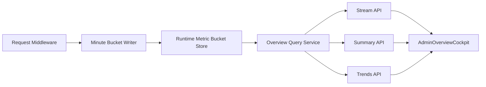

# 管理后台总览指标模型 V2 设计说明

> 文档版本：v1.0  
> 更新时间：2026-03-09  
> 设计状态：`approved`

## 0. 结论先行

- 本方案冻结为 **“单一事实源 + 双层状态 + 指标口径拆分”** 的总览模型，不再继续沿用“实时 5 分钟内存口径 + 历史分钟快照口径”混搭的方案。
- `请求质量` 卡片不再承担“用户提问量”的语义，改为 **全业务 API 请求质量**；原先“用户提问事件”单独收敛为 **用户提问活跃度** 维度。
- `summary`、`trends`、`stream` 三条链路必须读取同一套分钟聚合读模型，禁止再由 `summary` 即时计算、`trends` 读取旧快照、前端自己拼业务语义。
- 总览页面的“无数据 / 过期 / 降级 / 正常”状态必须显式建模，禁止继续用 `null`、`--`、`unknown` 让前端自行猜测业务含义。
- 健康总分不再在“无业务样本”场景下强行给出一个看似正常的数值分；系统在线与业务有样本必须拆开表达。
- 本项目尚未上线，优先选择结构正确的重构路径：允许 break 旧口径，不为旧字段语义保留兼容层。

## 0.1 可审批摘要

| 维度 | 冻结结论 |
|---|---|
| 指标事实源 | 统一为分钟聚合读模型 |
| 请求质量口径 | 全业务 API 请求，不再等同“用户提问” |
| 用户提问口径 | 单独卡片与单独趋势 |
| 页面状态语义 | `ok / no_data / stale / degraded` |
| 健康总分规则 | 无样本时不输出误导性数值分 |
| 趋势数据来源 | 与 `summary` / `stream` 同源 |
| 模块映射方式 | 收敛到 observability registry / resolver |
| 兼容策略 | 未上线阶段允许直接切口径，不做长期兼容层 |

## 1. scope_contract

- 目标:
  - 消除总览驾驶舱“当前卡片”和“历史趋势”语义不一致的问题。
  - 明确“系统在线”“业务无样本”“数据过期”“聚合降级”四种状态。
  - 让总览页面的每张卡片都具备可解释、可测试、可落库、可回放的 contract。
- 范围:
  - 后端运行时观测链路：`app/core/middlewares/correlation.py`
  - 总览聚合/查询：`app/services/admin_overview_service.py`、`app/services/overview_runtime_collector.py`
  - 总览 API：`app/api/v1/endpoints/admin_overview_api.py`
  - 总览 Schema：`app/schemas/admin_overview.py`
  - 历史快照/趋势存储：`app/models/ops_metric_snapshot.py`、`app/services/ops_snapshot_service.py`
  - 前端总览页面：`web/src/components/admin/overview/AdminOverviewCockpit.tsx`、`web/src/lib/admin-overview-api.ts`、`web/src/types/admin-overview.ts`
  - 真理源文档：`docs/API文档/接口文档.md`、`docs/开发文档/架构设计/前端架构.md`、`docs/开发文档/架构设计/数据库设计.md`
- 边界:
  - 不在本方案内引入外部观测平台（如 Prometheus / ClickHouse / Kafka）。
  - 不扩展为全站通用 APM，仅解决管理后台总览驾驶舱的指标建模与读取问题。
  - 不保留“请求质量 = 用户提问量”的历史产品语义。
- 成功标准:
  - 页面能够区分“无样本”与“故障”，且文案、数值、图表一致。
  - `summary`、`trends`、`stream` 三个接口在同一时间窗口下返回一致的事实语义。
  - 服务重启后不会因为进程内状态丢失而让当前值与趋势数据语义失真。
  - 前端不再通过 `null/--/unknown` 推断业务状态，所有状态以后端 contract 为准。

## 2. product_contract

### 2.1 target_users

- 后台管理员：需要快速判断“系统在线否”“业务当前有无流量”“异常在哪个模块”。
- 研发与排障人员：需要知道卡片上的值来自哪类口径、哪个窗口、是否可信。
- 未来验收/测试人员：需要用可重复的方式验证“无流量 / 过期 / 异常 / 正常”四类场景。

### 2.2 core_scenarios

- 打开总览页时，如果最近 5 分钟没有业务请求，页面明确显示“无业务样本”，而不是 `97 分 + 请求质量 --`。
- 如果有业务流量但聚合链路异常，页面显示“降级”，并保留最后一份可用快照的来源与时间。
- 如果系统在线但聊天提问量为 0，仍能看到业务请求质量和模块状态，不会被“提问量口径”绑架。
- 如果最近 24 小时有趋势数据但当前窗口无样本，趋势图仍可展示历史点，同时当前卡片明确显示 `no_data`。

### 2.3 business_goals

- `request_quality_semantics_confusion = 0`：`请求质量` 不再承载“提问数”语义。
- `dashboard_state_ambiguity = 0`：前端不再通过 `null` 猜状态。
- `summary_trends_stream_contract_drift = 0`：三条链路读同一套事实源。
- `restart_induced_realtime_blindness` 显著下降：服务重启后仍可基于分钟读模型恢复当前窗口视图。

### 2.4 non_goals

- 不在本轮设计中引入复杂的原始事件明细存储。
- 不将每个业务模块都做成独立看板，仅保证总览驾驶舱可解释。
- 不为未上线历史口径保留长期兼容层。

### 2.5 acceptance_gates

- `AO-V2-AC-01`：无业务样本时，卡片状态显式为 `no_data`，不出现误导性健康数值。
- `AO-V2-AC-02`：`请求质量` 与 `用户提问活跃度` 至少在 contract 层明确拆分。
- `AO-V2-AC-03`：`summary`、`trends`、`stream` 读取同源分钟聚合结果。
- `AO-V2-AC-04`：前端只消费显式状态，不再通过数值缺失猜测状态。
- `AO-V2-AC-05`：模块跳转依据 `module_key` contract，而不是前端关键词猜测。
- `AO-V2-AC-06`：历史趋势与当前卡片在“同一分钟窗口”语义下不再互相打架。

## 3. architecture_contract

### 3.1 模块边界

| 模块 | 当前问题 | 最终决策 | 禁止动作 |
|---|---|---|---|
| 观测写入层 | 中间件只写进程内内存，请求事实无法跨进程/重启保留 | 统一写入分钟聚合读模型，必要时允许内存作短期缓存 | 禁止继续把进程内队列当事实源 |
| 聚合读模型层 | `summary` 即时算、`trends` 读旧快照，事实源分裂 | 建立分钟桶模型作为单一事实源 | 禁止 `summary` 成功时顺手落趋势快照 |
| 总览查询层 | 评分、状态、空态语义分散在后端与前端 | 总览查询服务统一输出 canonical snapshot | 禁止前端继续自定义业务状态 |
| 前端展示层 | 通过 `--/unknown` 猜业务语义 | 前端只做渲染和交互，不推断指标含义 | 禁止把数据解释责任下放给 UI |

### 3.2 依赖方向

- 当前问题：`middleware -> in-memory -> collector -> summary -> conditional persist -> trends`，存在“先看当前、再顺手造历史”的倒置依赖。
- 最终决策：固定为 `请求事实 -> 聚合读模型 -> 查询服务 -> 三类消费端`。
- 禁止动作：禁止继续让 `stream` 和 `summary` 各算各的；禁止让 `trends` 依赖 `summary` 是否恰好成功落库。

### 3.3 状态归属

| 状态 | owner | 说明 |
|---|---|---|
| 请求事实 | 观测写入层 | 只负责记录 path/status/duration/module/cost 等事实 |
| 分钟聚合 | 聚合读模型层 | 维护窗口统计、样本数、水位、延迟分布 |
| 业务状态 | Overview Query Service | 输出 `ok/no_data/stale/degraded` 与解释文案 |
| 展示态 | 前端 | 只消费后端状态，不再推断业务语义 |

- 当前问题：实时状态在进程内、历史状态在 DB、显示状态在前端，各有一套 owner。
- 最终决策：状态 owner 收口到 Overview Query Service。
- 禁止动作：禁止继续在 `web/src/components/admin/overview/AdminOverviewCockpit.tsx` 中拼接业务语义判断。

### 3.4 错误处理责任

| 场景 | 责任层 | 处理方式 |
|---|---|---|
| 无样本 | Query Service | 输出 `status=no_data`，附 `sample_count=0` 与可读解释 |
| 数据过期 | Query Service | 输出 `status=stale`，保留 `watermark_at` 与最后可用值 |
| 聚合链路异常 | Query Service | 输出 `status=degraded`，必要时回退到最后可用快照 |
| 展示失败 | 前端 | 只展示错误态，不改写业务状态 |

- 当前问题：无流量、异常、过期都被压缩在 `unknown` / `--` / fallback 中。
- 最终决策：把三类状态显式 contract 化。
- 禁止动作：禁止继续用一个 `unknown` 覆盖全部异常语义。

### 3.5 为什么必须是 refactor，而不是 patch

- 根因位于 **状态归属** 与 **依赖方向**，不是某个字段判空写得不对。
- 只改文案或继续扩大“用户提问路径白名单”，只能掩盖症状，不能让 `summary/trends/stream` 同源。
- 当前 `t_ops_metric_snapshot_minute` 存的是展示快照，不是可复用的聚合事实；继续围绕它打补丁会让历史语义越来越模糊。
- 项目未上线，允许一次性收敛结构，优先把 contract 做对。

## 4. current_state_problem_map

| 现象 | 用户感知 | 根因 |
|---|---|---|
| `请求质量` 显示 `--` | 觉得接口坏了 | 实际只统计聊天提问路径 |
| 稳定性可能显示 `97.0` | 觉得系统很健康 | 无流量被按 info 告警参与评分 |
| 趋势图有历史波动，但当前卡片空 | 觉得数据打架 | `summary` 和 `trends` 数据源不同 |
| 服务重启后实时卡片突然变空 | 觉得数据丢了 | 进程内内存是事实源 |
| 模块跳转靠关键词 | 维护成本高且脆弱 | 缺少显式 `module_key -> route` contract |

### 4.1 现状证据

- 5 分钟窗口：`app/services/overview_runtime_collector.py`
- 总览自身请求排除：`app/services/overview_runtime_collector.py`
- 用户提问路径白名单：`app/services/overview_runtime_collector.py`
- 条件落库：`app/services/ops_snapshot_service.py`
- 前端 `summary / trends / stream` 分别消费：`web/src/lib/admin-overview-api.ts`
- 文档当前已写死“请求总量与 QPS 采用用户提问事件口径”：`docs/API文档/接口文档.md`

## 5. approach_options

| 方案 | 做法 | 优点 | 缺点 | 结论 |
|---|---|---|---|---|
| A. 只改文案与空态 | 不改链路，只提示“无业务流量” | 成本最低 | 根因不变，语义继续漂移 | 不推荐 |
| B. 口径重构 + 单一事实源 | 重做指标 contract、分钟聚合读模型、前端状态渲染 | 结构正确，后续可扩展 | 改动面较大 | **推荐** |
| C. 直接接入外部观测平台 | 用更重的 observability 基建替代当前实现 | 长远能力强 | 当前阶段过重，超出 dashboard 范围 | 过度设计 |

**推荐结论**：采用方案 B。

## 6. metric_contract_v2

### 6.1 卡片模型

| 卡片 | 目标语义 | 是否依赖流量 |
|---|---|---|
| 系统状态 | 聚合链路、服务可用性、最后水位 | 否 |
| 业务请求质量 | 全业务 API 请求质量 | 是 |
| 用户提问活跃度 | 聊天提问入口健康与活跃度 | 是 |
| 稳定性 | 告警压力 + 模块异常情况 | 部分依赖 |
| 容量与成本 | 全业务 QPS、提问 QPS、成本与预算 | 是 |
| 数据新鲜度 | 当前窗口与历史快照的新鲜度 | 否 |
| 模块健康矩阵 | 按模块聚合后的健康态 | 是 |
| 告警 / 变更流 | 当前告警与最近配置变更 | 否 |

### 6.2 通用状态字段

每张卡统一输出以下字段：

| 字段 | 含义 |
|---|---|
| `status` | `ok / no_data / stale / degraded` |
| `health_level` | `healthy / warning / critical / unknown` |
| `window_sec` | 统计窗口（秒） |
| `sample_count` | 有效样本数 |
| `watermark_at` | 最后一条有效样本时间 |
| `data_source` | `bucket / fallback_snapshot / empty` |
| `explain` | 给 UI 的一句说明 |

### 6.3 请求质量与提问活跃度拆分

#### 业务请求质量

- 范围：`/api/v1/*` 业务接口
- 排除：`/api/v1/admin-overview/*`、健康检查、静态探针接口
- 目标：回答“系统对外 API 质量如何”

| 字段 | 口径 |
|---|---|
| `request_total` | 全业务请求数 |
| `success_rate` | 成功请求占比 |
| `error_4xx_rate` | 4xx 占比 |
| `error_5xx_rate` | 5xx 占比 |
| `latency_p95_ms` | 业务请求 P95 |
| `qps` | 全业务 QPS |

#### 用户提问活跃度

- 范围：聊天提问入口
- 目标：回答“用户提问链路是否活跃、是否健康”

| 字段 | 口径 |
|---|---|
| `question_total` | 用户提问次数 |
| `question_success_rate` | 提问成功率 |
| `question_latency_p95_ms` | 提问链路 P95 |
| `stream_interrupt_rate` | 流式中断率 |
| `question_qps` | 提问 QPS |

### 6.4 健康总分规则

- 有足够样本时：按权重正常计算。
- 无流量样本时：不输出误导性总分，顶层显示“业务无样本”。
- 聚合链路异常时：状态为 `degraded`，必要时可附最后一份可用快照。
- 数据过期时：可展示上次值，但必须明确标记 `stale`。

## 7. data_model_contract

### 7.1 单一事实源设计

推荐新增分钟聚合读模型，例如：`t_runtime_metric_bucket_minute`。

| 字段 | 类型建议 | 说明 |
|---|---|---|
| `bucket_minute` | TIMESTAMPTZ | 分钟桶时间 |
| `scope` | VARCHAR | `all_business / user_question / admin_operation` |
| `module_key` | VARCHAR | 模块标识 |
| `request_count` | INTEGER | 请求数 |
| `success_count` | INTEGER | 成功数 |
| `error_4xx_count` | INTEGER | 4xx 数 |
| `error_5xx_count` | INTEGER | 5xx 数 |
| `latency_histogram` | JSONB | 延迟分桶，用于 P95 |
| `cost_total` | NUMERIC | 成本累计 |
| `last_event_at` | TIMESTAMPTZ | 最后事件时间 |
| `created_at/updated_at` | TIMESTAMPTZ | 审计字段 |

### 7.2 对既有 `t_ops_metric_snapshot_minute` 的处理

- 当前表定位为“展示快照”，不适合作为单一事实源。
- V2 方案下建议：
  - 由分钟桶重新计算 `summary` / `trends`；
  - `t_ops_metric_snapshot_minute` 仅在确有必要时保留为派生缓存；
  - 若无明确性能收益，最终应删除旧快照表与相关写入链路，避免双写漂移。

### 7.3 模块注册表

- 路径前缀到模块的映射不再散落在 controller/service 中。
- 统一收敛到 observability registry / resolver 层，由其输出 `module_key` 与 `module_label`。
- 前端跳转只依赖 `module_key -> route` 映射，不再做关键词匹配。

## 8. api_contract_v2

### 8.1 `GET /admin-overview/summary`

- 返回 canonical snapshot。
- 每张卡都带显式状态字段。
- 顶层额外输出 `system_status` 与 `traffic_health`，明确“系统在线”和“业务有无样本”不是一回事。

### 8.2 `GET /admin-overview/trends`

- 仍支持 `1h / 24h` 两个窗口。
- 每个趋势序列明确 `scope` 与 `metric_key`。
- 空窗口返回 `status=no_data` 和空点集，不再用缺字段表达。

### 8.3 `GET /admin-overview/stream`

- 读取与 `summary` 同源的当前快照。
- 只推送 canonical snapshot patch，不再在 SSE 内重新计算另一套语义。
- 中断时只报告链路中断，不改变业务状态定义。

## 9. frontend_contract_v2

- 前端只做展示，不再猜业务状态。
- 页面需明确展示：
  - 当前窗口大小；
  - 样本数；
  - 最后水位；
  - 状态说明。
- 卡片建议调整为：
  - `系统状态`
  - `业务请求质量`
  - `用户提问活跃度`
  - `稳定性`
  - `容量与成本`
  - `数据新鲜度`
  - `模块健康矩阵`
  - `实时告警 / 关键变更流`

## 10. migration_strategy

### 10.1 迁移原则

- 未上线阶段不做长期兼容层。
- 允许 API contract 一次性切换，但必须先更新真理源文档，再改代码。
- 一旦新分钟桶链路可用，旧的进程内 collector 与旧快照旁路应尽快删除，避免双轨运行。

### 10.2 迁移阶段

| 阶段 | 内容 | 退出条件 |
|---|---|---|
| Phase 1 | 冻结文档与 contract | 设计文档、API 文档、架构文档完成同步 |
| Phase 2 | 引入分钟桶读模型与聚合写入 | 能稳定写入分钟桶 |
| Phase 3 | 重构 `summary/trends/stream` 同源读取 | 三条链路 contract 一致 |
| Phase 4 | 前端按显式状态渲染 | 页面不再出现歧义状态 |
| Phase 5 | 删除旧 collector / 旧猜测逻辑 | 仓库中不再存在旧口径分支 |

## 11. validation_contract

- 单元测试：分钟桶聚合、状态机、评分规则、模块 resolver。
- API 测试：`summary`、`trends`、`stream` 在 `ok/no_data/stale/degraded` 四态下 contract 一致。
- 前端测试：各卡片空态、过期态、降级态、正常态渲染正确。
- 运行态校验：在真实请求流量、无流量、服务重启后验证当前窗口与历史趋势不打架。

> 本文档阶段仅冻结设计，不执行运行态校验。后续实施阶段命中 API/UAT 时必须补运行态证据。

## 12. risk_and_tradeoff

| 风险 | 说明 | 应对 |
|---|---|---|
| 改动面较大 | API、存储、前端都会动 | 分阶段推进，先冻结 contract |
| 旧文档已有用户提问口径 | 真理源文档需要同步改写 | 先改文档再改代码 |
| 分钟桶设计不足以表达 P95 | 聚合模型需选择可计算的延迟分布格式 | 采用 histogram/TDigest 之一并写进数据库设计 |
| 前端切换期字段漂移 | contract 一次性切换风险较高 | 未上线阶段直接切换，不保留长期兼容 |

## 13. decision

- 最终决策：采用 **管理后台总览指标模型 V2**。
- 设计判断：本任务属于 **refactor**，不是 patch。
- 推荐下一步：进入实施规划，并同步真理源文档映射。
