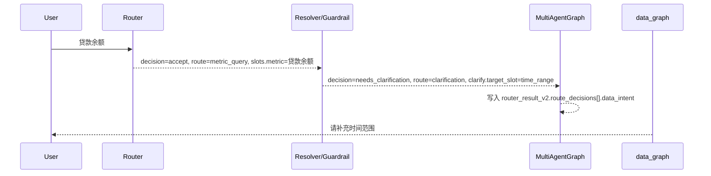
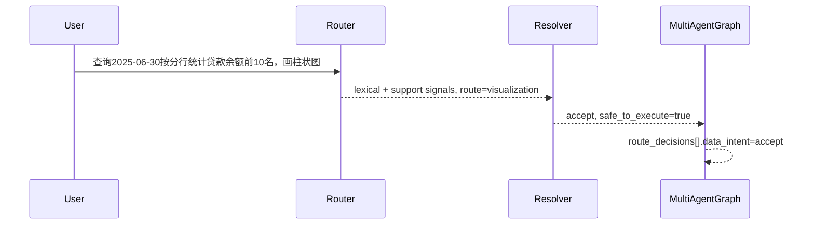

# Agent 意图防误触发重构设计（冻结版）

> 文档版本：v1.3
> 更新时间：2026-03-12
> 设计状态：`approved`

design_approved: true
approved_at: 2026-03-10 00:18 CST
approved_round: 1
approval_evidence: approved_design_and_hydrated_tasks

## 0. 结论先行

- 本轮冻结单方案：把“单关键词命中即触发规则”重构为“多信号 Router Contract 判定 + Resolver 放行 + Guardrail 阻断”。
- 运行态唯一 contract 继续使用 `router_result_v2`；`DataIntentContract` 只允许挂在 `router_result_v2.route_decisions[].data_intent`。
- 单个新的词法信号不得直接放行；只有 `frame-supported supplement` 才允许作为补充轮例外。
- `llm-shadow` 只允许异步旁路对账，不阻塞主回复，不接管主路径。
- 指标真理源冻结为 `t_metric_definition`；列/维度/数据类型真理源冻结为 `t_meta_columns`。
- `clarify` 必须输出结构化 `clarify_contract`，不再从澄清文案倒推槽位。

## 1. product_contract（PRD-Lite）

- target_users: 终端问数用户、AI/后端研发
- core_scenarios: 单关键词碰瓷不误触发；明确表达时正确触发；补充轮依赖 frame 正常放行；低置信度先澄清
- business_goals: 单关键词误触发率下降；问数/图表/TopN 主链路不退化；路由结果可观测；replay 不丢字段
- non_goals: 不新增 `router_result_v3`；不重写 Vanna/SQL 执行栈；不改前端协议
- acceptance_gates: workflow 不再靠关键词直接放行业务分支；统一输出 Router Contract；低置信度必须澄清；时间/列/SQL 安全由确定性 resolver 执行；replay 继续使用 `router_result_v2`

## 2. design_freeze_summary

```yaml
design_freeze_summary:
  design_actionable: true
  missing_blocks: []
  blocked_by: []
  risk_level: medium
  risk_counterexamples_count: 2
  product_contract_ready: true
```

## 3. clarify_handoff_contract

```yaml
clarify_handoff_contract:
  version: v2
  topic: agent-intent-anti-false-trigger
  handoff_ready: true
  required:
    product_contract_summary:
      target_users:
        - 终端问数用户
        - AI/后端研发
      core_scenarios:
        - 单关键词碰瓷不误触发
        - frame-supported supplement 正常放行
        - 低置信度先澄清
      business_goal_metrics:
        - 单关键词误触发率下降
        - router_result_v2 replay 丢字段事件数 = 0
      non_goals:
        - 不新增 router_result_v3
        - 不重写 Vanna/SQL 执行栈
      acceptance_gates:
        - 只允许 router_result_v2，不新增 v3
        - DataIntentContract 只能挂在 route_decisions[].data_intent
        - workflow 不再直接通过关键词放行业务分支
    requirement_seeds:
      - design_item: D-01-router-contract-single-source
        fr_id: FR-01
      - design_item: D-02-no-single-keyword-trigger
        fr_id: FR-02
      - design_item: D-03-frame-supported-supplement
        fr_id: FR-03
      - design_item: D-04-rule-primary-llm-shadow-async
        fr_id: FR-04
      - design_item: D-05-router-result-v2-nested-data-intent
        fr_id: FR-05
      - design_item: D-06-clarify-contract-and-truth-source
        fr_id: FR-06
      - design_item: D-07-doc-sync-and-plan-gates
        fr_id: FR-07
    implementation_seeds:
      - task_id: T01
      - task_id: T02
      - task_id: T03
      - task_id: T04
      - task_id: T05
      - task_id: T06
      - task_id: T07
    execution_chain_seed:
      execution_contract_hint:
        preferred_mode: core
        delivery_mode: staged
        execution_unit: per_task
        commit_policy: per_pr
        stop_boundary: per_pr
```

## 4. clarify_consistency_check

```yaml
clarify_consistency_check:
  clarify_phase: approval
  question_mode: package
  current_round: 1
  open_questions_count: 0
  fail_fast_codes: []
```

## 5. 实现回填（2026-03-12）

- **D-02 落地：metadata substring 误触发已移除**
  - `build_candidate_signals()` 不再对全量 `t_meta_columns.display_name/column_name` 做裸 substring 扫描。
  - 维度词法信号现只来自显式句式提取与 `frame-supported supplement`，像“余额”这类通用词不会再把“贷款余额”抬成伪多信号命中。

- **D-04 落地：`llm-shadow` 已接成异步旁路**
  - `data_graph.analyze_data_intent()` 现在会在 `intent_shadow_enabled=true` 时异步调度 shadow compare。
  - 运行态只记录 `shadow_status + diff_fields + shadow_decision + shadow_reason_code`，不阻塞主回复，也不接管主路径。
  - handoff short-circuit、无事件循环、配置关闭等场景会输出不同 `shadow_status`，便于排障观测。

- **D-05 / D-06 落地：`router_result_v2` 与 clarify contract 已同口径**
  - `router_result_v2.route_decisions[].data_intent` 继续是唯一 runtime/replay contract。
  - `metric-only` 且缺时间的查询（如“贷款余额”）现在会在 resolver/guardrail 阶段直接产出：
    - `decision=needs_clarification`
    - `route=clarification`
    - `clarify_contract.target_slot=time_range`
  - `data_graph` 不再需要把“已 accept 的 contract”二次改写成澄清语义。

- **D-06 落地：真理源收口保持不变**
  - 指标仍只认 `t_metric_definition`
  - 列/维度/数据类型仍只认 `t_meta_columns`
  - 但 `t_meta_columns` 现在只作为 resolver whitelist / truth source 使用，不再被当成自由词法信号发生器。

### 5.1 这次到底解决了什么

本轮不是简单“删关键词”，而是把 data 场景的语义入口从“关键词碰一下就触发”改成“结构化 contract + 真理源校验 + 明确澄清”。
真正关闭的不是一个 if 分支，而是三类长期会回流的问题：

| 问题类型 | 旧行为 | 新行为 | 为什么这样改 |
|---|---|---|---|
| metadata substring 误触发 | `贷款余额` 会因为 `t_meta_columns` 里存在 `余额` 被抬成维度提示 | 只保留显式维度句式，不再把全量元数据当词法信号发生器 | `t_meta_columns` 是 truth source，不是自由语义词表 |
| metric-only 双口径 | router 先写 `accept`，后续 `data_graph` 再改成澄清 | resolver 直接产出 `needs_clarification + clarify_contract(time_range)` | runtime contract 必须一次成型，不能后改口 |
| llm-shadow 占位未接线 | 只写 `shadow_status=bypassed_nonblocking` | 开关开启时异步旁路调度 shadow compare，主路径不受影响 | 设计要求是“旁路对账”，不是“同步 second opinion” |

一句话概括：
**问数主链路现在先产出 canonical contract，再决定是否执行；影子链路只做异步对账和观测。**

### 5.2 根因分析：为什么原方案会反复误触发

#### 根因 A：把真理源误用成词法触发器

`t_meta_columns` 的职责是“列/维度/数据类型真理源”，适合做：
- whitelist 校验
- canonical display name 映射
- 数据类型与列语义补齐

不适合做：
- 任意子串命中触发
- 编排层直接语义判定
- 自由扩散的关键词库

旧实现的问题在于：只要用户文本中出现某个元数据展示名的子串，就把它当成新的 lexical dimension signal。
这会让通用词（如“余额”“金额”“日期”）变成伪维度提示，从而把原本只有 1 个真实信号的问题，抬成“多信号命中”。

#### 根因 B：Router 与 Resolver 没有形成单一放行责任

旧链路的实际责任分裂是：
- Router：先给一个“看起来可执行”的 `accept`
- Resolver：只做部分 truth source 校验，但缺时间时仍可能落成 `safe_to_execute=true`
- `data_graph`：最后再基于 merged frame 和文案逻辑补救成 clarify

这个分裂导致：
- `router_result_v2.route_decisions[].data_intent` 不是运行态唯一真理源
- replay 拿到的是 `accept`，用户实际收到的却是澄清
- review 很难判断到底该信 router、resolver，还是 data_graph

#### 根因 C：shadow 只有“配置姿势”，没有“运行时接线”

设计里本来允许 `llm-shadow` 作为异步旁路，但旧状态只是：
- 配置存在
- helper 存在
- 运行时只写一个 `bypassed_nonblocking`

这意味着从交付角度看，只交付了“预留点”，没有交付“旁路对账”本身。

### 5.3 模块边界与单一职责

本轮落地后，data 意图链路的职责边界明确如下：

| 模块 | 单一职责 | 可以做什么 | 明确不能做什么 |
|---|---|---|---|
| `app/ai/router/data_intent_router.py` | 候选信号提取 + 初始 contract 判定 | 提取 lexical/support/frame signals；基于结构化规则生成 DataIntentContract | 不做真理源 whitelist；不在 workflow 层追加关键词补丁 |
| `app/ai/router/data_intent_resolver.py` | truth source 校验 + 放行/澄清 guardrail | 校验指标/维度真理源；缺关键槽位时直接产出 clarify contract；决定 `safe_to_execute` | 不生成用户文案；不做编排层补丁 |
| `app/ai/workflow/data_graph.py` | 消费 contract + 会话融合 + 最终问数状态输出 | 合并 session/handoff/current frame；读取 clarify contract 生成用户可见澄清；异步调度 shadow compare | 不再通过 substring/关键词/正则自行决定 data 语义是否放行 |
| `app/ai/workflow/multi_agent_graph.py` | 将 contract 嵌入运行态 canonical payload | 把 `data_intent` 挂到 `router_result_v2.route_decisions[]` | 不新增 `router_result_v3`；不平铺第二套 data contract |

收敛后的唯一入口：

```text
single_entry_owner:
  detect_and_contract: app/ai/router/data_intent_router.py::decide_data_intent
  execute_gate: app/ai/router/data_intent_resolver.py::resolve_data_intent
  runtime_embed: app/ai/workflow/multi_agent_graph.py::_apply_router_contract_guard
```

### 5.4 信号模型：什么算有效信号，什么不算

本轮采用三类信号族：

| 信号族 | 例子 | 用途 | 是否可单独放行 |
|---|---|---|---|
| `lexical` | `按分行`、`柱状图`、显式维度句式 | 识别用户当前轮新增结构化意图 | `否` |
| `support` | `metric_metadata_support:贷款余额`、`resolver_precheck_support.time:2025-06-30` | 提供指标/时间等辅助证据 | `否` |
| `frame` | `session_frame_support`、`handoff_frame_support` | 允许补充轮在已有上下文下成立 | 仅 `frame-supported supplement` 场景可作为例外 |

必须遵守的约束：

1. **单个新的词法信号不能直接放行**
   比如只有“按分行”、只有“图表”、只有“支行”，都不能直接执行问数。
2. **只有 `frame-supported supplement` 才允许作为补充轮例外**
   即上一轮已经明确指标/时间/维度，本轮只补图表或层级时，才允许单新增信号放行。
3. **`t_meta_columns` 不是 lexical signal catalog**
   它只参与 whitelist / canonical / truth source，不再参与“看见子串就加分”。

### 5.5 Resolver/Guardrail 的最终判定规则

resolver 的职责不是“修补 router 结果”，而是把执行条件一次性收口。

当前 guardrail 规则如下：

| 条件 | 输出 |
|---|---|
| 指标未命中 `t_metric_definition` | `reject/blocked_by=metric_not_found` |
| 维度未被 `t_meta_columns` whitelist 接住 | `reject/blocked_by=dimension_not_whitelisted` |
| 命中指标，但缺 `time_range` | `needs_clarification + clarify_contract(target_slot=time_range)` |
| 时间存在但解析失败 | `reject/blocked_by=time_parse_failed` |
| 指标/维度/时间都通过 | `accept + safe_to_execute=true` |

这意味着：
**“贷款余额”这种问题，router 可以识别出 metric，但只有 resolver 才能决定它是否已满足执行前提。**

### 5.6 运行态时序（关键场景）

#### 场景 A：纯指标问句，缺时间

用户输入：`贷款余额`



关键点：
- runtime/replay contract 与用户最终看到的澄清已经一致
- 不再出现“route_decision 里是 accept，但 data_graph 又追问时间”的双口径

#### 场景 B：显式多信号 visualization

用户输入：`查询2025-06-30按分行统计贷款余额前10名，画柱状图`



#### 场景 C：补充轮图表切换

上一轮已确认：指标=`贷款余额`，时间=`2025-06-30`，维度=`分行`
本轮输入：`改成图看看`

关键点：
- 当前轮只新增图表信号
- 但由于有 frame support，所以属于允许放行的 supplement 例外
- 该例外仅适用于已存在结构化上下文，不适用于首轮孤立短词

### 5.7 Contract 示例（最终形态）

#### 示例 1：缺时间的 metric-only 查询

```json
{
  "decision": "needs_clarification",
  "route": "clarification",
  "reason_code": "missing_time_range",
  "safe_to_execute": false,
  "slots": {
    "metric": "贷款余额",
    "time_range": null,
    "dimensions": []
  },
  "clarify": {
    "target_slot": "time_range",
    "reason_code": "missing_time_range",
    "prompt_template_key": "ask_time_range"
  }
}
```

#### 示例 2：正常 visualization 查询

```json
{
  "decision": "accept",
  "route": "visualization",
  "reason_code": "multi_signal_accept",
  "safe_to_execute": true,
  "slots": {
    "metric": "贷款余额",
    "time_range": "2025-06-30",
    "dimensions": ["分行"],
    "chart_type": "柱状图",
    "query_shape": "top_n"
  }
}
```

#### 示例 3：llm-shadow 异步对账结果

```json
{
  "status": "mismatch",
  "diff_fields": ["decision", "reason_code"],
  "shadow_decision": "needs_clarification",
  "shadow_reason_code": "llm_shadow_missing_time_range"
}
```

注意：
- 这个结果不会覆盖 primary contract
- 它只用于日志、观测、后续 diff 统计

### 5.8 `llm-shadow` 运行时设计

本轮 shadow 的目标不是“让第二个模型参与主判”，而是“低风险地补一条旁路对账链”。

#### 开关与启用条件

shadow 仅在以下条件同时满足时启用：

1. `intent_mode=model_primary`
2. `intent_shadow_enabled=true`
3. 当前不是 handoff short-circuit
4. 当前线程存在可用事件循环

#### 运行步骤

1. 主路径先完成 `decide_data_intent -> resolve_data_intent`
2. `data_graph.analyze_data_intent()` 在不影响主路径的前提下调用 `_schedule_data_intent_shadow_compare(...)`
3. shadow runner 复用问数意图分析 scene LLM 与既有 prompt，构造影子 contract
4. `shadow_compare_async(...)` 只比较字段差异
5. callback 将结果写日志：`status/diff_fields/shadow_decision/shadow_reason_code`

#### `shadow_status` 状态约定

| 状态 | 含义 |
|---|---|
| `disabled` | 配置未开启 shadow |
| `scheduled_nonblocking` | 已成功异步调度 |
| `skipped_handoff_short_circuit` | 当前轮直接走 handoff frame short-circuit，不跑 shadow |
| `bypassed_no_running_loop` | 当前上下文无事件循环，安全跳过 |
| `shadow_runner_unavailable` | shadow runner 初始化失败 |

#### 为什么必须异步

如果 shadow 同步执行，会带来两个直接问题：

1. 主回复延迟被影子链路放大
2. 一旦 shadow LLM 不稳定，会反向污染问数主链路

所以本设计坚持：
- 主路径先返回
- shadow 只记账
- 只允许“观测差异”，不允许“接管决策”

### 5.9 文档化后的评审关注点

后续 review / verify 不应该再只问“代码是不是改了”，而应该直接对以下问题给结论：

1. `router_result_v2.route_decisions[].data_intent` 是否仍是唯一 runtime contract？
2. `metric-only` 缺时间时，runtime contract 是否直接产出 `clarify_contract(time_range)`？
3. `t_meta_columns` 是否只作为 truth source，不再作为自由 lexical signal source？
4. `llm-shadow` 是否确实是异步旁路，而不是同步 second opinion？
5. replay、clarify、shadow、supplement 四类回归是否都在测试矩阵里？

### 5.10 本轮设计与实现的一致性结论

本轮实现已经与冻结设计对齐到以下程度：

| 设计项 | 结论 |
|---|---|
| `D-01` Router Contract 单一入口 | 已落地 |
| `D-02` 禁止单关键词/伪维度误触发 | 已落地 |
| `D-03` frame-supported supplement 例外 | 已落地 |
| `D-04` llm-shadow 异步旁路 | 已落地 |
| `D-05` `router_result_v2.route_decisions[].data_intent` 单挂载点 | 已落地 |
| `D-06` clarify contract + truth source 收口 | 已落地 |
| `D-07` 文档/规划门禁收口 | 已落地 |
