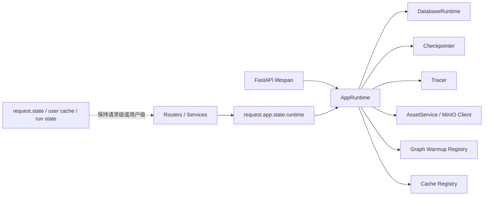

# Lifespan Runtime 收口设计方案

> 日期：2026-03-09  
> 状态：已评审通过（Design Approved）  
> 适用范围：FastAPI 应用级共享资源治理；本期仅覆盖后端 `app/**`，不涉及前端改造

---

## 1. 背景与目标

项目已经使用 FastAPI `lifespan` 管理启动/关闭逻辑，但真正的“应用级共享资源”还散落在多个位置：

1. `app/main.py` 里有启动编排；
2. `app/db/session.py` 里有模块级 engine；
3. `app/services/*.py` 里有全局 singleton；
4. `app/ai/**` 里有独立缓存和图编译缓存；
5. 部分启动副作用仍发生在导入期。

这会带来三个直接问题：

1. **资源 owner 不清楚**：同一类资源可能既在模块全局里活着，又被 `lifespan` 间接依赖；
2. **依赖方向反了**：业务 service 一边做业务，一边顺手创建底层资源；
3. **关闭语义不完整**：有初始化，没有统一 teardown，长期容易积累隐性问题。

本方案目标不是“把更多逻辑塞进 `lifespan`”，而是：

**把应用级共享资源统一收口到单一 runtime owner，由 `lifespan` 负责创建与释放。**

---

## 2. 官方最佳实践依据

| 来源 | 关键结论 | 对本项目的直接含义 |
|---|---|---|
| [FastAPI Lifespan Events](https://fastapi.tiangolo.com/advanced/events/) | 启动/关闭逻辑优先使用 `lifespan`，替代 `startup/shutdown` 事件 | 应用级资源初始化应集中编排，不再分散 |
| [Starlette Lifespan](https://www.starlette.io/lifespan/) | 生命周期内创建的共享资源，应通过应用状态向请求暴露 | 资源应该有单一 owner，而不是模块全局散养 |
| [SQLAlchemy Engine Disposal](https://docs.sqlalchemy.org/en/20/core/connections.html#engine-disposal) | `Engine` 是应用级连接池，应在应用结束时显式 `dispose()` | DB engine 不应只创建不回收 |

补充解释：

1. Starlette 官方提供了 lifespan state 机制；
2. 但为了避免“`lifespan yield state` 一套、`app.state` 又一套”的双 owner 混乱，
3. 本项目最终决策为：**内部只认 `app.state.runtime` 作为唯一应用级状态入口**。

---

## 3. 需求澄清结论

### 3.1 本次要解决什么

1. 统一应用级共享资源的 owner；
2. 把导入期副作用搬回启动期；
3. 给关闭阶段补完整 teardown；
4. 为后续继续消灭模块级 singleton 建一条主干路。

### 3.2 本次不解决什么

1. 不重写所有 service 的调用方式；
2. 不在本期引入第三方 DI 容器；
3. 不把用户级缓存、请求态状态塞进 runtime；
4. 不一次性重构所有 AI 缓存与图缓存。

---

## 4. 方案对比与选型

| 方案 | 做法 | 优点 | 缺点 | 推荐度 |
|---|---|---|---|---|
| A. 维持现状 + 继续往 `main.py` 堆初始化 | 保留模块全局，`lifespan` 只做预热 | 改动小 | owner 仍然分裂，后续只会更乱 | ⭐ |
| B. `app.state.runtime` 单一 owner（推荐） | 由 `lifespan` 创建 `AppRuntime`，请求从 `request.app.state.runtime` 取资源 | 结构清晰、关闭完整、利于持续收口 | 需要补 runtime 契约与迁移 | ⭐⭐⭐⭐⭐ |
| C. 直接引入完整 DI 容器 | 用依赖注入框架托管资源 | 理论上更统一 | 对当前项目过重，超出本期需求 | ⭐⭐ |

**选型结论：方案 B。**

原因很简单：

1. 现在项目未上线，优先做结构正确；
2. 当前资源规模还没大到必须上完整 DI 容器；
3. `app.state.runtime` 足够简单，也最贴合 FastAPI/Starlette 的原生用法。

---

## 5. 架构门禁结论（四段式）

### 5.1 模块边界

- 当前问题：`lifespan`、`db/session.py`、`service singleton`、`AI cache` 都在部分持有应用级资源。
- 最终决策：`lifespan` 只做编排；真正资源统一由 `AppRuntime` 持有。
- 禁止动作：继续新增 `_xxx_service`、`_xxx_cache` 作为应用级 owner；继续在业务 service 内部直接创建 engine/client。

### 5.2 依赖方向

- 当前问题：有些 service 既做业务，又兼做资源工厂，方向反了。
- 最终决策：`app.main -> runtime bootstrap -> services`；service 只能消费 runtime 暴露的资源。
- 禁止动作：`service -> create_engine()/Minio()/Tracer()` 这类反向依赖继续扩散。

### 5.3 状态归属

- 当前问题：应用级状态分散在模块全局变量和类缓存里，没有单一 owner。
- 最终决策：应用级共享资源只认 `app.state.runtime`；请求态、用户态继续留在 request / db / 业务层。
- 禁止动作：同时维护 `app.state.runtime`、模块全局 singleton、请求态镜像三套 owner。

### 5.4 错误处理责任

- 当前问题：有些资源应 fail-fast，有些应降级，但边界未完全固化。
- 最终决策：
  - 核心资源：启动失败直接阻断；
  - 辅助资源：记录日志并降级。
- 禁止动作：把核心依赖静默降级，或把可选能力升级成启动阻断项。

---

## 6. 目标架构



### 6.1 核心概念解释

| 概念 | 在本项目里指什么 | 负责什么 | 不负责什么 |
|---|---|---|---|
| `lifespan` | FastAPI 应用的启动/关闭编排入口 | 在应用启动时创建 `AppRuntime`，在应用关闭时调用 `runtime.aclose()` | 不直接长期持有 DB / graph / cache / asset 这类共享资源 |
| `runtime` | `app.state.runtime`，也就是 `AppRuntime` 实例 | 持有应用级共享资源，统一 owner、统一 teardown | 不承载请求级状态、用户会话、接口临时变量 |
| `cache_registry` | `AppRuntime` 下面的统一命名缓存登记处 | 收口进程级 cache / 共享实例，如 `data_graph` cache、asset service、graph cache | 不存用户级缓存、request state、一次性业务数据 |

可以把三者理解成一条固定关系：

```text
FastAPI 应用启动
    -> lifespan
    -> build_runtime()
    -> AppRuntime
       -> db / tracer / graph / asset_service / cache_registry
    -> app.state.runtime
```

一句话版：

- `lifespan` 负责开机和关机；
- `runtime` 负责真正拿着应用级共享资源；
- `cache_registry` 负责把进程级共享对象按名字收整齐。

### 6.2 Runtime 契约草图

```python
from dataclasses import dataclass
from typing import Any, Optional

@dataclass(slots=True)
class DatabaseRuntime:
    engine: Any
    analytics_engine: Any
    session_factory: Any

@dataclass(slots=True)
class GraphRuntime:
    default_multi_agent_graph: Optional[Any]

@dataclass(slots=True)
class AppRuntime:
    db: DatabaseRuntime
    checkpointer: Any
    tracer: Any
    asset_service: Optional[Any]
    graphs: GraphRuntime
    cache_registry: Any

    async def aclose(self) -> None:
        ...
```

设计原则：

1. **先有 owner，再暴露 accessor**；
2. **资源尽量成组收口**，比如 DB 相关资源放在 `DatabaseRuntime`；
3. **`lifespan` 只调用 `build_runtime()` / `runtime.aclose()`**，不要把细碎逻辑塞回 `main.py`。

---

## 7. 哪些该放进 runtime / lifespan

### 7.1 第一优先级（本期建议纳入）

| 资源 | 当前位置 | 结论 | 原因 |
|---|---|---|---|
| 启动目录准备 | `app/main.py` | 纳入 | 现在是导入期副作用，应该回到启动期 |
| Checkpointer | `app/db/postgres_checkpoint.py` + `app/main.py` | 纳入 | 已经是应用级资源，只需并入 runtime owner |
| Tracer | `app/ai/utils/observability.py` | 纳入 | 全局单例，且有 flush 语义 |
| 结果增强规则预热 | `app/services/result_enrichment_rule_service.py` | 纳入 | 共享只读配置，启动预热合理 |
| MinIO 客户端 / AssetService | `app/services/asset_service.py` | 纳入 | 外部依赖客户端，适合统一建连与可选健康检查 |
| 默认多智能体图预热 | `app/ai/workflow/multi_agent_graph.py` | 纳入（仅默认组合） | 减少首请求编译抖动 |

### 7.2 第二优先级（下一阶段继续收口）

| 资源 | 当前位置 | 结论 | 原因 |
|---|---|---|---|
| SQLAlchemy `engine` / `analytics_engine` / `SessionLocal` | `app/db/session.py` | 纳入 | 标准应用级资源，应显式 dispose |
| `MetricService` 内部 engine | `app/services/metric_service.py` | 删除重复 owner | 业务 service 不该自己 `create_engine()` |
| `data_graph` 意图策略缓存 | `app/ai/workflow/data_graph.py` | 并入统一缓存 registry | 本质是全局配置快照 |
| `data_access_control` 配置缓存 | `app/ai/semantic/data_access_control.py` | 并入统一缓存 registry | 与系统配置职责重叠 |

### 7.3 明确不放

| 项 | 不放原因 |
|---|---|
| 用户权限上下文缓存 | 这是 `user_id` 级状态，不是应用级常量 |
| `request.state` 里的请求 ID 等信息 | 生命周期跟 request 走 |
| 业务运行态 / 会话态 / thread state | 归属于业务层，不归属于应用生命周期 |

---

## 8. 启动与关闭责任

### 8.1 启动阶段

**必须阻断启动（Fail Fast）**

1. `Settings` 配置校验；
2. 主数据库关键初始化；
3. Checkpointer 初始化；
4. LLM / System / Scene 配置加载与启动一致性校验。

**允许降级启动（Best Effort）**

1. 结果增强规则预热；
2. Tracer 初始化；
3. MinIO 连接检查 / bucket 准备；
4. 默认图预热。

### 8.2 关闭阶段

关闭顺序建议：

1. 停止新请求进入关键共享资源；
2. flush tracer；
3. 关闭 checkpointer；
4. dispose DB engine；
5. 清空 runtime 引用。

原因：先停可选写出，再关连接池，能减少尾部异常和脏日志。

---

## 9. Phase 1 实施范围

### 9.1 本期范围（In Scope）

1. 新增 `AppRuntime` / `build_runtime()` / `runtime.aclose()` 骨架；
2. 把目录准备、Checkpointer、Tracer、结果增强规则预热、可选 AssetService、默认图预热收进 runtime；
3. `app/main.py` 改为只做 `lifespan -> build_runtime -> yield -> aclose`；
4. 补启动/关闭相关单元测试。

### 9.2 本期非目标（Out of Scope）

1. 不在 Phase 1 重写全部 DB 访问入口；
2. 不在 Phase 1 全量替换所有 singleton 调用点；
3. 不在 Phase 1 改造所有 AI cache；
4. 不在 Phase 1 引入新的依赖注入框架。

---

## 10. 迁移阶段规划

### 10.1 分期定义

| 阶段 | 目标 | 重点 |
|---|---|---|
| Phase 1 | 建立 runtime 主干 | 收口启动资源，减少 `main.py` 杂质 |
| Phase 2 | 收口 DB owner | 统一 engine / session_factory，删除 service 内重复 `create_engine()` |
| Phase 3 | 收口全局缓存 | 把 `data_graph` / `data_access_control` 等全局 cache 并入 registry |
| Phase 4 | 继续消灭 singleton | 按模块逐步替换 `_asset_service`、graph cache / provider、`_permission_service` 等 owner；收尾重构不再单列新阶段 |

### 10.2 当前落地总览（截至 2026-03-10）

| 阶段 | 当前状态 | 已落地内容 | 关键文件 | 剩余未收口项 |
|---|---|---|---|---|
| Phase 1 | 已完成 | `lifespan` 只做编排；`AppRuntime` 成为应用级共享资源 owner；导入期目录副作用移出入口 | `app/main.py`、`app/core/runtime.py`、`app/ai/utils/observability.py` | 无 |
| Phase 2 | 已完成 | DB engine / session lifecycle 收口到 runtime；`MetricService` 删除重复 engine owner | `app/db/session.py`、`app/services/metric_service.py` | 无 |
| Phase 3 | 已完成 | `data_graph` 与 `data_access_control` 进程级 cache 收口到统一 `CacheRegistry` | `app/core/cache_registry.py`、`app/ai/workflow/data_graph.py`、`app/ai/semantic/data_access_control.py` | 无 |
| Phase 4 | 持续推进中 | `_asset_service`、graph cache / provider、`PermissionService`、`ResultEnrichmentRuleService`、`RunControlService`、`MetricService` 已收口到 runtime registry；`chat_service` / `chat_api` 已删除模块级 run control 依赖 | `app/services/asset_service.py`、`app/ai/workflow/runtime_graph_provider.py`、`app/ai/workflow/multi_agent_graph.py`、`app/services/permission_service.py`、`app/services/result_enrichment_rule_service.py`、`app/services/run_control_service.py`、`app/services/metric_service.py`、`app/services/chat_service.py`、`app/api/v1/endpoints/chat_api.py` | `app/db/postgres_checkpoint.py`、`app/ai/utils/observability.py`；第二梯队 `app/ai/semantic/vanna_client.py` |

### 10.3 本轮交付边界

1. 本任务线正式阶段只到 `Phase 4`；此前误写为 `Phase 5` 的 graph provider 外移，统一归并为 **Phase 4 收尾重构**。
2. 本轮已经完成 `lifespan -> AppRuntime -> CacheRegistry` 这条主干，不再保留第二套应用级 owner。
3. `lifespan -> AppRuntime -> CacheRegistry` 主干已经稳定，但新识别出的应用级 owner 漏网项仍继续按 `Phase 4` 口径收口。
4. 后续若再发现新的应用级 owner 漏网项，仍应继续按 `Phase 4` 口径收尾，而不是新开 `Phase 5 / Phase 6` 编号。

### 10.4 下一批候选盘点（按官方 lifespan 最佳实践复核）

判定标准只看四件事：
1. 是否是**应用级共享资源**；
2. 是否存在**跨请求共享的可变状态**；
3. 是否适合在启动时预热 / 在关闭时清理；
4. 若继续保留模块级 owner，是否会形成第二套状态归属。

| 优先级 | 候选项 | 当前位置 | 判定 | 原因 |
|---|---|---|---|---|
| P0 | `run_control_service` | `app/services/run_control_service.py` | 已收口 | 模块级 `run_control_service = RunControlService()` 已删除；共享实例改由 registry 持有，`chat_service` / `chat_api` 已切到 `get_run_control_service()` |
| P1 | `MetricService` | `app/services/metric_service.py` | 已收口 | 模块级 `_metric_service` 已删除；`get_metric_service()` 改为 registry-backed，`_existing_tables` 继续留在共享实例内部 |
| P1 | PostgreSQL checkpointer owner | `app/db/postgres_checkpoint.py` | 应继续收口 | 它已经由 runtime 负责 warmup / close，但 `_checkpointer`、`_connection_pool`、`_init_lock` 仍在模块全局，属于“半收口” |
| P1 | tracer owner | `app/ai/utils/observability.py` | 应继续收口 | runtime 已在启动时获取 tracer，并在关闭时 flush，但 `_tracer_instance` 仍是模块级 owner，收口还没做完整 |
| P2 | `VannaClient` | `app/ai/semantic/vanna_client.py` | 视作第二梯队 | 它有全局单例，但更大的根因是内部多次 `create_engine()`；应先解决 engine 复用，再评估是否并入 runtime |
| P3 | chart MCP tools cache | `app/ai/mcp/chart_client.py` | 暂不收口 | 当前只是局部工具缓存，影响面小；优先做代码瘦身，先删死变量 `_mcp_client`，再决定是否需要 runtime 预热 |

### 10.5 不建议放进 lifespan 的项

| 对象 | 当前位置 | 不建议放进 lifespan 的原因 | 更合理方向 |
|---|---|---|---|
| `todo_config` / `todo_dependencies` | `app/ai/config/todo_config.py` | 这是配置和值对象，不是需要统一启动/关闭管理的外部资源 | 保持显式配置；如需治理，优先做配置层瘦身 |
| `recurring_service` | `app/services/recurring_service.py` | 它基本是无状态工具类；放进 runtime 只会增加抽象 | 更 lean 的做法是去掉单例壳，改为模块函数或纯静态调用 |
| `_rule_repo` 等 repo 实例 | `app/api/v1/endpoints/data_admin_api.py` | repo 不持应用级共享状态，也没有独立生命周期 | 保持普通实例或按需创建，不必 runtime 化 |

### 10.6 已落地切片：收口 run_control_service

#### 模块边界
- `RunControlService` 负责“聊天运行控制”的业务语义和内存态读写；
- `AppRuntime` / registry 负责持有它这个应用级共享实例；
- `chat_service`、`chat_api` 只负责使用，不再直接依赖模块级 `run_control_service` 实例。

#### 依赖方向
- 调用方向应收敛为 `chat_service / endpoint -> get_run_control_service() -> runtime registry`；
- 禁止继续通过 `from app.services.run_control_service import run_control_service` 直接绑定模块级实例。

#### 状态归属
- `_runs`、`_active_run_by_thread`、`_stopped_event_emitted`、`_last_activity_flush_at` 这几类跨请求共享内存态，只能由一个 owner 持有；
- 最终 owner 应是 runtime registry，而不是 service 模块全局变量。

#### 错误处理责任
- `RunControlService` 只处理运行控制自身逻辑错误；
- runtime 只负责创建 / 持有 / reset；
- request 链路只决定是否降级继续，不在 import 期做初始化失败兜底。

#### 已落地内容
1. **Slice A：删除模块级 owner**
   - 已新增 `get_run_control_service()` / `reset_run_control_service()`；
   - 已删除 `run_control_service = RunControlService()` 模块级实例；
   - `RunControlService` 类本身保持不变，只收状态 owner。
2. **Slice B：切换调用入口**
   - `chat_service.py`、`chat_api.py` 已改为按需获取共享实例；
   - 没有新增兼容层，也没有保留第二套入口。
3. **Slice C：接入 runtime cleanup**
   - `build_runtime()` 启动时已获取共享实例并记录 `run_control_service` 状态；
   - cleanup 已接入 `reset_run_control_service()`，避免测试和重启后的脏内存态。
4. **Slice D：补回归证据**
   - 已补 registry 复用 / reset 重建测试；
   - run control 相关 chat / API 定向回归已通过。

#### 当前执行切片：收口 `MetricService`

**模块边界**
- `MetricService` 继续负责指标匹配、SQL 依赖表检查和 `_existing_tables` 实例缓存；
- `runtime/registry` 只负责持有共享 `MetricService` 实例，不介入业务语义。

**依赖方向**
- 调用方向保持 `tool/service -> get_metric_service() -> runtime registry`；
- 禁止继续保留模块级 `_metric_service` 作为第二套 owner。

**状态归属**
- `_existing_tables` 仍保留在 `MetricService` 实例内部，因为它属于 service 自身的进程级缓存；
- 共享实例 owner 改由 registry 持有，模块只保留无状态薄 getter。

**错误处理责任**
- 指标匹配失败、表探测失败仍由 `MetricService` 内部记录并降级；
- 本轮不新增强制 startup warmup，避免把普通按需缓存抬成阻断启动项。

**已落地内容**
1. 已删除模块级 `_metric_service`；
2. 已新增 `reset_metric_service()`；
3. `get_metric_service()` 已改为 registry-backed；
4. 调用方签名保持不变，最小回归测试已通过。

#### 当前下一推荐切片
- 优先补齐 `app/db/postgres_checkpoint.py` 与 `app/ai/utils/observability.py` 这两处“runtime 已编排、owner 仍在模块全局”的半收口项；
- 第二梯队仍是 `app/ai/semantic/vanna_client.py` 内部 `create_engine()` 与 client owner 的继续收口。

#### 非目标
- 本轮不改 `MetricService` 的匹配算法；
- 本轮不新增 startup 预热流程；
- 本轮不调整 `data_query_tools` 的调用方式。

---

## 11. 验收标准

1. `app/main.py` 中不再堆积细碎初始化逻辑；
2. 应用级共享资源能通过 `request.app.state.runtime` 访问；
3. 启动/关闭路径具备单测覆盖；
4. 可选资源失败时只降级，不污染核心链路；
5. 没有新增第二套 runtime owner。

---

## 12. 风险与缓解

| 风险 | 影响 | 缓解方式 |
|---|---|---|
| 一次性收太多资源，改动面过大 | 回归成本高 | 严格按 Phase 拆分，Phase 1 只收外层资源 |
| runtime 与原有 singleton 并存太久 | 状态双源 | 每一阶段都要求明确 owner，并删除旧入口 |
| 默认图预热过度 | 启动变慢 | 只预热默认组合，不做全量图编译 |
| 可选资源误设为阻断项 | 启动稳定性下降 | 明确 fail-fast / degrade 边界 |

---

## 13. 设计结论

本项目后续关于 `lifespan` 的治理口径固定为一句话：

**`lifespan` 负责编排，`AppRuntime` 负责持有，service 只负责使用。**

这样做的好处很直接：

1. 谁创建、谁关闭，一眼看清；
2. 以后继续删模块级 singleton 时，有固定落点；
3. 结构会越改越简单，而不是越改越散。
