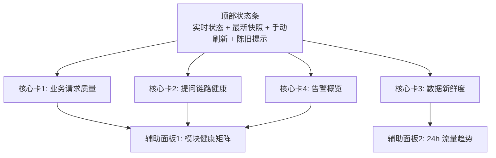

# admin overview 驾驶舱精简设计（冻结单方案）

> 设计目标：把当前“信息块过多、派生分过多、占位项过多”的总览驾驶舱，收敛成“4 张核心卡 + 2 个辅助面板 + 1 条顶部状态条”的可执行单方案。
>
> 外部最佳实践核验日期：2026-03-10。
> 参考来源：
> - Google SRE Workbook - Monitoring：<https://sre.google/workbook/monitoring/>
> - Grafana Docs - Dashboard best practices：<https://grafana.com/docs/grafana/latest/visualizations/dashboards/build-dashboards/best-practices/>
> - Grafana Docs - Alerting best practices：<https://grafana.com/docs/grafana/latest/alerting/guides/best-practices/>
> - Datadog Docs - Getting started with dashboards：<https://docs.datadoghq.com/getting_started/dashboards/>
>
> 本仓库当前事实依据：
> - 当前首页固定 8 块信息：`docs/产品文档/管理后台需求.md`
> - 当前查询层仍输出 `system_status / stability / capacity_cost / change_feed`：`app/services/admin_overview_query_service.py`
> - `stream_interrupt_rate` 当前未接真实数据；`change_feed` 当前恒为空；`capacity_cost` 的成本维度当前未接真实请求成本。

## 1. `scope_contract`
```yaml
scope_contract:
  objective: "冻结 admin overview 首页的精简方案：首页只保留真正支持值班判断与定位动作的信号，删除重复汇总卡与占位卡。"
  scope:
    - "管理后台 `/admin` 首页布局与信息架构。"
    - "`/api/v1/admin-overview` 的 summary/trends/stream 首页消费 contract。"
    - "`AdminOverviewCockpit` 的卡片划分、状态语义与展示层级。"
    - "首页告警、模块矩阵、趋势图之间的职责重分配。"
  boundaries:
    - "本轮不重做分钟桶写入链路，不改 runtime metric schema。"
    - "本轮不新增真实成本采集链路，不把估算成本硬塞回首页。"
    - "本轮不实现新的配置审计/变更流水，只处理首页是否继续展示 `change_feed`。"
    - "本轮不改管理后台其他子页面路由，只保留现有 drill-down 跳转能力。"
  success_criteria:
    - "首页从 8 块收敛为 4 张核心卡 + 2 个辅助面板 + 1 条顶部状态条。"
    - "首页用户在 10 秒内能回答：系统有没有业务样本、是否变慢、数据是否可信、异常集中在哪个模块。"
    - "首页不再展示未接真实数据的占位项。"
    - "首页不再用多个派生总分重复表达同一事实。"
```

## 2. product_contract

- target_users: 后台值班/运营管理员；排障研发
- core_scenarios: 打开 `/admin` 后 3 秒内判断业务是否异常；一跳定位异常模块；数据陈旧时优先提示不可信；无真实变更流时不展示空占位块
- business_goals: 降低首页认知负担；优先展示流量/错误/延迟/数据可信度；让首页成为告警入口和模块定位入口
- non_goals: 不做 BI/经营分析首页；不做按角色分版；不做历史变更审计系统；不为兼容旧 UI 保留重复卡片
- acceptance_gates: 首页保留块都要支持值班判断或 drill-down；`summary/trends/stream` 继续同源；`status` 继续后端唯一产出；移除系统状态/稳定性/容量与成本/关键变更；`用户提问活跃度` 更名为 `提问链路健康`；无动作价值告警不升级为首页告警

```yaml
product_contract:
  target_users:
    - "后台值班/运营管理员"
    - "排查管理后台与聊天链路问题的研发"
  core_scenarios:
    - "S1：值班人打开 `/admin`，3 秒内判断系统当前是否有业务样本、是否发生明显性能/错误异常。"
    - "S2：当用户反馈‘回答慢/报错/没反应’时，值班人能先看首页，再一跳进入异常模块。"
    - "S3：当实时链路中断或快照陈旧时，首页要先告诉用户‘数据不可信’，避免误判。"
    - "S4：当首页无关键变更数据源时，不再保留空占位区块干扰判断。"
  business_goals:
    - "G1：把首页认知负担降到最低，避免‘看起来很全，实际上不好判断’。"
    - "G2：让首页优先展示用户影响信号：流量、错误、延迟、数据新鲜度。"
    - "G3：让首页成为告警入口与模块定位入口，而不是二次汇总分展示墙。"
  business_goal_metrics:
    - "M1：首页首屏主信息块数量 <= 6。"
    - "M2：首页不再展示未接真实数据字段：`stream_interrupt_rate`、空 `change_feed`、伪成本占用。"
    - "M3：首页保留的每一块都能直接回答一个值班问题或支持一次下一步动作。"
    - "M4：首页仅保留一个顶部实时状态提示，不再额外用‘系统状态卡’重复表达。"
  non_goals:
    - "本轮不做 BI/经营分析型首页。"
    - "本轮不做按角色分版。"
    - "本轮不做历史变更审计系统本身。"
    - "本轮不为兼容旧 UI 保留重复卡片。"
  acceptance_gates:
    - "AG1：首页保留块必须都能映射到值班问题或 drill-down 动作。"
    - "AG2：`summary/trends/stream` 继续共享同一分钟桶事实源。"
    - "AG3：`status(ok/no_data/stale/degraded)` 继续由后端唯一产出，前端不猜语义。"
    - "AG4：首页移除 `系统状态`、`稳定性`、`容量与成本`、`关键变更` 四类低增量/占位展示。"
    - "AG5：`用户提问活跃度` 更名为 `提问链路健康`，直到真实活跃度/中断率指标接入前，不再展示伪活跃字段。"
    - "AG6：若告警无动作价值，则不升级为首页告警，只留在趋势/模块面板中辅助观察。"
  release_constraints:
    - "项目未上线，优先结构清晰和简洁，不为兼容旧首页继续背重复债。"
    - "所有被移除的首页能力，若未来重新引入，必须先接入真实数据源再回到首页。"
```

## 3. `architecture_contract`
```yaml
architecture_contract:
  module_boundaries:
    - module: "runtime minute bucket"
      responsibility: "唯一事实源；只负责采集分钟级业务请求与提问链路原始聚合事实。"
    - module: "AdminOverviewQueryService"
      responsibility: "唯一首页查询层；负责 status、告警、模块矩阵、趋势数据的聚合与裁剪。"
    - module: "admin overview API"
      responsibility: "只透出首页需要的 contract；不再把未消费或无真实数据的块继续暴露到首页。"
    - module: "admin-overview normalizer"
      responsibility: "只做字段兼容与默认值填充，不新增业务语义推断。"
    - module: "AdminOverviewCockpit"
      responsibility: "只负责排版、状态渲染和 drill-down；不再额外拼‘系统总分/稳定性二次总分’。"
  dependency_direction:
    - "minute bucket -> AdminOverviewQueryService -> admin overview API -> web normalizer -> AdminOverviewCockpit"
    - "告警概览依赖请求质量/新鲜度/模块矩阵，但首页不再额外派生独立 `稳定性` 总分卡。"
    - "趋势面板依赖同一查询层，不允许单独走另一套历史展示快照。"
  end_to_end_data_flow:
    - "请求与提问链路写入分钟桶。"
    - "查询层从分钟桶构建 `request_quality`、`question_health`、`freshness`、`alert_overview`、`module_matrix`、`traffic_trends`。"
    - "API summary 返回首页当前快照；API trends 返回 24h 趋势；stream 继续推 patch，但 patch 的 canonical 首页字段只允许覆盖上述 6 块。"
  state_lifecycle:
    - "`status` 表示数据可用性：`ok / no_data / stale / degraded`。"
    - "`score` 仅作为单卡内部排序/颜色参考，不再与 `status` 并列显示为第二枚主 badge。"
    - "首页顶部状态条承接 `streaming/polling/error/connecting` 实时链路状态；不再单独保留 `系统状态卡`。"
  exception_semantics:
    - "分钟桶不可读 -> 首页进入 `degraded` 可解释空态，不兜底旧展示快照。"
    - "窗口内无业务样本 -> `request_quality.status=no_data`，不输出误导性健康总分。"
    - "有样本但快照超阈值 -> `freshness.status=stale`，顶部状态条与新鲜度卡显式提示‘数据不可信’。"
    - "告警只承载可动作项；无动作价值的噪音指标不升级为首页告警。"
  replay_canonical_contract:
    canonical_field: "stream.result.data.patch"
    migration_semantics: "summary 与 trends 继续以响应体 root 为 canonical；stream 仅以 `data.patch` 作为首页 patch 真理源，不新增平行 shadow patch 字段。"
```

## 4. 最终方案

### 4.1 首页结构（冻结）



### 4.2 页面信息架构（冻结）

| 层级 | 区块 | 保留/删除 | 作用 | 设计结论 |
|---|---|---|---|---|
| 顶部状态条 | 实时流在线 / 轮询降级 / 最新快照 / 手动刷新 | 保留 | 告诉用户“这页数据现在是否可信、是否在线” | 继续保留，但作为状态条，不占一张卡 |
| 核心卡 | 业务请求质量 | 保留 | 回答“全业务 API 最近 5 分钟质量如何” | 保留 |
| 核心卡 | 提问链路健康 | 保留并更名 | 回答“聊天提问链路是否健康” | 由“活跃度”改为“链路健康”，去掉伪活跃字段 |
| 核心卡 | 数据新鲜度 | 保留 | 回答“当前快照还可信么” | 保留 |
| 核心卡 | 告警概览 | 保留并收敛 | 回答“现在最值得处理的异常是什么” | 只保留 actionable alerts |
| 辅助面板 | 模块健康矩阵 | 保留 | 回答“问题集中在哪个模块” | 保留，支持 drill-down |
| 辅助面板 | 24h 流量趋势 | 新承接 | 回答“这是瞬时抖动还是趋势性变化” | 从现有 capacity/trend 拆成独立趋势面板 |
| 删除 | 系统状态 | 删除 | 与顶部状态条 + 总分重复 | 删除 |
| 删除 | 稳定性 | 删除 | 只是告警与模块分的二次汇总 | 删除 |
| 删除 | 容量与成本 | 删除 | `QPS` 可被趋势承接，成本未接真实数据 | 删除 |
| 删除 | 关键变更 | 删除 | 当前无真实数据源，空占位 | 删除 |

### 4.3 六块数据的唯一语义（冻结）

- `request_quality`
  - 看全业务请求量、QPS、成功率、5xx、P95。
  - 是首页第一优先级信号。
- `question_health`
  - 只看聊天提问链路的请求量、成功率、P95。
  - `stream_interrupt_rate` 未接真实数据前，字段从首页 contract 移除。
- `freshness`
  - 只负责回答“当前快照是否可信”。
  - 这个块陈旧时，首页其余块都默认降一级信任。
- `alert_overview`
  - 只收口当前可动作告警：高 5xx、高 P95、快照陈旧等。
  - 不再展示“无业务样本”这类信息告警为首页主告警；`no_data` 由对应卡本身表达。
- `module_matrix`
  - 只负责定位模块，不再额外产生首页“稳定性总分卡”。
- `traffic_trends`
  - 只负责 24h `request_qps` / `question_qps` 双序列趋势，不再夹带预算/成本占位指标。

### 4.4 首页展示规则（冻结）

1. 顶部状态条继续显示 `streaming / polling / error / connecting`。
2. 每张核心卡最多只展示一个主状态 badge：`status`。
3. `score` 可以保留为主数字或排序依据，但不再额外显示 `health_level` badge，避免出现“预警 + 正常”双标签认知冲突。
4. 告警概览默认只展示最高优先级 1~3 条告警，并保留跳转模块能力。
5. 模块矩阵默认展示 top N（按错误率、延迟、数据延迟综合排序），支持进入模块。
6. 趋势面板默认 24h，双曲线：`request_qps` 与 `question_qps`。

## 5. 决策权衡（仅放弃原因）

- 放弃路径：保留 `系统状态` 卡
  - 放弃原因：与顶部状态条、新鲜度卡、请求质量主分重复；名字还容易让人误以为是 uptime。
- 放弃路径：保留 `稳定性` 卡
  - 放弃原因：只是 `alerts + module_matrix` 的二次加工，不提供新动作。
- 放弃路径：保留 `容量与成本` 卡
  - 放弃原因：当前成本未接真实数据，继续放首页只会制造“看似专业、实际无依据”的伪信息。
- 放弃路径：保留 `关键变更`
  - 放弃原因：当前无真实数据源，空展示没有业务价值，违反“减少认知负担”原则。

## 6. `risk_rollback_contract`
```yaml
risk_rollback_contract:
  key_risks:
    - risk_id: "R-01"
      risk: "一次性收缩首页 contract 后，前后端测试会集中失败。"
      impact: "需要同步更新 API/schema/types/component/tests。"
      counterexample: "如果只删前端卡片、不删后端 contract，会留下继续无人维护的死字段。"
    - risk_id: "R-02"
      risk: "去掉 `health_level` badge 后，团队短期内可能担心‘没有直观红黄绿标签’。"
      impact: "需要用 `status` + 主数字颜色 + 告警概览` 替代旧双 badge 习惯。"
      counterexample: "继续保留双 badge 会延续‘预警 + 正常’的认知冲突。"
    - risk_id: "R-03"
      risk: "未来若补上真实成本/变更流，首页可能需要再次扩容。"
      impact: "需要二次设计回归。"
      counterexample: "现在先把占位项拿掉，等真实数据成熟后再单独评估是否重回首页，整体复杂度更低。"
  rollback_anchors:
    - anchor: "ENABLE_ADMIN_OVERVIEW_SLIM_V2=true"
      default: true
      rollback: false
      rollback_behavior: "关闭后回退到当前首页布局，仅作为临时回退，不保留长期双版本。"
    - anchor: "ENABLE_ADMIN_OVERVIEW_CHANGE_FEED=false"
      default: true
      rollback: false
      rollback_behavior: "在真实变更流接入前，首页不渲染 change feed。"
```

## 7. `requirement_seeds`
```yaml
requirement_seeds:
  - design_item: D-01
    fr_id: FR-01
    trigger: "用户打开 `/admin` 首页"
    input_contract:
      required_fields: [snapshot_at, realtime_status]
      optional_fields: [load_error]
      defaults:
        load_error: ""
    output_contract:
      required_fields: [top_status_bar]
    failure_semantics: "实时链路异常时显示 polling/error，不隐藏页面主体。"
    observability_fields: [snapshot_at, realtime_mode, freshness_status]
    rollback_anchor: ENABLE_ADMIN_OVERVIEW_SLIM_V2=false
    acceptance_cmd_ref: "bash scripts/pytest_targeted.sh tests/api/test_admin_overview_api.py tests/unit/test_admin_overview_query_service.py -q"
  - design_item: D-02
    fr_id: FR-02
    trigger: "首页渲染业务请求质量"
    input_contract:
      required_fields: [request_quality.status, request_quality.request_total, request_quality.qps, request_quality.success_rate, request_quality.error_5xx_rate, request_quality.latency_p95_ms]
      optional_fields: [request_quality.score]
      defaults: {}
    output_contract:
      required_fields: [request_quality_card]
    failure_semantics: "无业务样本时显示 no_data，不补正常分。"
    observability_fields: [request_quality.status, request_quality.error_5xx_rate, request_quality.latency_p95_ms]
    rollback_anchor: ENABLE_ADMIN_OVERVIEW_SLIM_V2=false
    acceptance_cmd_ref: "bash scripts/pytest_targeted.sh tests/unit/test_admin_overview_query_service.py -q"
  - design_item: D-03
    fr_id: FR-03
    trigger: "首页渲染提问链路健康"
    input_contract:
      required_fields: [question_health.status, question_health.question_total, question_health.question_qps, question_health.question_success_rate, question_health.question_latency_p95_ms]
      optional_fields: [question_health.score]
      defaults: {}
    output_contract:
      required_fields: [question_health_card]
    failure_semantics: "无提问样本时显示 no_data；未接真实数据字段不得占位渲染。"
    observability_fields: [question_health.status, question_health.question_total, question_health.question_latency_p95_ms]
    rollback_anchor: ENABLE_ADMIN_OVERVIEW_SLIM_V2=false
    acceptance_cmd_ref: "bash scripts/pytest_targeted.sh tests/unit/test_admin_overview_query_service.py -q"
  - design_item: D-04
    fr_id: FR-04
    trigger: "首页渲染数据新鲜度"
    input_contract:
      required_fields: [freshness.status, freshness.delay_sec, freshness.max_delay_sec, freshness.source]
      optional_fields: []
      defaults: {}
    output_contract:
      required_fields: [freshness_card]
    failure_semantics: "快照陈旧时首页明确标红并保留最后快照时间。"
    observability_fields: [freshness.status, freshness.delay_sec, freshness.source]
    rollback_anchor: ENABLE_ADMIN_OVERVIEW_SLIM_V2=false
    acceptance_cmd_ref: "bash scripts/pytest_targeted.sh tests/api/test_admin_overview_api.py -q"
  - design_item: D-05
    fr_id: FR-05
    trigger: "查询层生成首页告警"
    input_contract:
      required_fields: [request_quality, freshness, module_matrix]
      optional_fields: []
      defaults: {}
    output_contract:
      required_fields: [alert_overview]
    failure_semantics: "不可动作噪音项不升级为首页告警；页面可退化为‘当前无告警’。"
    observability_fields: [alert_code, alert_severity, alert_module]
    rollback_anchor: ENABLE_ADMIN_OVERVIEW_SLIM_V2=false
    acceptance_cmd_ref: "bash scripts/pytest_targeted.sh tests/unit/test_admin_overview_query_service.py -q"
  - design_item: D-06
    fr_id: FR-06
    trigger: "首页展示模块健康矩阵"
    input_contract:
      required_fields: [module_matrix]
      optional_fields: []
      defaults: {}
    output_contract:
      required_fields: [module_matrix_panel]
    failure_semantics: "无模块样本时显示空态，不回退到稳定性总分卡。"
    observability_fields: [module_key, error_rate, latency_p95_ms, data_delay_sec]
    rollback_anchor: ENABLE_ADMIN_OVERVIEW_SLIM_V2=false
    acceptance_cmd_ref: "bash scripts/pytest_targeted.sh tests/unit/test_admin_overview_query_service.py -q"
  - design_item: D-07
    fr_id: FR-07
    trigger: "首页展示 24h 流量趋势"
    input_contract:
      required_fields: [trends.windows.24h]
      optional_fields: []
      defaults: {}
    output_contract:
      required_fields: [traffic_trends_panel]
    failure_semantics: "趋势不可读时只降级趋势面板，不影响核心卡主体。"
    observability_fields: [timestamp, request_qps, question_qps]
    rollback_anchor: ENABLE_ADMIN_OVERVIEW_SLIM_V2=false
    acceptance_cmd_ref: "bash scripts/pytest_targeted.sh tests/api/test_admin_overview_api.py -q"
  - design_item: D-08
    fr_id: FR-08
    trigger: "首页 contract 收敛"
    input_contract:
      required_fields: [summary_contract_v2]
      optional_fields: [legacy_fields]
      defaults:
        legacy_fields: []
    output_contract:
      required_fields: [summary_contract_v3_slim]
    failure_semantics: "旧字段只允许在读路径短暂兼容；首页写路径与流 patch 只写新字段。"
    observability_fields: [meta.generated_at, meta.trace_id]
    rollback_anchor: ENABLE_ADMIN_OVERVIEW_SLIM_V2=false
    acceptance_cmd_ref: "bash scripts/pytest_targeted.sh tests/api/test_admin_overview_api.py web/src/components/admin/overview/__tests__/AdminOverviewCockpit.test.tsx -q"
```

## 8. `implementation_seeds`
```yaml
implementation_seeds:
  - task_id: T-01
    feature_id: P1-01
    blocked_by: []
    file_paths:
      - docs/产品文档/管理后台需求.md
      - docs/API文档/接口文档.md
      - docs/开发文档/架构设计/前端架构.md
    symbols:
      - admin_overview
      - AdminOverviewCockpit
    change_type: modify
  - task_id: T-02
    feature_id: P1-02
    blocked_by: [T-01]
    file_paths:
      - app/services/admin_overview_query_service.py
      - app/schemas/admin_overview.py
      - app/api/v1/endpoints/admin_overview_api.py
    symbols:
      - AdminOverviewQueryService
      - AdminOverviewSnapshot
    change_type: refactor
  - task_id: T-03
    feature_id: P1-03
    blocked_by: [T-02]
    file_paths:
      - web/src/types/admin-overview.ts
      - web/src/lib/admin-overview-api.ts
      - web/src/components/admin/overview/AdminOverviewCockpit.tsx
    symbols:
      - AdminOverviewSnapshot
      - normalizeSummaryPayload
      - AdminOverviewCockpit
    change_type: refactor
  - task_id: T-04
    feature_id: P1-04
    blocked_by: [T-02, T-03]
    file_paths:
      - tests/unit/test_admin_overview_query_service.py
      - tests/api/test_admin_overview_api.py
      - web/src/components/admin/overview/__tests__/AdminOverviewCockpit.test.tsx
    symbols:
      - test_admin_overview_query_service
      - test_admin_overview_api
      - AdminOverviewCockpit
    change_type: modify
```

## 9. `execution_chain_seed`
```yaml
execution_chain_seed:
  preferred_mode: core
  task_key: PP-20260310-admin-overview-slimming
  card_seed: [T-01, T-02, T-03, T-04]
  execution_contract_hint:
    delivery_mode: staged
    execution_unit: all_tasks
    commit_policy: single_commit
    stop_boundary: per_task
```

## 10. `design_freeze_summary`
```yaml
design_freeze_summary:
  design_actionable: true
  missing_blocks: []
  risk_level: medium
  risk_counterexamples_count: 3
  handoff_contract_ready: true
  product_contract_ready: true
  implementation_seed_count: 4
  semantic_frozen: true
  contract_source_decided: true
  handoff_seed_alignment_ok: true
  parallel_dependency_ready: true
  replay_canonical_field_set: true
  blocking_issues: []
```

## 11. `clarify_handoff_contract`
```yaml
clarify_handoff_contract:
  version: v2
  topic: "admin-overview-cockpit-slimming"
  design_source: docs/plans/2026-03-10-admin-overview-cockpit-slimming-design.md
  handoff_ready: true
  required:
    product_contract_summary:
      target_users:
        - "后台值班/运营管理员"
        - "排查管理后台与聊天链路问题的研发"
      core_scenarios:
        - "快速判断业务是否异常"
        - "定位异常模块"
        - "识别数据陈旧/链路降级"
      business_goal_metrics:
        - "首页主信息块数量 <= 6"
        - "首页不展示未接真实数据字段"
        - "首页每一块都支持判断或动作"
      non_goals:
        - "不做经营分析首页"
        - "不做变更审计系统"
      acceptance_gates:
        - "移除 4 类低增量/占位块"
        - "status 继续后端唯一产出"
        - "summary/trends/stream 保持同源"
    requirement_seeds:
      - design_item: D-01
        fr_id: FR-01
        trigger: "用户打开 `/admin` 首页"
        input_contract:
          required_fields: [snapshot_at, realtime_status]
          optional_fields: [load_error]
          defaults:
            load_error: ""
        output_contract:
          required_fields: [top_status_bar]
        failure_semantics: "实时链路异常时显示 polling/error，不隐藏页面主体。"
        observability_fields: [snapshot_at, realtime_mode, freshness_status]
        rollback_anchor: ENABLE_ADMIN_OVERVIEW_SLIM_V2=false
        acceptance_cmd_ref: "bash scripts/pytest_targeted.sh tests/api/test_admin_overview_api.py tests/unit/test_admin_overview_query_service.py -q"
      - design_item: D-02
        fr_id: FR-02
        trigger: "首页渲染业务请求质量"
        input_contract:
          required_fields: [request_quality.status, request_quality.request_total, request_quality.qps, request_quality.success_rate, request_quality.error_5xx_rate, request_quality.latency_p95_ms]
          optional_fields: [request_quality.score]
          defaults: {}
        output_contract:
          required_fields: [request_quality_card]
        failure_semantics: "无业务样本时显示 no_data，不补正常分。"
        observability_fields: [request_quality.status, request_quality.error_5xx_rate, request_quality.latency_p95_ms]
        rollback_anchor: ENABLE_ADMIN_OVERVIEW_SLIM_V2=false
        acceptance_cmd_ref: "bash scripts/pytest_targeted.sh tests/unit/test_admin_overview_query_service.py -q"
      - design_item: D-03
        fr_id: FR-03
        trigger: "首页渲染提问链路健康"
        input_contract:
          required_fields: [question_health.status, question_health.question_total, question_health.question_qps, question_health.question_success_rate, question_health.question_latency_p95_ms]
          optional_fields: [question_health.score]
          defaults: {}
        output_contract:
          required_fields: [question_health_card]
        failure_semantics: "无提问样本时显示 no_data；未接真实数据字段不得占位渲染。"
        observability_fields: [question_health.status, question_health.question_total, question_health.question_latency_p95_ms]
        rollback_anchor: ENABLE_ADMIN_OVERVIEW_SLIM_V2=false
        acceptance_cmd_ref: "bash scripts/pytest_targeted.sh tests/unit/test_admin_overview_query_service.py -q"
      - design_item: D-04
        fr_id: FR-04
        trigger: "首页渲染数据新鲜度"
        input_contract:
          required_fields: [freshness.status, freshness.delay_sec, freshness.max_delay_sec, freshness.source]
          optional_fields: []
          defaults: {}
        output_contract:
          required_fields: [freshness_card]
        failure_semantics: "快照陈旧时首页明确标红并保留最后快照时间。"
        observability_fields: [freshness.status, freshness.delay_sec, freshness.source]
        rollback_anchor: ENABLE_ADMIN_OVERVIEW_SLIM_V2=false
        acceptance_cmd_ref: "bash scripts/pytest_targeted.sh tests/api/test_admin_overview_api.py -q"
      - design_item: D-05
        fr_id: FR-05
        trigger: "查询层生成首页告警"
        input_contract:
          required_fields: [request_quality, freshness, module_matrix]
          optional_fields: []
          defaults: {}
        output_contract:
          required_fields: [alert_overview]
        failure_semantics: "不可动作噪音项不升级为首页告警；页面可退化为‘当前无告警’。"
        observability_fields: [alert_code, alert_severity, alert_module]
        rollback_anchor: ENABLE_ADMIN_OVERVIEW_SLIM_V2=false
        acceptance_cmd_ref: "bash scripts/pytest_targeted.sh tests/unit/test_admin_overview_query_service.py -q"
      - design_item: D-06
        fr_id: FR-06
        trigger: "首页展示模块健康矩阵"
        input_contract:
          required_fields: [module_matrix]
          optional_fields: []
          defaults: {}
        output_contract:
          required_fields: [module_matrix_panel]
        failure_semantics: "无模块样本时显示空态，不回退到稳定性总分卡。"
        observability_fields: [module_key, error_rate, latency_p95_ms, data_delay_sec]
        rollback_anchor: ENABLE_ADMIN_OVERVIEW_SLIM_V2=false
        acceptance_cmd_ref: "bash scripts/pytest_targeted.sh tests/unit/test_admin_overview_query_service.py -q"
      - design_item: D-07
        fr_id: FR-07
        trigger: "首页展示 24h 流量趋势"
        input_contract:
          required_fields: [trends.windows.24h]
          optional_fields: []
          defaults: {}
        output_contract:
          required_fields: [traffic_trends_panel]
        failure_semantics: "趋势不可读时只降级趋势面板，不影响核心卡主体。"
        observability_fields: [timestamp, request_qps, question_qps]
        rollback_anchor: ENABLE_ADMIN_OVERVIEW_SLIM_V2=false
        acceptance_cmd_ref: "bash scripts/pytest_targeted.sh tests/api/test_admin_overview_api.py -q"
      - design_item: D-08
        fr_id: FR-08
        trigger: "首页 contract 收敛"
        input_contract:
          required_fields: [summary_contract_v2]
          optional_fields: [legacy_fields]
          defaults:
            legacy_fields: []
        output_contract:
          required_fields: [summary_contract_v3_slim]
        failure_semantics: "旧字段只允许在读路径短暂兼容；首页写路径与流 patch 只写新字段。"
        observability_fields: [meta.generated_at, meta.trace_id]
        rollback_anchor: ENABLE_ADMIN_OVERVIEW_SLIM_V2=false
        acceptance_cmd_ref: "bash scripts/pytest_targeted.sh tests/api/test_admin_overview_api.py web/src/components/admin/overview/__tests__/AdminOverviewCockpit.test.tsx -q"
    implementation_seeds:
      - task_id: T-01
        feature_id: P1-01
        blocked_by: []
        file_paths:
          - docs/产品文档/管理后台需求.md
          - docs/API文档/接口文档.md
          - docs/开发文档/架构设计/前端架构.md
        symbols: [admin_overview, AdminOverviewCockpit]
        change_type: modify
      - task_id: T-02
        feature_id: P1-02
        blocked_by: [T-01]
        file_paths:
          - app/services/admin_overview_query_service.py
          - app/schemas/admin_overview.py
          - app/api/v1/endpoints/admin_overview_api.py
        symbols: [AdminOverviewQueryService, AdminOverviewSnapshot]
        change_type: refactor
      - task_id: T-03
        feature_id: P1-03
        blocked_by: [T-02]
        file_paths:
          - web/src/types/admin-overview.ts
          - web/src/lib/admin-overview-api.ts
          - web/src/components/admin/overview/AdminOverviewCockpit.tsx
        symbols: [AdminOverviewSnapshot, normalizeSummaryPayload, AdminOverviewCockpit]
        change_type: refactor
      - task_id: T-04
        feature_id: P1-04
        blocked_by: [T-02, T-03]
        file_paths:
          - tests/unit/test_admin_overview_query_service.py
          - tests/api/test_admin_overview_api.py
          - web/src/components/admin/overview/__tests__/AdminOverviewCockpit.test.tsx
        symbols: [test_admin_overview_query_service, test_admin_overview_api, AdminOverviewCockpit]
        change_type: modify
    execution_chain_seed:
      preferred_mode: core
      task_key: PP-20260310-admin-overview-slimming
      card_seed: [T-01, T-02, T-03, T-04]
      execution_contract_hint:
        delivery_mode: staged
        execution_unit: all_tasks
        commit_policy: single_commit
        stop_boundary: per_task
    alignment_contract:
      strict_match: true
      requirement_seed_ids: [D-01, D-02, D-03, D-04, D-05, D-06, D-07, D-08]
      implementation_task_ids: [T-01, T-02, T-03, T-04]
      card_seed_ids: [T-01, T-02, T-03, T-04]
  extended:
    observability_hints:
      - "首页先看症状信号：错误、延迟、流量、数据新鲜度。"
      - "模块矩阵负责 drill-down，不再额外导出稳定性总分。"
    risk_counterexample_map:
      - risk_id: R-01
        counterexample: "只删前端不删 API contract，导致后端死字段继续漂移。"
        verify_cmd: "bash scripts/pytest_targeted.sh tests/api/test_admin_overview_api.py tests/unit/test_admin_overview_query_service.py -q"
      - risk_id: R-02
        counterexample: "双 badge 继续并列展示，用户仍看到‘预警 + 正常’冲突。"
        verify_cmd: "bash scripts/pytest_targeted.sh web/src/components/admin/overview/__tests__/AdminOverviewCockpit.test.tsx -q"
      - risk_id: R-03
        counterexample: "把空的 change feed 保留在首页，用户继续把空占位误认为故障。"
        verify_cmd: "bash scripts/pytest_targeted.sh web/src/components/admin/overview/__tests__/AdminOverviewCockpit.test.tsx -q"
    assumptions:
      - "现有分钟桶字段足够支撑请求质量/提问链路/新鲜度/模块矩阵/趋势。"
      - "真实成本与变更流不在本轮接入范围。"
```

## 12. `clarify_consistency_check`
```yaml
clarify_consistency_check:
  clarify_phase: approval
  current_round: 1
  question_mode: package
  open_questions_count: 0
  product_contract_ready: true
  semantic_frozen: true
  contract_source_decided: true
  handoff_seed_alignment_ok: true
  parallel_dependency_ready: true
  replay_canonical_field_set: true
  fail_fast_codes: []
```

## 13. 审批记录
```yaml
design_approval:
  design_approved: true
  approved_at: "2026-03-10 21:21:12 CST"
  approved_round: "round-1"
  approval_evidence: "用户明确触发：$jjk-plan"
  approval_mode: "explicit"
  go_no_go: "GO"
```

- design_approved: true
- approved_at: 2026-03-10 21:21:12 CST
- approved_round: round-1
- approval_evidence: 用户明确触发：$jjk-plan
- approval_mode: explicit
- go_no_go: GO
