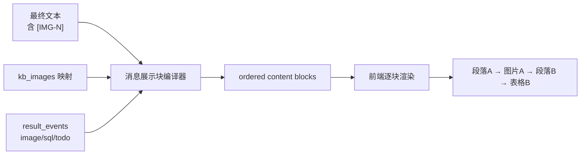
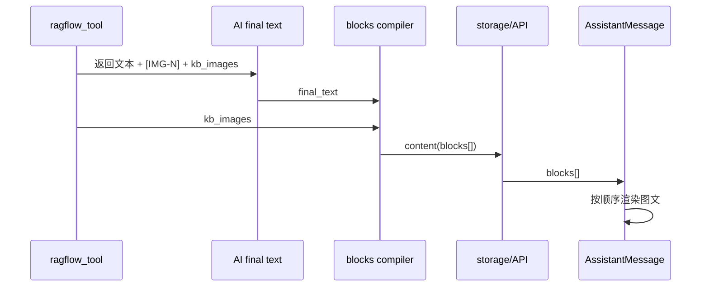

# 有序内容块（Ordered Content Blocks）设计

> 设计日期：2026-03-11
> 状态：已冻结，允许进入 implementation plan
> 目标：把 AI 回复中的文字、知识库图片、工具生成图片、SQL 结果、Todo 卡片按自然顺序放在一起展示，并收敛为单一消息契约

---

## 1. 执行结论（先说结论）

- 采用 **有序内容块** 作为 AI 消息的最终展示协议，`message.content` 成为唯一渲染真相源。
- **保留知识库 `[IMG-N]` 占位符**，但只把它当作中间锚点，不再让前端或落库层直接做 Markdown 字符串替换。
- 新增 **消息展示块编译器**，负责把：
  - 最终文本
  - 知识库 `kb_images`
  - 结构化 `result_events`
  统一编译成有序块数组。
- 历史回放、最终消息展示、知识库图文贴靠问题都用同一协议解决；不再允许“正文一条线、结果卡片一条线”的双轨渲染。
- 本次属于 **refactor / contract 收敛**，不是 patch。



---

## 2. 现状与根因

### 2.1 当前现象

当前聊天消息的展示事实被拆成了三路：

1. `message.content`：正文字符串；
2. `additional_kwargs.result_events`：图片 / SQL / Todo 等结构化结果；
3. `kb_images`：知识库图片占位符映射。

于是前端只能：

- 先把整段 Markdown 渲染完；
- 再把 `result_events` 统一补在正文下方；
- 再在某些位置做 `[IMG-N] -> ` 字符串替换。

这就是“文字和图片挨不住”的根因。

### 2.2 当前问题落点

| 问题 | 当前位置 | 根因 |
|---|---|---|
| 正文与图片分家 | `web/src/components/chat/messages/ai.tsx` | 先渲正文、后渲 `result_events` |
| 知识库图片靠字符串替换 | `web/src/components/chat/utils.ts` | 渲染层在背结构债 |
| 保存前把占位符打平成 Markdown | `app/repositories/chat_repo.py` | 结构信息丢失 |
| 图表图片未引用时补到末尾 | `app/repositories/chat_repo.py` | 用补丁掩盖布局问题 |
| 历史回放仍以字符串为主 | `app/api/v1/endpoints/chat_api.py` / `web/src/lib/message-normalizer.ts` | 没有 canonical block contract |

---

## 3. 最佳实践核验（官方口径）

截至 2026-03-11，官方与权威资料的共同结论很一致：**多模态消息应建模为有序内容块，而不是拼成一段大字符串再猜着渲染。**

| 来源 | 观察 | 设计含义 |
|---|---|---|
| OpenAI Responses API | 输入/输出都围绕结构化 item / content part 组织 | 文本、图片、工具结果天然适合用 block 数组表达 |
| Anthropic Messages / Tool Use | `content` 是有序块数组，可混排 text / image / tool | 工具结果不应挂在正文外侧当“附件” |
| W3C Images Tutorial | 图片说明、上下文、替代文本应与图片保持就近关系 | 图文必须在渲染层可相邻呈现，不能统一甩到消息底部 |

参考链接：

- OpenAI Responses API: <https://platform.openai.com/docs/api-reference/responses/create>
- Anthropic Tool Use / Messages: <https://docs.anthropic.com/en/docs/agents-and-tools/tool-use/implement-tool-use>
- W3C Images Tutorial: <https://www.w3.org/WAI/tutorials/images/>

---

## 4. 架构门禁结论

### 4.1 模块边界

- **当前问题**：`AssistantMessage` 既在渲染，又在做图片替换、去重、结果拼接；`chat_repo` 既在保存，又在偷偷改写用户可见内容。
- **最终决策**：
  - 后端新增 `message display blocks compiler`，负责把多来源消息材料编译成有序块；
  - 前端只负责按块渲染，不负责猜结构；
  - `ragflow_tool` 继续负责产出 `[IMG-N]` 与映射，不负责展示；
  - `result_events` 继续表达结构化结果，不再直接决定最终布局。
- **禁止动作**：
  - 禁止继续在 `AssistantMessage` 里新增正则/关键词/去重补丁；
  - 禁止在 `chat_repo.save_conversation_from_messages()` 中继续拼接“补末尾图片”。

### 4.2 依赖方向

- **当前问题**：`content`、`kb_images`、`result_events` 三条链路同时决定 UI，依赖方向混乱。
- **最终决策**：
  - `tool/LLM output -> blocks compiler -> message.content(blocks) -> API/SSE/view`；
  - `result_events`、`kb_images` 只作为编译输入，不再与 `content` 并列成为展示真相源。
- **禁止动作**：
  - 禁止新增“content 渲正文、additional_kwargs 渲卡片”的第四种约定；
  - 禁止让前端依赖散落在不同字段里的局部规则来拼 UI。

### 4.3 状态归属

- **当前问题**：渲染真相源同时散落在 `content`、`result_events`、`kb_images`。
- **最终决策**：
  - **最终展示真相源 = `message.content` 中的有序内容块**；
  - `kb_images` 只是编译期辅助状态；
  - `result_events` 只是原始结构化结果输入与回放兼容源；
  - 历史消息优先读取 `content(blocks)`，旧消息再走兼容编译。
- **禁止动作**：
  - 禁止继续把“最终 UI”依赖于运行时字符串替换；
  - 禁止继续让 `content` 和 `result_events` 双写承担同等事实源职责。

### 4.4 错误处理责任

- **当前问题**：图片找不到、占位符没映射、结果类型未知时，缺少统一降级口径。
- **最终决策**：
  - 编译器负责：
    - 未解析占位符保留为 Markdown 文本；
    - 未注册 `result_event` 转成 `fallback_result` block；
    - 缺少 URL 的图片事件直接跳过并记日志；
  - 渲染层负责：
    - 图片加载失败显示占位说明；
    - fallback block 按统一告警卡展示。
- **禁止动作**：
  - 禁止把降级逻辑散落到多个组件；
  - 禁止用“没引用就自动追加到最后”掩盖编译失败。

---

## 5. 根因层级与 Gate 结论

| 项 | 结论 |
|---|---|
| 根因层级 | `contract + state` |
| 修复类型 | `refactor` |
| Allowed Change Set | 新增 block compiler、切换 AI message 渲染入口、保留 `[IMG-N]` 作为中间语法、历史消息读旧写新 |
| Forbidden Change Set | 继续前端字符串替换、继续末尾补图、继续双轨渲染 |
| Gate 结论 | `GO_PLAN` |

---

## 6. 瘦身合同（shrink contract）

### 6.1 obsolete_paths

- `web/src/components/chat/utils.ts` 中直接把 `[IMG-N]` 替换成 Markdown 图片的展示职责
- `web/src/components/chat/messages/ai.tsx` 中“正文先渲、结果后渲”的双轨主路径
- `app/repositories/chat_repo.py` 中保存前把 `[IMG-N]` 改写成 Markdown 图片的逻辑
- `app/repositories/chat_repo.py` 中“图表图片未引用则自动追加到末尾”的逻辑

### 6.2 retained_paths

- `app/ai/prompts/knowledge_prompts.py` 中“回答里保留 `[IMG-N]`”的要求
  **唯一理由**：当前知识库链路已经稳定使用占位符表达图片插入位置，这是最干净的中间语法，不应在模型层撤掉。
- `app/ai/tools/ragflow_tool.py` 中 `[IMG-N] + kb_images` 的生成逻辑
  **唯一理由**：它提供了“图片应该插在什么段落附近”的显式锚点，短期内比自然语言猜测更稳定。

### 6.3 single_entry_owner

- 建议新增：`app/core/message_display_blocks.py`

### 6.4 line_budget

- 本次属于结构收敛，允许新增单独编译模块与块渲染组件；
- 但必须同步删除旧字符串替换和末尾补图逻辑，避免继续长胖。

---

## 7. 目标契约

### 7.1 最终消息内容结构

目标是把 AI 消息统一保存为：

```json
[
  { "type": "markdown", "data": { "text": "明天天气如下：" } },
  { "type": "image", "data": { "url": "/charts/circle.png", "alt": "圆图", "source": "tool" } },
  { "type": "markdown", "data": { "text": "电子渠道开户分两类：" } },
  { "type": "image", "data": { "url": "/api/v1/assets/proxy/ragflow/img-1", "alt": "知识库图片", "source": "knowledge" } },
  { "type": "sql_result", "data": { "columns": ["name"], "rows": [{ "name": "A" }] } }
]
```

### 7.2 推荐 block 类型

| type | data 结构 | 用途 |
|---|---|---|
| `markdown` | `{ text: string }` | 标题、段落、来源说明 |
| `image` | `{ url, alt?, caption?, source }` | 知识库图、工具生成图 |
| `sql_result` | 沿用当前 `result_event.data` | SQL 表格/图表卡片 |
| `todo_list` | 沿用当前 `result_event.data` | 待办卡片 |
| `fallback_result` | `{ data_type, preview }` | 未注册结果兜底 |

备注：现有前端 `ContentBlock` 类型可扩展，不需要重新发明第二套消息模型。

---

## 8. 编译器设计

### 8.1 输入

编译器接收四类输入：

1. `final_text`：AI 最终文本；
2. `kb_images`：`{ index -> url }`；
3. `result_events`：有序结构化结果；
4. `thinking_content`：如存在，作为独立前缀文本块处理或继续保留现有 `<think>` 约定。

### 8.2 核心规则

1. 先按 `[IMG-N]` 把 `final_text` 切成若干文本片段；
2. 每遇到一个已解析占位符，插入 `image(source=knowledge)` block；
3. `result_events` 按 `sequence_number` 保序编译：
   - `image` -> `image(source=tool)`
   - `sql_result` -> `sql_result`
   - `todo_list` -> `todo_list`
   - 未知类型 -> `fallback_result`
4. 编译结束后做一次轻量去空块：
   - 空文本块删除；
   - 连续文本块可合并；
   - 同 URL 且同 source 的重复图片块只保留一份。

### 8.3 单一 owner

- **最终 owner**：后端编译器 `app/core/message_display_blocks.py`
- **前端职责**：只渲染 block，不承担结构判断。

---

## 9. 数据流设计

### 9.1 知识库路径



结论：知识库图片问题可以直接被这套结构解决，因为 `[IMG-N]` 已经天然表达了“插在这里”。

### 9.2 工具生成图片路径

- `fig_inter` 继续发 `result(image)`；
- 但图片不再通过“末尾补图”进入正文；
- 而是由编译器按事件顺序插成 `image(source=tool)` block。

### 9.3 历史回放路径

- 新消息：优先存 `content_type=multimodal` + `content=blocks[]`；
- 旧消息：若只有字符串正文 + `result_events`，在 API 或 normalizer 层做一次兼容编译；
- 一旦存在 canonical blocks，前端必须优先读 blocks，不再回退到双轨渲染。

---

## 10. 渐进迁移策略

### Phase 1：先收口“最终展示”和“历史回放”

- 后端保存 canonical blocks；
- API 历史查询返回 blocks；
- 前端 `AssistantMessage` 优先渲染 blocks；
- 旧消息走兼容编译。

**收益**：用户刷新页面、查看历史线程时，图文一定贴在一起。

### Phase 2：补齐流式预览一致性

- SSE 新增 `display_blocks` 快照或等价事件；
- 前端 in-flight 消息直接渲染 block snapshot；
- 删除前端临时兼容编译逻辑。

**收益**：实时流式阶段与历史回放使用同一份展示协议。

### 为什么分两期

- 直接一口气改 streaming + persistence + history + renderer，改面过大；
- Phase 1 已经能解决截图里的主要问题；
- Phase 2 再把临时过渡彻底删除，更稳也更容易验收。

---

## 11. 实现影响面

| 层 | 文件 | 变更方向 |
|---|---|---|
| 编译器 | `app/core/message_display_blocks.py` | 新增 canonical blocks compiler |
| 落库 | `app/repositories/chat_repo.py` | 保存 blocks，删除占位符转 Markdown / 末尾补图 |
| API 回放 | `app/api/v1/endpoints/chat_api.py` | 返回 multimodal blocks，读旧写新兼容 |
| 类型 | `web/src/types/message.ts` | 扩展 AI block 类型 |
| 标准化 | `web/src/lib/message-normalizer.ts` | 优先保留 blocks，不再打平为纯正文 |
| 渲染 | `web/src/components/chat/messages/ai.tsx` | 改为逐块渲染 |
| 组件 | `web/src/components/chat/messages/assistant-content-blocks.tsx` | 新增块渲染器 |
| 流式 | `web/src/hooks/useSSEStream.ts` | Phase 2 再补 block snapshot |

---

## 12. 验证策略

### 12.1 后端定向测试

- 新增 `tests/unit/test_message_display_blocks.py`
- 新增 `tests/unit/test_chat_repo_message_blocks.py`
- 回归：`tests/unit/test_ragflow_tool.py`
- 回归：`tests/api/test_chat_api.py`

### 12.2 前端/端到端验证

- 新增或扩展 Playwright 用例：
  - 知识库问答：图片出现在对应段落旁边；
  - 图表生成：图表出现在说明段后，而不是消息底部；
  - 刷新页面后布局保持不变。

### 12.3 非触发项

- 本任务不涉及端口/服务启动问题，不强制运行态端口校验；
- 若后续做 Playwright 联调，再补运行态最小校验集。

---

## 13. 非目标

- 本轮不改知识库召回排序、不改 RAG 语义质量；
- 本轮不引入新的前端测试框架；
- 本轮不新增数据库表；
- 本轮不把工具消息本身改造成用户可见消息。

---

## 14. 风险与取舍

| 风险 | 处理 |
|---|---|
| 旧消息只有纯字符串，没有 blocks | API/normalizer 做兼容编译 |
| 流式阶段与历史回放短期不完全一致 | 用 Phase 2 明确收口，不把兼容逻辑变长期 owner |
| `result_events` 顺序不稳定 | 继续以 `sequence_number` 作为编译顺序依据 |
| 知识库图片重复引用 | 编译器按 `source + url` 去重 |

---

## 15. 下一步

- 进入 `writing-plans` 阶段；
- 输出 implementation plan；
- 若后续批准实现，优先按 Phase 1 落地，再决定是否继续做 Phase 2。
