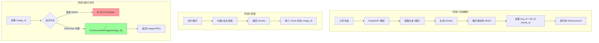

# RAGFlow 图片展示功能完整流程检查与改造评估

## 流程完整性检查

### ✅ 已验证的环节



---

## 各环节验证结果

| 环节 | 状态 | 验证方式 | 结果 |
|------|------|----------|------|
| 文档解析 | ✅ | 代码分析 | `document_service.py:1191` 正确设置 `img_id` |
| MinIO 存储 | ✅ | 桶检查 | 图片已存储在 `7c112617e91411f08852712b5dc403b8` 桶 |
| Elasticsearch 索引 | ✅ | 代码分析 | `img_id` 字段随 chunk 一起索引 |
| 检索 API 返回 | ✅ | 代码分析 | `search.py:470` 返回 `image_id` |
| MinIO 直接访问 | ❌ | curl 测试 | **403 Forbidden** - 桶权限为 private |
| RAGFlow 图片代理 | ✅ | curl 测试 | `/v1/document/image/{image_id}` 返回 200 |

---

## 关键发现

### 1. MinIO 桶权限问题

```bash
# 验证命令
docker exec fastapi-minio mc anonymous get local/7c112617e91411f08852712b5dc403b8
# 输出: Access permission for `local/7c112617e91411f08852712b5dc403b8` is `private`

# 直接访问失败
curl -I "http://localhost:19000/7c112617e91411f08852712b5dc403b8/c354179ee2213e12"
# HTTP/1.1 403 Forbidden
```

### 2. RAGFlow 图片代理 API

**官方版已经提供了图片代理接口**：

```python
# document_app.py:779-792
@manager.route("/image/<image_id>", methods=["GET"])
async def get_image(image_id):
    arr = image_id.split("-")
    bkt, nm = image_id.split("-")
    data = await asyncio.to_thread(settings.STORAGE_IMPL.get, bkt, nm)
    response = await make_response(data)
    response.headers.set("Content-Type", "image/JPEG")
    return response
```

**验证成功**：
```bash
curl -I "http://localhost:80/v1/document/image/7c112617e91411f08852712b5dc403b8-c354179ee2213e12"
# HTTP/1.1 200 
# Content-Type: image/JPEG
# Content-Length: 105091
```

---

## 改造方案

### 方案选择

| 方案 | 改动量 | 难度 | 推荐度 |
|------|--------|------|--------|
| A. 使用 RAGFlow 图片代理 API | ⭐ 极少 | ⭐ 简单 | ⭐⭐⭐⭐⭐ |
| B. 设置 MinIO 桶为公开 | ⭐⭐ 少 | ⭐⭐ 中等 | ⭐⭐⭐ |
| C. 修改 RAGFlow 源码 | ⭐⭐⭐⭐⭐ 大 | ⭐⭐⭐⭐ 高 | ⭐⭐ |

**推荐：方案 A** - 使用 RAGFlow 图片代理 API

---

## 方案 A：使用 RAGFlow 图片代理（推荐）

### 改造难度评估

| 项目 | 工作量 | 复杂度 | 说明 |
|------|--------|--------|------|
| 图片 URL 拼接 | 0.5h | ⭐ | 简单字符串拼接 |
| 前端 Markdown 渲染 | 1h | ⭐⭐ | 已有 react-markdown 支持 |
| 引用标记处理 | 1h | ⭐⭐ | 正则替换 |
| 测试验证 | 0.5h | ⭐ | API 调用测试 |
| **总计** | **3h** | **简单** | - |

### 实现代码

#### 后端：处理检索结果

```python
RAGFLOW_URL = "http://localhost:80"  # RAGFlow 地址

def process_chunks_with_images(chunks: list) -> list:
    """
    处理 chunks，添加图片 URL
    使用 RAGFlow 的图片代理 API
    """
    for chunk in chunks:
        image_id = chunk.get("image_id")
        if image_id:
            # 使用 RAGFlow 图片代理 API
            chunk["image_url"] = f"{RAGFLOW_URL}/v1/document/image/{image_id}"
    return chunks


def format_rag_context(chunks: list) -> str:
    """
    格式化检索结果为 LLM 上下文
    包含图片引用标记
    """
    context_parts = []
    for i, chunk in enumerate(chunks):
        text = chunk.get("content_with_weight", chunk.get("content", ""))
        doc_name = chunk.get("docnm_kwd", chunk.get("document_keyword", "未知来源"))
        
        # 格式: ##索引$$内容
        part = f"##参考{i}$$\n来源: {doc_name}\n内容: {text}"
        
        # 如果有图片，添加提示
        if chunk.get("image_url"):
            part += f"\n[该内容有相关图片]"
        
        context_parts.append(part)
    
    return "\n\n---\n\n".join(context_parts)


def insert_images_into_answer(answer: str, chunks: list) -> str:
    """
    在回答中插入图片
    将引用标记替换为 Markdown 图片
    """
    import re
    
    processed_images = set()
    
    def replace_citation(match):
        # 提取索引号 (支持 ##参考N$$ 或 ##N$$ 格式)
        text = match.group(1)
        try:
            idx = int(text.replace("参考", ""))
        except:
            return match.group(0)
        
        if idx >= len(chunks):
            return match.group(0)
        
        chunk = chunks[idx]
        image_url = chunk.get("image_url")
        
        if not image_url or image_url in processed_images:
            return match.group(0)
        
        processed_images.add(image_url)
        
        # 返回原引用 + 图片
        return f'{match.group(0)}\n\n'
    
    # 匹配 ##参考N$$ 或 ##N$$ 格式
    answer = re.sub(r'##(参考?\d+)\$\$', replace_citation, answer)
    
    return answer
```

#### 前端：渲染带图片的 Markdown

```tsx
// components/chat/MessageRenderer.tsx
import ReactMarkdown from 'react-markdown';
import rehypeRaw from 'rehype-raw';

interface MessageRendererProps {
  content: string;
}

export function MessageRenderer({ content }: MessageRendererProps) {
  return (
    <ReactMarkdown
      rehypePlugins={[rehypeRaw]}
      components={{
        img: ({ src, alt }) => (
           window.open(src, '_blank')}
          />
        ),
      }}
    >
      {content}
    </ReactMarkdown>
  );
}
```

---

## 完整调用流程示例

```python
import httpx

RAGFLOW_URL = "http://localhost:80"
RAGFLOW_API_KEY = "ragflow-Ntr71mkL76PdRlwtMz75kbeRE37WIhUj-QY1pnhGPIM"
KB_ID = "7c112617e91411f08852712b5dc403b8"

async def rag_with_images(question: str) -> str:
    """完整的带图片 RAG 流程"""
    
    # 1. 检索知识库
    async with httpx.AsyncClient() as client:
        response = await client.post(
            f"{RAGFLOW_URL}/api/v1/retrieval",
            headers={"Authorization": f"Bearer {RAGFLOW_API_KEY}"},
            json={
                "question": question,
                "dataset_ids": [KB_ID],
                "top_k": 5,
            }
        )
        result = response.json()
    
    chunks = result.get("data", {}).get("chunks", [])
    
    # 2. 处理 chunks，添加图片 URL
    chunks = process_chunks_with_images(chunks)
    
    # 3. 构建带引用标记的上下文
    context = format_rag_context(chunks)
    
    # 4. 调用 LLM 生成回答
    answer = await call_llm(question, context)  # 您的 LLM 调用
    
    # 5. 在回答中插入图片
    final_answer = insert_images_into_answer(answer, chunks)
    
    return final_answer
```

---

## 测试验证清单

- [ ] 验证图片代理 URL 可访问
  ```bash
  curl "http://localhost:80/v1/document/image/7c112617e91411f08852712b5dc403b8-c354179ee2213e12" -o test.jpg
  file test.jpg  # 应显示: JPEG image data
  ```

- [ ] 验证检索 API 返回 image_id
  ```bash
  curl -X POST "http://localhost:80/api/v1/retrieval" \
    -H "Authorization: Bearer YOUR_API_KEY" \
    -H "Content-Type: application/json" \
    -d '{"question": "登录问题", "dataset_ids": ["KB_ID"]}'
  # 检查返回的 chunks 中是否包含 image_id
  ```

- [ ] 前端图片渲染测试
  - 确保 react-markdown 配置了 rehypeRaw 插件
  - 确保 img 标签正确显示

---

## 潜在问题与解决方案

### 问题 1：跨域访问 (CORS)

如果前端和 RAGFlow 不在同一域：

**解决方案**：在您的后端创建图片代理

```python
# app/api/v1/endpoints/image_proxy.py
from fastapi import APIRouter
from fastapi.responses import Response
import httpx

router = APIRouter()

@router.get("/image/{kb_id}/{image_id}")
async def proxy_image(kb_id: str, image_id: str):
    url = f"http://ragflow:80/v1/document/image/{kb_id}-{image_id}"
    async with httpx.AsyncClient() as client:
        response = await client.get(url)
        return Response(
            content=response.content,
            media_type="image/jpeg",
            headers={"Cache-Control": "max-age=3600"}
        )
```

### 问题 2：图片加载慢

**解决方案**：
1. 启用图片懒加载：``
2. 添加缓存头：`Cache-Control: max-age=3600`
3. 考虑使用 CDN

### 问题 3：引用标记格式不统一

RAGFlow 官方版使用 `[ID:N]`，Plus 版使用 `##N$$`

**解决方案**：自己的 LLM Prompt 中明确指定格式

```python
SYSTEM_PROMPT = """
请根据知识库内容回答问题。
引用格式要求：
- 使用 ##参考N$$ 标记引用来源（N为数字）
- 例如：根据资料##参考0$$，答案是...
"""
```

---

## 总结

### 改造难度：⭐ 简单

| 评估项 | 结论 |
|--------|------|
| 技术可行性 | ✅ 完全可行，API 已就绪 |
| 改动范围 | 仅需修改您的 Agent 代码 |
| 预计工时 | 2-3 小时 |
| 风险等级 | 低 |

### 核心改动点

1. **后端**：添加 `process_chunks_with_images()` 和 `insert_images_into_answer()` 函数
2. **前端**：确保 Markdown 渲染器支持 img 标签
3. **可选**：创建图片代理避免 CORS 问题
