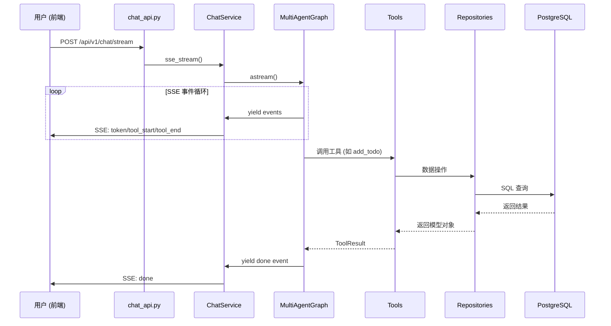
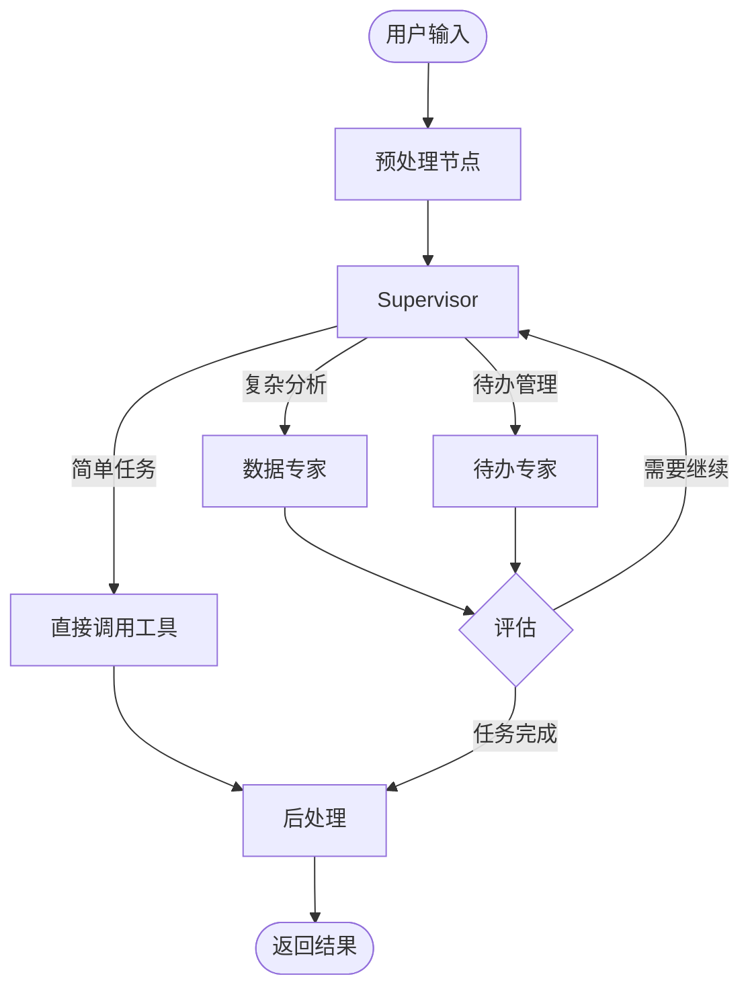

# 产品概述

> 面向用户和产品经理：了解系统能做什么。

---

## 产品简介

**智能助手** 是一个基于多智能体架构的 AI 助手系统，支持自然语言交互、智能待办管理和数据分析可视化。

## 核心功能

### 1. 智能聊天

- **多模型支持**: OpenAI、Claude、DeepSeek 等主流模型
- **流式响应**: 实时显示 AI 回答，无需等待
- **多轮对话**: 保持上下文，连续追问
- **安全护栏**: 输入/输出内容审查

### 2. 待办助手

| 功能 | 说明 |
|------|------|
| 自然语言创建 | "明天下午3点开会" → 自动创建待办 |
| 智能确认 | 操作前展示确认卡片，避免误操作 |
| 周期任务 | 支持每日/每周/每月重复任务 |
| 多维度查询 | 按时间、优先级、分类筛选 |

### 3. 数据分析

| 功能 | 说明 |
|------|------|
| 自然语言查询 | "本月销售额是多少？" → 自动生成 SQL |
| 自动可视化 | 根据数据自动选择图表类型 |
| 指标匹配 | 业务指标库支持模糊匹配 |

### 4. 知识问答

- **RAGFlow 集成**: 对接企业知识库
- **图片理解**: 支持上传图片进行内容分析

### 5. 管理后台

系统提供 Web 管理界面，用于配置和管理各项功能：

| 模块 | 功能 | 访问地址 |
|------|------|---------|
| 系统配置 | AI、RAGFlow、MCP 等运行参数管理 | `/admin/system` |
| LLM 配置 | 模型提供商和模型的增删改查、默认模型设置 | `/admin/llm` |
| 技能管理 | Agent 技能库维护、向量索引重建 | `/admin/skills` |
| 数据访问控制 | 问数功能的表白名单/黑名单配置 | `/admin/access` |

---

## 用户角色

| 角色 | 典型场景 |
|------|---------|
| **普通用户** | 日常聊天、任务管理 |
| **数据分析师** | 数据查询、报表生成 |
| **管理员** | 通过管理后台进行模型配置、技能维护、系统参数调整、数据访问权限控制 |

---

## 系统架构

### 请求处理流程

### 分层职责

| 层级 | 目录 | 职责 |
|------|------|------|
| **API** | `app/api/v1/endpoints/` | HTTP 入口、参数校验、路由 |
| **Service** | `app/services/` | 业务编排、SSE 流处理 |
| **AI** | `app/ai/` | LangGraph 图、Agent、Tools |
| **Repository** | `app/repositories/` | 数据访问、CRUD 操作 |
| **Model** | `app/models/` | ORM 定义、表结构 |

> 详细说明请参阅 [后端架构](../开发文档/架构设计/后端架构.md)

### 多智能体架构

系统采用 **Supervisor 模式** 的多智能体架构：

> 详细说明请参阅 [多智能体工作流](../开发文档/代码解读/多智能体工作流.md)

---

## 功能状态

| 功能模块 | 状态 |
|---------|------|
| 多智能体架构 | ✅ 已完成 |
| 待办助手 | ✅ 已完成 |
| 数据分析 | ✅ 已完成 |
| SSE 流式通信 | ✅ 已完成 |
| 管理后台 | ✅ 已完成 |
| 知识库问答 | 🚧 优化中 |

---

## 相关文档

- [聊天系统](聊天系统.md) - 聊天功能详解
- [待办助手](待办助手.md) - 待办功能详解
- [数据分析](数据分析.md) - 数据分析功能详解

---

## 技术规格

> 详细技术文档请参阅 [系统总览](../开发文档/架构设计/系统总览.md)

| 分类 | 技术 |
|------|------|
| 后端 | FastAPI + LangGraph |
| 前端 | Next.js 15 + React 19 |
| 数据库 | PostgreSQL + pgvector |
| 对象存储 | MinIO |
