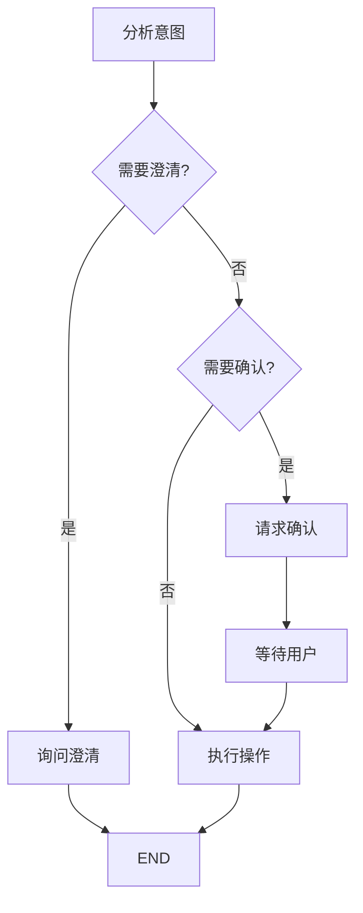

# 待办助手需求文档

> 版本: 1.1  
> 更新时间: 2026-02-02  
> 范围: 单任务待办（简化版）

## 1. 功能概述

待办助手是一个专门处理待办事项的 AI Agent，支持：

- 自然语言创建待办
- 智能时间解析
- 冲突检测
- 确认流程

### 1.1 支持的操作

| 操作 | 示例 |
|------|------|
| 创建 | "帮我添加一个明天下午3点的会议" |
| 查询 | "我有哪些待办" |
| 更新 | "把明天的会议改到周五" |
| 完成 | "标记会议为已完成" |
| 删除 | "删除那个会议" |

### 1.2 工作流程

### 1.3 智能特性

**时间解析**：支持自然语言时间
- "明天下午3点"
- "下周一上午10点"
- "三天后"

**冲突检测**：自动检测时间冲突
- "你已经有一个14:00的会议"
- 提供解决建议

**模糊匹配**：支持模糊标题匹配
- 用户说"那个会议" → 自动匹配最近的会议

**重复检测**：创建新任务时自动检测相似任务
- 基于 Jaccard n-gram 相似度算法 (阈值 0.4)
- 发现相似任务时提示用户选择

**确认流程**：危险操作需要用户确认
1. AI 发送确认请求
2. 用户选择确认/拒绝/编辑
3. AI 继续执行或取消

---

## 2. 角色与场景

- **普通用户**：通过自然语言管理个人待办事项
- **管理员**：不直接参与待办操作，仅负责系统配置

## 3. 范围与约束

- 单次对话仅支持**单任务**创建/变更
- **不支持**批量创建/批量完成的对话意图
- **不自动**拆解复杂任务为子任务
- 保留**前端 UI** 批量勾选/导入能力（非对话）

## 4. 用户故事与验收标准

### US-TODO-01: 创建待办

**角色**：作为普通用户  
**需求**：我想通过自然语言创建待办  
**目的**：以便快速记录任务，无需手动填写表单

**验收标准**：
- AC-1: 输入"明天下午3点开会"，系统解析出标题与时间
- AC-2: 显示确认卡片（蓝色边框），包含标题/时间/优先级/分类（如有）
- AC-3: 点击确认后，数据库新增记录并返回成功消息
- AC-4: 点击取消后，不创建记录并返回取消消息

**关联测试**：TC-CRUD-01, TC-CRUD-02, TC-SMART-01, TC-CONFIRM-01, TC-CONFIRM-02

### US-TODO-02: 查询待办

**角色**：作为普通用户  
**需求**：我想查询我的待办列表  
**目的**：以便了解当前任务状态

**验收标准**：
- AC-1: 输入"查询我的待办"，返回列表卡片并按截止时间排序
- AC-2: 输入"查询今天/高优先级/工作分类"，只返回符合条件的任务
- AC-3: 当无待办时，显示"没有找到相关待办事项"

**关联测试**：TC-CRUD-04, TC-CRUD-05, TC-EDGE-05

### US-TODO-03: 更新待办

**角色**：作为普通用户  
**需求**：我想修改待办的字段（时间/优先级/标题等）  
**目的**：以便动态调整计划

**验收标准**：
- AC-1: 输入"把开会的优先级改成高"，显示更新确认卡片与 Diff
- AC-2: 确认后数据库字段更新，返回成功消息
- AC-3: 找不到目标任务时，提示用户选择或说明原因

**关联测试**：TC-CRUD-06, TC-SMART-04, TC-SMART-05, TC-EDGE-06, TC-CONFIRM-03

### US-TODO-04: 完成待办

**角色**：作为普通用户  
**需求**：我想将任务标记为完成  
**目的**：以便记录进度

**验收标准**：
- AC-1: 输入"完成买菜这个任务"，显示完成确认卡片（绿色边框）
- AC-2: 确认后状态为 done 且 completed_at 有值
- AC-3: 取消后不改变任务状态

**关联测试**：TC-CRUD-07, TC-UI-04

### US-TODO-05: 删除待办

**角色**：作为普通用户  
**需求**：我想删除不再需要的任务  
**目的**：以便清理列表

**验收标准**：
- AC-1: 输入"删除开会这个待办"，显示删除确认卡片（红色边框）
- AC-2: 确认后执行软删除（is_deleted=TRUE）
- AC-3: 取消后任务仍保留

**关联测试**：TC-CRUD-08, TC-UI-03, TC-CONFIRM-02

### US-TODO-06: 多轮澄清

**角色**：作为普通用户  
**需求**：当我输入不完整时系统能追问  
**目的**：以便补齐信息后再创建

**验收标准**：
- AC-1: 输入"创建一个待办"时，系统追问标题
- AC-2: 标题提供后仍缺少时间时，系统追问时间
- AC-3: 超过3轮后自动应用默认值并显示确认卡片

**关联测试**：TC-MULTI-01, TC-MULTI-02

### US-TODO-07: 模糊指代与实体解析

**角色**：作为普通用户  
**需求**：我可以用"它/那个"指代刚提到的任务  
**目的**：以便对话更自然

**验收标准**：
- AC-1: "把它改成周五"可正确指代最近任务
- AC-2: 多个匹配时列出候选并请求用户选择

**关联测试**：TC-MULTI-03, TC-SMART-04, TC-SMART-05

### US-TODO-08: 冲突与重复检测

**角色**：作为普通用户  
**需求**：系统应提示时间冲突或重复任务  
**目的**：以便避免重复安排

**验收标准**：
- AC-1: 新任务与已有任务时间冲突时提示，但不阻断
- AC-2: 创建相似标题任务时提示重复，并允许继续或取消

**关联测试**：TC-SMART-03, TC-SMART-07

## 5. 卡片交互行为

### 5.1 待办列表卡片

查询待办后，AI 返回可交互的待办列表卡片，支持：

| 操作 | 行为 | 数据刷新方式 |
|------|------|-------------|
| 删除 | 弹出确认，确认后移除 | 本地即时更新 |
| 完成 | 标记为已完成 | 本地即时更新 |
| 编辑 | 双击进入编辑模式 | 本地即时更新 |

### 5.2 数据一致性策略

- **当前消息**：从 API 获取实时数据，确保刷新后数据准确
- **历史消息**：显示消息创建时的快照数据，符合对话历史语义

> **说明**：卡片内操作采用"本地乐观更新"，操作成功后直接更新本地状态，不再自动发送"查看待办"消息。这样响应更快，且不会产生额外的对话记录。

## 6. 非功能需求

- **响应**：确认卡片在 10s 内出现（正常网络）
- **一致性**：创建/更新/删除后，列表刷新保持一致
- **可用性**：异常时提供可理解的提示语
