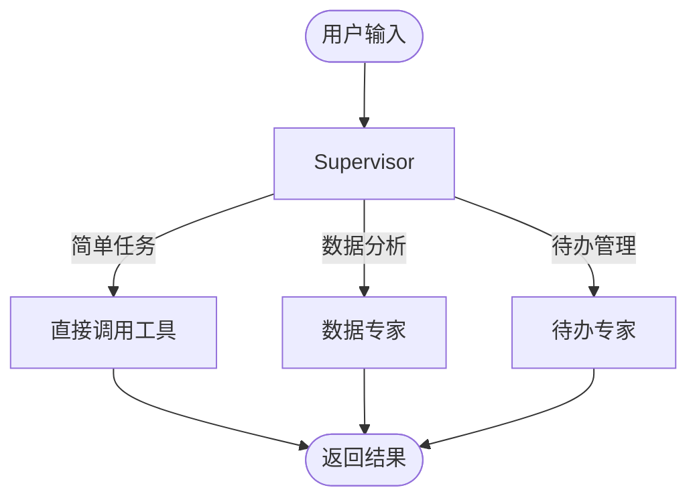

# 多智能体

本文档介绍多智能体系统的设计和工作原理。

## 架构概述

系统采用 **Supervisor 模式**，由一个中心调度器协调多个专家 Agent。



---

## 专家 Agent

| Agent | 职责 | 工具 |
|-------|------|------|
| Supervisor | 任务理解、路由决策 | fig_inter, sql_inter, knowledge_search |
| 数据专家 | 复杂数据分析 | extract_data, python_inter |
| 待办专家 | 待办事项管理 | add_todo, list_todos, update_todo |

---

## 路由机制

### 意图识别

1. 预处理节点分析用户意图
2. 根据意图类型路由到对应 Agent
3. 简单任务 Supervisor 直接处理

### Handoff 工具

```python
# Supervisor 使用 handoff 工具委派任务
transfer_to_todo_expert(
    task_description="帮用户添加一个明天的会议待办"
)
```

---

## 使用控制

系统已默认启用多智能体模式，无需手动配置。

> **历史说明**：早期版本通过 `use_multi_agent` 参数控制，该参数已废弃（2026-01-31）。
