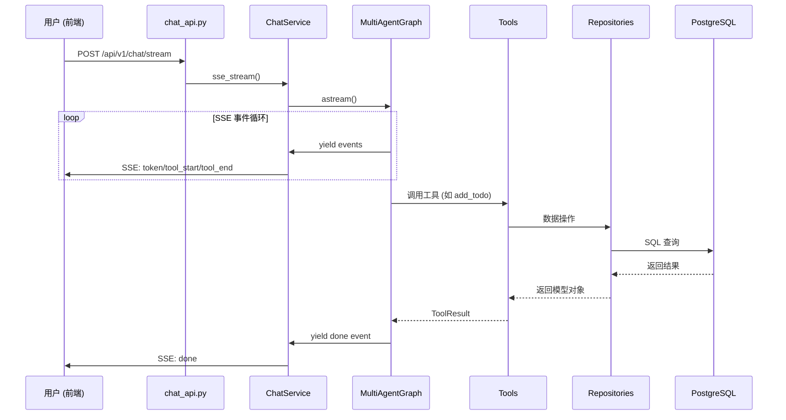
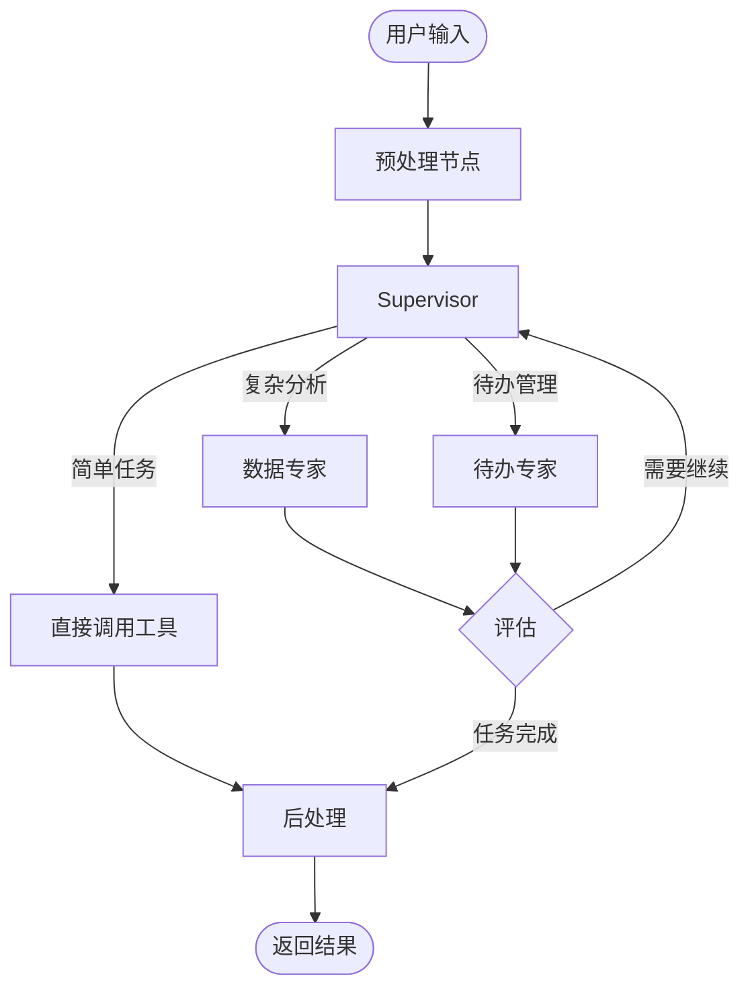

# 系统需求文档

> 版本: 1.1  
> 更新时间：2026-03-13
> 定位: 全局/长期需求 (Master)

## 文档导航

- 架构总览：[系统总览](../开发文档/架构设计/系统总览.md)
- AI 模块设计：[AI模块设计](../开发文档/架构设计/AI模块设计.md)
- 接口契约定义：[接口文档](../API文档/接口文档.md)
- 部署与环境配置：[快速开始](../开发文档/快速入门/快速开始.md)、[配置说明](../开发文档/快速入门/配置说明.md)
- 模块需求明细：[聊天系统需求](聊天系统需求.md)、[待办助手需求](待办助手需求.md)、[问数助手需求](问数助手需求.md)

## 1. 产品简介

**智能助手** 是一个基于多智能体架构的 AI 助手系统，支持自然语言交互、智能待办管理和数据分析可视化。

## 2. 项目愿景

构建一个基于 LangGraph 的**多智能体 AI 助手系统**，支持：
- 自然语言交互
- 待办管理
- 数据分析与可视化
- 知识库问答

## 3. 核心功能

### 3.1 智能聊天

- **多模型支持**: OpenAI、Claude、DeepSeek 等主流模型
- **流式响应**: 实时显示 AI 回答，无需等待
- **多轮对话**: 保持上下文，连续追问
- **安全护栏**: 输入/输出内容审查

### 3.2 待办助手

| 功能 | 说明 |
|------|------|
| 自然语言创建 | "明天下午3点开会" → 自动创建待办 |
| 智能确认 | 操作前展示确认卡片，避免误操作 |
| 周期任务 | 支持每日/每周/每月重复任务 |
| 多维度查询 | 按时间、优先级、分类筛选 |

> 详见 [待办助手需求](待办助手需求.md)

### 3.3 问数助手

| 功能 | 说明 |
|------|------|
| 自然语言查询 | "本月销售额是多少？" → 自动生成 SQL |
| 自动可视化 | 根据数据自动选择图表类型 |
| 指标匹配 | 业务指标库支持模糊匹配 |

> 详见 [问数助手需求](问数助手需求.md)

### 3.4 知识问答

- **RAGFlow 集成**: 对接企业知识库
- **图片理解**: 支持上传图片进行内容分析

### 3.5 管理后台

系统提供 Web 管理界面，用于配置和管理各项功能：

| 模块 | 功能 | 访问地址 |
|------|------|---------|
| 系统配置 | AI、RAGFlow、MCP 等运行参数管理 | `/admin/system` |
| LLM 配置 | 模型提供商和模型的增删改查、默认模型设置 | `/admin/llm` |
| 技能管理 | Agent 技能库维护、向量索引重建 | `/admin/skills` |
| 数据访问控制 | 问数功能的表白名单/黑名单配置 | `/admin/access` |

> 详见 [管理后台需求](管理后台需求.md)

---

## 4. 用户角色

| 角色 | 典型场景 | 核心需求 |
|------|---------|---------|
| **普通用户** | 日常聊天、任务管理 | 快速、准确的任务管理 |
| **数据分析师** | 数据查询、报表生成 | 自然语言转 SQL、图表生成 |
| **管理员** | 模型配置、系统监控 | 模型配置、系统监控 |

---

## 5. 系统架构

### 5.1 请求处理流程

### 5.2 分层职责

| 层级 | 目录 | 职责 |
|------|------|------|
| **API** | `app/api/v1/endpoints/` | HTTP 入口、参数校验、路由 |
| **Service** | `app/services/` | 业务编排、SSE 流处理 |
| **AI** | `app/ai/` | LangGraph 图、Agent、Tools |
| **Repository** | `app/repositories/` | 数据访问、CRUD 操作 |
| **Model** | `app/models/` | ORM 定义、表结构 |

### 5.3 多智能体架构

系统采用 **Supervisor 模式** 的多智能体架构：

---

## 6. 核心功能列表

### 6.1 聊天系统
- [x] **基础设施**: SSE 流式响应、多轮对话上下文、历史记录持久化
- [x] **模型适配**: 多模型支持 (OpenAI, Claude, DeepSeek 等)
- [x] **安全护栏**: 输入/输出内容审查 (Guardrails)
- [x] **意图识别**: 基于 LLM 的快速意图分类

### 6.2 多智能体 (Agent System)
- [x] **Supervisor 模式**: 中央调度器，基于意图和上下文路由
- [x] **数据专家 (Data Expert)**: NL2SQL、数据提取、Python 代码执行
- [x] **待办专家 (Todo Expert)**: 任务 CRUD、多轮澄清
- [x] **知识库专家 (Knowledge Expert)**: RAGFlow 集成 (规划中)

### 6.3 业务模块
- [x] **待办管理**: 周期性任务、智能确认卡片、多维度过滤查询
- [x] **数据可视化**: 自动绘图 (Matplotlib/Seaborn)、图表持久化 (MinIO)
- [x] **资产管理**: 文件上传与解析、图片内容理解

### 6.4 系统配置
- [x] **动态配置**: 运行时修改 LLM Provider 和 System Config
- [x] **认证授权**: 基于 JWT 的用户认证

---

## 7. 非功能需求

| 维度 | 要求 |
|------|------|
| **性能** | SSE 首 Token 延迟 < 2s |
| **安全** | 用户隔离、SQL 注入防护、敏感词过滤 |
| **可扩展** | 支持新增 Agent 和 Tool (Plugin 架构) |
| **可观测** | 结构化日志、LangSmith 追踪集成 |

## 8. 技术约束

- 后端: Python 3.11+, FastAPI, LangGraph
- 前端: Next.js 15, React 19
- 数据库: PostgreSQL (SQLAlchemy 2.0 Async)
- 对象存储: MinIO

---

## 9. 功能状态

| 功能模块 | 状态 |
|---------|------|
| 多智能体架构 | 已完成 |
| 待办助手 | 已完成 |
| 问数助手 | 已完成 |
| SSE 流式通信 | 已完成 |
| 管理后台 | 已完成 |
| 知识库问答 | 优化中 |

---

## 10. 相关文档

- [聊天系统需求](聊天系统需求.md)
- [待办助手需求](待办助手需求.md)
- [问数助手需求](问数助手需求.md)
- [管理后台需求](管理后台需求.md)
