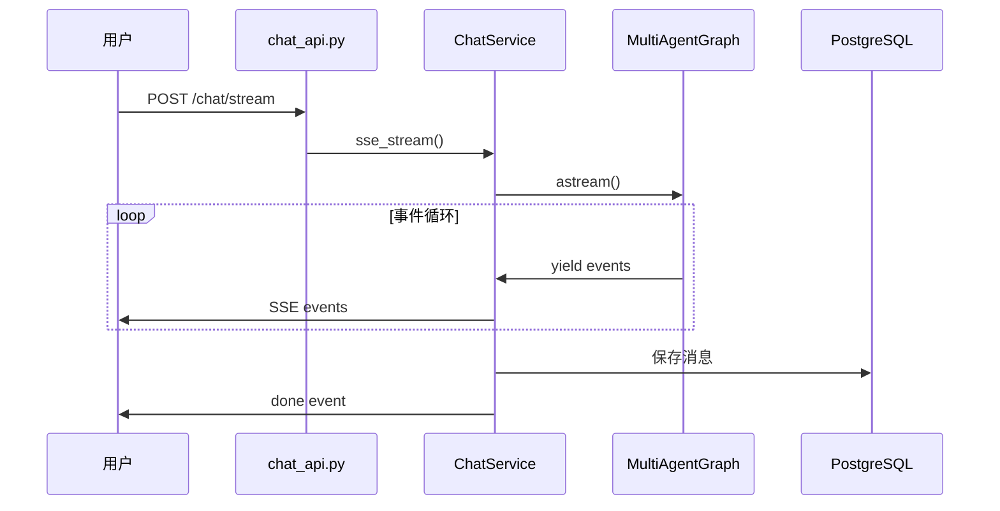

# 聊天系统

本文档介绍聊天系统的完整工作流程。

## 概述

聊天系统基于 LangGraph 实现，支持：
- 流式响应
- 多智能体协作
- 工具调用
- 对话历史

---

## 工作流程



---

## 对话管理

### 新建对话

不传 `thread_id` 时自动创建新对话。

### 继续对话

传入已有 `thread_id` 继续历史对话。

### 历史恢复

从数据库加载消息，恢复 LangGraph 状态。

---

## 消息存储

消息存储在 `t_chat_message` 表：

| 字段 | 说明 |
|------|------|
| `role` | human / ai |
| `content` | 消息内容 |
| `metadata` | 工具调用等扩展信息 |


# SSE 事件定义

# SSE 流式响应

本文档介绍项目的 Server-Sent Events (SSE) 通信协议。

## 协议概述

项目使用 SSE 实现流式响应，支持多种结构化事件类型。

### 基本格式

```
event: {event_type}
data: {json_payload}

```

- 每个事件以两个换行符结尾
- `data` 字段使用 JSON 格式

---

## 事件类型

| 事件 | 用途 |
|------|------|
| `init` | 流初始化 |
| `token` | AI 文本输出 |
| `thinking` | 思考过程 |
| `tool_start` | 工具调用开始 |
| `tool_end` | 工具调用结束 |
| `status` | 状态更新 |
| `result` | 结构化结果 |
| `confirmation` | 确认请求 |
| `clarification` | 澄清问题 |
| `interrupt` | 中断等待 |
| `done` | 流结束 |
| `error` | 错误 |

---

## 事件数据结构

### token - AI 文本输出

```json
{
  "type": "token",
  "data": {
    "content": "你好"
  }
}
```

### tool_start - 工具调用开始

```json
{
  "type": "tool_start",
  "data": {
    "name": "list_todos",
    "input": {"status": "todo"}
  }
}
```

### tool_end - 工具调用结束

```json
{
  "type": "tool_end",
  "data": {
    "name": "list_todos",
    "output": "找到3条待办"
  }
}
```

### status - 状态更新

```json
{
  "type": "status",
  "data": {
    "message": "正在查询数据库..."
  }
}
```

### result - 结构化结果

```json
{
  "type": "result",
  "data": {
    "data_type": "todo_list",
    "data": {"todos": [...]},
    "message": "找到5条待办"
  }
}
```

| data_type | 用途 |
|-----------|------|
| `todo_list` | 待办列表 |
| `image` | 图片 |
| `chart` | 图表 |

### confirmation - 确认请求

```json
{
  "type": "confirmation",
  "data": {
    "operation": {
      "action": "delete_todo",
      "target": "待办A",
      "details": {}
    },
    "message": "确认删除?"
  }
}
```

### done - 流结束

```json
{
  "type": "done",
  "data": {
    "thread_id": "abc123"
  }
}
```

---

## 后端发送

```python
from langgraph.config import get_stream_writer
from app.ai.events import emit_status, emit_result

def my_node(state):
    writer = get_stream_writer()
    emit_status(writer, "正在处理...")
    emit_result(writer, "todo_list", {"todos": [...]})
    return state
```

---

## 前端处理

```typescript
const callbacks: StreamCallbacks = {
  onToken: (token) => appendToAiMessage(aiId, token),
  onToolStart: (name, input) => addToolCallToMessage(aiId, name, input),
  onStatus: (message) => setCurrentStatus(message),
  onResult: (data) => handleResult(data),
  onDone: () => setIsLoading(false),
};
```
