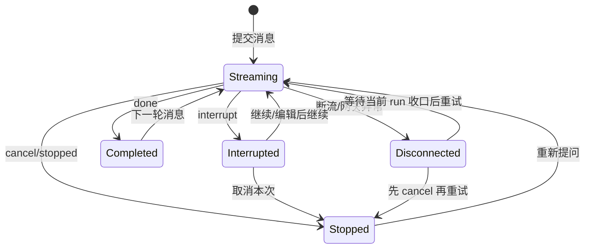

# 聊天系统需求
> 更新时间：2026-03-11

> 模块定位：统一对话入口、SSE 流式协议、历史消息与反馈闭环
> 
> 关联代码：`app/api/v1/endpoints/chat_api.py`、`app/services/chat_service.py`、`web/src/lib/backend.ts`、`web/src/hooks/useSSEStream.ts`

## 文档导航

- 全局需求入口：[系统需求](系统需求.md)
- 架构总览：[系统总览](../开发文档/架构设计/系统总览.md)
- AI 模块设计：[AI模块设计](../开发文档/架构设计/AI模块设计.md)
- 接口契约定义：[接口文档](../API文档/接口文档.md)
- 测试与验收入口：[聊天系统测试案例](../开发文档/测试管理/聊天系统测试案例.md)

---

## 1. 目标与边界

### 1.1 目标

1. 提供稳定的流式对话体验（init/token/result/status/interrupt/done/error）。
2. 支持中断恢复（accept/reject/edit）并保证消息持久化一致。
3. 支持历史消息、线程管理、反馈提交等完整生命周期。

### 1.2 非目标

1. 不定义问数或待办业务决策细节。
2. 不在本模块内承载模型路由管理 UI。

---

## 2. 典型用户故事

1. **一线员工**：发送问题后实时看到 token 与状态进展。
2. **审批人员**：在 interrupt 卡片上完成确认或驳回并继续流程。
3. **运营人员**：可对 AI 消息点赞点踩，并在历史中可追溯。

---

## 3. 功能需求

### 3.1 流式主链路

1. 主接口：`POST /api/v1/chat/stream`。
2. 流事件必须包含 `event + data` 双字段，前端可逐事件消费。
3. `done` 事件应回传 `thread_id`，并尽量附带 `message_id`。
4. 同一 `thread_id` 的会话执行必须串行化，避免并发重入造成乱序、重复计算或冲突写入。
5. 实时链路与历史回放必须共享同一 canonical 协议与可见文本，不得出现“实时正常、刷新异常”的双口径。
6. 历史接口返回的 `content` 必须为可直接渲染的可读正文，或前端已支持的结构化内容；不得暴露 Python/JSON 结构串。
7. 对历史遗留结构串数据，读取时必须兼容归一化并保持可读展示。
8. 外部依赖重试、记忆写入与结构化结果持久化不得长期阻塞首 token 主路径；必要时通过异步入队或后台补偿收口。
9. 聊天主链路中可独立迁移的预构建 Agent 入口统一使用 `langchain.agents.create_agent`；当前多智能体 Supervisor 因运行时工具裁剪仍保留 `create_react_agent`。
10. 当前阶段不把 `TodoGraph`、`DataGraph`、多智能体主图整体改写成 Functional API，也不在 runtime gating 尚未等价前强改 Supervisor 构建方式。
11. 迁移后必须继续满足 `interrupt / resume / replay` 语义不变，以及 `messages / values / custom` 三路流式契约不漂移。
12. 用户上传附件后，后端必须先将附件收口为结构化合同，并由 `supervisor` 基于用户目标与会话状态完成 planning；不得直接把附件描述硬编码拼入隐式提示词。
13. human 历史消息必须保留用户可见的附件展示内容：图片以 Markdown 图片回放，文件以 Markdown 链接回放；不得出现“发送当轮可见、刷新后丢失”的双口径。

### 3.1.1 多会话并发与状态同步（2026-03-09）

1. 用户级 active run 并发上限默认 `3`；超限时新提交必须被拒绝，且已在运行的其他会话不受影响。
2. 并发粒度按 `thread_id` 隔离：不同会话可并行，同一会话始终串行，禁止同一 `thread_id` 下出现双 run 并发写入。
3. 新会话在服务端 `init` 返回 `thread_id` 后，必须立即出现在历史侧栏；不能等首条回复完成后才入栏。
4. 页面停留期间，历史侧栏必须自动同步其他会话的运行态，不依赖用户手动刷新；同步真相源为 `GET /api/v1/chat/runs/active`，本地 streaming 快照只用于覆盖短暂空窗，避免运行图标闪烁。
5. 用户主动停止统一走 hard cancel；取消成功后 run 直接进入 `stopped`，后续 token 停止回灌，并立即释放并发槽位。
6. 历史侧栏状态优先级固定为：`running` 显示旋转运行图标，非当前会话存在未读回复显示蓝点，已读且 idle 不显示状态图标。
7. 运行中任务的共享状态 owner 统一由后端应用级 runtime 持有；前端只依赖 `run_id/thread_id` 与 `/chat/runs/active`，不假设后端存在模块级全局状态。

### 3.2 中断恢复链路

1. 当前恢复接口：`POST /api/v1/chat/resume`。
2. 支持三种决策类型：`accept`、`reject`、`edit`。
3. resume 过程中可再次触发 interrupt，前端需可重入处理。

#### 3.2.1 用户交互规则（2026-03-07）

> [!IMPORTANT]
> “继续/确认/编辑后继续/取消本次”属于**聊天控制动作**，不是普通聊天内容。

| 用户看到的状态 | UI 必须提供的动作 | 系统正确行为 | 禁止交互 |
|---|---|---|---|
| `interrupt`（等待确认） | `继续`、`编辑后继续`、`取消本次` | 分别调用 `POST /api/v1/chat/resume` 或 `POST /api/v1/chat/runs/{run_id}/cancel` | 把“继续”“你刚刚中断了”当普通消息发送 |
| `stopped` / 已取消 | `重新提问` | 视为旧 run 已结束，下一条消息开启新 run | 对旧 run 再次 `resume` |
| SSE 断流 / 网关报错 / 用户手动中止连接 | `等待收口后重试`、`取消后重试` | 先判断当前 run 是否仍在收口；放弃旧 run 时先 cancel，再重发 | 直接把“继续”作为聊天文本发送 |

#### 3.2.2 产品语义约束（2026-03-07）

1. 同一 `thread_id` 内，新的聊天消息只代表**当前最新用户意图**；更早消息只作为上下文，不应被当成并列新问题再次执行。
2. `interrupt` 产生的半成品回复不应直接作为最终历史展示；刷新历史时默认隐藏中间消息。
3. 若用户未对当前 `interrupt` 做出 `resume/cancel` 决策，系统不应鼓励在同一上下文里直接继续发送自然语言“继续”。
4. 前端必须将控制动作做成显式按钮或卡片操作，而不是依赖自由文本理解。

#### 3.2.3 状态机要求（2026-03-07）

### 3.3 历史与反馈

1. 支持线程列表、线程消息、线程删除、批量删除。
2. 支持消息反馈提交（点赞/点踩/撤销）。
3. 历史侧栏需提供搜索、时间分组与分组折叠能力；桌面端默认展开，移动端默认收起，并允许恢复用户最近一次开合状态，同时列表密度应保持紧凑，保证同屏可浏览更多会话。
4. 历史回放的 `content` 必须是可直接渲染的正文或已定义的结构化内容，不得暴露 Python/JSON 原始结构串。
5. 读取历史遗留脏数据或命中 legacy 结构化载荷时，系统需执行 `read-old-write-new` 兼容归一化，保证实时链路与刷新后的展示一致。
6. assistant 历史回放若含 Responses 风格 block，必须先剥离 `function_call`、`tool_use`、`tool_result` 等内部块，以及缺少可读正文的空壳 `text`、`output_text`、`refusal` block；旧线程中的内部补齐提示也不得再次作为模型回放上下文。
7. 实时对话完成后应可立即关联数据库消息 ID。

### 3.4 Skill 自动触发与检索增强

1. 预处理节点应支持 Skill 混合召回（关键词 + 语义向量），并按融合分排序。
2. Skill 自动触发必须经过 `is_enabled/auto_enabled/scope` 过滤，避免误触发。
3. 技能冲突时按 `priority` 进行裁决，确保同冲突组只保留一个技能。
4. 技能注入改为章节级懒加载，不再固定截断前 500 字。
5. 召回链路需保留可观测信息（候选、入选、淘汰原因、耗时）。

### 3.5 跨会话用户偏好记忆（MVP）

1. 仅在用户明确表达“记住/默认/以后都”类指令时写入偏好记忆。
2. 偏好记忆应按 `user_id` 隔离，并在新 `thread_id` 会话中自动生效。
3. 偏好读取应优先最近更新项，并对冲突项做去重。
4. 偏好注入不得污染用户原始输入与历史展示内容。
5. 当偏好上下文超出阈值时，需自动摘要压缩。
6. 记忆模块异常时应降级，不得阻断 SSE 主链路。

### 3.6 记忆意图异步入队（2026-03-04）

1. 主链路写入阶段支持“同步 flush / 异步入队”双模式，异步模式下仅入队不阻塞当前轮 SSE。
2. 异步模式通过配置键 `memory.intent_async_enabled`（环境变量 `MEMORY_INTENT_ASYNC_ENABLED`）控制，异常时必须自动降级。
3. 入队失败不影响当前回复完成，系统应记录告警并继续执行后续节点。

### 3.7 用户可见状态与脱敏边界

1. 聊天主链路不得把编排内部缺口通过 `clarification` 事件暴露给用户。
2. 只有真正缺少业务信息（如时间、指标、维度）时，系统才可以进入澄清提问。
3. 前端不得直接展示编排型工具名（如 `assign_to_data_expert`、`decompose_goals`、`load_skills`）。
4. 当内部补齐失败但已有部分结果时，系统应返回已确认内容，并以结果性文案提示稍后重试，而不是要求用户回复“继续”。
5. 运行态目标合同在单目标 direct handoff 与 `decompose_goals` 显式拆解两条路径上必须一致，禁止出现双真理源状态。

---

## 4. 协议与类型契约

### 4.1 SSE 事件最小契约

- `token`: `{content}`
- `status`: `{message}`
- `result`: `{data_type, data, message?}`
- `interrupt`: `{thread_id, interrupt_id, value}`
- `done`: `{thread_id, message_id?, final_content?}`
- `error`: `{message}`
- 扩展事件（兼容期可选）：`plan_ready`、`coverage_check`、`task_started`、`task_finished`、`confirmation`、`kb_images`、`handoff`、`stopped`
- 前端与解析层只消费白名单事件，未知 `event` 仅记录警告日志，不进入状态更新分支。
- `plan_ready` 仅作为兼容期开关事件；开关关闭时后端不再下发，前端保持无感。
- SSE 可靠性最小集固定为 `id`、`retry`、heartbeat、`Last-Event-ID`，用于断线重连、续传与去重恢复。

### 4.2 前端统一消息模型

1. 历史消息、SSE 消息、LangChain 消息需归一到 `UnifiedMessage`。
2. 结构化结果统一通过 `additionalKwargs.result_events[]` 传递给渲染层，并保持历史回放与实时流同构。
3. 单轮多个结构化结果必须按追加顺序保留，不得以后到结果覆盖先到结果。
4. 图片、图表等结构化产物以 `result_events[]` 为单一展示入口，正文不得重复承载同一产物。
5. 反馈接口只接受数据库整数 `message_id`。

### 4.3 结构化结果与重连契约

1. 复合提问（文本 + 表格 + 图片）场景下，结构化响应统一走 `result` 事件，不允许并行私有协议。
2. 历史回放与实时流统一消费 canonical 字段 `additional_kwargs.result_events[]`，并保持 `read-old-write-new` 兼容。
3. SSE 可靠性最小集固定为 `id / retry / heartbeat / Last-Event-ID`，用于断线重连、续传与去重恢复。

## 5. 验收标准

### 5.1 Happy Path

1. 发送消息后可接收完整事件流并结束于 done。
2. interrupt 出现后可恢复继续，且最后完成持久化。
3. `message_id` 回填后可立即执行点赞点踩。
4. 输入“按分行统计贷款余额并画趋势图”时可召回数据分析相关 Skill 并注入有效章节。
5. 单轮产生多个结构化结果时，实时渲染顺序与历史回放顺序保持一致。

### 5.2 边界与异常

1. SSE 断连或超时后，前端状态可恢复，不长期卡在 loading。
2. JSON 解析失败或未知 SSE 事件应被隔离，只记录警告，不影响后续流处理。
3. 对话异常时输出 `error` 事件并保留可诊断信息。
4. embedding 服务不可用时应降级关键词检索，主链路不可中断。
5. 涉及客户敏感信息请求时，Skill 自动触发不得绕过权限或合规策略。
6. 登录态失效返回 401 时，前端必须清理会话 Token、当前用户缓存与最近线程缓存，并跳转登录页；刷新后不得残留旧用户历史或错误用户信息。
7. 用户 A 写入偏好后，用户 B 的会话结果不受影响。
8. `interrupt` 后点击“继续”必须恢复旧 run，而不是发送新的普通消息。
9. `stopped` 或已取消状态下，界面必须阻止继续恢复旧 run。
10. 断流后若用户选择放弃本次执行，系统必须先完成 cancel，再允许重发。
11. 历史接口命中 legacy 结构化字段时，必须可回放并标记兼容来源。
12. mixed query（如“先查天气，再查贷款余额”）下，若 Supervisor 已生成精确 data task，则后续 handoff 不得退化为整句用户原问题。
13. 第三方搜索工具原始网页或 HTML 噪声不得直接进入 handoff frame、coverage 汇总或最终答复。
14. `data_expert` 仅返回澄清文本、未产出结构化结果时，覆盖率状态必须保持 `pending`，并由统一汇总继续提示补齐。
15. coverage gate、final composer 等内部缺口不得伪装成用户待确认的 `clarification`。
16. 已有部分结果但后续补齐失败时，最终答复允许提示稍后重试，但不得要求用户回复“继续”。

### 5.3 稳定性

1. 事件顺序稳定，不出现 `done` 早于主内容的情况。
2. `resume` 与 `postprocess` 不得重复落库。
3. 多个 `result` 事件顺序稳定，不发生后到覆盖先到。
4. 断线重连后的重复渲染率目标为 `0`，消息顺序保持稳定。

## 6. 非功能需求

1. **可观测性**：日志包含 `thread_id/event_type/trace_id`，并可追踪关键兼容分支与重连路径。
2. **一致性**：`done/result` 事件字段演进需兼容旧前端，历史回放与实时流共享同一 canonical 结构。
3. **可靠性**：SSE 超时、中断、重连路径具备兜底策略，重复渲染率目标为 `0`。
4. **性能**：`/api/v1/chat/threads` 在统一基线下 p95 延迟目标较治理前下降至少 `30%`。
5. **性能**：`POST /api/v1/chat/stream` 首 token 延迟目标较治理前下降至少 `40%`。
6. **性能**：Skill 检索增强后 preprocess 耗时 p95 增量不超过 `150ms`。
7. **可控性**：跨会话偏好记忆与记忆异步入队均具备配置开关，可灰度启停。
8. **运行态一致性**：聊天运行控制共享状态必须只有一个后端 owner，避免因模块级全局实例分裂而造成侧栏状态、恢复控制和取消结果不一致。

## 7. 测试追溯

| 编号 | 用例目标 | 入口 |
|---|---|---|
| CHAT-TC-001 | done payload 与 `message_id` 回传 | `tests/unit/test_chat_service_done_payload.py` |
| CHAT-TC-002 | 当前轮消息切片正确性 | `tests/unit/test_chat_service_turn_slice.py` |
| CHAT-TC-003 | 反馈停止与实时链路 | `web/e2e/test_feedback_stop.spec.cjs` |
| CHAT-TC-004 | SSE 多事件消费与白名单解析 | `web/src/lib/backend.ts` + `web/src/hooks/useSSEStream.ts` |
| CHAT-TC-005 | 后处理落库时列表内容归一化 | `tests/unit/test_chat_repo_serialization.py` |
| CHAT-TC-006 | 历史接口兼容结构串并输出可读文本 | `tests/api/test_chat_api.py` |
| CHAT-SKILL-TC-005 | 混合检索命中与注入章节正确性 | `tests/integration/test_multi_agent_skill_context.py` |
| CHAT-SKILL-TC-006 | embedding 降级与合规边界 | `tests/integration/test_skill_retrieval_fallback.py` |
| CHAT-TC-007 | 记忆异步入队开关与降级路径 | `tests/unit/test_chat_service_memory_flags.py` |
| CHAT-TC-008 | `plan_ready` 兼容开关与 SSE 事件门禁 | `tests/api/test_chat_sse_intent_goal_status.py` |
| CHAT-TC-009 | 多意图队列调度与覆盖率收口 | `tests/unit/test_multi_intent_queue_flow.py` |
| CHAT-TC-010 | mixed query 下精确 data handoff 保留 | `app/tests/test_handoff_detection.py` |
| CHAT-TC-011 | Tavily observation 归一，网页噪声不透传 | `tests/unit/test_multi_agent_streaming_helpers.py` |
| CHAT-PERF-TC-001 | 同线程串行执行与顺序一致性 | `tests/integration/test_chat_thread_lane_queue.py` |
| CHAT-PERF-TC-002 | 外部依赖重试策略有效性 | `tests/unit/test_retry_policy.py` |
| CHAT-PERF-TC-003 | 预热命中后首问延迟收敛 | `tests/perf/test_chat_cold_warm_compare.py` |
| CHAT-INC-TC-001 | 记忆异步开关对主链路行为影响 | `tests/unit/test_chat_service_memory_flags.py` |
| CHAT-INC-TC-002 | SSE 状态事件兼容开关行为 | `tests/api/test_chat_sse_intent_goal_status.py` |
| CHAT-INC-TC-003 | 多意图并发下覆盖率与任务流收口 | `tests/unit/test_multi_intent_queue_flow.py` |
| CHAT-CQ-TC-001 | 回放 canonical 迁移与保序 | `tests/unit/test_multi_intent_coverage_reconcile.py` |
| CHAT-CQ-TC-002 | `done/result` 协议与收口一致性 | `tests/unit/test_chat_service_done_payload.py` |
| CHAT-CQ-TC-003 | 当前轮切片避免跨轮污染 | `tests/unit/test_chat_service_turn_slice.py` |
| CHAT-CQ-TC-004 | `resume` + 结构化卡片渲染与去重 | `web/e2e/todo-sse-protocol.spec.cjs` |
| CHAT-CQ-TC-005 | 契约门禁与计划对齐检查 | `scripts/contract/check_result_contract.sh` |
| CHAT-UX-TC-001 | coverage 缺口不再触发继续补齐提问 | `tests/unit/test_multi_intent_queue_flow.py` |
| CHAT-UX-TC-002 | 编排型工具名不再直接展示给用户 | `docs/开发文档/测试管理/聊天系统测试案例.md#tc-chat-ux-01-内部编排工具不应直出` |

## 8. 当前风险与改造优先级

1. `P1`：done 事件存在可选字段，前端消费策略尚未完全强类型化。
2. `P1`：SSE 协议定义分散在后端事件定义、服务层、前端解析三处，需统一维护入口。
3. `P1`：Skill 检索从单路改为混合召回后，需持续监控召回质量漂移。
4. `P1`：Skill 冲突裁决规则若配置不当，可能导致关键技能被抑制。
5. `P2`：前端部分流处理代码存在 lint 告警，影响可读性但未阻断功能。

---
