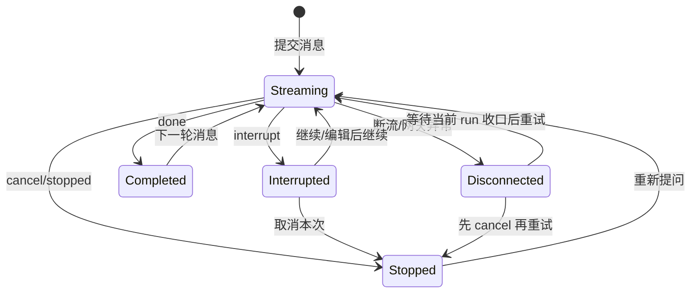

# 聊天系统需求

> 模块定位：统一对话入口、SSE 流式协议、历史消息与反馈闭环
> 
> 关联代码：`app/api/v1/endpoints/chat_api.py`、`app/services/chat_service.py`、`web/src/lib/backend.ts`、`web/src/hooks/useSSEStream.ts`

## 文档导航

- 全局需求入口：[系统需求](系统需求.md)
- 架构总览：[系统总览](../开发文档/架构设计/系统总览.md)
- AI 模块设计：[AI模块设计](../开发文档/架构设计/AI模块设计.md)
- 接口契约定义：[接口文档](../API文档/接口文档.md)
- 测试与验收入口：[聊天系统测试案例](../开发文档/测试管理/聊天系统测试案例.md)

---

## 1. 目标与边界

### 1.1 目标

1. 提供稳定的流式对话体验（init/token/result/status/interrupt/done/error）。
2. 支持中断恢复（accept/reject/edit）并保证消息持久化一致。
3. 支持历史消息、线程管理、反馈提交等完整生命周期。

### 1.2 非目标

1. 不定义问数或待办业务决策细节。
2. 不在本模块内承载模型路由管理 UI。

---

## 2. 典型用户故事

1. **一线员工**：发送问题后实时看到 token 与状态进展。
2. **审批人员**：在 interrupt 卡片上完成确认或驳回并继续流程。
3. **运营人员**：可对 AI 消息点赞点踩，并在历史中可追溯。

---

## 3. 功能需求

### 3.1 流式主链路

1. 主接口：`POST /api/v1/chat/stream`。
2. 流事件必须包含 `event + data` 双字段，前端可逐事件消费。
3. `done` 事件应回传 `thread_id`，并尽量附带 `message_id`。

### 3.2 中断恢复链路

1. 当前恢复接口：`POST /api/v1/chat/resume`。
2. 支持三种决策类型：`accept`、`reject`、`edit`。
3. resume 过程中可再次触发 interrupt，前端需可重入处理。

#### 3.2.1 用户交互规则（2026-03-07）

> [!IMPORTANT]
> “继续/确认/编辑后继续/取消本次”属于**聊天控制动作**，不是普通聊天内容。

| 用户看到的状态 | UI 必须提供的动作 | 系统正确行为 | 禁止交互 |
|---|---|---|---|
| `interrupt`（等待确认） | `继续`、`编辑后继续`、`取消本次` | 分别调用 `POST /api/v1/chat/resume` 或 `POST /api/v1/chat/runs/{run_id}/cancel` | 把“继续”“你刚刚中断了”当普通消息发送 |
| `stopped` / 已取消 | `重新提问` | 视为旧 run 已结束，下一条消息开启新 run | 对旧 run 再次 `resume` |
| SSE 断流 / 网关报错 / 用户手动中止连接 | `等待收口后重试`、`取消后重试` | 先判断当前 run 是否仍在收口；放弃旧 run 时先 cancel，再重发 | 直接把“继续”作为聊天文本发送 |

#### 3.2.2 产品语义约束（2026-03-07）

1. 同一 `thread_id` 内，新的聊天消息只代表**当前最新用户意图**；更早消息只作为上下文，不应被当成并列新问题再次执行。
2. `interrupt` 产生的半成品回复不应直接作为最终历史展示；刷新历史时默认隐藏中间消息。
3. 若用户未对当前 `interrupt` 做出 `resume/cancel` 决策，系统不应鼓励在同一上下文里直接继续发送自然语言“继续”。
4. 前端必须将控制动作做成显式按钮或卡片操作，而不是依赖自由文本理解。

#### 3.2.3 状态机要求（2026-03-07）

### 3.3 历史与反馈

1. 支持线程列表、线程消息、线程删除、批量删除。
2. 支持消息反馈提交（点赞/点踩/撤销）。
3. 实时对话完成后应可立即关联数据库消息 ID。

### 3.4 Skill 自动触发与检索增强

1. 预处理节点应支持 Skill 混合召回（关键词 + 语义向量），并按融合分排序。
2. Skill 自动触发必须经过 `is_enabled/auto_enabled/scope` 过滤，避免误触发。
3. 技能冲突时按 `priority` 进行裁决，确保同冲突组只保留一个技能。
4. 技能注入改为章节级懒加载，不再固定截断前 500 字。
5. 召回链路需保留可观测信息（候选、入选、淘汰原因、耗时）。

### 3.5 跨会话用户偏好记忆（MVP）

1. 仅在用户明确表达“记住/默认/以后都”类指令时写入偏好记忆。
2. 偏好记忆应按 `user_id` 隔离，并在新 `thread_id` 会话中自动生效。
3. 偏好读取应优先最近更新项，并对冲突项做去重。
4. 偏好注入不得污染用户原始输入与历史展示内容。
5. 当偏好上下文超出阈值时，需自动摘要压缩。
6. 记忆模块异常时应降级，不得阻断 SSE 主链路。

### 3.6 记忆意图异步入队（2026-03-04）

1. 主链路写入阶段支持“同步 flush / 异步入队”双模式，异步模式下仅入队不阻塞当前轮 SSE。
2. 异步模式通过配置键 `memory.intent_async_enabled`（环境变量 `MEMORY_INTENT_ASYNC_ENABLED`）控制，异常时必须自动降级。
3. 入队失败不影响当前回复完成，系统应记录告警并继续执行后续节点。

---

## 4. 协议与类型契约

### 4.1 SSE 事件最小契约

- `token`: `{content}`
- `status`: `{message}`
- `result`: `{data_type, data, message?}`
- `interrupt`: `{thread_id, interrupt_id, value}`
- `done`: `{thread_id, message_id?, final_content?}`
- `error`: `{message}`
- 扩展事件（兼容期可选）：`plan_ready`、`coverage_check`、`task_started`、`task_finished`、`confirmation`、`kb_images`、`handoff`、`stopped`

### 4.2 前端统一消息模型

1. 历史消息、SSE 消息、LangChain 消息需归一到 `UnifiedMessage`。
2. 结构化结果通过 `additionalKwargs` 传递给渲染层。
3. 反馈接口只接受数据库整数 `message_id`。

---

## 5. 验收标准

### 5.1 Happy Path

1. 发送消息后可接收完整事件流并结束于 done。
2. interrupt 出现后可恢复继续，且最后完成持久化。
3. `message_id` 回填后可立即执行点赞点踩。
4. 输入“按分行统计贷款余额并画趋势图”时可召回数据分析相关 Skill 并注入有效章节。

### 5.2 边界与异常

1. SSE 断连或超时后，前端状态可恢复，不长期卡在 loading。
2. JSON 解析失败事件应被隔离，不影响后续流处理。
3. 对话异常时输出 error 事件并保留可诊断信息。
4. embedding 服务不可用时应降级关键词检索，主链路不可中断。
5. 涉及客户敏感信息请求时，Skill 自动触发不得绕过权限或合规策略。
6. 用户 A 写入偏好后，用户 B 的会话结果不受影响。
7. `interrupt` 后点击“继续”必须恢复旧 run，而不是发送新的普通消息。
8. `stopped`/已取消状态下，界面必须阻止继续恢复旧 run。
9. 断流后若用户选择放弃本次执行，系统必须先完成 cancel，再允许重发。

### 5.3 稳定性

1. 事件顺序稳定，不出现 done 先于主内容。
2. resume 与 postprocess 不得重复落库。

---

## 6. 非功能需求

1. **可观测性**：日志包含 thread_id、event_type、trace_id。
2. **一致性**：done/result 事件字段演进需兼容旧前端。
3. **可靠性**：SSE 超时、中断、重连路径具备兜底策略。
4. **性能**：Skill 检索增强后 preprocess 耗时 P95 增量不超过 150ms。
5. **可控性**：跨会话偏好记忆具备环境变量开关，可灰度启停。

---

## 7. 测试追溯

| 编号 | 用例目标 | 入口 |
|---|---|---|
| CHAT-TC-001 | done payload 与 message_id 回传 | `tests/unit/test_chat_service_done_payload.py` |
| CHAT-TC-002 | 当前轮消息切片正确性 | `tests/unit/test_chat_service_turn_slice.py` |
| CHAT-TC-003 | 反馈停止与实时链路 | `web/e2e/test_feedback_stop.spec.cjs` |
| CHAT-TC-004 | SSE 多事件消费 | `web/src/lib/backend.ts` + `web/src/hooks/useSSEStream.ts` |
| CHAT-SKILL-TC-005 | 混合检索命中与注入章节正确性 | `tests/integration/test_multi_agent_skill_context.py` |
| CHAT-SKILL-TC-006 | embedding 降级与合规边界 | `tests/integration/test_skill_retrieval_fallback.py` |
| CHAT-TC-007 | 记忆异步入队开关与降级路径 | `tests/unit/test_chat_service_memory_flags.py` |
| CHAT-TC-008 | `plan_ready` 兼容开关与 SSE 事件门禁 | `tests/api/test_chat_sse_intent_goal_status.py` |
| CHAT-TC-009 | 多意图队列调度与覆盖率收口 | `tests/unit/test_multi_intent_queue_flow.py` |

---

## 8. 当前风险与改造优先级

1. `P1`：done 事件存在可选字段，前端消费策略尚未完全强类型化。
2. `P1`：SSE 协议定义分散在后端事件定义、服务层、前端解析三处，需统一维护入口。
3. `P1`：Skill 检索从单路改为混合召回后，需持续监控召回质量漂移。
4. `P1`：Skill 冲突裁决规则若配置不当，可能导致关键技能被抑制。
5. `P2`：前端部分流处理代码存在 lint 告警，影响可读性但未阻断功能。

---

## 9. 增量需求（2026-02-13）：历史回复格式一致性

### 9.1 需求描述

1. 当 AI 回复在内部以内容块（list/dict）形式生成时，历史回放不得展示 Python/JSON 结构串。
2. 历史接口返回的 `content` 必须为可直接渲染的可读正文（或前端已支持的结构化内容）。
3. 实时链路与历史链路的可见文本需保持一致，不得出现“实时正常、刷新异常”。

### 9.2 验收标准（增量）

1. 新落库消息不再出现 `[{...}]`、`{'type': ...}` 形式的原始结构暴露。
2. 对历史遗留脏数据，读取时可兼容归一化并正常展示。
3. 该修复不改变 SSE 协议字段与既有接口路径。

### 9.3 测试追溯（增量）

| 编号 | 用例目标 | 入口 |
|---|---|---|
| CHAT-TC-005 | 后处理落库时列表内容归一化 | `tests/unit/test_chat_repo_serialization.py` |
| CHAT-TC-006 | 历史接口兼容结构串并输出可读文本 | `tests/api/test_chat_api.py` |

---

## 10. 增量需求（2026-02-16）：聊天链路性能治理（全局架构）

### 10.1 需求描述

1. 在不改变业务语义与 SSE 主契约的前提下，降低聊天链路延迟与抖动。
2. 对 `thread_id` 会话引入串行执行，避免同会话并发重入导致乱序与重复计算。
3. 将高频阻塞点（同步 DB I/O）从 async 热路径迁移，减少事件循环阻塞。
4. 对外部依赖统一重试策略，提升短时故障场景下的恢复能力。

### 10.2 验收标准（增量）

1. `/api/v1/chat/threads` 在统一基线下 p95 延迟显著下降（目标 ≥ 30%）。
2. `POST /api/v1/chat/stream` 热路径首 token 延迟显著下降（目标 ≥ 40%）。
3. 同 `thread_id` 并发请求保持顺序一致，不出现并发写入冲突。
4. `done/result/interrupt` 字段契约保持兼容，不新增必填破坏项。

### 10.3 测试追溯（增量）

| 编号 | 用例目标 | 入口 |
|---|---|---|
| CHAT-PERF-TC-001 | 同线程串行执行与顺序一致性 | `tests/integration/test_chat_thread_lane_queue.py` |
| CHAT-PERF-TC-002 | 外部依赖重试策略有效性 | `tests/unit/test_retry_policy.py` |
| CHAT-PERF-TC-003 | 预热命中后首问延迟收敛 | `tests/perf/test_chat_cold_warm_compare.py` |

---

## 11. 增量需求（2026-03-04）：事件兼容治理与主链路解耦

### 11.1 需求描述

1. SSE 解析层必须只消费白名单事件，未知事件不得进入前端状态更新分支。
2. `plan_ready` 事件进入兼容期开关治理：开关关闭时后端不再下发该事件，前端保持无感。
3. 记忆写入由“主链路同步 flush”扩展为“可异步入队”，降低首轮响应被持久化逻辑阻塞的概率。

### 11.2 验收标准（增量）

1. 前端收到未知 SSE `event` 时仅记录警告日志，不报错、不污染消息流。
2. 关闭 `memory.intent_async_enabled` 后系统回退到同步路径；开启后主链路仅入队。
3. 任一记忆入队异常都不应中断当前 `POST /api/v1/chat/stream` 会话。

### 11.3 测试追溯（增量）

| 编号 | 用例目标 | 入口 |
|---|---|---|
| CHAT-INC-TC-001 | 记忆异步开关对主链路行为影响 | `tests/unit/test_chat_service_memory_flags.py` |
| CHAT-INC-TC-002 | SSE 状态事件兼容开关行为 | `tests/api/test_chat_sse_intent_goal_status.py` |
| CHAT-INC-TC-003 | 多意图并发下覆盖率与任务流收口 | `tests/unit/test_multi_intent_queue_flow.py` |

---

## 12. 增量需求（2026-03-06）：复合提问多模态响应契约

### 12.1 需求描述

1. 复合提问（文本 + 表格 + 图片）场景下，结构化响应必须统一走 `result` 事件，不允许并行私有协议。
2. 历史回放与实时流必须对齐 canonical 字段 `additional_kwargs.result_events[]`，并支持 `read-old-write-new`。
3. SSE 可靠性最小集冻结：`id/retry/heartbeat/Last-Event-ID`，保障断线重连可去重恢复。
4. 契约演进采用过渡策略：`asyncapi_transitional_contract`（OpenAPI 3.1 + AsyncAPI 3.0），并预留 OAS 3.2 的 `text_event_stream_itemSchema`。

### 12.2 契约冻结点

| 冻结点 | 说明 | 关联符号 |
|---|---|---|
| 结构化联合类型 | `result.data` 基于单一联合契约 | `result_event_union` |
| SSE 单帧 oneOf | 为 OAS 3.2 迁移预留统一命名 | `text_event_stream_itemSchema` |
| 断线重连续传 | 客户端回传 `Last-Event-ID`，服务端续传或重放 + 客户端去重 | `last_event_id_resume` |
| 载荷预算治理 | 大 payload 外置、fallback 脱敏白名单 | `payload_budget_rules` |
| 文档过渡策略 | REST/OAS 与 SSE/AsyncAPI 分层冻结 | `asyncapi_transitional_contract` |

### 12.3 验收标准（增量）

1. 单轮产生多个结构化结果时，`result_events[]` 顺序与实时渲染一致，不得后到覆盖先到。
2. 历史加载命中 legacy 字段时，必须可回放并标记 `compat_source`。
3. 重连恢复后重复渲染率为 0，顺序稳定。
4. 契约门禁（脚本 + CI）可阻断 schema drift、fallback 漏显和重连去重回归。

### 12.4 测试追溯（增量）

| 编号 | 用例目标 | 入口 |
|---|---|---|
| CHAT-CQ-TC-001 | 回放 canonical 迁移与保序 | `tests/unit/test_multi_intent_coverage_reconcile.py` |
| CHAT-CQ-TC-002 | done/result 协议与收口一致性 | `tests/unit/test_chat_service_done_payload.py` |
| CHAT-CQ-TC-003 | 当前轮切片避免跨轮污染 | `tests/unit/test_chat_service_turn_slice.py` |
| CHAT-CQ-TC-004 | resume + 结构化卡片渲染/去重 | `web/e2e/todo-sse-protocol.spec.cjs` |
| CHAT-CQ-TC-005 | 契约门禁与计划对齐检查 | `scripts/contract/check_result_contract.sh` |

---

## 13. 增量需求（2026-03-08）：内部编排状态脱敏与缺口收敛

### 13.1 需求描述

1. 聊天主链路不得把编排内部缺口通过 `clarification` 事件暴露给用户。
2. 只有真正缺少业务信息（如时间、指标、维度）时，系统才可以进入澄清提问。
3. 前端不得直接展示编排型工具名（如 `assign_to_data_expert`、`decompose_goals`、`load_skills`）。
4. 当内部补齐失败但已有部分结果时，系统应返回已确认内容，并以结果性文案提示稍后重试，而不是要求用户回复“继续”。

### 13.2 验收标准（增量）

1. 复合或单目标问答在 coverage 缺口场景下，不再看到“请确认是否继续补齐”“你回复继续即可”。
2. UI 中不再出现 `assign_to_data_expert`、`assign_to_todo_expert`、`decompose_goals`、`load_skills` 原始工具名。
3. `clarification` 事件仅来自真实缺参场景，不再由 coverage gate / final composer 发出。
4. 已有部分结果时，最终答复允许带“请稍后重试”式收口，但不得把内部执行状态伪装成用户待确认动作。

### 13.3 测试追溯（增量）

| 编号 | 用例目标 | 入口 |
|---|---|---|
| CHAT-UX-TC-001 | coverage 缺口不再触发继续补齐提问 | `tests/unit/test_multi_intent_queue_flow.py` |
| CHAT-UX-TC-002 | 编排型工具名不再直接展示给用户 | `docs/开发文档/测试管理/聊天系统测试案例.md#tc-chat-ux-01-内部编排工具不应直出` |

- 运行态目标合同在单目标 direct handoff 与 `decompose_goals` 显式拆解两条路径上必须一致，禁止出现“已识别专家类型但 router guard 仍按通用目标拦截”的双真理源状态。
