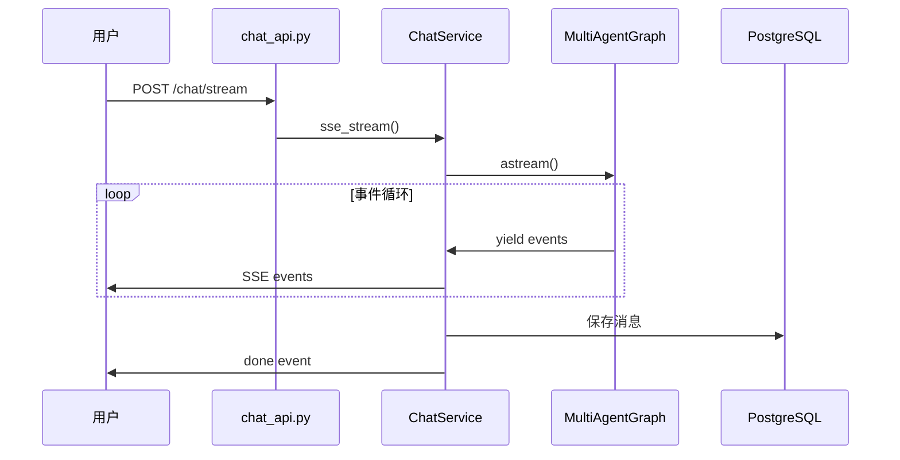

# 聊天系统需求文档

> 版本: 1.1  
> 更新时间: 2026-02-02  
> 范围: 基础聊天与对话同步

## 1. 功能概述

聊天系统基于 LangGraph 实现，支持：
- 流式响应
- 多智能体协作
- 工具调用
- 对话历史

### 1.1 工作流程



### 1.2 对话管理

- **新建对话**：不传 `thread_id` 时自动创建新对话
- **继续对话**：传入已有 `thread_id` 继续历史对话
- **历史恢复**：从数据库加载消息，恢复 LangGraph 状态

### 1.3 消息存储

消息存储在 `t_chat_message` 表：

| 字段 | 说明 |
|------|------|
| `role` | human / ai |
| `content` | 消息内容 |
| `metadata` | 工具调用等扩展信息 |

---

## 2. SSE 事件协议

### 2.1 基本格式

```
event: {event_type}
data: {json_payload}

```

- 每个事件以两个换行符结尾
- `data` 字段使用 JSON 格式

### 2.2 事件类型

| 事件 | 用途 |
|------|------|
| `init` | 流初始化 |
| `token` | AI 文本输出 |
| `thinking` | 思考过程 |
| `tool_start` | 工具调用开始 |
| `tool_end` | 工具调用结束 |
| `status` | 状态更新 |
| `result` | 结构化结果 |
| `confirmation` | 确认请求 |
| `clarification` | 澄清问题 |
| `interrupt` | 中断等待 |
| `done` | 流结束 |
| `error` | 错误 |

### 2.3 事件数据结构示例

**token - AI 文本输出**
```json
{"type": "token", "data": {"content": "你好"}}
```

**result - 结构化结果**
```json
{"type": "result", "data": {"data_type": "todo_list", "data": {"todos": [...]}, "message": "找到5条待办"}}
```

**done - 流结束**
```json
{"type": "done", "data": {"thread_id": "abc123"}}
```

---

## 3. 角色与场景

- **普通用户**：进行多轮聊天并查看历史记录
- **系统**：提供流式响应与历史持久化

## 4. 用户故事与验收标准

### US-CHAT-01: 流式响应

**角色**：作为普通用户  
**需求**：发送消息后能看到 AI 逐步回复  
**目的**：以便更好的交互体验

**验收标准**：
- AC-1: 发送消息后 2 秒内出现首个响应字符
- AC-2: 回复期间显示"正在输入"指示
- AC-3: 回复结束后指示消失

**关联测试**：TC-CHAT-01

### US-CHAT-02: 对话历史持久化

**角色**：作为普通用户  
**需求**：刷新页面后仍能看到历史消息  
**目的**：以便继续上下文对话

**验收标准**：
- AC-1: 刷新页面后历史消息完整显示
- AC-2: 消息顺序与发送顺序一致
- AC-3: 消息内容与发送时一致（含格式/链接）

**关联测试**：TC-CHAT-02, TC-SYNC-02

### US-CHAT-03: 多轮上下文保持

**角色**：作为普通用户  
**需求**：系统理解上下文并进行追问  
**目的**：以便对话连贯

**验收标准**：
- AC-1: 多轮对话中能引用上一轮信息
- AC-2: 同一线程内消息保持连续上下文

**关联测试**：TC-CHAT-03

### US-CHAT-04: 前后端一致性

**角色**：作为普通用户  
**需求**：前端展示内容与后端保存一致  
**目的**：以便确保数据可信

**验收标准**：
- AC-1: SSE 完成后前端展示与后端保存一致
- AC-2: 刷新前后消息一致（相似度 100%）
- AC-3: 特殊字符正确显示且不引发 XSS 风险

**关联测试**：TC-SYNC-01, TC-SYNC-02, TC-SYNC-05

### US-CHAT-05: 停止与反馈

**角色**：作为普通用户  
**需求**：我可以停止生成并对回复进行反馈  
**目的**：以便控制输出与改进质量

**验收标准**：
- AC-1: 点击"停止"可中断生成
- AC-2: 点赞/点踩反馈能被系统记录

**关联测试**：TC-CHAT-04

## 5. 非功能需求

- **性能**：首 token 延迟 < 2s（正常网络）
- **可靠性**：长文本响应不丢失、不重复
- **安全**：特殊字符输入不产生 XSS
