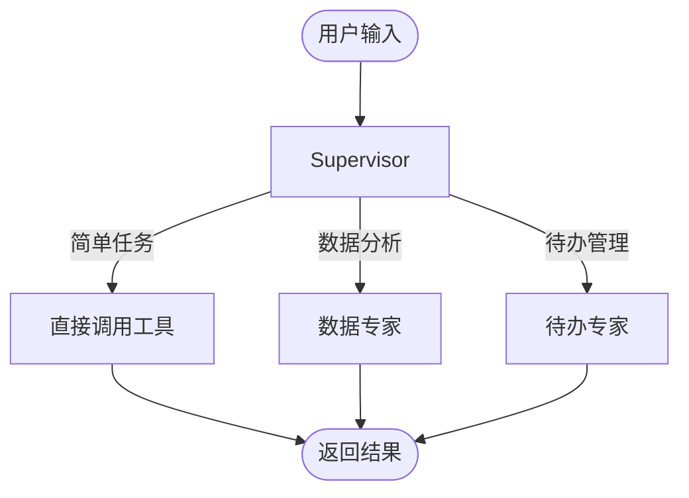

# 问数助手需求文档

> 版本: 1.1  
> 更新时间: 2026-02-02  
> 范围: 自然语言问数与 SQL 生成

## 1. 功能概述

问数助手是系统中的数据分析模块，支持用户通过自然语言查询业务数据。

### 1.1 架构概述

系统采用 **Supervisor 模式**，由一个中心调度器协调多个专家 Agent。

### 1.2 专家 Agent

| Agent | 职责 | 工具 |
|-------|------|------|
| Supervisor | 任务理解、路由决策 | fig_inter, sql_inter, knowledge_search |
| 数据专家 | 复杂数据分析 | extract_data, python_inter |
| 待办专家 | 待办事项管理 | add_todo, list_todos, update_todo |

### 1.3 路由机制

1. 预处理节点分析用户意图
2. 根据意图类型路由到对应 Agent
3. 简单任务 Supervisor 直接处理

---

## 2. 角色与场景

- **数据分析师**：通过自然语言查询业务数据
- **普通用户**：进行简单的数据查询

### 2.1 银行业务场景约束

- 面向 **对公/零售** 业务的核心指标查询
- 常见口径：**贷款余额、存款余额、客户数、逾期率、分行排名**
- 维度包括：**分行/机构、产品线、时间区间、客户类型**
- 必须符合 **合规与权限**：敏感字段需脱敏/受控

## 3. 用户故事与验收标准

### US-AD-01: Schema 同步

**角色**：作为数据分析师  
**需求**：我想同步业务表结构到系统  
**目的**：以便模型基于最新表结构生成 SQL

**验收标准**：
- AC-1: 提供 DDL 后可完成 Schema 同步
- AC-2: 元数据被写入元表并可查询
- AC-3: 银行核心业务表（如贷款、存款、客户、机构）可被正确识别

**关联测试**：TC-AD-01

### US-AD-02: 自然语言生成 SQL

**角色**：作为数据分析师  
**需求**：我想用自然语言生成 SQL  
**目的**：以便快速得到查询结果

**验收标准**：
- AC-1: 输入"查询贷款余额"生成包含聚合的 SQL
- AC-2: 输入"查询上月对公存款余额"能生成带时间过滤的 SQL
- AC-3: 生成 SQL 符合数据库方言

**关联测试**：TC-AD-02

### US-AD-03: 多维分析与可视化

**角色**：作为数据分析师  
**需求**：我想按维度统计并生成图表  
**目的**：以便快速洞察数据

**验收标准**：
- AC-1: 输入"按分行统计存款"生成带 GROUP BY 的 SQL
- AC-2: 输入"按产品线统计贷款余额"生成包含维度统计的 SQL
- AC-3: 可生成图表并返回可访问的图表资源

**关联测试**：TC-AD-03

## 4. 非功能需求

- **正确性**：SQL 语义与用户意图一致
- **安全**：防止生成危险 SQL（如 DROP）
- **合规**：涉及客户/账户信息时需权限校验或脱敏

## 5. 已知问题

### 5.1 测试数据日期不匹配

**问题描述**：
- 当前测试环境的业务数据仅有 `2025-06-30` 这一天
- 问数系统默认使用当天日期（`2026-02-02`）查询，导致查不到数据
- 贷款表 (`f_mid_loan_tb`) 和指标结果表 (`f_mid_index_result`) 目前为空

**影响范围**：
- 存款相关指标可查询，但需指定日期为 `2025-06-30`
- 贷款、指标结果等场景暂无法测试

**解决方案**：待导入更多日期的生产数据

---

## 6. 待导入数据表清单

> 按指标 SQL 模板使用频率排序的 TOP 10 高频表（2026-02-02 检查）

| 排名 | 表名 | 使用次数 | 行数 | 日期范围 | 状态 |
|------|------|---------|------|---------|------|
| 1 | `fdmdata.f_mid_index_result` | 1764 | 0 | - | **需导入** |
| 2 | `fdmdata.f_mid_org_tree` | 750 | 185 | - | 已有数据 |
| 3 | `sdmdata.s_ods_g_c_dim_date` | 586 | 30,315 | - | 已有数据 |
| 4 | `fdmdata.f_mid_index_result_derive` | 470 | 0 | - | **需导入** |
| 5 | `fdmdata.f_mid_index_result_dim` | 280 | 0 | - | **需导入** |
| 6 | `fdmdata.f_mid_loan_tb` | 252 | 0 | - | **需导入** |
| 7 | `fdmdata.f_mid_org_tree_k` | 249 | 0 | - | **需导入** |
| 8 | `fdmdata.f_mid_dep_tb` | 161 | 3,969,646 | 2025-06-30 | 需补充日期 |
| 9 | `fdmdata.f_mid_loan_k_tb` | 122 | 0 | - | **需导入** |
| 10 | `sdmdata.s_mms_dmp_pub_cust_tag_all` | 114 | 0 | - | **需导入** |

**数据现状**：
- 共 170 张表被指标 SQL 模板引用
- 已有数据：3 张表（机构树、日期维度、存款表）
- 需导入：7 张表（指标结果、贷款等核心表）

**待导入优先级**：
1. **最高**：`f_mid_index_result` (1764次引用) - 指标结果主表
2. **高**：`f_mid_loan_tb` + `f_mid_loan_k_tb` - 贷款相关
3. **中**：`f_mid_index_result_derive/dim` - 派生/维度指标
4. **低**：`f_mid_org_tree_k`, `s_mms_dmp_pub_cust_tag_all`

**注意**：数据需包含 `data_dt` 字段，建议导入最近 30 天数据

---

## 7. 表功能说明与加载频率

### 7.1 指标结果类（3张，每日加载）

| 表名 | 作用 | 加载频率 |
|------|------|---------|
| `f_mid_index_result` | **指标结果主表**：各类业务指标计算结果（存款余额、贷款余额、客户数等），按机构、日期、币种汇总 | 每日 T+1 |
| `f_mid_index_result_derive` | **派生指标表**：由基础指标计算出的派生指标（同比增长率、环比等） | 每日 T+1 |
| `f_mid_index_result_dim` | **维度指标表**：带多维度切分的指标（按产品线、客户类型等） | 每日 T+1 |

### 7.2 业务明细类（4张，每日加载）

| 表名 | 作用 | 加载频率 |
|------|------|---------|
| `f_mid_dep_tb` | **存款明细表**：每笔存款账户详情（账号、余额、利率、产品、机构） | 每日全量 |
| `f_mid_loan_tb` | **贷款明细表**：每笔贷款借据详情（借据号、本金余额、利率、逾期天数） | 每日全量 |
| `f_mid_loan_k_tb` | **贷款快照表**：贷款数据按部门维度汇总 | 每日 |
| `s_mms_dmp_pub_cust_tag_all` | **客户标签表**：客户画像标签（VIP等级、风险等级等） | 每日 |

### 7.3 维度表类（3张，静态/低频更新）

| 表名 | 作用 | 加载频率 |
|------|------|---------|
| `f_mid_org_tree` | **机构树**：银行组织架构（总行-分行-支行层级） | 月度/变更时 |
| `f_mid_org_tree_k` | **机构树快照**：历史机构架构快照 | 月度 |
| `s_ods_g_c_dim_date` | **日期维度表**：日期属性（工作日、月末、季末等） | 一次性导入 |

### 7.4 加载频率汇总

| 频率 | 表数量 | 说明 |
|------|--------|------|
| **每日加载** | 8 张 | 带 `data_dt` 字段的表 |
| **月度/静态** | 2 张 | 机构树 |
| **一次性** | 1 张 | 日期维度表（已有） |

---

## 8. 待决策问题

### 8.1 数据同步架构选择

**问题**：每日加载数据会导致本地数据库持续膨胀，存储成本高。

**可选方案**：

| 方案 | 优点 | 缺点 |
|------|------|------|
| **A. 本地副本** | 查询稳定、安全隔离 | 存储成本高、数据延迟 T+1 |
| **B. 直连数仓** | 实时数据、零存储成本 | 安全风险、依赖网络、可能影响生产 |
| **C. 混合模式** | 热数据本地、冷数据直连 | 实现复杂、需维护两套连接 |

**当前状态**：待评估

**安全考量**：
- 直连数仓需严格控制只读权限
- 敏感表（客户信息等）需脱敏处理
- 需评估对生产数据库的性能影响

**后续行动**：与数据团队讨论，确定最终方案
