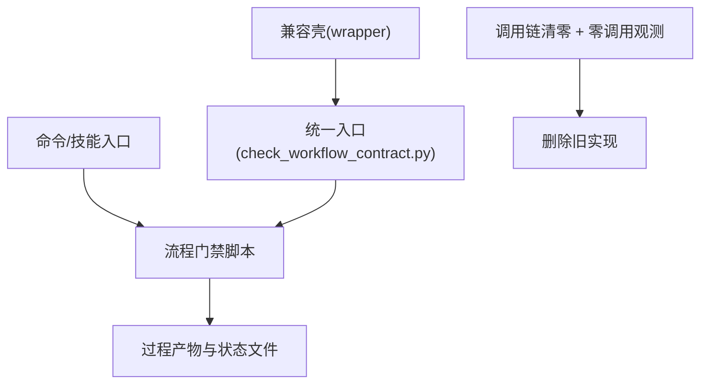

# 工程减法体检报告（v3：可执行退役与验收版）

**日期**：2026-03-06  
**分支**：`master`  
**适用前提**：项目未上线，设计合理性与主干稳定性优先。  
**执行口径**：从“删文件”升级为“依赖迁移 -> 兼容壳 -> 可观测退役”。

---

## 0. 结论先行（可执行版）

1. `工程减法体检报告_2026-03-06.md` 可作为减法动机稿，但其 `3.1 立即执行` 命令不可直接执行。  
2. `check_special_doc_sync.py` 属于 **L0 硬门禁**（pre-commit/CI 间接强制），禁止删除。  
3. `check_clarify_plan_alignment.py`、`check_plan_vk_coverage.py`、`check_gate_contract_consistency.py`、`check_integration_gate.py` 属于 **L1 流程门禁**，只能“先迁移入口，再软退役”。  
4. `coder4-idempotency.json` 与 `task-ledger.jsonl` 属于运行态幂等/账本文件，禁止按“清理临时文件”策略直接删除。  
5. 推荐执行路径：**Phase 0 修报告 -> Phase 1 建统一入口与兼容壳 -> Phase 2 观测零调用 -> Phase 3 删除旧实现**。

---

## 1. 四段式架构结论（改动前门禁）

### 1.1 模块边界

- `scripts/check_*.py` 属于流程门禁层，不是普通工具脚本。  
- `scripts/docs_guard.py` 属于文档治理层，不覆盖流程契约校验。  
- `docs/内部参考/任务拆解/**` 同时承载计划态、作用域态、运行态产物，不应一刀切清理。

### 1.2 依赖方向

- 上游命令与技能（`jjk-plan`、`jjk-vkplan`、`jjk-cardrun`、G01/IG01） -> 门禁脚本 -> 报告与状态产物。  
- 若先删门禁脚本，上游链路会断裂，属于架构级故障，不是局部冗余。

### 1.3 状态归属

- 计划态：`parallel_plan.md`、`vk_cards.json`。  
- 作用域态：`_active_task.json`。  
- 运行态：`.state/**`（含 `coder4-idempotency.json`、`task-ledger.jsonl`、`task-runner-state.json` 内联 `gate_results/merge_results`）。  
- 三态分离是必要设计，不建议并为单文件。

### 1.4 错误处理责任

- 退役动作必须满足 NO-GO 门禁（调用链清零、兼容壳在线、dry-run/验收通过）。  
- 任一步失败必须可快速回退（恢复 wrapper/旧入口/文档映射），禁止“删后补救”。

---

## 2. 核验基线（2026-03-06 实测）

| 指标 | 实测值 | 备注 |
|---|---:|---|
| 任务拆解目录数 | 8 | 含 `_templates` 与活跃任务 |
| 任务 JSON 文件数 | 33 | `docs/内部参考/任务拆解/**/*.json` |
| `.state` 文件数 | 7 | 当前以活跃任务为主 |
| `scripts/` 顶层普通文件数 | 34 | 不递归 |
| `scripts/` 顶层符号链接数 | 16 | 主要映射 `db/`、`data/` |
| `scripts/` 顶层总条目 | 50 | 普通文件 + 链接 |
| `.cursor/scripts` 顶层文件数 | 10 | 与 `scripts/` 映射关系稳定 |
| `consumption_report.json` | 1 | 过程产物 |
| `gate_contract_report.json` | 1 | 过程产物 |
| `vktodo_create_result.json` | 2 | 过程产物 |
| `vksync_status.json` | 1 | 过程产物 |

---

## 3. 退役对象分层（含 owner/trigger/影响/替代）

### 3.1 脚本分层清单

| 层级 | 对象 | Owner（建议） | 主要 Trigger | 删除失败影响 | 替代策略 | 当前动作 |
|---|---|---|---|---|---|---|
| L0 硬门禁 | `check_special_doc_sync.py` | 文档治理负责人 | pre-commit / CI 通过 `check_doc_sync.sh` 间接调用 | 提交/CI 文档门禁失效 | 保持现状，后续仅可内聚实现 | **保留** |
| L1 流程门禁 | `check_clarify_plan_alignment.py` | `jjk-plan` 维护者 | `jjk-plan` 命令契约 | 规划承接失真，后续执行偏航 | 新增统一入口代理 | 迁移前禁止删 |
| L1 流程门禁 | `check_plan_vk_coverage.py` | `jjk-vkplan`/`jjk-cardrun` 维护者 | `jjk-vkplan`、`jjk-cardrun` | 任务消费覆盖失真，卡片漏执行 | 新增统一入口代理 | 迁移前禁止删 |
| L1 流程门禁 | `check_gate_contract_consistency.py` | G01 门禁维护者 | G01 验收、任务卡片 | Gate 契约一致性失效 | 新增统一入口代理 | 迁移前禁止删 |
| L1 流程门禁 | `check_integration_gate.py` | IG01 门禁维护者 | IG01 集成验收 | merge 可见性与证据链失效 | 新增统一入口代理 | 迁移前禁止删 |
| L2 包装层 | `coder4_scope_guard.py` | Coder4 流程维护者 | `jjk-wtimp` / Coder4 手册 | 作用域校验丢失，跨任务误执行 | 合并到 `set_active_task.py`，保留兼容壳 | 可收敛 |
| L3 运行保障 | `coder4_external_backup.sh` / `coder4_external_restore.sh` | 回滚治理负责人 | G-4 回滚演练 / 仓外恢复 | 回滚路径不可用 | 合并单入口但参数兼容 | 慎改 |
| L4 观测脚本 | `codex_app_monitor.py` / `codex_turn_supervisor.py` | 运行观测负责人 | `cron`/手工巡检 | 观测盲区扩大 | 先确认启用状态再归档 | 按启用判定 |

### 3.2 依赖关系图（退役顺序）

---

## 4. 过程文件治理（生命周期，而非全删）

### 4.1 文件级策略

| 文件 | 生命周期策略 | 清理条件 | 保留条件 |
|---|---|---|---|
| `consumption_report.json` | TTL 归档 | 任务 `done/archived` 且连续 14 天无写入 | 活跃任务、最近排障 |
| `gate_contract_report.json` | TTL 归档 | 同上 | G01 复盘窗口内保留 |
| `vktodo_create_result.json` | TTL 归档 | 同上 | 建卡幂等排障窗口内保留 |
| `vksync_status.json` | TTL 归档 | 同上 | vksync 异常排障时保留 |

### 4.2 `.state` 安全策略

| 对象 | 策略 | 说明 |
|---|---|---|
| `task-ledger.jsonl` | 永久保留 | 运行账本真理源之一 |
| `coder4-idempotency.json` | 永久保留 | 幂等窗口判定默认状态文件 |
| `task-runner-state.json.gate_results/merge_results` | 按 `card_id` 保留最近 N 条（建议 20） | 仅裁剪超窗历史键，不清空整块证据 |

---

## 5. NO-GO 门禁（阻断条件）

| 阶段 | GO 条件（全部满足） | NO-GO（任一命中即阻断） |
|---|---|---|
| 退役 L1 前 | 新入口已上线；命令/技能/文档切换完成；兼容壳可用 | 任一入口仍直接调用旧脚本 |
| 删除旧实现前 | 连续 7 天零调用；dry-run 与全量验收通过 | 观测到旧入口调用或验收失败 |
| 清理过程文件前 | 任务为 `done/archived`；已完成备份；TTL 到期 | 仍是活跃任务或 14 天内有写入 |
| 运行态治理前 | schema 说明与回放策略已发布 | 读写链任一处仍依赖待删字段 |

---

## 6. 分阶段执行计划（可落地）

### Phase 0（当天）：修正文档口径，不删脚本

| 动作 | 交付 | 验收 |
|---|---|---|
| 冻结原报告 `3.1` 删除命令 | 标注 `NO-GO` | 团队不再执行 `rm scripts/check_*.py` |
| 统一采用本 `v3` 口径 | 新增执行清单 | 评审通过 |

> 执行说明：人工命令、命令模板、技能引用三类入口统一停用 `rm scripts/check_*.py`，仅允许按本 `v3` 流程推进。

### Phase 1（1~2 天）：建立统一入口 + 兼容壳

| 动作 | 交付 | 验收 |
|---|---|---|
| 新建 `scripts/check_workflow_contract.py` | 聚合调用 4 个 L1 门禁 | 支持 `--mode` 与原脚本等价输出 |
| 旧脚本改为 wrapper | 保持参数兼容 + deprecation 提示 | 旧命令不中断 |
| 更新命令与技能入口 | `.cursor/commands/*`、`.agents/skills/*` | 引用切换完成 |

### Phase 2（3~7 天）：观测与软退役

| 动作 | 交付 | 验收 |
|---|---|---|
| 增加调用日志 | `logs/workflow-gate-usage.jsonl`（建议） | 可追踪旧入口调用量 |
| 连续观测 7 天 | 旧入口调用统计 | 零调用 |
| 执行过程文件 TTL 清理 | 归档目录 + 清理记录 | 清理仅命中非活跃任务 |

### Phase 3（第 8 天后）：删除旧实现

| 动作 | 前置 | 验收 |
|---|---|---|
| 删除 L1 旧实现（保留必要壳） | Phase 1~2 全通过 | 全量验收一次通过 |
| 更新文档与速查表 | 命令链路已切换 | 文档无旧入口残留 |

---

## 7. 回退路径（必须预演）

| 场景 | 快速回退动作 | 回退成功判据 |
|---|---|---|
| 新入口不兼容 | 恢复旧脚本为主入口（wrapper 反向） | 原命令链路恢复，门禁通过 |
| 文档/技能引用错配 | 回退 `.cursor/commands/*` 与 `.agents/skills/*` 引用 | 命令无 `NOT_FOUND` |
| 过程文件误清理 | 从 Git 历史恢复对应任务目录文件 | 任务链路可重放 |
| 运行态异常 | 恢复 `.state` 备份并重跑最小验收 | 幂等与账本行为恢复 |

---

## 8. 验收矩阵（执行完成前必跑）

| 验收项 | 命令（示例） | 通过标准 |
|---|---|---|
| L0 文档硬门禁 | `bash scripts/check_doc_sync.sh --diff-range "HEAD~1...HEAD"` | 返回码 0 |
| Clarify-Plan 承接 | `python3 scripts/check_clarify_plan_alignment.py --requirements-path <req> --implementation-path <impl> --output -` | `ok=true` |
| 计划消费覆盖 | `python3 scripts/check_plan_vk_coverage.py --task-split-dir <dir> --output -` | `ok=true` 且缺失项为空 |
| G01 契约一致性 | `python3 scripts/check_gate_contract_consistency.py --task-split-dir <dir>` | 返回码 0 |
| IG01 集成门禁 | `python3 scripts/coder4/check_integration_gate.py --task-split-dir <dir> --baseline master` | 返回码 0 |
| 旧入口清零扫描 | `rg -n "check_(clarify_plan_alignment|plan_vk_coverage|gate_contract_consistency|integration_gate)\\.py" .cursor/commands .agents/skills docs` | 仅允许新入口或兼容壳说明 |

---

## 9. 本轮建议决策

1. 以本 `v3` 取代 `2026-03-06.md` 的执行部分（尤其 `3.1` 命令段）。  
2. 先立项“统一门禁入口 + wrapper 兼容退役”小卡，再做脚本删除。  
3. 过程文件治理采用“生命周期 + TTL + 活跃任务白名单”，不再全局 `find -delete`。  
4. `.state` 仅允许“按条清理 attempts 历史”，禁止删除幂等/账本核心文件。

---

**结论复述**：本仓库可做工程减法，但必须遵循“迁移优先、观测先行、退役可回退”。按本 `v3` 执行可实现瘦身目标，同时保持主干能力与流程完整性。
