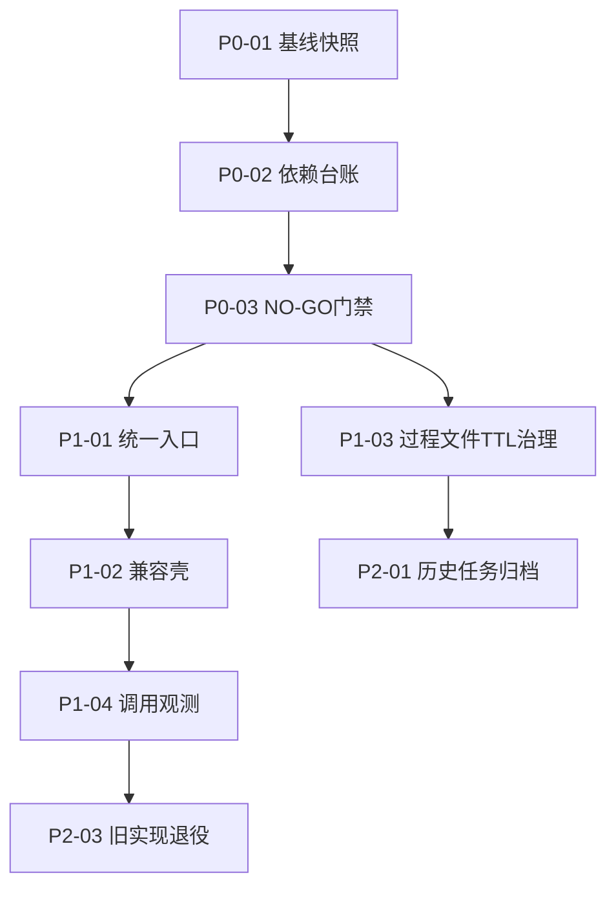

# 工程减法治理看板模板（可直接开卡）

**日期**：2026-03-06  
**适用范围**：`工程减法体检报告_2026-03-06.md` 的可取项治理落地  
**执行基线**：以 `工程减法体检报告_2026-03-06_v3.md` 为风险口径与退役门禁  
**目标**：在不破坏主干能力前提下，完成“依赖收敛 + 生命周期治理 + 可观测退役”。

---

## 0. 结论先行

1. 本模板只治理“可取项”，不执行任何未过 NO-GO 的直接删除动作。  
2. 所有卡片必须绑定 `owner / trigger / replacement / rollback / acceptance_cmds`。  
3. 退役顺序固定：**盘点 -> 统一入口 -> 兼容壳 -> 零调用观测 -> 删除旧实现**。  
4. 验收失败默认回退，不允许“带病收口”。

---

## 1. 看板泳道定义（建议）

| 泳道 | 含义 | 进入条件 | 退出条件 |
|---|---|---|---|
| Backlog | 已识别治理项 | 可取项已确认 | 指定 owner 与优先级 |
| Ready | 可执行卡片 | 依赖齐全、验收命令明确 | 开始实施 |
| In Progress | 正在实施 | 已认领 + 已记录当前风险 | 代码/文档完成并自检通过 |
| Verify | 验收中 | 有证据输出与回退点 | 验收通过或触发回退 |
| Done | 已完成 | 通过验收矩阵 | 结果回填 + 影响复盘 |
| Blocked | 阻塞 | 命中 NO-GO 或外部依赖缺失 | 阻塞解除并重入 Ready |

---

## 2. 卡片模板（复制即用）

## 2.1 Markdown 卡片模板

```md
### [<card_id>] <subject>

- Phase: <P0|P1|P2>
- Owner: <owner>
- Priority: <P0|P1|P2>
- Scope: <files/modules/docs>
- Trigger: <who/when invokes>
- Failure Impact: <what breaks if wrong>
- Replacement: <new entrypoint/wrapper/ttl-policy>
- Rollback Point: <exact command or file restore>
- Acceptance Cmds:
  - <cmd_1>
  - <cmd_2>
- NO-GO:
  - <condition_1>
  - <condition_2>
- Deliverables:
  - <artifact_1>
  - <artifact_2>
- Status: <Backlog|Ready|In Progress|Verify|Done|Blocked>
```

## 2.2 表格行模板（适合汇总）

| Card ID | Phase | Subject | Owner | Depends On | Acceptance | Rollback | Status |
|---|---|---|---|---|---|---|---|
| `<P0-01>` | `<P0>` | `<基线扫描自动化>` | `<owner>` | `<none>` | `<cmd>` | `<cmd>` | `<Backlog>` |

---

## 3. 建议首批治理卡（按优先级）

## 3.1 P0：基线与门禁（先做）

| Card ID | 主题 | 目标 | 核心交付 | 验收标准 |
|---|---|---|---|---|
| P0-01 | 基线快照 | 固化文件/依赖基线 | `治理基线快照.md` | 指标可复现 |
| P0-02 | 脚本依赖台账 | 每脚本具备 owner/trigger | `scripts_manifest.csv` | 关键脚本无 `owner=unknown` |
| P0-03 | NO-GO 门禁 | 冻结高风险直删动作 | `no_go_gate.md` | 阻断条件可执行 |
| P0-04 | 退役验收矩阵 | 统一通过标准 | `acceptance_matrix.md` | 每卡均有验收命令 |

## 3.2 P1：收敛与兼容（中期）

| Card ID | 主题 | 目标 | 核心交付 | 验收标准 |
|---|---|---|---|---|
| P1-01 | 统一流程门禁入口 | 聚合 L1 校验入口 | `scripts/check_workflow_contract.py` | 保持旧能力等价 |
| P1-02 | 兼容壳治理 | 老命令不断流 | wrapper + deprecation 提示 | 旧入口可用且可追踪 |
| P1-03 | 过程文件 TTL 治理 | 降认知负担 | 生命周期规则 + 清理脚本 | 仅命中非活跃任务 |
| P1-04 | 观测脚本启用态治理 | 避免误删监控能力 | 启用登记 + 调用日志 | 启用状态可查询 |

## 3.3 P2：归档与瘦身（后期）

| Card ID | 主题 | 目标 | 核心交付 | 验收标准 |
|---|---|---|---|---|
| P2-01 | 历史任务归档治理 | 降主目录噪音 | 归档规则与白名单 | 活跃任务零误伤 |
| P2-02 | DB 脚本分层归档 | 核心/一次性分离 | `scripts/data/archive/` 规则 | 核心脚本验收通过 |
| P2-03 | 旧实现退役 | 完成减法闭环 | 删除清单 + 回退记录 | 连续零调用后删除 |

---

## 4. 依赖顺序图（治理执行图）



---

## 5. 治理驾驶舱指标（每周复盘）

| 指标 | 定义 | 目标值 | 采集方式 |
|---|---|---:|---|
| `legacy_entrypoint_calls` | 老入口周调用次数 | 0 | 调用日志统计 |
| `no_go_blocks` | NO-GO 阻断次数 | >=1（说明门禁有效） | 门禁报告 |
| `process_artifacts_active` | 活跃任务过程产物数量 | 稳定或下降 | 目录统计 |
| `orphan_scripts` | 无 owner 脚本数 | 0 | 依赖台账 |
| `rollback_success_rate` | 回退成功率 | 100% | 回退演练记录 |

---

## 6. 周节奏（推荐）

| 周期 | 动作 | 输出 |
|---|---|---|
| 每周一 | 刷新基线与依赖台账 | 本周治理目标与风险清单 |
| 每周三 | 中期验收与阻塞清理 | Blocked -> Ready 迁移 |
| 每周五 | 验收矩阵执行 + 复盘 | Done 卡片证据、下周计划 |

---

## 7. 最小验收命令清单（模板）

```bash
# 文档硬门禁
bash scripts/check_doc_sync.sh --diff-range "HEAD~1...HEAD"

# 流程门禁（按任务目录替换）
python3 scripts/check_clarify_plan_alignment.py --requirements-path <req> --implementation-path <impl> --output -
python3 scripts/check_plan_vk_coverage.py --task-split-dir <dir> --output -
python3 scripts/check_gate_contract_consistency.py --task-split-dir <dir>
python3 scripts/check_integration_gate.py --task-split-dir <dir> --baseline master

# 旧入口清零扫描
rg -n "check_(clarify_plan_alignment|plan_vk_coverage|gate_contract_consistency|integration_gate)\\.py" .cursor/commands .agents/skills docs
```

---

## 8. 启动说明（你现在就可以做）

1. 先创建 P0-01 ~ P0-04 四张卡并指定 owner。  
2. 先做“台账与门禁”，再做“实现收敛与退役”。  
3. 任一 NO-GO 命中，立即进入 `Blocked` 泳道并触发回退。  
4. 完成后将结果回填到 `工程减法体检报告_2026-03-06_v3.md` 的阶段执行与验收章节。

---

**结论复述**：本模板的作用是把“可取项”从理念变成可执行治理卡片，确保减法过程可观测、可回退、可验收。
