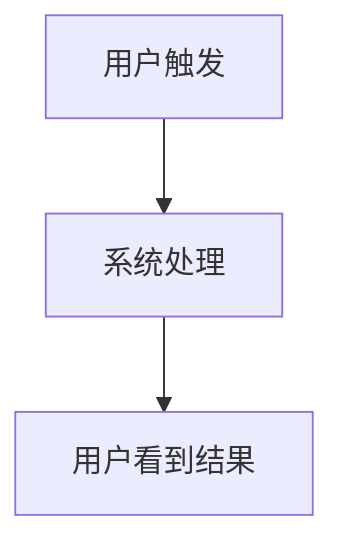

# `/jjk-clarify` 项目主模板（requirements）

## `requirements.md` 推荐骨架

~~~markdown
# <Topic> 需求文档

> 更新时间：<YYYY-MM-DD HH:mm TZ>
> 文档目标：定义 WHAT（业务需求、业务流程、验收种子、追溯种子），供 `/jjk-design` 直接承接

## 1. 需求范围与目标

### 1.1 problem_statement
- 当前问题：
- 为什么现在要做：

### 1.2 target_users
- 目标用户：
- 非目标用户：

### 1.3 core_scenarios
- S-01：
- S-02：

### 1.4 in_scope
- 本次必须做：

### 1.5 out_of_scope
- 本次明确不做：

## 2. 业务流程图



- 这张图回答的问题：

## 3. 机读需求合同（强制）

```yaml
requirements_contract:
  topic: "<topic>"
  status: draft|approved
  owner: "<owner>"
  approver: "<approver>"
  updated_at: "<YYYY-MM-DD HH:mm TZ>"
  publish_product_doc: false
```

## 4. product_contract_matrix

```yaml
product_contract_matrix:
  - bg_id: BG-01
    target_users: [<角色>]
    core_scenario: <一句话场景>
    business_goal_metric: <可验证指标>
    acceptance_gates: [A-01]
    release_constraint: <发布约束>
```

## 5. fr_contract_matrix

```yaml
fr_contract_matrix:
  - fr_id: FR-01
    scenario_id: S-01
    user_value: <用户得到什么价值>
    trigger: <什么情况下触发>
    input_contract:
      required_fields: [<业务输入>]
      optional_fields: [<可选输入>]
    output_contract:
      required_fields: [<用户可见结果>]
    failure_semantics: <失败时用户看到什么>
    acceptance_story: <业务验收话术>
    linked_business_goals: [BG-01]
```

## 6. nfr_contract_matrix

```yaml
nfr_contract_matrix:
  - nfr_id: NFR-01
    category: latency|simplicity|consistency|observability|security
    requirement: <非功能要求>
    metric: <可验证指标>
    linked_frs: [FR-01]
```

## 7. acceptance_seed_matrix

```yaml
acceptance_seed_matrix:
  - ac_id: AC-01
    fr_id: FR-01
    user_role: <角色>
    preconditions:
      - <前置条件>
    expected_result:
      - <验收结果>
```

## 8. traceability_seed_matrix

```yaml
traceability_seed_matrix:
  - bg_id: BG-01
    fr_id: FR-01
    scenario_id: S-01
    acceptance_seed_ids: [AC-01]
    design_focus: <设计阶段要重点回答什么>
```

## 9. business_acceptance_criteria
- BAC-01：
- BAC-02：

## 10. constraints_and_assumptions
- 约束：
- 假设：

## 11. approval
- requirements_approved: true|false
- approved_at:
- approval_evidence:
~~~

## `--doc` 发布提示

~~~markdown
- publish_product_doc: true|false
- true  -> 需要把本次需求收敛到正式产品/需求文档对应章节
- false -> 只保留内部 requirements 真理源
~~~
