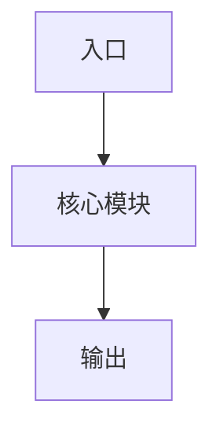

# `/jjk-design` 项目覆盖模板（requirements -> design）

## `design.md` 推荐骨架

~~~markdown
# <Topic> 技术设计

> 设计目标：<一句话说清改造目标>
> 需求真理源：`workdocs/需求/<topic>/requirements.md`

## 1. best_practice_review
- review_date:
- sources:
  - <官方/权威来源 1>
  - <官方/权威来源 2>
- adopted_practices:
  - <采用什么>
- rejected_practices:
  - <没采用什么>
- why_this_repo_differs:
  - <为什么不直接照搬>

## 2. 四段式架构结论

### 2.1 module_boundaries
- 当前问题：
- 最终决策：
- 为什么这么改：
- 禁止动作：

### 2.2 dependency_direction
- 当前问题：
- 最终决策：
- 为什么这么改：
- 禁止动作：

### 2.3 state_ownership
- 当前问题：
- 最终决策：
- 为什么这么改：
- 禁止动作：

### 2.4 error_handling
- 当前问题：
- 最终决策：
- 为什么这么改：
- 禁止动作：

## 3. 技术流程图



- 这张图回答的问题：

## 4. module_change_plan

| module | current_problem | target_change | why_this_way | affected_paths | owner |
|---|---|---|---|---|---|
| <模块> | <当前问题> | <改造动作> | <原因> | `<path>` | <owner> |

## 5. change_map

```yaml
change_map:
  new_paths:
    - path: <path>
      purpose: <作用>
  modified_paths:
    - path: <path>
      purpose: <作用>
  deleted_paths:
    - path: <path>
      reason: <删除原因>
  replaced_responsibilities:
    - old_path: <旧路径>
      replaced_by: <新路径或新模块>
```

## 6. deletion_plan

```yaml
deletion_plan:
  - path_or_symbol: <path_or_symbol>
    current_responsibility: <当前职责>
    remove_reason: <为什么删>
    replaced_by: <由谁接手>
    cleanup_timing: plan|implementation|post-release
```

## 7. db_migration_contract

```yaml
db_migration_contract:
  db_migration_required: true|false
  db_change_scope:
  db_migration_mode: sync_database_only|alembic_versioned
  release_migration_required: true|false
  db_rollback_strategy:
```

## 8. shrink_contract

```yaml
shrink_contract:
  obsolete_paths:
    - <path>
  retained_paths:
    - path: <path>
      reason: <唯一保留理由>
  single_entry_owner: <owner>
  line_budget:
    scope: whole_change_set
    expectation: shrink|neutral|expand
    added_paths: []
    deleted_paths: []
    reason: <如果不是 shrink，用一句话说明为什么>
```

## 9. implementation_seeds

```yaml
implementation_seeds:
  - task_id: T-01
    feature_id: P1-01
    blocked_by: []
    file_paths:
      - <path>
    symbols:
      - <symbol>
    change_type: create|modify|delete|refactor
```

## 10. execution_chain_seed

```yaml
execution_chain_seed:
  preferred_mode: core|vkplan
  task_key: <task_key>
  card_seed: [T-01]
  execution_contract_hint:
    delivery_mode: staged|single
    execution_unit: all_tasks|per_task
    commit_policy: single_commit|per_task_commit
    stop_boundary: per_task|per_card
```

## 11. design_freeze_summary

```yaml
design_freeze_summary:
  design_actionable: true
  missing_blocks: []
  risk_level: low|medium|high
  handoff_contract_ready: true
  implementation_seed_count: 1
```

## 12. clarify_consistency_check

```yaml
clarify_consistency_check:
  ok: true|false
  missing_or_ambiguous_requirements: []
  design_conflicts: []
  next_action: <下一步>
```

## 13. clarify_handoff_contract

```yaml
clarify_handoff_contract:
  version: v2
  topic: "<topic>"
  design_source: workdocs/设计/<topic>/design.md
  handoff_ready: true
  required:
    product_contract_summary:
      target_users: [<角色>]
      core_scenarios: [<场景>]
      business_goal_metrics: [<指标>]
      non_goals: [<非目标>]
      acceptance_gates: [<业务验收约束>]
    requirement_seeds:
      - design_item: D-01
        fr_id: FR-01
        trigger: <触发条件>
        input_contract:
          required_fields: [<输入>]
          optional_fields: [<可选输入>]
          defaults: {}
        output_contract:
          required_fields: [<输出>]
        failure_semantics: <失败语义>
        observability_fields: [<观测字段>]
        rollback_anchor: <回滚锚点>
        acceptance_cmd_ref: <验收命令引用>
    implementation_seeds:
      - task_id: T-01
        feature_id: P1-01
        blocked_by: []
        file_paths: [<path>]
        symbols: [<symbol>]
        change_type: create|modify|delete|refactor
```

## 14. Doc Sync Flags
- api_doc_required: true|false
- publish_design_doc: true|false
~~~
